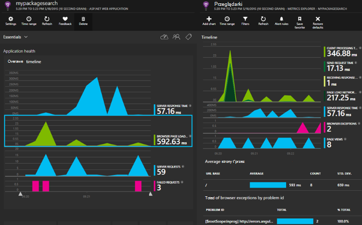

<properties 
    pageTitle="Wnioski aplikacji dla programu ASP.NET Core" 
    description="Monitorowanie aplikacji sieci web dla dostępności, wydajności i użycia." 
    services="application-insights" 
    documentationCenter=".net"
    authors="alancameronwills" 
    manager="douge"/>

<tags 
    ms.service="application-insights" 
    ms.workload="tbd" 
    ms.tgt_pltfrm="ibiza" 
    ms.devlang="na" 
    ms.topic="article" 
    ms.date="08/30/2016" 
    ms.author="awills"/>

# Wnioski aplikacji dla programu ASP.NET Core

[Wnioski aplikacji usługi programu Visual Studio](app-insights-overview.md) umożliwia monitorowanie aplikacji sieci web dostępność, wydajności i użycia. Z opinii, jaką możesz wyświetlić informacje o wydajności i efektywności aplikacji w znaków symboli można wybrać opcje informacje o kierunku projektu w każdym Cykl opracowywania.

Konieczne będzie subskrypcję z [Platformy Microsoft Azure](http://azure.com). Zaloguj się przy użyciu konta Microsoft, które może być dla systemu Windows, XBox Live lub innymi usługami w chmurze firmy Microsoft. Zespół może być organizacji subskrypcji Azure: Poproś właściciela, możesz dodać do niej za pomocą konta Microsoft.

## Wprowadzenie

[Przewodnik wprowadzający dla](https://github.com/Microsoft/ApplicationInsights-aspnetcore/wiki/Getting-Started)wykonaj.

## Za pomocą aplikacji wniosków

Zaloguj się do [portalu Microsoft Azure](https://portal.azure.com) i przejdź do zasobu, możesz utworzyć monitorowanie aplikacji.

W osobnym oknie przeglądarki użyj aplikacji przez pewien czas. Zostaną wyświetlone dane znajdujące się na wykresach wniosków aplikacji. (Może być się do kliknij przycisk Odśwież). Zostaną wyświetlone tylko niewielkiej ilości danych podczas opracowywania, ale te wykresy naprawdę pochodzić aktywności podczas publikowania aplikacji i wielu użytkowników. 

Na stronie Omówienie widać wykresy wydajności, prawdopodobnie najbardziej Cię zainteresować: czas odpowiedzi serwera, czas ładowania strony i liczby żądań zakończonych niepowodzeniem. Kliknij wykres, aby wyświetlić więcej schematów i danych.

Widoki w portalu podzielić na dwie główne kategorie:

* [Eksplorator metryki](app-insights-metrics-explorer.md) zawiera wykresy i tabele, metryki i zlicza, takich jak czasy odpowiedzi, awariami lub metryki możesz utworzyć samodzielnie przy użyciu [interfejsu API](app-insights-api-custom-events-metrics.md). Filtrowanie i segmentu danych według wartości właściwości w celu uzyskania lepszego zrozumienia aplikacji i jej użytkowników.
* [Eksplorator usługi wyszukiwania](app-insights-diagnostic-search.md) zawiera listę poszczególnych zdarzeniami, takimi jak próśb, wyjątki, dziennika śledzenia lub zdarzeń, możesz samodzielnie utworzone za pomocą [interfejsu API](app-insights-api-custom-events-metrics.md). Filtrowanie i wyszukiwanie w zdarzeniach i przechodzenie między powiązane z nimi zdarzenia do badanie problemów.
* [Analizy](app-insights-analytics.md) umożliwia uruchamianie zapytania SQL przypominających przez usługi telemetrycznego i to zaawansowane narzędzie analityczne i diagnostyczne.

## Alerty

* Zostanie wyświetlony automatycznie [aktywne alerty diagnostyczne](app-insights-proactive-diagnostics.md) informują o anomalous zmian w awariami i inne wskaźniki.
* Ustawianie [testów dostępność](app-insights-monitor-web-app-availability.md) , aby przetestować swojej witryny sieci Web na bieżąco z lokalizacji na całym świecie, a pobieranie wiadomości e-mail, jak dowolną test zakończy się niepowodzeniem.
* Skonfiguruj [alerty metryczne](app-insights-monitor-web-app-availability.md) wiedzieć, jeśli miar, takich jak czasy odpowiedzi lub stawki wyjątku Przejdź poza dopuszczalne wartości graniczne.

## Uzyskaj więcej telemetrycznego

* [Dodaj telemetrycznego do stron sieci web](app-insights-javascript.md) monitorowanie użycia strony i wydajność.
* [Zależności monitor](app-insights-dependencies.md) użytkownikom, jeśli RESZTA, SQL lub inne zasoby zewnętrzne spowalniają możesz w dół.
* [Użyj API](app-insights-api-custom-events-metrics.md) do wysłania własnych zdarzeń i metryki, aby uzyskać bardziej szczegółowe informacje dotyczące wydajności i użycia Twojej aplikacji.
* [Sprawdza dostępności](app-insights-monitor-web-app-availability.md) Sprawdź aplikację stale z całego świata. 

## Otwórz źródło

[Czytanie i współtworzyć kodu](https://github.com/Microsoft/ApplicationInsights-aspnetcore#recent-updates)

