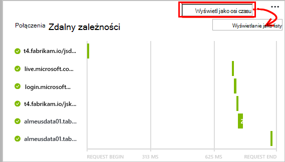

<properties 
    pageTitle="Zależność śledzenia w aplikacji wniosków" 
    description="Analizowanie użycia, dostępności i wydajności lokalnego lub aplikacji sieci web Microsoft Azure o wniosków aplikacji." 
    services="application-insights" 
    documentationCenter=".net"
    authors="alancameronwills" 
    manager="douge"/>

<tags 
    ms.service="application-insights" 
    ms.workload="tbd" 
    ms.tgt_pltfrm="ibiza" 
    ms.devlang="na" 
    ms.topic="article" 
    ms.date="10/24/2016" 
    ms.author="awills"/>


# <a name="set-up-application-insights-dependency-tracking"></a>Konfigurowanie aplikacji wniosków: Śledzenie zależności


[AZURE.INCLUDE [app-insights-selector-get-started-dotnet](../../includes/app-insights-selector-get-started-dotnet.md)]


*Zależność* jest składnik zewnętrzny wywoływana przez aplikację. Zazwyczaj to usługa o nazwie przy użyciu protokołu HTTP, lub bazy danych lub systemu plików. W Visual Studio wniosków aplikacji także łatwe wyświetlanie czas oczekiwania aplikacji dla zależności i częstotliwość wywołanie zależności nie powiedzie się.


Monitorowanie zależności w nowym polu raportów obecnie połączenia na następujące typy zależności:

* PROGRAMU ASP.NET
 * Bazy danych SQL
 * Sieci web programu ASP.NET i usługi WCF za pomocą powiązań oparte na HTTP
 * Lokalną lub zdalną połączeń protokołu HTTP
 * Azure DocumentDb, tabeli, magazyn obiektów blob i kolejki
* Java
 * Połączenia z bazą danych za pomocą sterownika [JDBC](http://docs.oracle.com/javase/7/docs/technotes/guides/jdbc/) , na przykład MySQL, SQL Server, PostgreSQL lub SQLite.
* JavaScript na stronach sieci web — [Strona sieci web SDK](app-insights-javascript.md) automatycznie dzienniki połączeń Ajax jako zależności.

Można napisać własny zestaw SDK połączeń monitorowanie innych zależności za pomocą [Interfejsu API TrackDependency](app-insights-api-custom-events-metrics.md#track-dependency).


## <a name="to-set-up-dependency-monitoring"></a>Aby skonfigurować monitorowania współzależności

Potrzebujesz subskrypcji [Microsoft Azure](http://azure.com) .

### <a name="if-your-app-runs-on-your-iis-server"></a>Jeśli aplikacji jest uruchamiany na serwerze usług IIS

Jeśli aplikacji sieci web jest uruchamiana na .NET 4.6 lub nowszy, możesz albo [Zainstaluj zestaw SDK wniosków aplikacji](app-insights-asp-net.md) w aplikacji, lub zainstalować Monitor stanu wniosków aplikacji. Nie musisz oba.

W przeciwnym razie Zainstaluj Monitor stanu wniosków aplikacji na serwerze:

1. Na serwerze sieci web usług IIS, zaloguj się przy użyciu poświadczeń administratora.
2. Pobierz i uruchom [Instalatora Monitor stanu](http://go.microsoft.com/fwlink/?LinkId=506648).
4. W Kreatorze instalacji logowanie się do programu Microsoft Azure.

    

    *Błędy połączeń? Zobacz [Rozwiązywanie problemów](#troubleshooting).*

5. Wybieranie aplikacji zainstalowanych w sieci web lub witrynie sieci Web, którą chcesz monitorować, a następnie konfigurowanie zasobów, w której chcesz wyświetlić wyniki w portalu wniosków aplikacji.

    

    Zazwyczaj chcesz skonfigurować nowego zasobu i [Grupa zasobów][roles].

    W przeciwnym razie użyj istniejącego zasobu, jeśli jeszcze skonfigurowana [sprawdza web] [ availability] witryny lub [Klient sieci web monitorowania][client].

6. Ponowne uruchomienie usług IIS.

    

    Usługa sieci web zostanie przerwane przez krótki czas.

6. Zwróć uwagę, że ApplicationInsights.config został wstawiony do aplikacji sieci web, które chcesz monitorować.

    

   Dostępne są także niektóre zmiany web.config.

#### <a name="want-to-reconfigure-later"></a>Chcesz (ponownego) skonfigurować później?

Po zakończeniu pracy z kreatorem można ponownie skonfigurować agenta w dowolnym momencie. Można to jeśli zainstalowany agent, ale było niektóre problemy z początkowej konfiguracji.


### <a name="if-your-app-runs-as-an-azure-web-app"></a>Jeśli aplikacji jest uruchamiany jako aplikacji sieci Web programu Azure

W Panelu sterowania w aplikacji sieci Web Azure dodać rozszerzenia aplikacji wnioski.


### <a name="if-its-an-azure-cloud-services-project"></a>Jeśli jest projekt usług Azure chmury

[Dodaj skrypty do ról w sieci web i pracownika](app-insights-cloudservices.md#dependencies). Lub [Zainstaluj .NET framework 4.6 lub nowszy](../cloud-services/cloud-services-dotnet-install-dotnet.md).

## <a name="diagnosis"></a>Diagnozowanie problemów z wydajnością zależności

Aby ocenić wydajność żądania na serwerze, otwórz Karta wydajności i przewiń w dół do spojrzenie na siatce żądania:


Górny jeden trwa bardzo długo. Zobaczmy, jeśli firma Microsoft można znaleźć w miejsce, w którym czas.

Kliknij ten wiersz, aby wyświetlić indywidualne żądanie zdarzeń:


Kliknij dowolne wystąpienie długim pozwalają dalej.

Przewiń w dół do połączenia zdalnego zależności związane z tego żądania:


Ta funkcja wygląda większość obsługi czasu poświęconego tego żądania w połączeniu z usługą lokalny. 


Zaznacz ten wiersz, aby uzyskać więcej informacji:


Szczegóły zawiera wystarczających informacji do przeanalizowania problemu.


W innym przypadku nie połączenia zależności jest długi, ale, możesz je przełączyć do widoku osi czasu, widać, gdzie wystąpił opóźnienie w naszym wewnętrznego przetwarzania:





## <a name="failures"></a>Błędy

W przypadku żądania nie powiodło się, kliknij wykres.


Kliknij typ żądania i żądania wystąpienia, w celu znalezienia nie powiodło się wywołanie zależność zdalnego.


## <a name="custom-dependency-tracking"></a>Zależność niestandardowa śledzenia

Moduł standardowy śledzenia współzależności automatycznie wykrywa zależności zewnętrznych, takich jak bazy danych oraz interfejsy API pozostałych. Jednak może być pewne dodatkowe składniki traktowane w taki sam sposób. 

Można napisać kod, który wysyła informacje o zależnościach, za pomocą samego [Interfejsu API TrackDependency](app-insights-api-custom-events-metrics.md#track-dependency) używanego przez moduł standardowy.

Na przykład jeśli konstruujesz kodu z zestawem napisanego nie samodzielnie rejestrowania chronometrażu wszystkie połączenia, aby dowiedzieć się, jakie udział ułatwia do Twoich czasów odpowiedzi. Aby te dane wyświetlane na wykresach zależności w aplikacji wniosków, wyślij go przy użyciu `TrackDependency`.

```C#

            var startTime = DateTime.UtcNow;
            var timer = System.Diagnostics.Stopwatch.StartNew();
            try
            {
                success = dependency.Call();
            }
            finally
            {
                timer.Stop();
                telemetry.TrackDependency("myDependency", "myCall", startTime, timer.Elapsed, success);
            }
```

Jeśli chcesz wyłączyć moduł standardowy współzależności śledzenia usuwanie odwołanie do DependencyTrackingTelemetryModule w [ApplicationInsights.config](app-insights-configuration-with-applicationinsights-config.md).

## <a name="troubleshooting"></a>Rozwiązywanie problemów

*Zależność sukcesu zawsze Flaga pokazuje wartość PRAWDA lub FAŁSZ.*

* Uaktualnienie do najnowszej wersji zestawu SDK. Jeśli Twoja wersja programu .NET jest mniejsza niż 4.6, zainstaluj [monitor stanu](app-insights-monitor-performance-live-website-now.md).

## <a name="next-steps"></a>Następne kroki

- [Wyjątki](app-insights-asp-net-exceptions.md)
- [Dane użytkownika i strony][client]
- [Dostępność](app-insights-monitor-web-app-availability.md)


<!--Link references-->

[api]: app-insights-api-custom-events-metrics.md
[apikey]: app-insights-api-custom-events-metrics.md#ikey
[availability]: app-insights-monitor-web-app-availability.md
[azure]: ../insights-perf-analytics.md
[client]: app-insights-javascript.md
[diagnostic]: app-insights-diagnostic-search.md
[metrics]: app-insights-metrics-explorer.md
[netlogs]: app-insights-asp-net-trace-logs.md
[portal]: http://portal.azure.com/
[qna]: app-insights-troubleshoot-faq.md
[redfield]: app-insights-asp-net-dependencies.md
[roles]: app-insights-resources-roles-access-control.md

 
