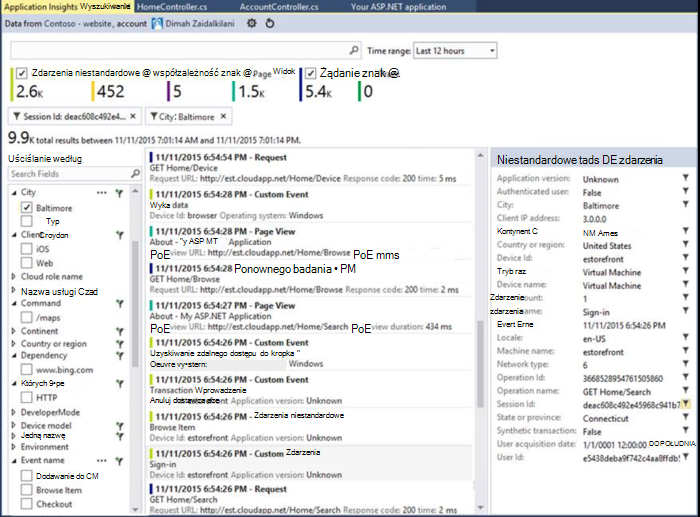
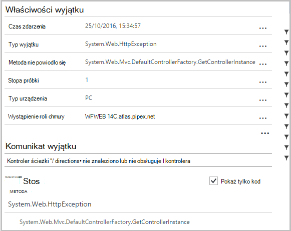
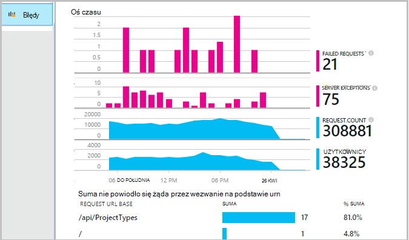
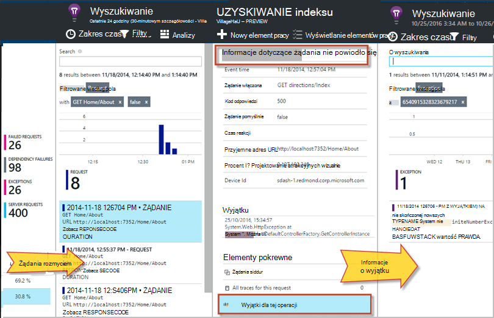
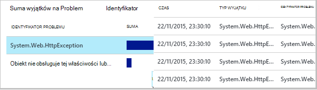
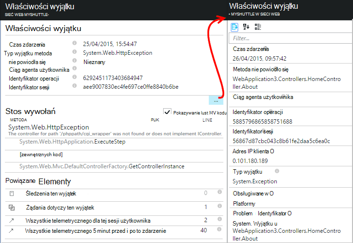
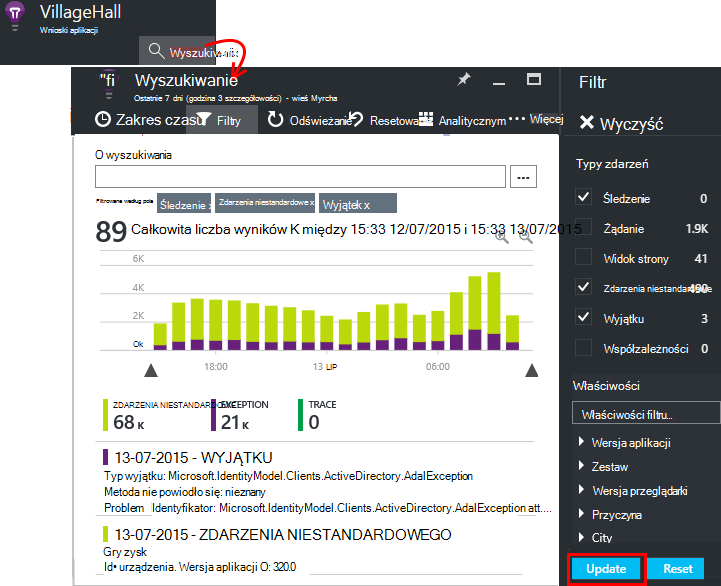
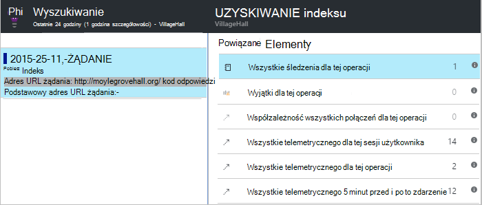

<properties 
    pageTitle="Diagnozowanie błędów i wyjątki w aplikacjach programu ASP.NET z wniosków aplikacji" 
    description="Przechwytywanie wyjątki od aplikacje ASP.NET wraz z telemetrycznego wezwanie." 
    services="application-insights" 
    documentationCenter=".net"
    authors="alancameronwills" 
    manager="douge"/>

<tags 
    ms.service="application-insights" 
    ms.workload="tbd" 
    ms.tgt_pltfrm="ibiza" 
    ms.devlang="na" 
    ms.topic="article" 
    ms.date="10/27/2016" 
    ms.author="awills"/>


# <a name="set-up-application-insights-diagnose-exceptions"></a>Konfigurowanie aplikacji wniosków: diagnozowanie wyjątków

[AZURE.INCLUDE [app-insights-selector-get-started-dotnet](../../includes/app-insights-selector-get-started-dotnet.md)]


Monitorowanie aplikacji przy użyciu [Programu Visual Studio aplikacji wniosków][start], żądań zakończonych niepowodzeniem może zgodne z wyjątki i inne zdarzenia u klienta i serwera, tak, aby można szybko diagnozowanie przyczyn.

Monitorowanie aplikacji programu ASP.NET, należy [dodać aplikację wniosków SDK] [ greenbrown] do aplikacji lub [Instalowanie Monitor stanu na serwerze usług IIS][redfield], lub, jeśli aplikacji nie jest Azure aplikacji sieci Web, dodać [Rozszerzenie wniosków aplikacji](app-insights-azure-web-apps.md).

## <a name="diagnosing-exceptions-using-visual-studio"></a>Diagnozowanie wyjątków przy użyciu programu Visual Studio

Otwórz rozwiązanie aplikacji w programie Visual Studio, aby pomóc w debugowania.

Uruchom aplikację, na serwerze lub na komputerze rozwoju przy użyciu F5.

Otwarcie okna Wyszukiwanie wniosków aplikacji w programie Visual Studio i ustaw go, aby wyświetlić wydarzenia z aplikacji. Podczas debugowanie, możesz to zrobić tylko po kliknięciu przycisku wniosków aplikacji.



Zwróć uwagę, że można filtrować raport, aby wyświetlić tylko wyjątki. 

*Bez wyjątków przedstawiający? Zobacz [przechwytywanie wyjątków](#exceptions).*

Kliknij raport wyjątku, aby wyświetlić jego śledzenia stosu.



Kliknij pozycję odwołanie do wiersza w wynikach śledzenia stosu, aby otworzyć odpowiedniego pliku.  

## <a name="diagnosing-failures-using-the-azure-portal"></a>Diagnozowanie błędów za pomocą portalu Azure

Z aplikacji wniosków Omówienie aplikacji kafelków błędy wykresy wyjątków ale nie powiodło się żądania HTTP, razem z listy żądania adresy URL, które powodować błędy najczęściej.



Kliknij jeden z typów żądań zakończonych niepowodzeniem na liście uzyskiwania dostępu do poszczególnych wystąpienia awarii. W tym miejscu kliknij, aby wyjątki lub jakiekolwiek dane śledzenia skojarzona:




**Alternatywnie** możesz zacząć od listy wyjątków który znajdziesz dalsze karta błędy w dół. Zachowaj klikając, dopóki nie może uzyskać dostęp do poszczególnych wyjątki.




*Bez wyjątków przedstawiający? Zobacz [przechwytywanie wyjątków](#exceptions).*

Stamtąd można przeglądać śledzenia stosu i szczegółowe właściwości każdego wyjątku i znajdowanie powiązanych dziennika śledzenia lub innych zdarzeń.




[Dowiedz się więcej o diagnostyki wyszukiwania][diagnostic].


## <a name="dependency-failures"></a>Błędy współzależności

*Zależność* to usługa, która aplikacja połączenia zwykle za pośrednictwem połączenia interfejsu API usługi REST lub bazy danych. [Monitor stanu wniosków aplikacji] [ redfield] automatycznie monitoruje różne typy współzależności połączenia, pomiaru czasu trwania połączenia i sukces lub niepowodzenie. 

Aby pobrać dane współzależności, należy [zainstalować Monitor stanu] [ redfield] na serwerze usług IIS lub aplikacji w przypadku aplikacji sieci Web programu Azure, używając [Rozszerzenia wniosków aplikacji](app-insights-azure-web-apps.md). 

Nie powiodło się połączenia do zależności znajdują się na karta błędy, a także znajdziesz je w obszarze powiązanych elementów w informacje dotyczące żądania i szczegóły wyjątku.

*Nie błędy współzależność? To jest dobre. Jednak aby sprawdzić otrzymywanie danych współzależności, otwierać Karta wydajności i spójrz na wykresie czas trwania współzależności.*

 

## <a name="custom-tracing-and-log-data"></a>Śledzenie niestandardowe i dane dziennika

Aby pobrać dane diagnostyczne specyficzne dla aplikacji, możesz wstawić kodu do wysyłania danych telemetrycznych. To wyświetlane w diagnostyczne wyszukiwania obok żądanie, widok strony i inne dane zbierane automatycznie. 

Dostępnych jest kilka możliwości:

* [TrackEvent()](app-insights-api-custom-events-metrics.md#track-event) jest zazwyczaj używany do monitorowania upodobania, ale dane, które wysyła również wyświetlane w obszarze zdarzenia niestandardowe w wyszukiwaniu diagnostyczne. Zdarzenia są nazywane i może wykonać właściwości ciągu i liczbowe metryki, w którym można [filtrować diagnostyki wyszukiwania][diagnostic].
* [TrackTrace()](app-insights-api-custom-events-metrics.md#track-trace) pozwala na wysyłanie dłużej danych, takich jak informacje o WPIS.
* [TrackException()](#exceptions) wysyła śledzenia stosu. [Więcej informacji na temat wyjątki](#exceptions).
* Jeśli używasz już ramy rejestrowania, takie jak Log4Net lub NLog, można [przechwycić te dzienniki] [ netlogs] i wyświetlanie ich w wyszukiwaniu diagnostyczne razem z pakietem żądania i wyjątku danych.

Aby wyświetlić te zdarzenia, otwórz [wyszukiwania][diagnostic], Otwórz filtr, a następnie wybierz zdarzenia niestandardowe, śledzenia lub wyjątek.





> [AZURE.NOTE] Jeśli aplikacji generuje wiele telemetrycznego, moduł adaptacyjne przy próbkowaniu automatycznie zmniejszy wielkość jest wysyłana do portalu, wysyłając przedstawiciela część zdarzeń. Zdarzenia, które są częścią tej samej operacji będzie zaznaczone lub wyczyszczone grupowo, dlatego możesz przechodzić między powiązane z nimi zdarzenia. [Informacje na temat pobierania.](app-insights-sampling.md)

### <a name="how-to-see-request-post-data"></a>Jak wyświetlić dane wpisu żądania

Informacje dotyczące żądania nie zawierają dane wysyłane do aplikacji w trakcie rozmowy wpisu. Aby te dane zgłoszone:

* [Zainstaluj zestaw SDK] [ greenbrown] w projekcie aplikacji.
* Wstawianie kodu w aplikacji, aby nawiązać połączenie [Microsoft.ApplicationInsights.TrackTrace()][api]. Wyślij dane wpisu w parametrze wiadomości. Istnieje limit dozwolony rozmiar, więc należy wysyłać tylko podstawowe dane.
* Analizując żądanie nie powiodło się znaleźć skojarzony śledzenia.  




## <a name="exceptions"></a>Przechwytywanie wyjątków i powiązane dane diagnostyczne

Na początku nie będą widoczne w portalu wyjątków, które powodują błędy w aplikacji. Zobaczysz wyjątki przeglądarki (Jeśli korzystasz z [Języka JavaScript SDK] [ client] na stronach sieci web). Większość wyjątki serwera są objęte usług IIS a trzeba napisać nieco kodu, aby je wyświetlić.

Można:

* **Jawnie logowania wyjątków** , wstawiając kod w procedury raportowania wyjątków.
* **Przechwytywanie wyjątków automatycznie** przez skonfigurowanie architekturę programu ASP.NET. Wymagane dodatki są różne dla różnych typów framework.

## <a name="reporting-exceptions-explicitly"></a>Raportowanie wyjątki jawnie

Najłatwiejszym sposobem jest wstawienie połączenia do TrackException() do obsługi wyjątków.

Języka JavaScript

    try 
    { ...
    }
    catch (ex)
    {
      appInsights.trackException(ex, "handler loc",
        {Game: currentGame.Name, 
         State: currentGame.State.ToString()});
    }

C#

    var telemetry = new TelemetryClient();
    ...
    try 
    { ...
    }
    catch (Exception ex)
    {
       // Set up some properties:
       var properties = new Dictionary <string, string> 
         {{"Game", currentGame.Name}};

       var measurements = new Dictionary <string, double>
         {{"Users", currentGame.Users.Count}};

       // Send the exception telemetry:
       telemetry.TrackException(ex, properties, measurements);
    }

VB

    Dim telemetry = New TelemetryClient
    ...
    Try
      ...
    Catch ex as Exception
      ' Set up some properties:
      Dim properties = New Dictionary (Of String, String)
      properties.Add("Game", currentGame.Name)

      Dim measurements = New Dictionary (Of String, Double)
      measurements.Add("Users", currentGame.Users.Count)
  
      ' Send the exception telemetry:
      telemetry.TrackException(ex, properties, measurements)
    End Try

Opcjonalne parametry pomiary i właściwości, ale są przydatne w przypadku [filtrowania i dodawanie] [ diagnostic] dodatkowe informacje. Na przykład jeśli masz aplikację, który może zostać uruchomiony kilka gier, możesz znaleźć wszystkie raporty wyjątku związane z określonym nożna. Możesz dodać dowolną liczbę elementów, jak do każdego słownika.

## <a name="browser-exceptions"></a>Wyjątki w przeglądarce

Większość wyjątków przeglądarki są zgłaszane.

Jeśli strony sieci web zawiera pliki skryptów z sieci dostarczania zawartości lub inne domeny, upewnij się, oznakowanie skrypt ma atrybut ```crossorigin="anonymous"```, i że serwer wysyła [CORS nagłówków](http://enable-cors.org/). Pozwoli uzyskać nieobsługiwanego JavaScript wyjątki od następujących zasobów śledzenia stosu i szczegółów.

## <a name="web-forms"></a>Formularze sieci Web

Moduł protokołu HTTP w formularzach sieci web będzie zbierać z wyjątkiem przypadku nie przekierowania konfigurowana CustomErrors.

Jednak jeśli masz aktywne przekierowania, Dodaj następujące wiersze do funkcji Application_Error w Global.asax.cs. (Dodaj plik Global.asax, jeśli nie masz jeszcze jedną).

*C#*

    void Application_Error(object sender, EventArgs e)
    {
      if (HttpContext.Current.IsCustomErrorEnabled && Server.GetLastError  () != null)
      {
         var ai = new TelemetryClient(); // or re-use an existing instance

         ai.TrackException(Server.GetLastError());
      }
    }


## <a name="mvc"></a>MVC

Jeśli konfiguracja [CustomErrors](https://msdn.microsoft.com/library/h0hfz6fc.aspx) jest `Off`, wyjątki będzie dostępne dla [Moduł protokołu HTTP](https://msdn.microsoft.com/library/ms178468.aspx) na potrzeby zbierania. Jednak jeśli jest `RemoteOnly` (ustawienie domyślne), lub `On`, wyjątek będzie wyczyszczone i nie są dostępne dla aplikacji wniosków na automatyczne pobieranie. Możesz można rozwiązać ten problem, zastępowanie [klasy System.Web.Mvc.HandleErrorAttribute](http://msdn.microsoft.com/library/system.web.mvc.handleerrorattribute.aspx)i zastosowanie zastąpiona zajęć, jak pokazano w różnych wersjach MVC poniżej ([źródło github](https://github.com/AppInsightsSamples/Mvc2UnhandledExceptions/blob/master/MVC2App/Controllers/AiHandleErrorAttribute.cs)):

    using System;
    using System.Web.Mvc;
    using Microsoft.ApplicationInsights;

    namespace MVC2App.Controllers
    {
      [AttributeUsage(AttributeTargets.Class | AttributeTargets.Method, Inherited = true, AllowMultiple = true)] 
      public class AiHandleErrorAttribute : HandleErrorAttribute
      {
        public override void OnException(ExceptionContext filterContext)
        {
            if (filterContext != null && filterContext.HttpContext != null && filterContext.Exception != null)
            {
                //If customError is Off, then AI HTTPModule will report the exception
                if (filterContext.HttpContext.IsCustomErrorEnabled)
                {   //or reuse instance (recommended!). see note above  
                    var ai = new TelemetryClient();
                    ai.TrackException(filterContext.Exception);
                } 
            }
            base.OnException(filterContext);
        }
      }
    }

#### <a name="mvc-2"></a>MVC 2

Zamień atrybutu HandleError nowy atrybut w kontrolerach.

    namespace MVC2App.Controllers
    {
       [AiHandleError]
       public class HomeController : Controller
       {
    ...

[Przykładowe](https://github.com/AppInsightsSamples/Mvc2UnhandledExceptions)

#### <a name="mvc-3"></a>MVC 3

Zarejestruj się w `AiHandleErrorAttribute` jako filtr globalny w Global.asax.cs:

    public class MyMvcApplication : System.Web.HttpApplication
    {
      public static void RegisterGlobalFilters(GlobalFilterCollection filters)
      {
         filters.Add(new AiHandleErrorAttribute());
      }
     ...

[Przykładowe](https://github.com/AppInsightsSamples/Mvc3UnhandledExceptionTelemetry)


#### <a name="mvc-4-mvc5"></a>MVC 4, MVC5

Zarejestruj AiHandleErrorAttribute jako filtr globalny w FilterConfig.cs:

    public class FilterConfig
    {
      public static void RegisterGlobalFilters(GlobalFilterCollection filters)
      {
        // Default replaced with the override to track unhandled exceptions
        filters.Add(new AiHandleErrorAttribute());
      }
    }

[Przykładowe](https://github.com/AppInsightsSamples/Mvc5UnhandledExceptionTelemetry)

## <a name="web-api-1x"></a>Interfejs API z siecią Web 1.x


Zastępowanie System.Web.Http.Filters.ExceptionFilterAttribute:

    using System.Web.Http.Filters;
    using Microsoft.ApplicationInsights;

    namespace WebAPI.App_Start
    {
      public class AiExceptionFilterAttribute : ExceptionFilterAttribute
      {
        public override void OnException(HttpActionExecutedContext actionExecutedContext)
        {
            if (actionExecutedContext != null && actionExecutedContext.Exception != null)
            {  //or reuse instance (recommended!). see note above 
                var ai = new TelemetryClient();
                ai.TrackException(actionExecutedContext.Exception);    
            }
            base.OnException(actionExecutedContext);
        }
      }
    }

Możesz dodać ten atrybut zastąpiona do określonych kontrolerów lub Dodaj go do konfiguracji filtru globalnego w klasie WebApiConfig: 

    using System.Web.Http;
    using WebApi1.x.App_Start;

    namespace WebApi1.x
    {
      public static class WebApiConfig
      {
        public static void Register(HttpConfiguration config)
        {
            config.Routes.MapHttpRoute(name: "DefaultApi", routeTemplate: "api/{controller}/{id}",
                defaults: new { id = RouteParameter.Optional });
            ...
            config.EnableSystemDiagnosticsTracing();

            // Capture exceptions for Application Insights:
            config.Filters.Add(new AiExceptionFilterAttribute());
        }
      }
    }

[Przykładowe](https://github.com/AppInsightsSamples/WebApi_1.x_UnhandledExceptions)

Istnieje wiele spraw, które filtry wyjątek nie obsługuje. Na przykład:

* Wyjątki generowane z konstruktorów kontrolerze. 
* Wyjątki generowane z obsługi wiadomości. 
* Wyjątki wyjątek podczas routingu. 
* Wyjątki wyjątek podczas szeregowania zawartości odpowiedzi. 

## <a name="web-api-2x"></a>Interfejs API z siecią Web 2.x

Dodaj implementacja IExceptionLogger:

    using System.Web.Http.ExceptionHandling;
    using Microsoft.ApplicationInsights;

    namespace ProductsAppPureWebAPI.App_Start
    {
      public class AiExceptionLogger : ExceptionLogger
      {
        public override void Log(ExceptionLoggerContext context)
        {
            if (context !=null && context.Exception != null)
            {//or reuse instance (recommended!). see note above 
                var ai = new TelemetryClient();
                ai.TrackException(context.Exception);
            }
            base.Log(context);
        }
      }
    }

Dodaj to do usług WebApiConfig:

    using System.Web.Http;
    using System.Web.Http.ExceptionHandling;
    using ProductsAppPureWebAPI.App_Start;

    namespace WebApi2WithMVC
    {
      public static class WebApiConfig
      {
        public static void Register(HttpConfiguration config)
        {
            // Web API configuration and services

            // Web API routes
            config.MapHttpAttributeRoutes();

            config.Routes.MapHttpRoute(
                name: "DefaultApi",
                routeTemplate: "api/{controller}/{id}",
                defaults: new { id = RouteParameter.Optional }
            );
            config.Services.Add(typeof(IExceptionLogger), new AiExceptionLogger()); 
        }
      }
  }

[Przykładowe](https://github.com/AppInsightsSamples/WebApi_2.x_UnhandledExceptions)

Rozwiązania alternatywne można:

2. Zamień tylko ExceptionHandler niestandardowej implementacji IExceptionHandler. Jest to polecenie tylko wtedy, gdy ramach jest nadal można wybrać jaki komunikat odpowiedzi, aby wysłać (nie gdy połączenie zostanie przerwane na przykład) 
3. Filtry wyjątku (w sposób opisany w sekcji kontrolerów 1.x interfejs API sieci Web powyżej) — nie o nazwie we wszystkich przypadkach.


## <a name="wcf"></a>WCF

Dodać klasę rozszerza atrybut, który wykonuje IErrorHandler i IServiceBehavior.

    using System;
    using System.Collections.Generic;
    using System.Linq;
    using System.ServiceModel.Description;
    using System.ServiceModel.Dispatcher;
    using System.Web;
    using Microsoft.ApplicationInsights;

    namespace WcfService4.ErrorHandling
    {
      public class AiLogExceptionAttribute : Attribute, IErrorHandler, IServiceBehavior
      {
        public void AddBindingParameters(ServiceDescription serviceDescription,
            System.ServiceModel.ServiceHostBase serviceHostBase,
            System.Collections.ObjectModel.Collection<ServiceEndpoint> endpoints,
            System.ServiceModel.Channels.BindingParameterCollection bindingParameters)
        {
        }

        public void ApplyDispatchBehavior(ServiceDescription serviceDescription, 
            System.ServiceModel.ServiceHostBase serviceHostBase)
        {
            foreach (ChannelDispatcher disp in serviceHostBase.ChannelDispatchers)
            {
                disp.ErrorHandlers.Add(this);
            }
        }

        public void Validate(ServiceDescription serviceDescription, 
            System.ServiceModel.ServiceHostBase serviceHostBase)
        {
        }

        bool IErrorHandler.HandleError(Exception error)
        {//or reuse instance (recommended!). see note above 
            var ai = new TelemetryClient();

            ai.TrackException(error);
            return false;
        }

        void IErrorHandler.ProvideFault(Exception error, 
            System.ServiceModel.Channels.MessageVersion version, 
            ref System.ServiceModel.Channels.Message fault)
        {
        }
      }
    }

Dodawanie atrybutu do implementacji usługi:

    namespace WcfService4
    {
        [AiLogException]
        public class Service1 : IService1 
        { 
         ...

[Przykładowe](https://github.com/AppInsightsSamples/WCFUnhandledExceptions)

## <a name="exception-performance-counters"></a>Liczniki wydajności wyjątku

Jeśli masz [zainstalowany Monitor stanu] [ redfield] na serwerze, zostanie wyświetlony wykres szybkości wyjątków, mierzona .NET. Ta opcja uwzględnia zarówno obsłużone i nieobsługiwanego wyjątki .NET.

Otwórz karta Eksploratora metryczne, dodawanie nowego wykresu i wybierz **wyjątku stawek**, wymienione w obszarze liczników wydajności. 

.NET framework oblicza stopę liczenie wyjątki w zakresie i dzieląc długość okresu. 

Należy zauważyć, że będą inne niż liczba "Wyjątki" obliczana przez portal wniosków aplikacji na podstawie TrackException raportów. Interwały pobierania są różne, a zestawu SDK nie są wysyłane raporty TrackException dla wszystkich obsługiwania i nieobsługiwany wyjątki.

<!--Link references-->

[api]: app-insights-api-custom-events-metrics.md
[client]: app-insights-javascript.md
[diagnostic]: app-insights-diagnostic-search.md
[greenbrown]: app-insights-asp-net.md
[netlogs]: app-insights-asp-net-trace-logs.md
[redfield]: app-insights-monitor-performance-live-website-now.md
[start]: app-insights-overview.md

 
