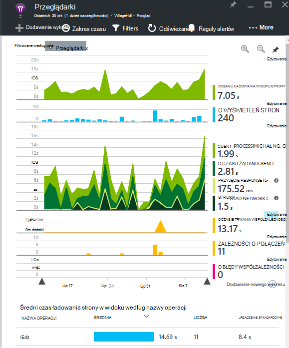

<properties 
    pageTitle="Lepiej wykorzystać możliwości aplikacji wniosków | Microsoft Azure" 
    description="Po wprowadzenie do aplikacji wniosków, Oto Podsumowanie funkcji, które można eksplorować." 
    services="application-insights" 
    documentationCenter=".net"
    authors="alancameronwills" 
    manager="douge"/>

<tags 
    ms.service="application-insights" 
    ms.workload="tbd" 
    ms.tgt_pltfrm="ibiza" 
    ms.devlang="na" 
    ms.topic="article" 
    ms.date="10/27/2016" 
    ms.author="awills"/>

# <a name="more-telemetry-from-application-insights"></a>Więcej telemetrycznego z wniosków aplikacji

Po umieszczeniu [dodany wniosków aplikacji do kodu ASP.NET](app-insights-asp-net.md), istnieje kilka rzeczy, które można wykonać, aby jeszcze bardziej telemetrycznego. 

## <a name="if-your-app-runs-on-your-iis-server-"></a>Jeśli aplikacji jest uruchamiany na serwerze usług IIS...

Jeśli aplikacji znajduje się na serwerach usług IIS w kontrolę, należy zainstalować Monitor stanu wniosków aplikacji na serwerach. Jeśli aplikacja jest już zainstalowana, nie musisz wykonywać żadnych dodatkowych czynności.

1. Na każdym serwerze sieci web usług IIS Zaloguj się przy użyciu poświadczeń administratora.
2. Pobierz i uruchom [Instalatora Monitor stanu](http://go.microsoft.com/fwlink/?LinkId=506648).
3. W Kreatorze instalacji logowanie się do programu Microsoft Azure.

Nie musisz nic robić, ale możesz potwierdzić, że monitorowanie jest włączone dla aplikacji.


(Umożliwia także Monitor stanu w celu [umożliwienia monitorowania w czasie rzeczywistym](app-insights-monitor-performance-live-website-now.md), nawet jeśli nie instrumentu aplikacji w programie Visual Studio.)

### <a name="what-do-you-get"></a>Co można uzyskać?

Jeśli Monitor stanu jest zainstalowana na komputerach serwerów, możesz uzyskać kilka dodatkowych telemetrycznego:

* Zależność telemetrycznego (połączeń pozostałych wprowadzone przez aplikację i połączeń SQL) dla aplikacji 4,5 .NET. (Nowszych wersjach programu .NET Monitor stanu nie jest wymagane na potrzeby telemetrycznego współzależności.) 
* Śledzenia stosu wyjątku wyświetlić więcej szczegółów.
* Liczniki wydajności. W aplikacji wniosków te liczniki są wyświetlane w karta serwerów. 


Aby wyświetlić więcej lub mniej liczniki, [Edytowanie wykresów](app-insights-metrics-explorer.md). Jeśli licznik wydajności, które mają nie jest w zestawie dostępne, możesz [dodać ją do zestawu zebranych przez modułu licznika wydajności](app-insights-performance-counters.md).

## <a name="if-its-an-azure-web-app-"></a>Jeśli jest Azure w przeglądarce...

Jeśli aplikacji działa jako Azure w przeglądarce, przejdź do panelu sterowania Azure dla aplikacji lub maszyn wirtualnych i otwórz karta wniosków aplikacji. 

### <a name="what-do-you-get"></a>Co można uzyskać?

* Śledzenia stosu wyjątku wyświetlić więcej szczegółów.
* Zależność telemetrycznego (połączeń pozostałych wprowadzone przez aplikację i połączeń SQL) dla aplikacji 4,5 .NET. (Nowszych wersjach programu .NET rozszerzenie nie jest wymagane na potrzeby telemetrycznego współzależności.) 


(Umożliwia także tej metody, aby [włączyć monitorowania w czasie rzeczywistym wydajności](app-insights-monitor-performance-live-website-now.md), nawet jeśli nie instrumentu aplikacji w programie Visual Studio.)

## <a name="client-side-monitoring"></a>Monitorowanie po stronie klienta

Po zainstalowaniu zestawu SDK wysyłające dane telemetryczne na serwerze (wewnętrznej) aplikacji. Teraz możesz dodać monitorowania po stronie klienta. Zawiera dane użytkowników, sesje, liczbę wyświetleń stron oraz wyjątki lub awarii, które występują w przeglądarce. Można też napisać własny kod do śledzenia działania użytkowników z aplikacji, z dokładnością do szczegółowego kliknięcia i naciśnięć klawiszy.

Dodawanie wstawkę kodu JavaScript wniosków aplikacji do każdej strony sieci web, aby uzyskać telemetrycznego z przeglądarki klientów.

1. Azure Otwórz zasobu wniosków aplikacji dla aplikacji.
2. Otwórz wprowadzenie monitorze po stronie klienta i skopiuj wstawkę kodu.
3. Powoduje wklejenie go, tak aby była wyświetlana w nagłówku strony sieci web — zwykle że można to zrobić przez wklejanie wzorca układu strony.


Zwróć uwagę, że kod zawiera klucz oprzyrządowania, identyfikujący zasób aplikacji.

### <a name="what-do-you-get"></a>Co można uzyskać?

* Można napisać JavaScript w celu wysyłania [niestandardowych telemetrycznego ze stron sieci web](app-insights-api-custom-events-metrics.md), na przykład w celu śledzenia kliknięcia przycisku.
* W [analizy](app-insights-analytics.md), dane w `pageViews` i danych AJAX `dependencies`. 
* [Wydajność klienta i danych dotyczących użycia](app-insights-javascript.md) karta przeglądarki.




[Dowiedz się więcej na temat śledzenia strony sieci web.](app-insights-web-track-usage.md)


## <a name="track-application-version"></a>Śledzenie wersji aplikacji

Upewnij się, `buildinfo.config` jest generowany przez proces MSBuild. W pliku .csproj należy dodać:  

```XML

    <PropertyGroup>
      <GenerateBuildInfoConfigFile>true</GenerateBuildInfoConfigFile>    <IncludeServerNameInBuildInfo>true</IncludeServerNameInBuildInfo>
    </PropertyGroup> 
```

Gdy został informacje o moduł wniosków aplikacji sieci web automatycznie dodaje **wersję aplikacji** jako właściwość do każdego elementu telemetrycznego. Umożliwia przefiltrować dane według wersji podczas wykonywania [diagnostyki wyszukiwania](app-insights-diagnostic-search.md) lub [poznawanie metryki](app-insights-metrics-explorer.md). 

Jednak zauważyć, że numer wersji kompilacji jest generowany tylko przez MS Build nie przez tworzenie Deweloper w programie Visual Studio.


## <a name="availability-web-tests"></a>Dostępność testy sieci web

Wysyłanie żądania HTTP aplikacji sieci web, w regularnych odstępach na całym świecie. Firma Microsoft jeśli alert odpowiedzi jest wolne lub mało wiarygodnych.

W tworzonej aplikacji w zasobie wniosków aplikacji kliknij Kafelek dostępność na dodawanie, edytowanie i wyświetlanie testów sieci web.

Możesz dodać wielu testów uruchomiony w różnych lokalizacjach.


[Dowiedz się więcej](app-insights-monitor-web-app-availability.md)

## <a name="custom-telemetry-and-logging"></a>Rejestrowanie i telemetrycznego niestandardowe

Pakiety wniosków aplikacji dodanych w kodzie zapewniają interfejs API, którymi można się połączyć z poziomu aplikacji.

* [Generowanie własnego wydarzeń i metryki](app-insights-api-custom-events-metrics.md), na przykład aby liczba zdarzeń biznesowych lub monitorowanie wydajności.
* [Przechwytywanie dziennika śledzenia](app-insights-asp-net-trace-logs.md) z Log4Net, NLog lub System.Diagnostics.Trace.
* [Filtr, zmodyfikować, lub powiększyć](app-insights-api-filtering-sampling.md) telemetrycznego standardowy, wysyłane z Twojej aplikacji pisząc telemetrycznego procesorów. 


## <a name="powerful-analysis-and-presentation"></a>Zaawansowana analiza i prezentacji

Istnieje wiele metod Eksplorowanie danych. Jeśli niedawno rozpoczęto przy użyciu aplikacji więcej informacji, zapoznaj się z następujących artykułów:

||
|---|---
|[**Diagnostyczne wyszukiwania, na przykład danych**](app-insights-visual-studio.md)<br/>Wyszukiwanie i filtrowanie zdarzenia, na przykład żądania, wyjątki współzależności połączeń, dziennika śledzenia i liczba wyświetleń strony. W programie Visual Studio przejdź do kodu śledzenia stosu.|
|[**Eksplorator metryki dla zagregowane dane**](app-insights-metrics-explorer.md)<br/>Eksplorowanie, filtrowania i segmentu zagregowane dane, takie jak stawki żądania, błędy i wyjątki; czas odpowiedzi, czasem ładowania strony.|
|[**Pulpity nawigacyjne**](app-insights-dashboards.md#dashboards)<br/>Łączenie danych z wielu zasobów i udostępnić innym osobom. Doskonałe dla wielu części aplikacji i ciągłym wyświetlaną w pokoju zespołu.  |
|[**Live strumienia metryki**](app-insights-metrics-explorer.md#live-metrics-stream)<br/>Po wdrożeniu nową kompilację Obejrzyj te wskaźniki wydajności w czasie rzeczywistym, aby upewnić się, że wszystko działa zgodnie z oczekiwaniami.|
|[**Analizy**](app-insights-analytics.md)<br/>Odbierz trudne pytania dotyczące wydajności i użycia Twojej aplikacji przy użyciu tego języka zaawansowanych kwerend.|
|[**Automatyczne i ręczne alertów**](app-insights-alerts.md)<br/>Automatyczne alerty dopasować do Twojej aplikacji normalny wzorców telemetrycznego i wyzwalacz po kwestie poza wzorcem normalny. Można także ustawić alerty na określony poziomów metryki standardowych lub niestandardowych.|

## <a name="data-management"></a>Zarządzanie danymi

|||
|---|---|
|[**Eksportowanie ciągły**](app-insights-export-telemetry.md)<br/>Kopiowanie wszystkich danych telemetrycznych do miejsca do magazynowania, dzięki czemu można analizować własny sposób.|
|**Dostęp do danych interfejsu API**<br/>Wkrótce.|
|[**Próbki**](app-insights-sampling.md)<br/>Obniża szybko danych i pomaga zachować w limicie z poziomu cennik.|