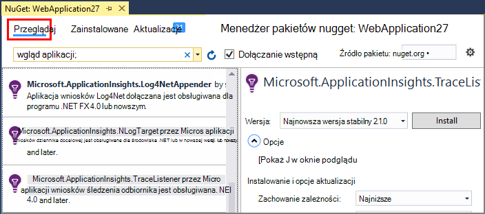
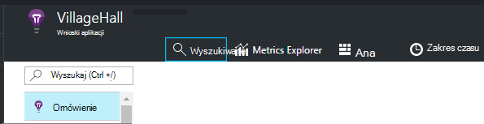
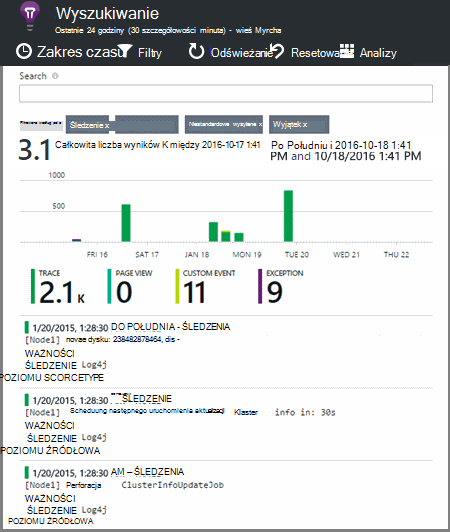

<properties 
    pageTitle="Eksplorowanie .NET dzienników w aplikacji wniosków" 
    description="Wyszukiwanie dzienniki generowane za pomocą śledzenia, NLog lub Log4Net." 
    services="application-insights" 
    documentationCenter=".net"
    authors="alancameronwills" 
    manager="douge"/>

<tags 
    ms.service="application-insights" 
    ms.workload="tbd" 
    ms.tgt_pltfrm="ibiza" 
    ms.devlang="na" 
    ms.topic="article" 
    ms.date="07/21/2016" 
    ms.author="awills"/>
 
# <a name="explore-net-trace-logs-in-application-insights"></a>Eksplorowanie .NET dzienników w aplikacji wniosków  

Jeśli korzystasz z NLog log4Net lub System.Diagnostics.Trace pozwalającą diagnostyczne w aplikacji programu ASP.NET może zawierać dzienniki wysyłane do [Programu Visual Studio aplikacji wniosków][start], gdzie można eksplorować i je przeszukiwać. Dzienniki zostaną scalone z innymi telemetrycznego pochodzące z aplikacji, dzięki czemu będzie identyfikowanie śledzenia skojarzonych z obsługą każdego żądania użytkownika i ich powiązania z innymi zdarzeń i raporty wyjątku.


> [AZURE.NOTE] Czy potrzebujesz moduł przechwytywania rejestrowania? Jest kartą przydatne dla firm 3rd rejestratory, ale jeśli nie są już używane NLog, log4Net lub System.Diagnostics.Trace, należy rozważyć, czy tylko nawiązywania połączeń z [Aplikacji wniosków TrackTrace()](app-insights-api-custom-events-metrics.md#track-trace) bezpośrednio.


## <a name="install-logging-on-your-app"></a>Instalowanie logowania aplikacji

Zainstaluj framework z wybranym rejestrowania w projekcie. Powinno to spowodować wpis w app.config lub web.config.

Jeśli korzystasz z System.Diagnostics.Trace, należy dodać wpis do pliku web.config:

```XML

    <configuration>
     <system.diagnostics>
       <trace autoflush="false" indentsize="4">
         <listeners>
           <add name="myListener" 
             type="System.Diagnostics.TextWriterTraceListener" 
             initializeData="TextWriterOutput.log" />
           <remove name="Default" />
         </listeners>
       </trace>
     </system.diagnostics>
   </configuration>
```

## <a name="configure-application-insights-to-collect-logs"></a>Konfigurowanie aplikacji wniosków zbieranie dzienników

**[Dodawanie aplikacji wniosków do projektu](app-insights-asp-net.md)** , jeśli użytkownik jeszcze nie. Zobaczysz opcję uwzględniania zbierających dziennika.

Lub **Skonfigurować wniosków aplikacji** , klikając prawym przyciskiem myszy projektu w Eksploratorze rozwiązań. Wybierz opcję **Konfiguruj kolekcji śledzenia**.

*Wnioski aplikacji menu lub dziennika zbierających opcja Brak?* Spróbuj [rozwiązywania problemów](#troubleshooting).


## <a name="manual-installation"></a>Instalacja ręczna

Ta metoda usługi typ projektu nie jest obsługiwana przez Instalatora wniosków aplikacji (na przykład projektu pulpitu systemu Windows). 

1. Jeśli zamierzasz użyć log4Net lub NLog, należy go zainstalować w projekcie. 
2. W Eksploratorze rozwiązań projektu kliknij prawym przyciskiem myszy i wybierz pozycję **Zarządzaj NuGet pakietów**.
3. Wyszukiwanie "Wniosków aplikacji"

    

4. Wybierz odpowiedni pakiet — jeden z:
  + Microsoft.ApplicationInsights.TraceListener (do przechwytywania System.Diagnostics.Trace połączeń)
  + Microsoft.ApplicationInsights.NLogTarget
  + Microsoft.ApplicationInsights.Log4NetAppender

Pakiet NuGet instaluje niezbędne zespołów i zmodyfikowano web.config lub app.config.

## <a name="insert-diagnostic-log-calls"></a>Wstawianie połączeń w dzienniku diagnostycznym

Jeśli używasz System.Diagnostics.Trace typowego połączenia jest następujący:

    System.Diagnostics.Trace.TraceWarning("Slow response - database01");

Jeśli wolisz log4net lub NLog:

    logger.Warn("Slow response - database01");


## <a name="using-the-trace-api-directly"></a>Bezpośrednio przy użyciu śledzenia interfejsu API

Możesz zadzwonić do śledzenia wniosków aplikacji interfejsu API bezpośrednio. Karty rejestrowanie za pomocą tego interfejsu API. 

Na przykład:

    var telemetry = new Microsoft.ApplicationInsights.TelemetryClient();
    telemetry.TrackTrace("Slow response - database01");

Zaletą TrackTrace to, że stosunkowo długich danych można umieścić w wiadomości. Można na przykład kodowanie danych wpisu. 

Ponadto możesz dodać poziom ważności do wiadomości. I, takich jak inne telemetrycznego można dodawać wartości właściwości, które służy do filtrowania lub wyszukiwania dla różnych zestawów śledzenia. Na przykład:


    var telemetry = new Microsoft.ApplicationInsights.TelemetryClient();
    telemetry.TrackTrace("Slow database response",
                   SeverityLevel.Warning,
                   new Dictionary<string,string> { {"database", db.ID} });

Umożliwi, w [wyszukiwaniu][diagnostic], aby łatwo odfiltrowywania wszystkich wiadomości poziom ważności określonego odnoszących się do konkretnej bazy danych.

## <a name="explore-your-logs"></a>Eksplorowanie dzienników

Uruchamianie aplikacji, albo w trybie debugowania lub wdrażanie live.

W swojej aplikacji karta Przegląd w [portalu wniosków aplikacji][portal], wybierz pozycję [Wyszukiwanie][diagnostic].





Możesz, na przykład:

* Odfiltrować śledzenia dziennika lub elementy z określonej właściwości
* Sprawdź, czy na konkretny element w szczegółów.
* Znajdowanie innych telemetrycznego odnoszących się do samej żądanie użytkownika (czyli z tym samym OperationId) 
* Zapisywanie konfiguracji tej strony jako ulubionej

> [AZURE.NOTE] **Próbki.** Jeśli aplikacja wysyła wiele danych i korzystania z SDK wniosków aplikacji dla programu ASP.NET wersji 2.0.0-beta3 lub nowszym, funkcja adaptacyjne przy próbkowaniu może działać i Wyślij tylko procent swojego telemetrycznego. [Dowiedz się więcej na temat pobierania.](app-insights-sampling.md)

## <a name="next-steps"></a>Następne kroki

[Diagnozowanie błędów i wyjątki w programie ASP.NET][exceptions]

[Dowiedz się więcej o wyszukiwaniu][diagnostic].


## <a name="troubleshooting"></a>Rozwiązywanie problemów

### <a name="how-do-i-do-this-for-java"></a>Jak to zrobić dla języka Java?

Za pomocą [karty dziennika Java](app-insights-java-trace-logs.md).

### <a name="theres-no-application-insights-option-on-the-project-context-menu"></a>Istnieje opcja wniosków aplikacji w menu kontekstowym projektu

* Sprawdź narzędzia wniosków aplikacji jest zainstalowana na tym komputerze rozwoju. W menu Narzędzia menu programu Visual Studio aktualizacje i rozszerzenia Znajdź narzędzia wniosków aplikacji. Jeśli nie jest na karcie zainstalowane, otwórz kartę Online i zainstaluj go.
* Może to być typ projektu nie jest obsługiwane za pomocą narzędzi wniosków aplikacji. Za pomocą [Instalacja ręczna](#manual-installation).

### <a name="no-log-adapter-option-in-the-configuration-tool"></a>Nie opcji karty dziennika przy użyciu narzędzia Konfiguracja

* Musisz najpierw zainstalować framework rejestrowanie.
* Jeśli korzystasz z System.Diagnostics.Trace, upewnij się, możesz [skonfigurowana w `web.config` ](https://msdn.microsoft.com/library/system.diagnostics.eventlogtracelistener.aspx).
* Masz masz najnowszą wersję aplikacji wniosków narzędzia? W menu programu Visual Studio **Narzędzia** wybierz **rozszerzenia i aktualizacje**, a następnie otwórz kartę **aktualizacje** . Jeśli narzędzia wniosków aplikacji nie jest dostępne, kliknij, aby je zaktualizować.


### <a name="emptykey"></a>Pojawia się błąd "klucz oprzyrządowania nie może być puste"

Wygląda na komputerze zainstalowano rejestrowanie karty Nuget pakiet bez instalowania aplikacji wnioski.

W Eksploratorze rozwiązań, kliknij prawym przyciskiem myszy `ApplicationInsights.config` i wybierz polecenie **Aktualizuj aplikacji wniosków**. Zostanie wyświetlony okno dialogowe umożliwiające logowanie się do Azure i Utwórz zasób wniosków aplikacji lub ponowne użycie istniejącej. Który należy rozwiązywanie problemu.

### <a name="i-can-see-traces-in-diagnostic-search-but-not-the-other-events"></a>Widzę śledzenia w diagnostyki wyszukiwania, ale nie inne zdarzenia

Czasami może minąć trochę czasu, zanim wszystkie zdarzenia i wezwań na uzyskanie potoku.

### <a name="limits"></a>Ile kosztuje dane są zachowywane?

Do 500 zdarzenia z każdą z nich na sekundę. Zdarzenia są zachowywane przez siedem dni.

### <a name="im-not-seeing-some-of-the-log-entries-that-i-expect"></a>Nie widzę niektóre wpisy dziennika, które się spodziewać

Jeśli aplikacja wysyła wiele danych i korzystania z SDK wniosków aplikacji dla programu ASP.NET wersji 2.0.0-beta3 lub nowszym, funkcja adaptacyjne przy próbkowaniu może działać i Wyślij tylko procent swojego telemetrycznego. [Dowiedz się więcej na temat pobierania.](app-insights-sampling.md)

## <a name="add"></a>Następne kroki

* [Konfigurowanie dostępności i badania czas reakcji][availability]
* [Rozwiązywanie problemów][qna]


<!--Link references-->

[availability]: app-insights-monitor-web-app-availability.md
[diagnostic]: app-insights-diagnostic-search.md
[exceptions]: app-insights-asp-net-exceptions.md
[portal]: https://portal.azure.com/
[qna]: app-insights-troubleshoot-faq.md
[start]: app-insights-overview.md

 
