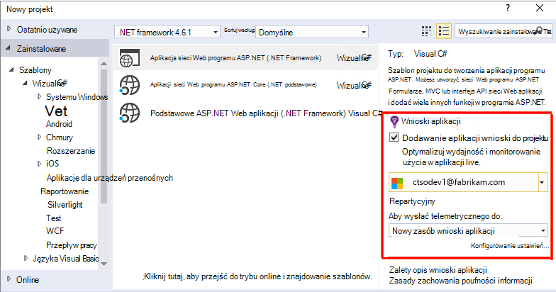
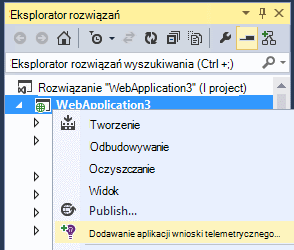
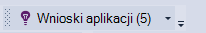
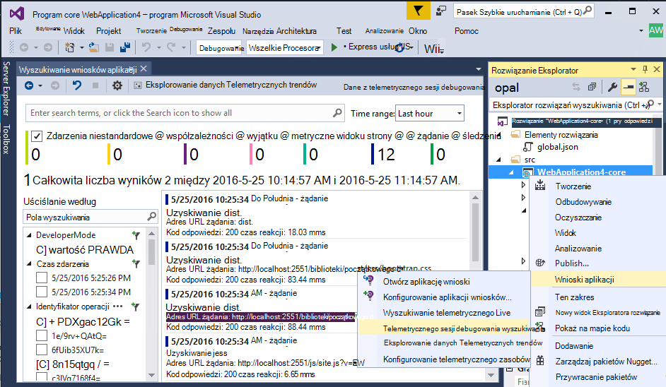
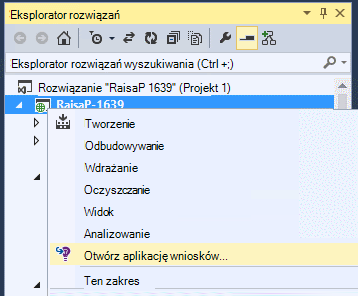
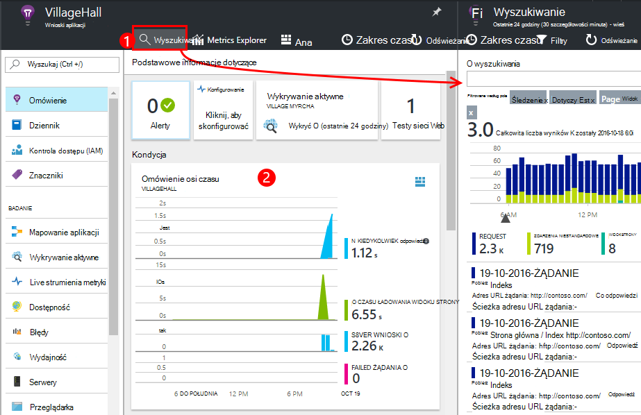
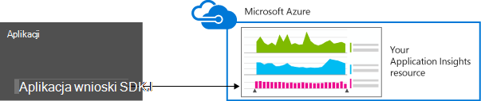
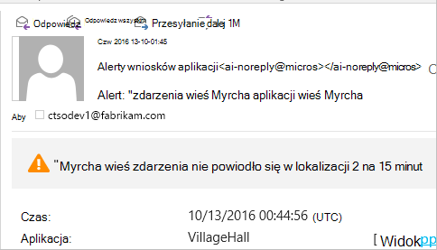
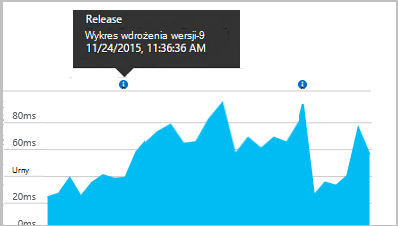
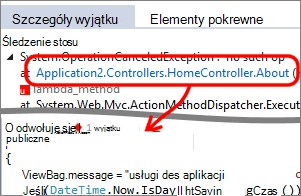

<properties 
    pageTitle="Konfigurowanie analizy aplikacji sieci web programu ASP.NET przy użyciu aplikacji wniosków | Microsoft Azure" 
    description="Konfigurowanie wydajności, dostępności i analizy użycia witryny sieci Web programu ASP.NET hostowanej lokalnego lub Azure." 
    services="application-insights" 
    documentationCenter=".net"
    authors="NumberByColors" 
    manager="douge"/>

<tags 
    ms.service="application-insights" 
    ms.workload="tbd" 
    ms.tgt_pltfrm="ibiza" 
    ms.devlang="na" 
    ms.topic="get-started-article" 
    ms.date="10/13/2016" 
    ms.author="awills"/>


# <a name="set-up-application-insights-for-aspnet"></a>Konfigurowanie wniosków aplikacji dla programu ASP.NET

[Visual Studio aplikacji wniosków](app-insights-overview.md) monitoruje live aplikacji ułatwiające [Wykrywanie i diagnozowanie problemów z wydajnością i wyjątki](app-insights-detect-triage-diagnose.md)oraz [używania aplikacji](app-insights-overview-usage.md).  Działa aplikacje, które są obsługiwane na serwerach programu IIS własne lokalnego lub na chmurze maszyny wirtualne, a także aplikacje Azure web.


## <a name="before-you-start"></a>Przed rozpoczęciem

Potrzebujesz:

* Visual Studio aktualizacja z 2013 3 lub nowszej. Później jest lepsza.
* Subskrypcję usługi [Microsoft Azure](http://azure.com). Jeśli Twój zespół lub organizacja ma subskrypcję usługi Azure, właściciela można dodać możesz do niej, za pomocą [konta Microsoft](http://live.com). 

Istnieje alternatywny artykułów, aby przyjrzeć się Jeśli interesuje Cię:

* [Instrumentacja aplikacji sieci web w czasie wykonywania](app-insights-monitor-performance-live-website-now.md)
* [Azure usług w chmurze](app-insights-cloudservices.md)

## <a name="ide"></a>1. Dodaj wniosków aplikacji SDK


### <a name="if-its-a-new-project"></a>Jeśli jest nowy projekt...

Upewnij się, że wniosków aplikacji jest zaznaczone, podczas tworzenia nowego projektu w programie Visual Studio. 





### <a name="-or-if-its-an-existing-project"></a>..., czy istniejącego projektu

Kliknij prawym przyciskiem myszy projektu w Eksploratorze rozwiązań, a następnie wybierz pozycję **Dodaj telemetrycznego wniosków aplikacji** lub **Skonfigurować wniosków aplikacji**.



* ASP.NET projektów? - [Wykonaj te instrukcje, aby rozwiązać problem kilka wierszy kodu](https://github.com/Microsoft/ApplicationInsights-aspnetcore/wiki/Getting-Started#add-application-insights-instrumentation-code-to-startupcs). 


## <a name="run"></a>2. Uruchom aplikację

Uruchomienie aplikacji z F5 i przetestuj: otwieranie różnych stronach w celu wygenerowania niektórych telemetrycznego.

W programie Visual Studio pojawi się liczba zdarzeń, które zostały zarejestrowane. 



## <a name="3-see-your-telemetry"></a>3. Zobacz usługi telemetrycznego...

### <a name="-in-visual-studio"></a>... w programie Visual Studio

Otwórz okno wniosków aplikacji w programie Visual Studio: kliknij przycisk wniosków aplikacji, lub kliknij prawym przyciskiem myszy projektu w Eksploratorze rozwiązań:



W tym widoku wyświetlane telemetrycznego wygenerowane po stronie serwera aplikacji. Eksperymentować filtry, a następnie kliknij dowolne zdarzenie, aby wyświetlić więcej szczegółów.

Aby [uzyskać więcej informacji o narzędziach wniosków aplikacji w programie Visual Studio](app-insights-visual-studio.md).

<a name="monitor"></a> 
### <a name="-in-the-portal"></a>... w portalu

O ile nie wybierzesz *Zainstalować SDK,* można też wyświetlić telemetrycznego w portalu wniosków aplikacji sieci web. 

Portalu ma więcej wykresów, narzędzia analitycznego i pulpity nawigacyjne niż Visual Studio. 


Otwórz zasób wniosków aplikacji w [Azure portal](https://portal.azure.com/).



Portalu zostanie otwarta w widoku telemetrycznego z Twojej aplikacji:

* Pierwszy telemetrycznego pojawia się w [strumień na żywo metryki](app-insights-metrics-explorer.md#live-metrics-stream).
* Poszczególne zdarzenia są wyświetlane w **wyszukiwania** (1). Dane może potrwać kilka minut. Kliknij zdarzenie, aby wyświetlić jego właściwości. 
* Zagregowane wskaźniki są wyświetlane na wykresach (2). Może potrwać minutę lub dwie danych są wyświetlane w tym miejscu. Kliknij dowolny wykres, aby otworzyć kartę więcej szczegółów.

Aby [uzyskać więcej informacji o korzystaniu z aplikacji wniosków w portalu Azure](app-insights-dashboards.md).

## <a name="4-publish-your-app"></a>4. Publikowanie aplikacji

Publikowanie aplikacji z serwerem programu IIS lub Azure. Obejrzyj [strumień na żywo metryki](app-insights-metrics-explorer.md#live-metrics-stream) , aby upewnić się, że wszystko działa sprawniej.

Zobaczysz usługi telemetrycznego budowania w portalu wniosków aplikacji, gdzie możesz monitorować metryki, wyszukiwania usługi telemetrycznego oraz konfigurowanie [pulpitów nawigacyjnych](app-insights-dashboards.md). Umożliwia także zaawansowanych [analiz kwerendy języka](app-insights-analytics.md) do analizy użycia i wydajności lub znaleźć określone zdarzenia. 

Możesz również analizowanie usługi telemetrycznego w [Programie Visual Studio](app-insights-visual-studio.md) przy użyciu narzędzi, takich jak diagnostyki wyszukiwania i [trendów](app-insights-visual-studio-trends.md).

> [AZURE.NOTE] Jeśli aplikacji wysyła za mało telemetrycznego do [ograniczenie](app-insights-pricing.md#limits-summary), automatyczne [przy próbkowaniu](app-insights-sampling.md) przełącza się. Przy próbkowaniu zmniejsza ilość telemetrycznego wysyłane w przypadku aplikacji przy zachowaniu skorelowany danych na potrzeby diagnostyczne.


##<a name="land"></a>Do czego "Dodawanie aplikacji wniosków"?

Wnioski aplikacji wysyła telemetrycznego z Twojej aplikacji do portalu wniosków aplikacji (który jest obsługiwany w programie Microsoft Azure):



Aby polecenie zostało trzy elementy:

1. Dodawanie pakietu aplikacji wniosków sieci Web SDK NuGet do projektu. Aby wyświetlić go w programie Visual Studio, kliknij prawym przyciskiem myszy projektu, a następnie wybierz pozycję Zarządzaj pakietów NuGet.
2. Utwórz zasób wniosków aplikacji w [portalu Azure](https://portal.azure.com/). Jest to miejsce, w którym pojawi się danych. Pobiera je *oprzyrządowania klucz* , który identyfikuje zasobu.
3. Wstawia klucz oprzyrządowania w `ApplicationInsights.config`, tak aby zestawu SDK można wysłać telemetrycznego do portalu.

Jeśli chcesz, możesz ręcznie wykonaj te kroki, [ASP.NET 4](app-insights-windows-services.md) lub [ASP.NET Core](https://github.com/Microsoft/ApplicationInsights-aspnetcore/wiki/Getting-Started).

### <a name="to-upgrade-to-future-sdk-versions"></a>Aby uaktualnić przyszłych wersjach SDK

Aby uaktualnić do [nowej wersji zestawu SDK](https://github.com/Microsoft/ApplicationInsights-dotnet-server/releases), ponownie otworzyć Menedżera pakietów NuGet, a odfiltrować zainstalowanych pakietów. Wybierz pozycję Microsoft.ApplicationInsights.Web i wybierz pozycję uaktualnienia.

Jeśli zostały wprowadzone żadne dostosowania ApplicationInsights.config zapisać jego kopię przed uaktualnienie, a następnie scalić zmiany w nowej wersji.

## <a name="add-more-telemetry"></a>Dodawanie więcej telemetrycznego

### <a name="web-pages-and-single-page-apps"></a>Strony sieci Web i aplikacje jedną stronę

1. [Dodaj wstawkę kodu JavaScript](app-insights-javascript.md) do stron sieci web, aby podświetlony przeglądarki i zastosowania karty z danymi o liczbę wyświetleń stron, czasy ładowania, wyjątki przeglądarki i wydajność połączeń AJAX, liczby użytkowników i sesji.
2. [Zdarzenia niestandardowe kodu](app-insights-api-custom-events-metrics.md) dla liczby, godziny lub akcje użytkownika miary.

### <a name="dependencies-exceptions-and-performance-counters"></a>Zależności, wyjątki i liczników wydajności

[Instalowanie Monitor stanu](app-insights-monitor-performance-live-website-now.md) na wszystkich komputerach serwerów, aby uzyskać dodatkowe telemetrycznego o aplikacji. Jest to zostanie wyświetlony:

* [Liczniki wydajności](app-insights-performance-counters.md) - 
Procesora, pamięci, dysku i inne liczniki wydajności odnoszących się do aplikacji. 
* [Wyjątki](app-insights-asp-net-exceptions.md) - bardziej szczegółowe telemetrycznego dla pewnymi wyjątkami.
* [Zależności](app-insights-asp-net-dependencies.md) — połączeń do usług interfejsu API usługi REST lub SQL. Dowiedz się, czy działa wolno odpowiedzi przez składniki zewnętrzne powoduje problemy z wydajnością w aplikacji. (Jeśli aplikacji działa na .NET 4.6, nie potrzebują Monitor stanu, aby uzyskać ten telemetrycznego).

### <a name="diagnostic-code"></a>Kod diagnostyczne

Masz problem? Jeśli chcesz wstawić kod w aplikacji diagnozowanie go, dostępnych jest kilka możliwości:

* [Przechwytywanie dziennika śledzenia](app-insights-asp-net-trace-logs.md): Jeśli już korzystasz Log4N, NLog lub System.Diagnostics.Trace do rejestrowania śledzenia zdarzeń, a następnie dane wyjściowe mogą być wysyłane do wniosków aplikacji, dlatego może być zgodne z żądania, je przeszukiwać i analizować je. 
* [Zdarzenia niestandardowe i wskaźniki](app-insights-api-custom-events-metrics.md): używanie TrackEvent() i TrackMetric() serwera lub kodu strony sieci web.
* [Znacznik telemetrycznego z dodatkowe właściwości](app-insights-api-filtering-sampling.md#add-properties)

Aby znaleźć i dostosować określonych zdarzeń i [analizy](app-insights-analytics.md) wykonywania bardziej zaawansowanych kwerend za pomocą [wyszukiwania](app-insights-diagnostic-search.md) .

## <a name="alerts"></a>Alerty

Bądź pierwszym, aby sprawdzić, czy aplikacji występują problemy. (Nie poczekaj, aż użytkownicy informujący!) 

* [Tworzenie testy sieci web](app-insights-monitor-web-app-availability.md) upewnij się, że witryna jest widoczny w sieci web.
* [Aktywne diagnostyki](app-insights-proactive-diagnostics.md) wykonywane automatycznie (jeśli aplikacji ma minimalne pewnego ruch). Nie musisz niczego robić w celu ich konfigurowania. One zorientować się, czy aplikacji nietypowe liczba żądań nie powiodło się.
* [Ustawianie alertów metryczne](app-insights-alerts.md) z odpowiednim ostrzeżeniem Jeśli metryki przecina progu. Można ustawić ich metryki niestandardowy kod możesz do aplikacji.

Domyślnie alertów są wysyłane do właściciela Azure subskrypcji. 



## <a name="version-and-release-tracking"></a>Wersja i śledzenie wersji

### <a name="track-application-version"></a>Śledzenie wersji aplikacji

Upewnij się, `buildinfo.config` jest generowany przez proces MSBuild. W pliku .csproj należy dodać:  

```XML

    <PropertyGroup>
      <GenerateBuildInfoConfigFile>true</GenerateBuildInfoConfigFile>    <IncludeServerNameInBuildInfo>true</IncludeServerNameInBuildInfo>
    </PropertyGroup> 
```

Gdy został informacje o moduł wniosków aplikacji sieci web automatycznie dodaje **wersję aplikacji** jako właściwość do każdego elementu telemetrycznego. Umożliwia przefiltrować dane według wersji podczas wykonywania [diagnostyki wyszukiwania](app-insights-diagnostic-search.md) lub [poznawanie metryki](app-insights-metrics-explorer.md). 

Jednak zauważyć, że numer wersji kompilacji jest generowany tylko przez MS Build nie przez tworzenie Deweloper w programie Visual Studio.

### <a name="release-annotations"></a>Zwolnij adnotacji

Jeśli używasz programu Visual Studio Team Services, możesz [uzyskać znacznik adnotacji](app-insights-annotations.md) dodane do wykresów, gdy nowej wersji.




## <a name="next-steps"></a>Następne kroki

| | 
|---|---
|**[Praca z wniosków aplikacji w programie Visual Studio](app-insights-visual-studio.md)**<br/>Debugowanie z telemetrycznego diagnostyczne wyszukiwania, przechodzić do kodu.|
|**[Praca z portalem wniosków aplikacji](app-insights-dashboards.md)**<br/>Eksportowanie pulpitów nawigacyjnych, zaawansowane narzędzia diagnostyczne i analityczne, alerty, mapy live zależności aplikacji i telemetrycznego. |
|**[Dodawanie większej ilości danych](app-insights-asp-net-more.md)**<br/>Monitorowanie użycia, dostępność, zależności, wyjątki. Włączenie śledzenia z ram rejestrowanie. Napisz telemetrycznego niestandardowe. | 


