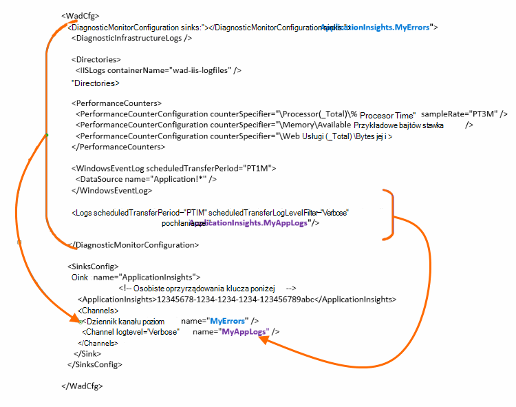

<properties
    pageTitle="Wyślij dzienniki diagnostyczne Azure analizy aplikacji"
    description="Konfigurowanie szczegółów dzienniki diagnostyczne usług w chmurze Azure, które są wysyłane do portalu wniosków aplikacji."
    services="application-insights"
    documentationCenter=".net"
    authors="sbtron"
    manager="douge"/>

<tags
    ms.service="application-insights"
    ms.workload="tbd"
    ms.tgt_pltfrm="ibiza"
    ms.devlang="na"
    ms.topic="article"
    ms.date="11/17/2015"
    ms.author="awills"/>

# <a name="configure-azure-diagnostic-logging-to-application-insights"></a>Konfigurowanie rejestrowania diagnostycznego Azure analizy aplikacji

Po skonfigurowaniu projektu usług w chmurze lub maszyny wirtualnej Microsoft Azure, [Azure mogą powodować zwrócenie dzienniku diagnostycznym](../vs-azure-tools-diagnostics-for-cloud-services-and-virtual-machines.md). Możesz mieć to wysłanych, aby wniosków aplikacji tak, aby można analizować je wraz z diagnostyki i zastosowania telemetrycznego pocztą z poziomu aplikacji SDK wniosków aplikacji. Dziennik Azure zawiera zdarzenia w zarządzaniu aplikacji, takiej jak Rozpocznij, Zatrzymaj, awarii, a także liczniki wydajności. Dziennik obejmuje także połączeń w aplikacji, aby System.Diagnostics.Trace.

Ten artykuł zawiera opis konfiguracji diagnostyczne przechwytywania szczegółowo.

Potrzebujesz 2,8 SDK Azure zainstalowanych w programie Visual Studio.

## <a name="get-an-application-insights-resource"></a>Uzyskiwanie wniosków aplikacji zasobów

Najlepsze środowisko, [Dodaj SDK wniosków aplikacji do poszczególnych ról aplikacji usług w chmurze](app-insights-cloudservices.md), lub [do dowolnej aplikacji spowoduje uruchomienie w swojej maszyn wirtualnych](app-insights-overview.md). Następnie można wysłać diagnostyczne dane, które mają być analizowane i wyświetlany ten sam zasób wniosków aplikacji.

Alternatywnie Jeśli nie chcesz używać SDK — na przykład jeśli aplikacja jest już live — możesz tylko [utworzyć nowy zasób wniosków aplikacji](app-insights-create-new-resource.md) w portalu Azure. Wybierz pozycję **Diagnostyka Azure** jako typ aplikacji.


## <a name="send-azure-diagnostics-to-application-insights"></a>Wysyłanie diagnostyki Azure analizy aplikacji

Jeśli jesteś można aktualizować projektu aplikacji, następnie w programie Visual Studio wybierz każdej roli, wybierz jego właściwości, a na karcie konfiguracji, zaznacz pole wyboru **Wyślij Diagnostyka analizy aplikacji**.

Jeśli aplikacja jest już live, użyj Eksploratora serwera lub Eksploratora usług w chmurze Visual Studio, aby otworzyć okno dialogowe właściwości aplikacji. Wybierz opcję **Wyślij Diagnostyka analizy aplikacji**.

W każdym przypadku zostanie wyświetlony monit szczegółowe zasobu wniosków aplikacji utworzonej.

Aby [uzyskać więcej informacji o konfigurowaniu wniosków aplikacji dla aplikacji usług w chmurze](app-insights-cloudservices.md).

## <a name="configuring-the-azure-diagnostics-adapter"></a>Konfigurowanie karty diagnostyki Azure

Tylko do odczytu na czy chcesz zaznaczyć części dziennik wysyłanie do wniosków aplikacji. Domyślnie wszystkie elementy są wysyłane, łącznie z: Microsoft Azure zdarzeń; liczniki wydajności; Śledzenie połączenia z aplikacji do System.Diagnostics.Trace.

Azure diagnostyki są przechowywane dane do tabel magazyn Azure. Można jednak także potoku wszystkich lub podzestawu danych do aplikacji wniosków przez skonfigurowanie "sink" i "kanałów" w konfiguracji podczas korzystania z rozszerzenia diagnostyki Azure 1.5 lub nowszym.

### <a name="configure-application-insights-as-a-sink"></a>Konfigurowanie aplikacji wniosków jako zainstalowania stołu

Użycie właściwości roli ustawić "Wyślij dane do aplikacji wniosków", dodaje SDK Azure (2,8 lub nowszej) `<SinksConfig>` element do publicznej [pliku konfiguracji diagnostyki Azure](https://msdn.microsoft.com/library/azure/dn782207.aspx) roli.

`<SinksConfig>`Określa dodatkowe obiekt sink wysyłania danych diagnostyki Azure.  Przykład `SinksConfig` wygląda tak:

```xml

    <SinksConfig>
     <Sink name="ApplicationInsights">
      <ApplicationInsights>{Insert InstrumentationKey}</ApplicationInsights>
      <Channels>
        <Channel logLevel="Error" name="MyTopDiagData"  />
        <Channel logLevel="Verbose" name="MyLogData"  />
      </Channels>
     </Sink>
    </SinksConfig>

```

`ApplicationInsights` Element określa klucz oprzyrządowania, który identyfikuje zasobów wniosków aplikacji, do którego będą wysyłane dane diagnostyki Azure. Po zaznaczeniu tego zasobu, jest on automatycznie wypełniany na podstawie `APPINSIGHTS_INSTRUMENTATIONKEY` Konfiguracja usługi. (Jeśli chcesz ustawić go ręcznie, uzyskać klucz z podstawowe informacje dotyczące listy rozwijanej zasobu.)

`Channels`Definiowanie danych, które będzie wysyłane do obiekt sink. Kanał zachowuje się jak filtru. `loglevel` Atrybut umożliwia określenie poziomu dziennika, który wyśle kanału. Dostępne wartości to: `{Verbose, Information, Warning, Error, Critical}`.

### <a name="send-data-to-the-sink"></a>Wysyłanie danych do obiekt sink

Wysyłanie danych do wniosków aplikacji zlew, dodając atrybut pochłaniacze węźle DiagnosticMonitorConfiguration. Dodawanie elementu pochłaniacze do każdego węzła Określa, że dane zebrane z tego węzła i dowolny węzeł pod nim do wysłania do sink określone.

Na przykład domyślnie tworzone przez Azure SDK to wysyłanie Azure diagnostyczne danych:

```xml

    <DiagnosticMonitorConfiguration overallQuotaInMB="4096" sinks="ApplicationInsights">
```

Ale jeśli chcesz wysłać tylko pliki dziennika kwalifikować nazwę sink pod nazwą kanału:

```xml

    <DiagnosticMonitorConfiguration overallQuotaInMB="4096" sinks="ApplicationInsights.MyTopDiagdata">
```

Zwróć uwagę, że użyto programu nazwę zlew, zdefiniowanej możemy razem z nazwę kanału, zdefiniowanego powyżej.

Jeśli chcesz wysłać Dzienniki aplikacji pełne do wniosków aplikacji, a następnie należy dodać atrybut pochłaniacze `Logs` węzeł.

```xml

    <Logs scheduledTransferPeriod="PT1M" scheduledTransferLogLevelFilter="Verbose" sinks="ApplicationInsights.MyLogData"/>
```

Można także dodać wielu pochłaniacze w konfiguracji na różnych poziomach hierarchii. W takim przypadku sink określony na najwyższym poziomie hierarchii działa jako ustawień globalnych i jedną określone czynności element poszczególnych elementów, takich jak zastępowanie do tego ustawień globalnych.

Oto przykład wykonania pliku konfiguracji publicznej wysyłające wszystkie błędy analizy aplikacji (określonych w `DiagnosticMonitorConfiguration` węzeł), a ponadto pełne poziom dzienniki dla Dzienniki aplikacji (określonych w `Logs` węzeł).

```xml

    <WadCfg>
     <DiagnosticMonitorConfiguration overallQuotaInMB="4096"
       sinks="ApplicationInsights.MyTopDiagData"> <!-- All info below sent to this channel -->
      <DiagnosticInfrastructureLogs />
      <PerformanceCounters>
        <PerformanceCounterConfiguration counterSpecifier="\Processor(_Total)\% Processor Time" sampleRate="PT3M" sinks="ApplicationInsights.MyLogData/>
        <PerformanceCounterConfiguration counterSpecifier="\Memory\Available MBytes" sampleRate="PT3M" />
        <PerformanceCounterConfiguration counterSpecifier="\Web Service(_Total)\Bytes Total/Sec" sampleRate="PT3M" />
      </PerformanceCounters>
      <WindowsEventLog scheduledTransferPeriod="PT1M">
        <DataSource name="Application!*" />
      </WindowsEventLog>
      <Logs scheduledTransferPeriod="PT1M" scheduledTransferLogLevelFilter="Verbose"
            sinks="ApplicationInsights.MyLogData"/>
       <!-- This specific info sent to this channel -->
     </DiagnosticMonitorConfiguration>

     <SinksConfig>
      <Sink name="ApplicationInsights">
        <ApplicationInsights>{Insert InstrumentationKey}</ApplicationInsights>
        <Channels>
          <Channel logLevel="Error" name="MyTopDiagData"  />
          <Channel logLevel="Verbose" name="MyLogData"  />
        </Channels>
      </Sink>
     </SinksConfig>
    </WadCfg>
```



Istnieją pewne ograniczenia, o których warto pamiętać przy użyciu tej funkcji:

* Kanały są przeznaczone tylko do pracy z nie liczniki wydajności i typ dziennika. Jeśli użytkownik określi kanału z elementem licznik wydajności będą ignorowane.
* Poziom rejestrowania dla kanału nie może przekraczać poziom rejestrowania dla co to są zbierane przez diagnostyki Azure. Na przykład: nie można zbieranie błędów w dzienniku aplikacji w elemencie dzienniki i próbują wysłać pełne dzienniki do wglądu aplikacji synchronizacji. Atrybut scheduledTransferLogLevelFilter musi zawsze zbieranie równa lub dzienniki więcej niż dzienniki próbujesz wysłać do zainstalowania stołu.
* Nie możesz wysłać wszystkie dane obiektów blob zbierane przez rozszerzenia diagnostyki Azure analizy aplikacji. Na przykład nic określoną węźle katalogów. Dla awarii dokonuje zrzutu zrzut awaryjny rzeczywisty nadal będą wysyłane do blob miejsca do magazynowania i tylko powiadomienie, że został wygenerowany zrzut awaryjny będą wysyłane do wniosków aplikacji.

## <a name="related-topics"></a>Tematy pokrewne

* [Monitorowanie usługi Azure chmurze przy użyciu aplikacji wniosków](app-insights-cloudservices.md)
* [Aby wysłać diagnostyki Azure analizy aplikacji przy użyciu programu PowerShell](app-insights-powershell-azure-diagnostics.md)
* [Plik konfiguracyjny diagnostyki Azure](https://msdn.microsoft.com/library/azure/dn782207.aspx)
