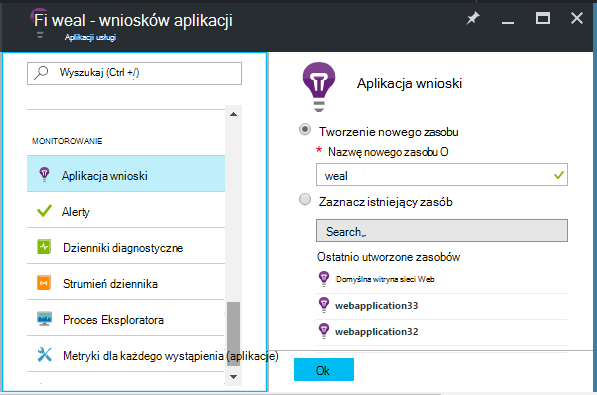
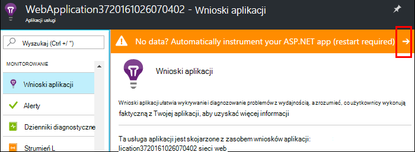
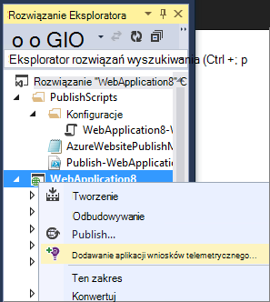
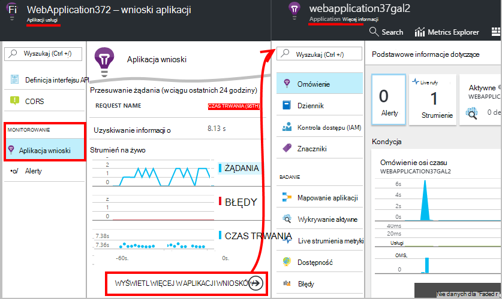
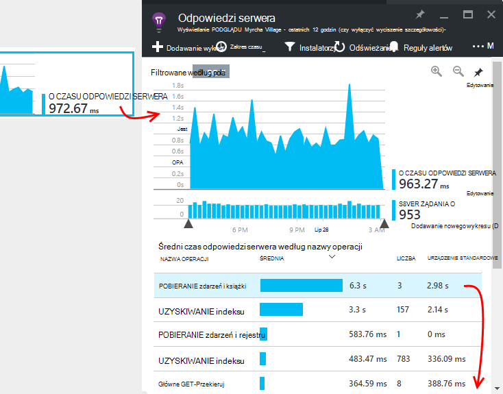
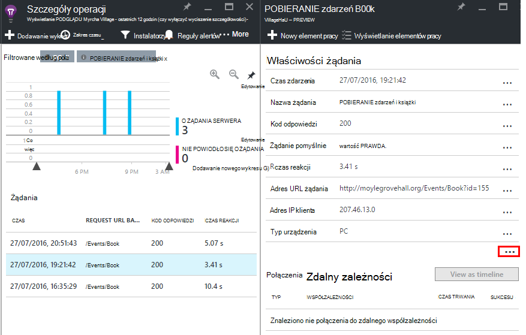

<properties
    pageTitle="Monitorowanie wydajności aplikacji sieci web Azure | Microsoft Azure"
    description="W przypadku aplikacji sieci web Azure do monitorowania wydajności aplikacji. Wykres obciążenia i odpowiadania na czas, informacje o zależnościach i ustawianie alertów na wydajność."
    services="application-insights"
    documentationCenter=".net"
    authors="alancameronwills"
    manager="douge"/>

<tags
    ms.service="azure-portal"
    ms.workload="na"
    ms.tgt_pltfrm="na"
    ms.devlang="na"
    ms.topic="article"
    ms.date="10/24/2016"
    ms.author="awills"/>

# Monitorowanie wydajności aplikacji sieci web Azure

W [Azure Portal](https://portal.azure.com) możesz skonfigurować monitorowania wydajności aplikacji dla [aplikacji sieci web Azure](../app-service-web/app-service-web-overview.md). [Visual Studio aplikacji wniosków](app-insights-overview.md) instruments aplikacji wysłać telemetrycznego o działalności do usługi wniosków aplikacji, gdzie są przechowywane i analizy. Wykresy metryczne i narzędzia wyszukiwania może służyć do diagnozowanie problemów, zwiększyć wydajność i oceny zastosowania.

## Czas wykonywania lub tworzenie czasu

Możesz skonfigurować monitorowania przez Instrumentacja aplikacji w jeden z dwóch sposobów:

* **Wykonywalna** - możesz wybrać wydajności, monitorowanie rozszerzenia aplikacji sieci web jest już live. Nie jest konieczne odbudowanie lub ponownie zainstalować aplikację. Zostanie wyświetlony standardowy zestaw pakietów, które można monitorować czasy odpowiedzi, stawki sukcesu, wyjątki, zależności i tak dalej. 
 
* **Tworzenie czas** — możesz zainstalować pakiet w aplikacji w fazie projektowania. Ta opcja jest bardziej uniwersalny. Oprócz samej opakowań standardowy można wpisać kod Dostosowywanie telemetrycznego lub, aby wysłać własne telemetrycznego. Można rejestrować określonych działań lub zdarzeń rekordu według znaczeń właściwych domeny aplikacji. 

## Uruchamianie oprzyrządowania czasu przy użyciu aplikacji wniosków

Już korzystasz z aplikacji sieci web platformy Azure, już ponowienie niektórych monitorowania: stawki żądania i błędów. Dodawanie wniosków aplikacji, aby uzyskać więcej, takich jak czasy odpowiedzi, monitorowanie połączenia do zależności, Inteligentne wykrywanie i zaawansowanych analiz kwerendy języka. 

1. **Wybierz aplikację wniosków** w Panelu sterowania Azure dla aplikacji sieci web.

    

 * Wybierz pozycję Utwórz nowy zasób, chyba że już ustawione zasób wniosków aplikacji dla tej aplikacji innej drogą.

2. **Instrument aplikacji sieci web** po zainstalowaniu aplikacji wnioski. 

    

3. **Monitorowanie aplikacji**.  [Expore dane](#explore-the-data).

Później możesz tworzyć i ponownie wdróż tę aplikację za pomocą aplikacji wniosków, jeśli chcesz.

*Jak usunąć aplikację wniosków, lub przełącz się do wysyłania do innego zasobu?*

* Platformy Azure Otwórz karta sterowania aplikacji sieci web, a w obszarze narzędzia do projektowania otwórz **rozszerzenia**. Usuwanie rozszerzenia aplikacji wnioski. Następnie w obszarze monitorowania, wybierz pozycję wniosków aplikacji i Utwórz lub wybierz zasób, który chcesz.

## Tworzenie aplikacji przy użyciu aplikacji wniosków

Wnioski aplikacji umożliwiają bardziej szczegółowe telemetrycznego instalując SDK do aplikacji. W szczególności można zbieranie dzienników, [Pisanie telemetrycznego niestandardowe](../application-insights/app-insights-api-custom-events-metrics.md)i uzyskiwanie bardziej szczegółowych raportów wyjątek.

1. **W programie Visual Studio** (aktualizacja 2013, 2 lub nowszy), dodawanie SDK wniosków aplikacji do projektu.

    

    W przypadku wyświetlenia pytania, aby się zalogować, Użyj poświadczeń dla Twojego konta Azure.

    Operacja ma dwa efekty:

 1. Tworzy zasób wniosków aplikacji w Azure, gdzie telemetrycznego są przechowywane, analizowane i wyświetlania.
 2. Dodaje pakiet aplikacji wniosków NuGet w kodzie i konfiguruje go, aby wysłać telemetrycznego do Azure zasobów.

2. **Test telemetrycznego** , uruchamiając aplikację na tym komputerze rozwoju (F5).

3. **Publikowanie aplikacji** Azure w zwykły sposób. 

*Jak przełączyć wysyłanie do innego zasobu wniosków aplikacji?*

* W programie Visual Studio, kliknij prawym przyciskiem myszy projektu, wybierz pozycję **wniosków aplikacji > Konfiguruj** i wybierz pozycję zasobu. Uzyskasz możliwość utworzenia nowego zasobu. Odbudowywanie i ponownie wdróż.

## Eksplorowanie danych

1. Na karta wniosków aplikacji Panelu sterowania aplikacji sieci web, zobacz Live metryki prezentującej żądania i błędy w drugiej lub trzeciej stronie ich występujące. Jest wyświetlana bardzo przydatne, gdy jest ponowne publikowanie aplikacji — problemów mogą być widoczne od razu.

2. Kliknij, aby wszystkich zasobów wniosków aplikacji.

    
    

    Możesz również przejść z bezpośrednio z nawigacji Azure zasobów.

2. Kliknij dowolny wykres, aby uzyskać więcej szczegółów:

    

    Możesz [dostosować metryki karty](../application-insights/app-insights-metrics-explorer.md).

3. Kliknij pozycję za pośrednictwem mapę Zobacz pojedynczych zdarzeń i ich właściwości:

    

    Zwróć uwagę, "..." łącze, aby otworzyć wszystkie właściwości.

    Możesz [dostosować wyniki wyszukiwania](../application-insights/app-insights-diagnostic-search.md).

Bardziej zaawansowane wyszukiwanie przez usługi telemetrycznego za pomocą [analizy kwerendy języka](../application-insights/app-insights-analytics-tour.md).

## Następne kroki

* [Włączanie Azure diagnostyki](app-insights-azure-diagnostics.md) były wysyłane do wniosków aplikacji.
* [Metryki kondycji usługi monitor](../monitoring-and-diagnostics/insights-how-to-customize-monitoring.md) upewnij się, że usługi jest dostępny i odpowiada.
* [Odbieranie alertów](../monitoring-and-diagnostics/insights-receive-alert-notifications.md) przy każdym operacyjne zdarzeń lub metryki krzyżowy progu.
* Uzyskiwanie telemetrycznego klienta z przeglądarek, które strony sieci web za pomocą [Aplikacji wniosków dla aplikacji JavaScript i stron sieci web](app-insights-web-track-usage.md) .
* [Ustawianie testów web dostępność](app-insights-monitor-web-app-availability.md) alertów, jeśli Twoja witryna w dół.
