<properties
   pageTitle="Wnioski aplikacji dla usług w chmurze Azure"
   description="Monitorowanie usługi sieci web i pracownik ról efektywnego wniosków aplikacji"
   services="application-insights"
   documentationCenter=""
   authors="soubhagyadash"
   manager="douge"
   editor="alancameronwills"/>

<tags
   ms.service="application-insights"
   ms.devlang="na"
   ms.tgt_pltfrm="ibiza"
   ms.topic="article"
   ms.workload="tbd"
   ms.date="03/02/2016"
   ms.author="sdash"/>

# <a name="application-insights-for-azure-cloud-services"></a>Wnioski aplikacji dla usług w chmurze Azure


*Wnioski aplikacji znajduje się w wersji preview*

[Aplikacje usługi Microsoft Azure chmury](https://azure.microsoft.com/services/cloud-services/) może być monitorowane przez [Program Visual Studio aplikacji wniosków] [ start] dostępność, wydajność, błędów i zastosowania. Z opinii, jaką możesz wyświetlić informacje o wydajności i efektywności aplikacji w znaków symboli można wybrać opcje informacje o kierunku projektu w każdym Cykl opracowywania.

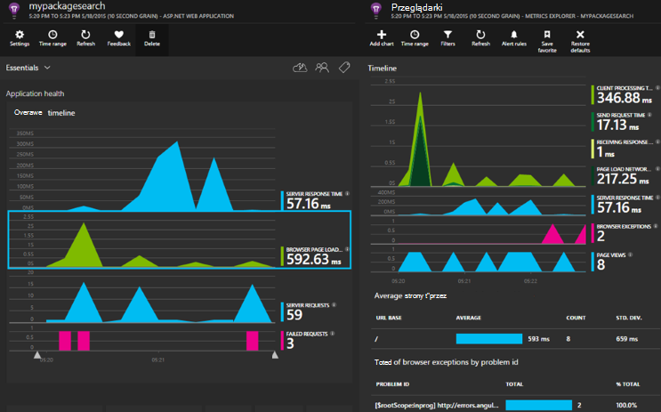

Konieczne będzie subskrypcję z [Platformy Microsoft Azure](http://azure.com). Zaloguj się przy użyciu konta Microsoft, które może być dla systemu Windows, XBox Live lub innymi usługami w chmurze firmy Microsoft. 


#### <a name="sample-application-instrumented-with-application-insights"></a>Przykładowa aplikacja działają z wniosków aplikacji

Zapoznaj się tej [przykładowej aplikacji](https://github.com/Microsoft/ApplicationInsights-Home/tree/master/Samples/AzureEmailService) , w której wniosków aplikacji jest dodawany do usługi w chmurze przy użyciu dwóch ról pracownik obsługiwany w Azure. 

Poniżej opisano, jak można dostosowywać własnego projektu usługi w chmurze w taki sam sposób.

## <a name="create-an-application-insights-resource-for-each-role"></a>Tworzenie zasób wniosków aplikacji dla poszczególnych ról

Zasób wniosków aplikacji to miejsce, w którym analizowane i wyświetlania danych telemetrycznych.  

1.  W [Azure portal][portal], tworzenia nowego zasobu wniosków aplikacji. Typ aplikacji wybierz pozycję w aplikacji programu ASP.NET. 

    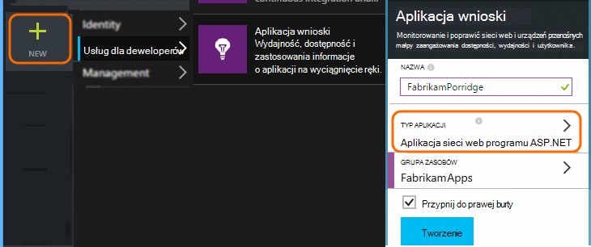

2.  Wykonaj kopię klucza oprzyrządowania. Musisz to krótko w celu skonfigurowania zestawu SDK.

    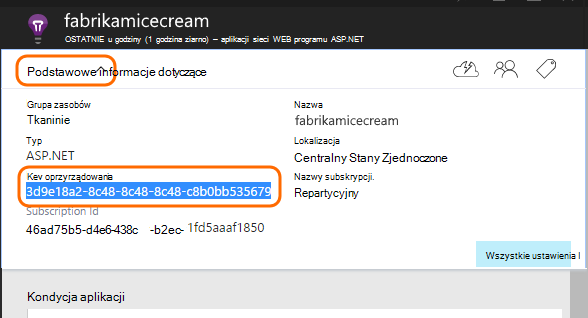


Zazwyczaj najlepiej [utworzyć zasób osobnych danych z każdej roli sieci web i pracownika](app-insights-separate-resources.md). 

Alternatywnie możesz może wysyłać dane ze wszystkich ról do tylko jeden zasób, ale należy ustawić [Właściwość default] [ apidefaults] tak, aby można filtrować lub grupować wyniki z każdą rolą.

## <a name="sdk"></a>Zainstaluj zestaw SDK w poszczególnych projektach


1. W programie Visual Studio Edytuj pakietów NuGet projektu aplikacji chmury.

    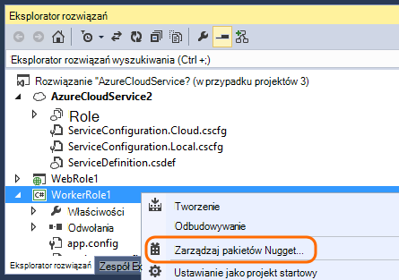


2. Role w sieci web Dodaj pakiet NuGet [Wniosków aplikacji sieci Web](http://www.nuget.org/packages/Microsoft.ApplicationInsights.Web) . Ta wersja zestawu SDK zawiera modułów, w których dodawanie kontekstu serwera, takich jak informacje o roli. Dla ról pracownika za pomocą [Aplikacji wniosków dla serwerów systemu Windows](https://www.nuget.org/packages/Microsoft.ApplicationInsights.WindowsServer/).

    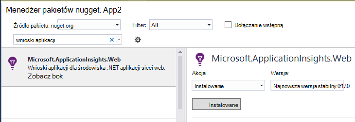


3. Konfigurowanie SDK wysyłanie danych do zasobu wniosków aplikacji.

    Ustawianie klucza oprzyrządowania jako ustawienia w pliku `ServiceConfiguration.Cloud.cscfg`. ([Kod](https://github.com/Microsoft/ApplicationInsights-Home/blob/master/Samples/AzureEmailService/AzureEmailService/ServiceConfiguration.Cloud.cscfg)).
 
    ```XML
     <Role name="WorkerRoleA"> 
      <Setting name="APPINSIGHTS_INSTRUMENTATIONKEY" value="YOUR IKEY" /> 
     </Role>
    ```
 
    W funkcji uruchamiania odpowiednie Ustaw klucz oprzyrządowania przy użyciu ustawienia konfiguracji:

    ```C#
     TelemetryConfiguration.Active.InstrumentationKey = RoleEnvironment.GetConfigurationSettingValue("APPINSIGHTS_INSTRUMENTATIONKEY");
    ```

    Notatki, taką samą nazwę `APPINSIGHTS_INSTRUMENTATIONKEY` konfiguracji ustawienia będą używane przez diagnostyki Azure raportowania. 


    Wykonaj następujące czynności dla każdej roli w aplikacji. Zapoznaj się z przykładami:
 
 * [Role w sieci Web](https://github.com/Microsoft/ApplicationInsights-Home/blob/master/Samples/AzureEmailService/MvcWebRole/Global.asax.cs#L27)
 * [Rola pracownika](https://github.com/Microsoft/ApplicationInsights-Home/blob/master/Samples/AzureEmailService/WorkerRoleA/WorkerRoleA.cs#L232)
 * [Dla stron sieci web](https://github.com/Microsoft/ApplicationInsights-Home/blob/master/Samples/AzureEmailService/MvcWebRole/Views/Shared/_Layout.cshtml#L13)   

4. Ustawianie pliku ApplicationInsights.config mają być zawsze kopiowane do katalogu wyjściowego. 

    (W pliku .config pojawi się wiadomości zapytaniem, aby umieścić klucz oprzyrządowania. Jednak dla aplikacje w chmurze lepiej jest go ustawić z pliku .cscfg. Dzięki temu poprawnie identyfikuje roli w portalu.)


#### <a name="run-and-publish-the-app"></a>Uruchamianie i publikowanie aplikacji

Uruchamianie aplikacji, a następnie zaloguj się do Azure. Otwórz zasobów wniosków aplikacji utworzonej i będzie widoczna pozycja poszczególnych punktów danych znajdujących się w [wyszukiwaniu](app-insights-diagnostic-search.md)i zagregowane dane w [Eksploratorze metryki](app-insights-metrics-explorer.md). 

Dodawanie więcej telemetrycznego — znajdują się w sekcjach poniżej -, a następnie opublikuj aplikacji uzyskanie opinii na żywo diagnostyczne i zastosowania. 


#### <a name="no-data"></a>Brak danych?

* Otwieranie [wyszukiwania] [ diagnostic] kafelków, aby wyświetlić pojedynczych zdarzeń.
* Za pomocą aplikacji otwieranie różnych stron tak, aby generuje niektórych telemetrycznego.
* Poczekaj kilka sekund, a następnie kliknij pozycję Odśwież.
* Zobacz [Rozwiązywanie problemów z][qna].


## <a name="more-telemetry"></a>Więcej telemetrycznego

Poniższych sekcjach przedstawiono sposób uzyskiwania dodatkowe telemetrycznego z różnych aspektów aplikacji.


## <a name="track-requests-from-worker-roles"></a>Śledzenie żądań roli pracownika

W sieci web role moduł żądania automatycznie zbiera dane dotyczące żądania HTTP. Zobacz [Przykładowy MVCWebRole](https://github.com/Microsoft/ApplicationInsights-Home/tree/master/Samples/AzureEmailService/MvcWebRole) przykłady jak można zmienić domyślne zachowanie kolekcji. 

Wydajność połączeń do ról pracownika można przechwycić, śledzenia je w taki sam sposób jak żądania HTTP. W aplikacji wniosków typ telemetrycznego żądania środków jednostka pracy po stronie serwera nazwanych, która może przekroczono i niezależne powiodła się lub zakończyć się niepowodzeniem. Podczas żądania HTTP są przechwytywane automatycznie przez zestaw SDK, możesz wstawić własnego kodu, aby śledzić żądania ról pracownika.

Zobacz dwie role pracownika przykładowe narzędzia do żądania raportów: [WorkerRoleA](https://github.com/Microsoft/ApplicationInsights-Home/tree/master/Samples/AzureEmailService/WorkerRoleA) i [WorkerRoleB](https://github.com/Microsoft/ApplicationInsights-Home/tree/master/Samples/AzureEmailService/WorkerRoleB)

## <a name="azure-diagnostics"></a>Diagnostyka Azure

[Diagnostyka Azure](../vs-azure-tools-diagnostics-for-cloud-services-and-virtual-machines.md) danych zawiera zdarzeń zarządzania roli, liczniki wydajności i dzienniki aplikacji. Możesz mieć następujące wysłanych do wniosków aplikacji tak, aby były widoczne obok reszta z telemetrycznego, co ułatwia diagnozowanie problemów.

Diagnostyka Azure są szczególnie przydatne, jeśli roli nieoczekiwanie kończy się niepowodzeniem lub nie można uruchomić.

1. Kliknij prawym przyciskiem myszy jego rolę (nie projekt!), otwórz jej właściwości, a następnie wybierz **Włącz diagnostyki**, **Wysyłanie Diagnostyka analizy aplikacji**.

    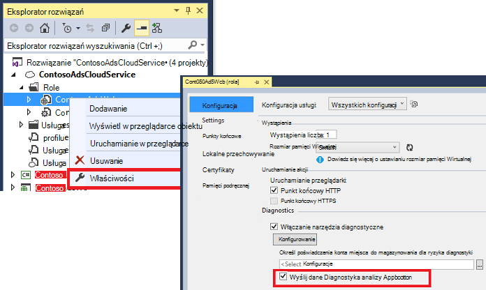

    **Czy aplikacja jest już opublikowanych i uruchomiona**, otwórz Eksploratora serwera lub Eksploratora chmury, kliknij prawym przyciskiem myszy aplikację i wybierz tę samą opcję.

3.  Zaznacz ten sam zasób wniosków aplikacji jako usługi innych telemetrycznego.

    Jeśli chcesz, można ustawić innego zasobu w innej usłudze konfiguracji (chmury, lokalny), aby zapewnić oddzielone od danych dynamicznych danych rozwoju.

3. Opcjonalnie [wykluczyć niektóre Azure diagnostyki](app-insights-azure-diagnostics.md) ma być przesyłana dalej wniosków aplikacji. Wartość domyślna to wszystko.

### <a name="view-azure-diagnostic-events"></a>Wyświetlanie Azure zdarzenia diagnostyczne

Gdzie można znaleźć diagnostycznych:

* Liczniki wydajności są wyświetlane jako metryki niestandardowe. 
* Dzienniki zdarzeń systemu Windows są wyświetlane jako śledzenia i zdarzenia niestandardowe.
* Dzienniki aplikacji, dzienniki zdarzeń systemu Windows i wszelkie dzienniki infrastruktury diagnostyki są wyświetlane jako śledzenia.

Aby wyświetlić liczniki wydajności i liczby zdarzeń, otwórz [Eksploratora metryki](app-insights-metrics-explorer.md) i dodawanie nowego wykresu:


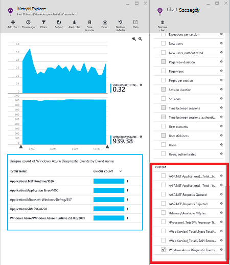

Aby przeszukać różnych dzienników wysyłane przez diagnostyki Azure za pomocą [wyszukiwania](app-insights-diagnostic-search.md) . Na przykład jeśli wcześniej używano wyjątek unhanded w roli, które spowodowało roli awarię i Kosza, te informacje będzie wyświetlany w aplikacji kanału z dziennika zdarzeń systemu Windows. Funkcje wyszukiwania umożliwia przeglądanie błędu dziennika zdarzeń systemu Windows i uzyskiwanie śledzenia pełnym stosie dla wyjątku, co umożliwia znajdowanie głównej przyczyny problemu.


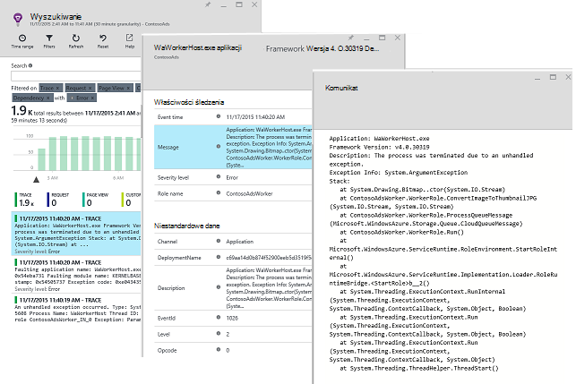

## <a name="app-diagnostics"></a>Narzędzia diagnostyczne aplikacji

Azure diagnostyki zawiera automatycznie generuje aplikacji przy użyciu System.Diagnostics.Trace wpisy dziennika. 

Jeśli używasz już RAM Log4N lub NLog, możesz także [Przechwytywanie ich śledzenia dziennika], ale[netlogs].

[Śledzenie zdarzeń niestandardowych i metryk] [ api] klienta serwera lub oba, aby dowiedzieć się więcej na temat wydajności i użycia aplikacji.

## <a name="dependencies"></a>Zależności

Aplikacja wniosków SDK zgłosić połączeń, które powoduje zależności zewnętrznych, takich jak interfejsy API pozostałych i serwerów SQL w aplikacji. Pozwala sprawdzić, czy określonego zależności jest przyczyną odpowiedzi działa wolno lub błędy.

Jeśli aplikacja używa .NET framework 4.6 lub nowszy, nie musisz nic robić. 

W przeciwnym razie skonfiguruj roli sieci web i pracownik przy użyciu [Aplikacji wniosków agenta](app-insights-monitor-performance-live-website-now.md) nazywane także "Monitor stanu".

Aby użyć agenta wniosków aplikacji przy użyciu usługi sieci web i pracownik ról:

* Dodawanie folderu [AppInsightsAgent](https://github.com/Microsoft/ApplicationInsights-Home/tree/master/Samples/AzureEmailService/WorkerRoleA/AppInsightsAgent) i dwa pliki w nim do projektów roli sieci web i pracownika. Pamiętaj ustawić ich właściwości kompilacji tak, aby zawsze są kopiowane do katalogu wyjściowego. Tych plików zainstalować agenta.
* Uruchamianie zadania można dodać do pliku CSDEF, jak pokazano [poniżej](https://github.com/Microsoft/ApplicationInsights-Home/tree/master/Samples/AzureEmailService/AzureEmailService/ServiceDefinition.csdef#L18).
* Uwaga: *Role pracownika* wymaga trzy zmienne środowiska, jak pokazano [poniżej](https://github.com/Microsoft/ApplicationInsights-Home/tree/master/Samples/AzureEmailService/AzureEmailService/ServiceDefinition.csdef#L44). Nie jest to wymagane dla ról w sieci web.

### <a name="dependency-reports"></a>Raporty współzależności

Oto przykład wyświetlonych w portalu wniosków aplikacji:

* Sformatowany Diagnostyka z automatycznie skorelowany żądania i zależności:

    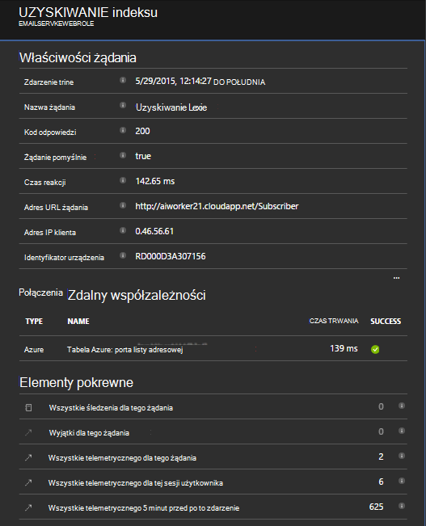

* Wydajność roli sieci web przy użyciu informacji o zależnościach:

    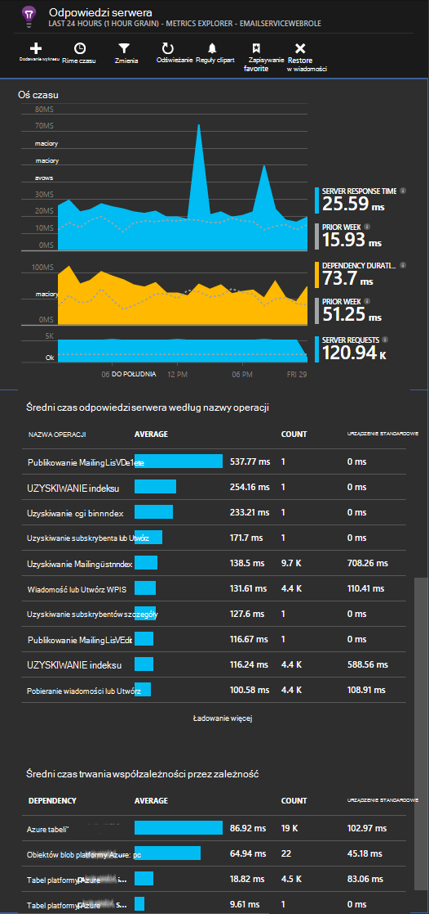

* Oto zrzutu ekranu na żądania i informacje o zależnościach dla roli pracownika:

    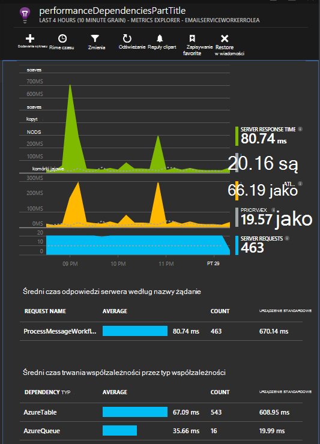

## <a name="exceptions"></a>Wyjątki

Zobacz [Monitorowanie wyjątki w aplikacji wniosków](app-insights-asp-net-exceptions.md) dla informacji na temat jak może zbierać nieobsługiwanego wyjątki od typów aplikacji innej witryny sieci web.

Przykładowe rola sieci web ma kontrolery MVC5 i 2 interfejsu API sieci Web. Nieobsługiwany wyjątki od 2 są przechwytywane w następujących zakresach:

* [AiHandleErrorAttribute](https://github.com/Microsoft/ApplicationInsights-Home/blob/master/Samples/AzureEmailService/MvcWebRole/Telemetry/AiHandleErrorAttribute.cs) Konfigurowanie [tutaj](https://github.com/Microsoft/ApplicationInsights-Home/blob/master/Samples/AzureEmailService/MvcWebRole/App_Start/FilterConfig.cs#L12) kontrolerów MVC5
* [AiWebApiExceptionLogger](https://github.com/Microsoft/ApplicationInsights-Home/blob/master/Samples/AzureEmailService/MvcWebRole/Telemetry/AiWebApiExceptionLogger.cs) Konfigurowanie [tutaj](https://github.com/Microsoft/ApplicationInsights-Home/blob/master/Samples/AzureEmailService/MvcWebRole/App_Start/WebApiConfig.cs#L25) kontrolerów 2 interfejsu API sieci Web

Dla ról pracownik istnieją dwa sposoby do śledzenia wyjątki.

* TrackException(ex)
* Po dodaniu pakietu aplikacji wniosków śledzenia odbiornika NuGet umożliwia System.Diagnostics.Trace logowania wyjątki. [Przykład kodu.](https://github.com/Microsoft/ApplicationInsights-Home/blob/master/Samples/AzureEmailService/WorkerRoleA/WorkerRoleA.cs#L107)

## <a name="performance-counters"></a>Liczniki wydajności

Domyślnie są zbierane następujące liczniki:

    * \Process(??APP_WIN32_PROC??)\% czas procesora
    * \Memory\Available bajtów
    * \.CLR netto Exceptions(??APP_CLR_PROC??)\# z Exceps generowany / s
    * \Process (?. APP_WIN32_PROC?) \Private bajtów
    * \Process (?. APP_WIN32_PROC?) Dane \IO bajtów/s
    * \Processor(_Total)\% czas procesora

Ponadto następujące są także pobierane do ról w sieci web:

    * \ASP.NET aplikacji (?. APP_W3SVC_PROC?) \Requests/sec    
    * \ASP.NET aplikacji (?. APP_W3SVC_PROC?) Czas wykonywania \Request
    * \ASP.NET aplikacji (?. APP_W3SVC_PROC?) \Requests w kolejce aplikacji

Jak pokazano [tutaj](https://github.com/Microsoft/ApplicationInsights-Home/blob/master/Samples/AzureEmailService/WorkerRoleA/ApplicationInsights.config#L14) można określić dodatkowe niestandardowej lub innych liczników wydajności systemu windows

  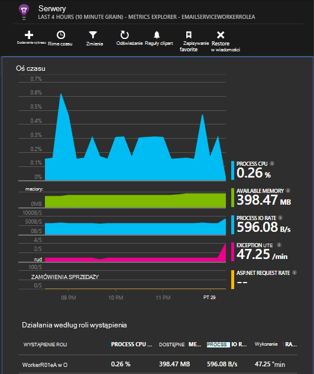

## <a name="correlated-telemetry-for-worker-roles"></a>Skorelowane telemetrycznego dla pracownika ról

Gdy zostanie wyświetlony, co prowadzi do żądania nie powiodło się lub wysoki opóźnienie jest zaawansowanych możliwości diagnostyczne. Z role w sieci web zestawu SDK automatycznie konfiguruje korelacji między telemetrycznego pokrewnych. Za pomocą inicjator telemetrycznego niestandardowe do ustawiania typowych atrybutu kontekstu Operation.Id dla wszystkich telemetrycznego osiągnąć ten cel, dla ról pracownika. Pozwoli sprawdzić, czy problem opóźnienie/błąd został spowodowany ze względu na zależność lub kodzie rzut oka! 

Oto jak:

* Ustaw identyfikator korelacji do parametr CallContext, jak pokazano [poniżej](https://github.com/Microsoft/ApplicationInsights-Home/blob/master/Samples/AzureEmailService/WorkerRoleA/WorkerRoleA.cs#L36). W tym przypadku użyto Identyfikatora żądania jako identyfikator korelacji
* Dodawanie niestandardowej implementacji TelemetryInitializer, który będzie ustawiana Operation.Id correlationId powyżej. Tu: [ItemCorrelationTelemetryInitializer](https://github.com/Microsoft/ApplicationInsights-Home/blob/master/Samples/AzureEmailService/WorkerRoleA/Telemetry/ItemCorrelationTelemetryInitializer.cs#L13)
* Dodawanie inicjator telemetrycznego niestandardowych. Można można to zrobić w pliku ApplicationInsights.config lub w kodzie jak pokazano [tutaj](https://github.com/Microsoft/ApplicationInsights-Home/blob/master/Samples/AzureEmailService/WorkerRoleA/WorkerRoleA.cs#L233)

To wszystko! Środowisko portalu już przewodowej w górę do pozwalają wyświetlać wszystkie skojarzone telemetrycznego rzut oka:

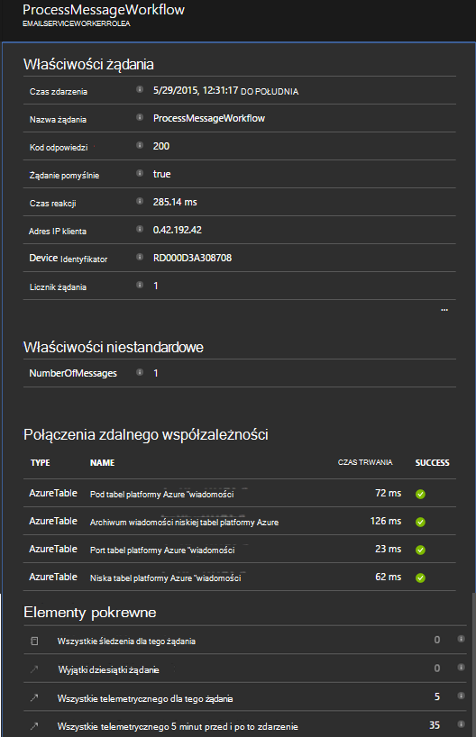


## <a name="client-telemetry"></a>Telemetrycznego klienta

[Dodawanie JavaScript SDK do stron sieci web] [ client] Aby uzyskać telemetrycznego oparte na przeglądarce, takie jak liczniki widoku strony, czasem ładowania strony, wyjątki skryptu i umożliwiają pisanie niestandardowych telemetrycznego w skrypty strony.

## <a name="availability-tests"></a>Sprawdza dostępności

[Ustawianie testów web] [ availability] aby upewnić się, pozostaje aplikacji i odpowiadać na żywo.


## <a name="example"></a>Przykład

[Przykład](https://github.com/Microsoft/ApplicationInsights-Home/tree/master/Samples/AzureEmailService) monitoruje usługa, która ma ról w sieci web i dwie role pracownika.

## <a name="exception-method-not-found-on-running-in-azure-cloud-services"></a>Wyjątku "nie można odnaleźć metody" w programie usług w chmurze Azure

Czy utworzyć dla .NET 4.6? 4.6 nie jest automatycznie obsługiwana w roli usług w chmurze Azure. [Instalowanie 4.6 na każdej roli](../cloud-services/cloud-services-dotnet-install-dotnet.md) przed uruchomieniem aplikacji.

## <a name="related-topics"></a>Tematy pokrewne

* [Konfigurowanie wysyłania diagnostyki Azure analizy aplikacji](app-insights-azure-diagnostics.md)
* [Aby wysłać diagnostyki Azure analizy aplikacji przy użyciu programu PowerShell](app-insights-powershell-azure-diagnostics.md)


[api]: app-insights-api-custom-events-metrics.md
[apidefaults]: app-insights-api-custom-events-metrics.md#default-properties
[apidynamicikey]: app-insights-separate-resources.md#dynamic-ikey
[availability]: app-insights-monitor-web-app-availability.md
[azure]: app-insights-azure.md
[client]: app-insights-javascript.md
[diagnostic]: app-insights-diagnostic-search.md
[netlogs]: app-insights-asp-net-trace-logs.md
[portal]: http://portal.azure.com/
[qna]: app-insights-troubleshoot-faq.md
[redfield]: app-insights-monitor-performance-live-website-now.md
[start]: app-insights-overview.md 
