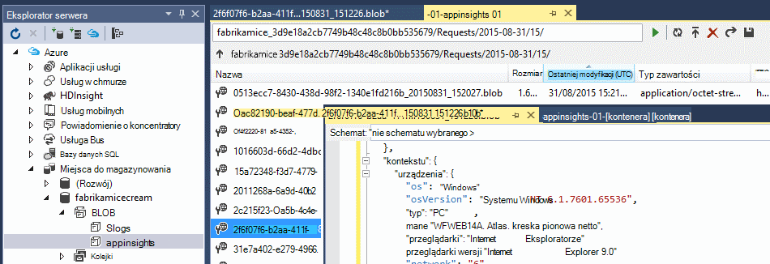

<properties 
    pageTitle="Przewodnik: eksportowanie telemetrycznego do bazy danych SQL z wniosków aplikacji" 
    description="Stale eksportować dane aplikacji wniosków do SQL za pomocą analizy strumieniu." 
    services="application-insights" 
    documentationCenter=""
    authors="noamben" 
    manager="douge"/>

<tags 
    ms.service="application-insights" 
    ms.workload="tbd" 
    ms.tgt_pltfrm="ibiza" 
    ms.devlang="na" 
    ms.topic="article" 
    ms.date="03/06/2015" 
    ms.author="awills"/>
 
# <a name="walkthrough-export-to-sql-from-application-insights-using-stream-analytics"></a>Przewodnik: Eksportowanie do SQL z wniosków aplikacji przy użyciu analizy strumieniu

W tym artykule przedstawiono sposób przenoszenia danych telemetrycznych z [Programu Visual Studio aplikacji wniosków] [ start] do bazy danych programu Azure SQL za pomocą [Ciągły eksportowanie] [ export] i [Analizy strumieniu Azure](https://azure.microsoft.com/services/stream-analytics/). 

Eksportowanie ciągły przejdzie danych telemetrycznych do magazynowania Azure w formacie JSON. Firma Microsoft będzie analizować obiektów JSON za pomocą analizy strumieniu Azure i Utwórz wiersze w tabeli bazy danych.

(Ogólnie, eksportowanie ciągły jest właśnie własnej analizy telemetrycznego aplikacji wysyłanie do wniosków aplikacji. Użytkownik może dopasować ten przykładowy kod, aby wykonać inne czynności z wyeksportowane telemetrycznego, takich jak agregacji danych.)

Zaczniemy od przy założeniu, że masz już aplikację, którą chcesz monitorować.


W tym przykładzie użyjemy strony widoku danych, ale można łatwo rozszerzyć takim samym wzorcem, aby innych typów danych, takich jak zdarzenia niestandardowe i wyjątki. 


## <a name="add-application-insights-to-your-application"></a>Dodawanie aplikacji wniosków do aplikacji


Aby rozpocząć:

1. [Konfigurowanie aplikacji wniosków dla stron sieci web](app-insights-javascript.md). 

    (W tym przykładzie poświęconym przetwarzania danych widoku strony z przeglądarki klientów, ale można także ustawić wniosków aplikacji dla aplikacji [Java](app-insights-java-get-started.md) lub [ASP.NET](app-insights-asp-net.md) i żądanie, zależności i innych telemetrycznego server po stronie serwera).


5. Publikowanie aplikacji i obejrzyj telemetrycznego dane znajdujące się w zasób wniosków aplikacji.


## <a name="create-storage-in-azure"></a>Tworzenie magazynu platformy Azure

Ciągły eksportu zawsze wyświetla dane konto Azure miejsca do magazynowania, musisz najpierw utworzyć magazyn.

1. Tworzenie konta miejsca do magazynowania w ramach subskrypcji w [portalu Azure][portal].

    

2. Tworzenie kontenera

    

3. Skopiuj kod dostępu miejsca do magazynowania

    Musisz go, aby szybko skonfigurować dane wejściowe usługę analizy strumieniu.

    

## <a name="start-continuous-export-to-azure-storage"></a>Rozpocznij ciągły eksportowanie do magazynu platformy Azure

1. W portalu Azure przejdź do zasobu wniosków aplikacji utworzonej aplikacji.

    

2. Tworzenie ciągły eksportu.

    


    Wybierz wcześniej utworzone konto miejsca do magazynowania:

    
    
    Ustawianie typów zdarzeń, które mają być wyświetlane:

    


3. Poinformuj części zebrać danych. Usiąść i umożliwić użytkownikom za pomocą aplikacji dla trochę czasu. Telemetrycznego rozpocznie się, a zobaczysz pozycję wykresy statystyczne w [Eksploratorze metryczne](app-insights-metrics-explorer.md) i zdarzeń z [diagnostyki wyszukiwania](app-insights-diagnostic-search.md). 

    A także dane zostaną eksportowanie do magazynu. 

4. Przeprowadzanie inspekcji eksportowanych danych, albo w portalu — wybierz pozycję **Przeglądaj**, wybierz swojego konta miejsca do magazynowania, a następnie **kontenerów** — lub w programie Visual Studio. W programie Visual Studio, wybierz pozycję **Wyświetlanie / chmury Eksploratora**i otwórz Azure / miejsca do magazynowania. (Jeśli nie masz tej opcji menu, należy zainstalować Azure SDK: Otwórz okno dialogowe Nowy projekt i otwórz Visual C# / chmury / pobieranie programu Microsoft Azure SDK dla środowiska .NET.)

    

    Zanotuj części wspólnej nazwy ścieżkę, która pochodzi z nazwy i oprzyrządowania klawisz aplikacji. 

Zdarzenia są zapisywane w blob pliki w formacie JSON. Każdy plik może zawierać jedno lub więcej zdarzeń. Dlatego chcemy odczytuje dane zdarzenie i filtrować pola, które będą. Dostępne są wszystkie typy firma Microsoft może wykonać z danymi, ale nasz plan dzisiaj jest, aby przenieść dane do bazy danych SQL za pomocą analizy strumieniu. Którego będą ułatwiają uruchamianie partii interesujące kwerend.

## <a name="create-an-azure-sql-database"></a>Tworzenie bazy danych programu Azure SQL

Ponownie uruchamianie z subskrypcji w [portalu Azure][portal], utworzenia bazy danych (i nowego serwera, o ile nie zostały już masz) do której będzie zapisywania danych.


Upewnij się, że serwer bazy danych umożliwia dostęp do usług Azure:


## <a name="create-a-table-in-azure-sql-db"></a>Tworzenie tabeli w bazie danych SQL Azure

Połączenia z bazą danych utworzona w poprzedniej sekcji za pomocą narzędzia do zarządzania preferowany. W tym przykładzie użyjemy [Narzędzia zarządzania programu SQL Server](https://msdn.microsoft.com/ms174173.aspx) (SSMS).


Utwórz nową kwerendę, a następnie wykonać T-SQL:

```SQL

CREATE TABLE [dbo].[PageViewsTable](
    [pageName] [nvarchar](max) NOT NULL,
    [viewCount] [int] NOT NULL,
    [url] [nvarchar](max) NULL,
    [urlDataPort] [int] NULL,
    [urlDataprotocol] [nvarchar](50) NULL,
    [urlDataHost] [nvarchar](50) NULL,
    [urlDataBase] [nvarchar](50) NULL,
    [urlDataHashTag] [nvarchar](max) NULL,
    [eventTime] [datetime] NOT NULL,
    [isSynthetic] [nvarchar](50) NULL,
    [deviceId] [nvarchar](50) NULL,
    [deviceType] [nvarchar](50) NULL,
    [os] [nvarchar](50) NULL,
    [osVersion] [nvarchar](50) NULL,
    [locale] [nvarchar](50) NULL,
    [userAgent] [nvarchar](max) NULL,
    [browser] [nvarchar](50) NULL,
    [browserVersion] [nvarchar](50) NULL,
    [screenResolution] [nvarchar](50) NULL,
    [sessionId] [nvarchar](max) NULL,
    [sessionIsFirst] [nvarchar](50) NULL,
    [clientIp] [nvarchar](50) NULL,
    [continent] [nvarchar](50) NULL,
    [country] [nvarchar](50) NULL,
    [province] [nvarchar](50) NULL,
    [city] [nvarchar](50) NULL
)

CREATE CLUSTERED INDEX [pvTblIdx] ON [dbo].[PageViewsTable]
(
    [eventTime] ASC
)WITH (PAD_INDEX = OFF, STATISTICS_NORECOMPUTE = OFF, SORT_IN_TEMPDB = OFF, DROP_EXISTING = OFF, ONLINE = OFF, ALLOW_ROW_LOCKS = ON, ALLOW_PAGE_LOCKS = ON)

```


W tym przykładzie użyto danych z liczba wyświetleń strony. Aby wyświetlić inne dostępne dane, sprawdzanie danych wyjściowych JSON i zobacz [Eksportowanie modelu danych](app-insights-export-data-model.md).

## <a name="create-an-azure-stream-analytics-instance"></a>Tworzenie wystąpieniem analizy strumieniu Azure

Wybierz usługę Azure analizy strumieniu z [Klasyczny Portal Azure](https://manage.windowsazure.com/)i utworzyć nowe zadanie analizy strumieniu:


Po utworzeniu nowego zadania rozwinąć jego szczegóły:


#### <a name="set-blob-location"></a>Ustawianie lokalizacji obiektów blob

Ustaw go, aby pobrać dane wejściowe z obiektów blob z ciągłym Eksportuj:


Teraz musisz klucz podstawowy dostęp z konta miejsca do magazynowania, w której wspomniano wcześniej. Ustaw ten jako klucz konta miejsca do magazynowania.


#### <a name="set-path-prefix-pattern"></a>Ustawianie ścieżka prefiks wzorzec 


Pamiętaj ustawić Format daty **YYYY-MM-DD** (z **kreski**).

Ścieżka wzorzec prefiksu umożliwia określenie sposobu analizy strumieniu znajdowania plików wejściowych w magazynie. Należy ustawić odpowiadają w sposób ciągły eksportowanie są przechowywane dane. Ustaw ją w następujący sposób:

    webapplication27_12345678123412341234123456789abcdef0/PageViews/{date}/{time}

W tym przykładzie:

* `webapplication27`to nazwa zasobu wniosków aplikacji, **Wszystkie na małe litery**. 
* `1234...`jest to oprzyrządowania klucz wniosków aplikacji zasobów **z kreski usunięte**. 
* `PageViews`jest typem odpowiednich do analizowania danych. Dostępne typy zależą od ustawionych w ciągły Eksportowanie filtru. Sprawdź eksportowanych danych, aby wyświetlić inne dostępne typy i zobacz [Eksportowanie modelu danych](app-insights-export-data-model.md).
* `/{date}/{time}`deseń jest zapisywany dosłownie.

Aby uzyskać nazwę i iKey zasobu wniosków aplikacji, otwórz Essentials na stronie Przegląd, lub Otwórz ustawienia.

#### <a name="finish-initial-setup"></a>Zakończenie początkowej konfiguracji

Potwierdzenie formatowania szeregowania:


Zamknij kreatora i poczekaj, aby zakończyć instalację.

>[AZURE.TIP] Aby sprawdzić poprawnie ustawić wprowadzania ścieżkę, należy użyć funkcji próbki. Jeśli nie jest on: Sprawdź, czy w magazynie dla próbki przedziału czasu wybrania jest danych. Edytowanie definicji wprowadzania i sprawdź ustawienie konto miejsca do magazynowania, ścieżka prefiksu i Data formacie poprawnie.

## <a name="set-query"></a>Konfigurowanie kwerendy

Otwórz sekcję kwerenda:


Zastąp kwerendę domyślną z:

```SQL

    SELECT flat.ArrayValue.name as pageName
    , flat.ArrayValue.count as viewCount
    , flat.ArrayValue.url as url
    , flat.ArrayValue.urlData.port as urlDataPort
    , flat.ArrayValue.urlData.protocol as urlDataprotocol
    , flat.ArrayValue.urlData.host as urlDataHost
    , flat.ArrayValue.urlData.base as urlDataBase
    , flat.ArrayValue.urlData.hashTag as urlDataHashTag
      ,A.context.data.eventTime as eventTime
      ,A.context.data.isSynthetic as isSynthetic
      ,A.context.device.id as deviceId
      ,A.context.device.type as deviceType
      ,A.context.device.os as os
      ,A.context.device.osVersion as osVersion
      ,A.context.device.locale as locale
      ,A.context.device.userAgent as userAgent
      ,A.context.device.browser as browser
      ,A.context.device.browserVersion as browserVersion
      ,A.context.device.screenResolution.value as screenResolution
      ,A.context.session.id as sessionId
      ,A.context.session.isFirst as sessionIsFirst
      ,A.context.location.clientip as clientIp
      ,A.context.location.continent as continent
      ,A.context.location.country as country
      ,A.context.location.province as province
      ,A.context.location.city as city
    INTO
      AIOutput
    FROM AIinput A
    CROSS APPLY GetElements(A.[view]) as flat


```

Zwróć uwagę, że pierwszy kilka właściwości są specyficzne dla strony widok danych. Eksportowanie innych typów telemetrycznego mają różne właściwości. Zobacz [szczegółowe dokumentacja modelu danych dla wartości i typy właściwości.](app-insights-export-data-model.md)

## <a name="set-up-output-to-database"></a>Konfigurowanie wyjścia do bazy danych

Wybierz pozycję SQL jako wynik.


Określanie bazy danych SQL.


Zamknij kreatora i poczekaj, aż powiadomienie, które skonfigurowano dane wyjściowe.

## <a name="start-processing"></a>Rozpocznij przetwarzanie

Uruchomić zadanie z poziomu paska akcji:


Możesz określić, czy do rozpoczęcia przetwarzania danych, rozpoczynając od teraz lub zaczynać się wcześniejszych danych. Nie jest przydatne, jeśli miały ciągły Eksportuj już uruchomiony przez pewien czas.


Po upływie kilku minut wróć do narzędzia zarządzania programu SQL Server i obejrzyj ułożony w danych. Na przykład za pomocą kwerendy w następujący sposób:

    SELECT TOP 100 *
    FROM [dbo].[PageViewsTable]


## <a name="related-articles"></a>Artykuły pokrewne

* [Eksportowanie do SQL za pomocą roli pracownika](app-insights-code-sample-export-telemetry-sql-database.md)
* [Eksportowanie do PowerBI za pomocą analizy strumieniu](app-insights-export-power-bi.md)
* [Szczegółowe dane modelu odwołanie do wartości i typy właściwości.](app-insights-export-data-model.md)
* [Ciągły eksportu w aplikacji wniosków](app-insights-export-telemetry.md)
* [Wnioski aplikacji](https://azure.microsoft.com/services/application-insights/)

<!--Link references-->

[diagnostic]: app-insights-diagnostic-search.md
[export]: app-insights-export-telemetry.md
[metrics]: app-insights-metrics-explorer.md
[portal]: http://portal.azure.com/
[start]: app-insights-overview.md

 