<properties 
    pageTitle="Przykładowy kod: analizowanie danych wyeksportowanego z aplikacji wniosków" 
    description="Kod własnej analizy telemetrycznego w wniosków aplikacji przy użyciu funkcji Eksportuj ciągły. Zapisywanie danych SQL." 
    services="application-insights" 
    documentationCenter=""
    authors="mazharmicrosoft" 
    manager="douge"/>

<tags 
    ms.service="application-insights" 
    ms.workload="tbd" 
    ms.tgt_pltfrm="ibiza" 
    ms.devlang="na" 
    ms.topic="article" 
    ms.date="01/05/2016" 
    ms.author="awills"/>
 
# Przykładowy kod: analizowanie danych wyeksportowanego z aplikacji wniosków

W tym artykule przedstawiono sposób przetwarzania danych JSON wyeksportowanego z aplikacji wnioski. Na przykład możemy napisać kod, aby przenieść dane telemetrycznego z [Programu Visual Studio aplikacji wniosków] [ start] do bazy danych programu Azure SQL za pomocą [Ciągły eksportowanie][export]. (Można również uzyskać ten [przy użyciu analizy strumieniu](app-insights-code-sample-export-sql-stream-analytics.md), ale tutaj naszym celem jest wyświetlona kodu). 

Ciągły eksportu powoduje przejście do telemetrycznego składu Azure w formacie JSON, więc możemy będzie pisać kod analizować obiektów JSON i tworzyć wierszy w tabeli bazy danych.

Ogólnie eksportowanie ciągły jest właśnie własnej analizy telemetrycznego aplikacji wysyłanie do wniosków aplikacji. Ten przykładowy kod, aby wykonać inne czynności z eksportowanych danych telemetrycznych można dostosować.

Zaczniemy od przy założeniu, że masz już aplikację, którą chcesz monitorować.

## Dodawanie aplikacji wniosków SDK

Monitorowanie aplikacji, możesz [dodać aplikację wniosków SDK] [ start] do aplikacji. Istnieją różne SDK i narzędzia pomocy dla różnych platform, IDEs i języków. Można monitorować stron sieci web, Java lub ASP.NET serwerów sieci web i urządzeń przenośnych z różnych typów. Wszystkie SDK wysyłanie telemetrycznego do [portalu wniosków aplikacji][portal], miejsce, w którym można użyć naszych Zaawansowana analiza i narzędzia diagnostyczne i eksportowanie danych do magazynowania.

Aby rozpocząć:

1. Uzyskiwanie [konta w programie Microsoft Azure](https://azure.microsoft.com/pricing/).
2. W [portalu Azure][portal], dodawanie nowego zasobu wniosków aplikacji dla aplikacji:

    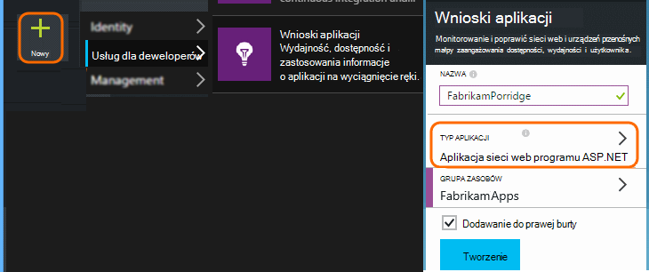

    (Wpisz aplikacji i subskrypcji usługi mogą się różnić.)
3. Otwórz Szybki Start, aby znaleźć sposobu konfigurowania SDK typu aplikacji.

    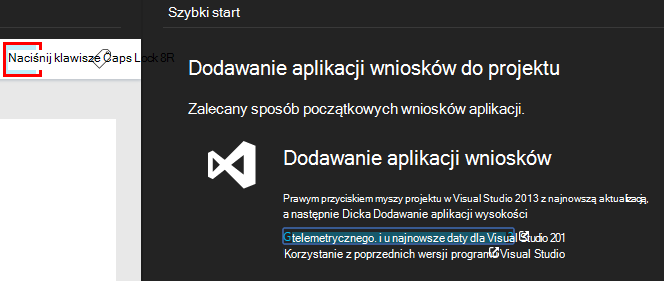

    Jeśli typ używanej aplikacji nie ma na liście, zapoznaj się [Wprowadzenie] [ start] strony.

4. W tym przykładzie możemy jest monitorowanie aplikacji sieci web, więc możemy użyć narzędzia Azure w programie Visual Studio instalowania zestawu SDK. Firma Microsoft określić jej nazwę zasobu naszych wniosków aplikacji:

    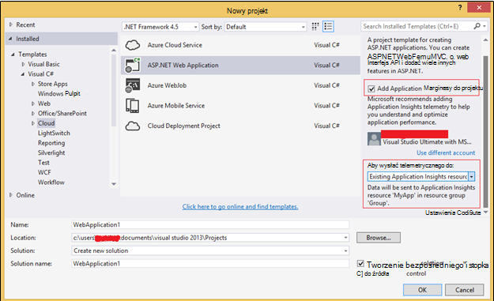

## Tworzenie magazynu platformy Azure

Dane z wniosków aplikacji zawsze są eksportowane do konta magazynu platformy Azure w formacie JSON. Jest z tego magazynu w kodzie odczytuje dane.

1. Tworzenie konta "klasycznego" miejsca do magazynowania w ramach subskrypcji w [portalu Azure][portal].

    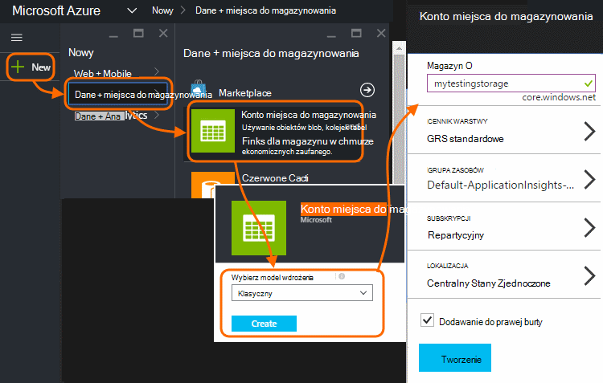

2. Tworzenie kontenera

    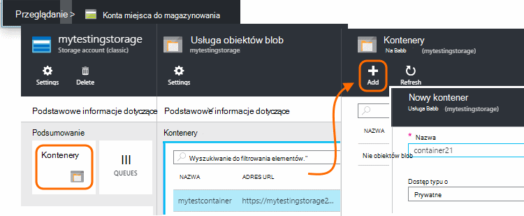

## Rozpocznij ciągły eksportowanie do magazynu platformy Azure

1. W portalu Azure przejdź do zasobu wniosków aplikacji utworzonej aplikacji.

    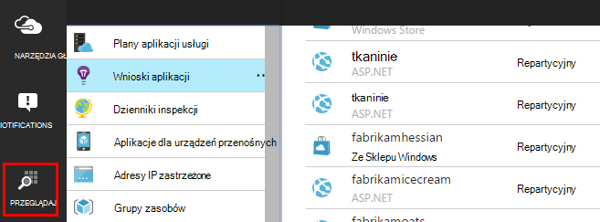

2. Tworzenie ciągły eksportu.

    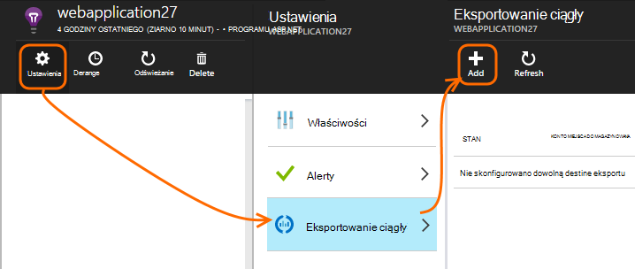

    Wybierz wcześniej utworzone konto miejsca do magazynowania:

    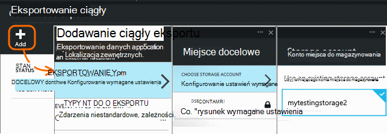
    
    Ustawianie typów zdarzeń, które mają być wyświetlane:

    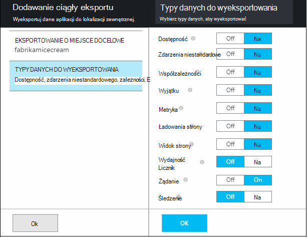

3. Poinformuj części zebrać danych. Usiąść i umożliwić użytkownikom za pomocą aplikacji dla trochę czasu. Telemetrycznego rozpocznie się, a zobaczysz pozycję wykresy statystyczne w [Eksploratorze metryczne](app-insights-metrics-explorer.md) i pojedynczych zdarzeń w [wyszukiwaniu diagnostyczne](app-insights-diagnostic-search.md). 

    A także dane zostaną eksportowanie do magazynu. 

4. Sprawdź, czy wyeksportowane dane. W programie Visual Studio, wybierz pozycję **Wyświetlanie / chmury Eksploratora**i otwórz Azure / miejsca do magazynowania. (Jeśli nie masz tej opcji menu, należy zainstalować Azure SDK: Otwórz okno dialogowe Nowy projekt i otwórz Visual C# / chmury / pobieranie programu Microsoft Azure SDK dla środowiska .NET.)

    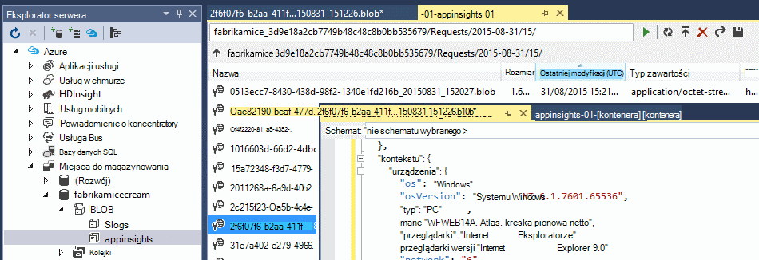

    Zanotuj części wspólnej nazwy ścieżkę, która pochodzi z nazwy i oprzyrządowania klawisz aplikacji. 

Zdarzenia są zapisywane w blob pliki w formacie JSON. Każdy plik może zawierać jedno lub więcej zdarzeń. Dlatego chcemy odczytuje dane zdarzenie i filtrować pola, które będą. Dostępne są wszystkie typy firma Microsoft może wykonać z danymi, ale nasz plan dzisiaj jest zapisać niektórych kod, aby przenieść dane do bazy danych SQL. Który będzie ułatwiają uruchamianie partii interesujące kwerend.

## Tworzenie bazy danych programu Azure SQL

W tym przykładzie firma Microsoft będzie napisać kod push danych do bazy danych.

Ponownie uruchamianie z subskrypcji w [portalu Azure][portal], utworzenia bazy danych (i nowego serwera, o ile nie zostały już masz) do której będzie zapisywania danych.

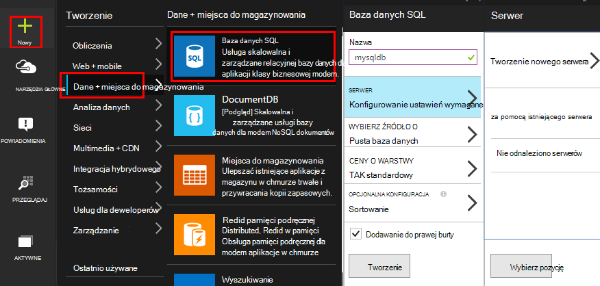

Upewnij się, że serwer bazy danych umożliwia dostęp do usług Azure:

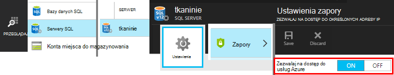

## Tworzenie roli pracownika 

Teraz ostatnio można było pisanie [kodu](https://sesitai.codeplex.com/) przeanalizować JSON w eksportowany obiektów blob i tworzenie rekordów w bazie danych. Ponieważ Eksportuj magazyn i w bazie danych znajdują się na Azure, firma Microsoft będzie uruchomić kod w roli Azure pracownika.

Kod automatycznie wyodrębnia, niezależnie od właściwości znajdują się w formacie JSON. Aby uzyskać opis właściwości zobacz [Eksportowanie modelu danych](app-insights-export-data-model.md).

#### Tworzenie projektu roli pracownika

W programie Visual Studio Tworzenie nowego projektu dla roli pracownika:

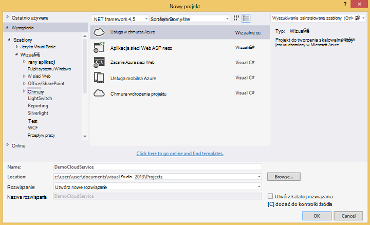

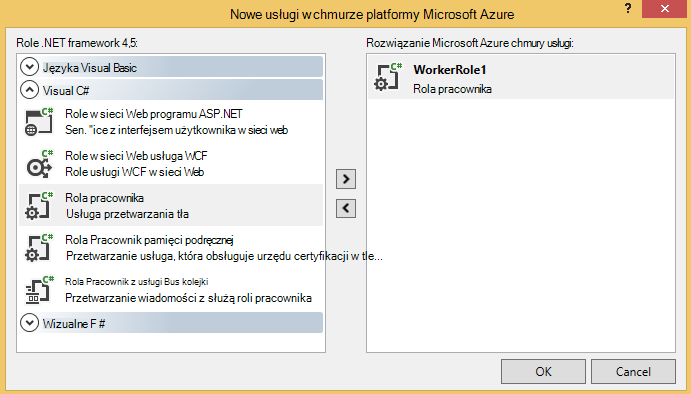

#### Nawiązywanie połączenia z kontem miejsca do magazynowania

Platformy Azure pobieranie parametrów połączenia z Twojego konta miejsca do magazynowania:

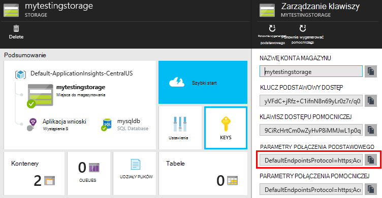

W programie Visual Studio należy skonfigurować ustawienia roli Pracownik przy użyciu parametrów połączenia konta miejsca do magazynowania:

#### Pakiety

W Eksploratorze rozwiązań kliknij prawym przyciskiem myszy projektu roli Pracownik i wybierz pozycję Zarządzaj NuGet pakietów.
Wyszukiwanie i zainstaluj te pakiety: 

 * EntityFramework 6.1.2 lub później — użyjemy to aby generowanie schematu tabela bazy danych w czasie rzeczywistym, na podstawie zawartości JSON w obiekcie blob.
 * JsonFx - użyjemy to spłaszczania JSON do właściwości klasy C#.

To narzędzie do generowania klasy C# wylogowywanie się z naszym pojedynczy dokument JSON. Wymaga drobnych zmian takich jak spłaszczanie tablice w formacie JSON do jednej właściwości C# w Włącz pojedynczej kolumny w tabeli bazy danych (ex. urlData_port) 

 * [Generator klasy JSON C#](http://jsonclassgenerator.codeplex.com/)

## Kod 

Kod, jaki można umieścić w `WorkerRole.cs`.

#### Importowanie plików

    using Microsoft.WindowsAzure.Storage;

    using Microsoft.WindowsAzure.Storage.Blob;

#### Pobieranie parametrów połączenia miejsca do magazynowania

    private static string GetConnectionString()
    {
      return Microsoft.WindowsAzure.CloudConfigurationManager.GetSetting("StorageConnectionString");
    }

#### Uruchamianie pracownika w regularnych odstępach

Zastąp istniejące metody wykonywania, a następnie wybierz interwał, które wolisz. Należy co najmniej jedną godzinę, ponieważ funkcja eksportu wykonuje jeden obiekt JSON godziny.

    public override void Run()
    {
      Trace.TraceInformation("WorkerRole1 is running");

      while (true)
      {
        Trace.WriteLine("Sleeping", "Information");

        Thread.Sleep(86400000); //86400000=24 hours //1 hour=3600000
                
        Trace.WriteLine("Awake", "Information");

        ImportBlobtoDB();
      }
    }

#### Wstawianie każdy obiekt JSON jako wiersz tabeli

    public void ImportBlobtoDB()
    {
      try
      {
        CloudStorageAccount account = CloudStorageAccount.Parse(GetConnectionString());

        var blobClient = account.CreateCloudBlobClient();
        var container = blobClient.GetContainerReference(FilterContainer);

        foreach (CloudBlobDirectory directory in container.ListBlobs())//Parent directory
        {
          foreach (CloudBlobDirectory subDirectory in directory.ListBlobs())//PageViewPerformance
          {
            foreach (CloudBlobDirectory dir in subDirectory.ListBlobs())//2015-01-31
            {
              foreach (CloudBlobDirectory subdir in dir.ListBlobs())//22
              {
                foreach (IListBlobItem item in subdir.ListBlobs())//3IAwm6u3-0.blob
                {
                  itemname = item.Uri.ToString();
                  ParseEachBlob(container, item);
                  AuditBlob(container, directory, subDirectory, dir, subdir, item);
                } //item loop
              } //subdir loop
            } //dir loop
          } //subDirectory loop
        } //directory loop
      }
      catch (Exception ex)
      {
        //handle exception
      }
    }

#### Analizowanie poszczególnych obiektów blob

    private void ParseEachBlob(CloudBlobContainer container, IListBlobItem item)
    {
      try
      {
        var blob = container.GetBlockBlobReference(item.Parent.Prefix + item.Uri.Segments.Last());
    
        string json;
    
        using (var memoryStream = new MemoryStream())
        {
          blob.DownloadToStream(memoryStream);
          json = System.Text.Encoding.UTF8.GetString(memoryStream.ToArray());
    
          IEnumerable<string> entities = json.Split('\n').Where(s => !string.IsNullOrWhiteSpace(s));
    
          recCount = entities.Count();
          failureCount = 0; //resetting failure count
    
          foreach (var entity in entities)
          {
            var reader = new JsonFx.Json.JsonReader();
            dynamic output = reader.Read(entity);
    
            Dictionary<string, object> dict = new Dictionary<string, object>();
    
            GenerateDictionary((System.Dynamic.ExpandoObject)output, dict, "");
    
            switch (FilterType)
            {
              case "PageViewPerformance":
    
              if (dict.ContainsKey("clientPerformance"))
                {
                  GenerateDictionary(((System.Dynamic.ExpandoObject[])dict["clientPerformance"])[0], dict, "");
                }
    
              if (dict.ContainsKey("context_custom_dimensions"))
              {
                if (dict["context_custom_dimensions"].GetType() == typeof(System.Dynamic.ExpandoObject[]))
                {
                  GenerateDictionary(((System.Dynamic.ExpandoObject[])dict["context_custom_dimensions"])[0], dict, "");
                }
              }
    
            PageViewPerformance objPageViewPerformance = (PageViewPerformance)GetObject(dict);
    
            try
            {
              using (var db = new TelemetryContext())
              {
                db.PageViewPerformanceContext.Add(objPageViewPerformance);
                db.SaveChanges();
              }
            }
            catch (Exception ex)
            {
              failureCount++;
            }
            break;
    
            default:
            break;
          }
        }
      }
    }
    catch (Exception ex)
    {
      //handle exception 
    }
    }

#### Przygotowywanie słownika dla każdego dokumentu JSON

    private void GenerateDictionary(System.Dynamic.ExpandoObject output, Dictionary<string, object> dict, string parent)
        {
            try
            {
                foreach (var v in output)
                {
                    string key = parent + v.Key;
                    object o = v.Value;

                    if (o.GetType() == typeof(System.Dynamic.ExpandoObject))
                    {
                        GenerateDictionary((System.Dynamic.ExpandoObject)o, dict, key + "_");
                    }
                    else
                    {
                        if (!dict.ContainsKey(key))
                        {
                            dict.Add(key, o);
                        }
                    }
                }
            }
            catch (Exception ex)
            {
            //handle exception 
            }
        }

#### CAST dokumentu JSON C# właściwości obiektu telemetrycznego o zajęć

     public object GetObject(IDictionary<string, object> d)
        {
            PropertyInfo[] props = null;
            object res = null;

            try
            {
                switch (FilterType)
                {
                    case "PageViewPerformance":

                        props = typeof(PageViewPerformance).GetProperties();
                        res = Activator.CreateInstance<PageViewPerformance>();
                        break;

                    default:
                        break;
                }

                for (int i = 0; i < props.Length; i++)
                {
                    if (props[i].CanWrite && d.ContainsKey(props[i].Name))
                    {
                        props[i].SetValue(res, d[props[i].Name], null);
                    }
                }
            }
            catch (Exception ex)
            {
            //handle exception 
            }

            return res;
        }

#### Plik klasy PageViewPerformance wygenerowane poza JSON dokumentu

    public class PageViewPerformance
    {
        [DatabaseGenerated(DatabaseGeneratedOption.Identity)]
        public Guid Id { get; set; }

        public string url { get; set; }

        public int urlData_port { get; set; }

        public string urlData_protocol { get; set; }

        public string urlData_host { get; set; }

        public string urlData_base { get; set; }

        public string urlData_hashTag { get; set; }

        public double total_value { get; set; }

        public double networkConnection_value { get; set; }

        public double sendRequest_value { get; set; }

        public double receiveRequest_value { get; set; }

        public double clientProcess_value { get; set; }

        public string name { get; set; }

        public string internal_data_id { get; set; }

        public string internal_data_documentVersion { get; set; }

        public DateTime? context_data_eventTime { get; set; }

        public string context_device_id { get; set; }

        public string context_device_type { get; set; }

        public string context_device_os { get; set; }

        public string context_device_osVersion { get; set; }

        public string context_device_locale { get; set; }

        public string context_device_userAgent { get; set; }

        public string context_device_browser { get; set; }

        public string context_device_browserVersion { get; set; }

        public string context_device_screenResolution_value { get; set; }

        public string context_user_anonId { get; set; }

        public string context_user_anonAcquisitionDate { get; set; }

        public string context_user_authAcquisitionDate { get; set; }

        public string context_user_accountAcquisitionDate { get; set; }

        public string context_session_id { get; set; }

        public bool context_session_isFirst { get; set; }

        public string context_operation_id { get; set; }

        public double context_location_point_lat { get; set; }

        public double context_location_point_lon { get; set; }

        public string context_location_clientip { get; set; }

        public string context_location_continent { get; set; }

        public string context_location_country { get; set; }

        public string context_location_province { get; set; }

        public string context_location_city { get; set; }
    }

#### DBcontext interakcji SQL w ramach jednostki

    public class TelemetryContext : DbContext
    {
        public DbSet<PageViewPerformance> PageViewPerformanceContext { get; set; }
        public TelemetryContext()
            : base("name=TelemetryContext")
        {
        }
    }

Dodawanie ciągu połączenia bazy danych o nazwie `TelemetryContext` w `app.config`.

## Schemat (tylko informacje)

To jest schemat tabeli, który będzie podstawą widok strony.

> [AZURE.NOTE] Nie masz uruchomić ten skrypt. Atrybuty w formacie JSON określenia kolumn w tabeli.

    CREATE TABLE [dbo].[PageViewPerformances](
    [Id] [uniqueidentifier] NOT NULL,
    [url] [nvarchar](max) NULL,
    [urlData_port] [int] NOT NULL,
    [urlData_protocol] [nvarchar](max) NULL,
    [urlData_host] [nvarchar](max) NULL,
    [urlData_base] [nvarchar](max) NULL,
    [urlData_hashTag] [nvarchar](max) NULL,
    [total_value] [float] NOT NULL,
    [networkConnection_value] [float] NOT NULL,
    [sendRequest_value] [float] NOT NULL,
    [receiveRequest_value] [float] NOT NULL,
    [clientProcess_value] [float] NOT NULL,
    [name] [nvarchar](max) NULL,
    [User] [nvarchar](max) NULL,
    [internal_data_id] [nvarchar](max) NULL,
    [internal_data_documentVersion] [nvarchar](max) NULL,
    [context_data_eventTime] [datetime] NULL,
    [context_device_id] [nvarchar](max) NULL,
    [context_device_type] [nvarchar](max) NULL,
    [context_device_os] [nvarchar](max) NULL,
    [context_device_osVersion] [nvarchar](max) NULL,
    [context_device_locale] [nvarchar](max) NULL,
    [context_device_userAgent] [nvarchar](max) NULL,
    [context_device_browser] [nvarchar](max) NULL,
    [context_device_browserVersion] [nvarchar](max) NULL,
    [context_device_screenResolution_value] [nvarchar](max) NULL,
    [context_user_anonId] [nvarchar](max) NULL,
    [context_user_anonAcquisitionDate] [nvarchar](max) NULL,
    [context_user_authAcquisitionDate] [nvarchar](max) NULL,
    [context_user_accountAcquisitionDate] [nvarchar](max) NULL,
    [context_session_id] [nvarchar](max) NULL,
    [context_session_isFirst] [bit] NOT NULL,
    [context_operation_id] [nvarchar](max) NULL,
    [context_location_point_lat] [float] NOT NULL,
    [context_location_point_lon] [float] NOT NULL,
    [context_location_clientip] [nvarchar](max) NULL,
    [context_location_continent] [nvarchar](max) NULL,
    [context_location_country] [nvarchar](max) NULL,
    [context_location_province] [nvarchar](max) NULL,
    [context_location_city] [nvarchar](max) NULL,
    CONSTRAINT [PK_dbo.PageViewPerformances] PRIMARY KEY CLUSTERED 
    (
     [Id] ASC
    )WITH (PAD_INDEX = OFF, STATISTICS_NORECOMPUTE = OFF, IGNORE_DUP_KEY = OFF, ALLOW_ROW_LOCKS = ON, ALLOW_PAGE_LOCKS = ON) ON [PRIMARY]
    ) ON [PRIMARY] TEXTIMAGE_ON [PRIMARY]

    GO

    ALTER TABLE [dbo].[PageViewPerformances] ADD  DEFAULT (newsequentialid()) FOR [Id]
    GO

Aby wyświetlić w tym przykładzie w działaniu, [Pobierz](https://sesitai.codeplex.com/) pełny kodu pracy, należy zmienić `app.config` ustawienia i publikowanie roli Pracownik Azure.

## Artykuły pokrewne

* [Eksportowanie do SQL za pomocą roli pracownika](app-insights-code-sample-export-telemetry-sql-database.md)
* [Ciągły eksportu w aplikacji wniosków](app-insights-export-telemetry.md)
* [Wnioski aplikacji](https://azure.microsoft.com/services/application-insights/)
* [Eksportowanie modelu danych](app-insights-export-data-model.md)
* [Więcej przykładów i instruktaży](app-insights-code-samples.md)

<!--Link references-->

[diagnostic]: app-insights-diagnostic-search.md
[export]: app-insights-export-telemetry.md
[metrics]: app-insights-metrics-explorer.md
[portal]: http://portal.azure.com/
[start]: app-insights-overview.md

 
