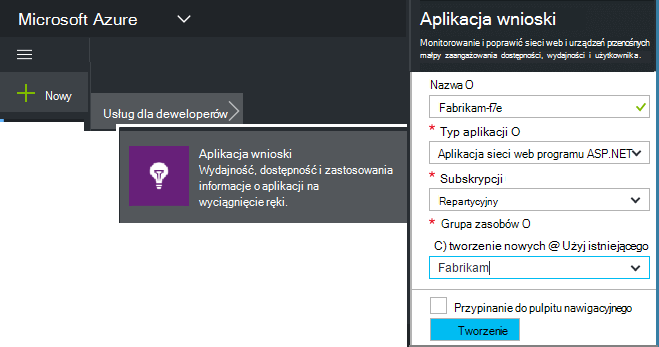
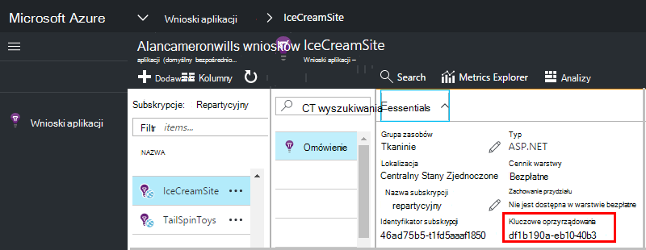

<properties 
    pageTitle="Tworzenie nowego zasobu wnioski aplikacji | Microsoft Azure" 
    description="Konfigurowanie aplikacji wniosków monitorowania dla nowej aplikacji live. Podejście oparte na sieci Web." 
    services="application-insights" 
    documentationCenter=""
    authors="alancameronwills" 
    manager="douge"/>

<tags 
    ms.service="application-insights" 
    ms.workload="tbd" 
    ms.tgt_pltfrm="ibiza" 
    ms.devlang="na" 
    ms.topic="article" 
    ms.date="08/26/2016" 
    ms.author="awills"/>

# Tworzenie zasób wnioski aplikacji

Visual Studio aplikacji wniosków wyświetla dane dotyczące aplikacji Microsoft Azure *zasobów*. Tworzenie nowego zasobu w związku z tym jest częścią [konfigurowania aplikacji wniosków monitorowanie nowej aplikacji][start]. W większości przypadków można to zrobić automatycznie IDE i jest zalecany sposób, w której znajduje się. Ale w niektórych przypadkach możesz utworzyć zasób ręcznie.

Po utworzeniu zasobu, możesz uzyskać kluczem oprzyrządowania i używać, aby skonfigurować zestawu SDK w aplikacji. Telemetrycznego wyśle odbiorcy do zasobu.

## Utwórz konto Microsoft Azure

Jeśli nie masz programu [Microsoft konta, uzyskaj go teraz](http://live.com). (Jeśli korzystasz z usług, takich jak Outlook.com, OneDrive, Windows Phone i XBox Live, masz już konto Microsoft.)

Konieczne będzie również subskrypcję usługi [Microsoft Azure](http://azure.com). Jeśli Twój zespół lub organizacja ma subskrypcję usługi Azure, właściciela można dodać możesz do niej, za pomocą swojego identyfikatora Windows Live ID.

Lub można utworzyć nowej subskrypcji. Bezpłatne konto umożliwia testowanie publikowane w Azure. Po wygaśnięciu okresu próbnego, może się okazać płatne subskrypcji właściwe, jak możesz nie zostanie obciążona bezpłatnie usług. 

Gdy masz dostęp do subskrypcji, zaloguj się do aplikacji wniosków na [http://portal.azure.com](https://portal.azure.com)i za pomocą identyfikatora Live ID logowania.

## Tworzenie zasób wniosków aplikacji
  

W [portal.azure.com](https://portal.azure.com)Dodaj zasób wniosków aplikacji:

* Ma wpływ na **Typ aplikacji** , co widać na karta Przegląd i właściwości dostępne w [Eksploratorze metryczne][metrics]. Jeśli nie widzisz typ aplikacji, wybierz pozycję ASP.NET.
* **Grupa zasobów** jest wygody zarządzania właściwości, takich jak kontrola dostępu. Jeśli utworzono już inne zasoby Azure, możesz umieścić ten nowy zasób w tej samej grupy.
* **Subskrypcja** jest konta płatności w Azure.
* **Lokalizacja** to miejsce, w którym możemy zachować dane. Obecnie go nie można zmienić.
* **Dodaj do startboard** umieszcza kafelka szybkiego dostępu dla zasobu na stronie głównej Azure. Zalecane.

Po utworzeniu aplikacji zostanie wyświetlona karta nowy. Jest to miejsce, w którym są wyświetlane wydajności i danych dotyczących użycia o aplikacji. 

Aby przejść wstecz, aby go dalej czasu logowania Azure, poszukaj kafelka szybki start usługi aplikacji na tablicy start (ekran główny). Lub kliknij przycisk Przeglądaj, aby je znaleźć.

## Kopiowanie klucza oprzyrządowania

Klucz oprzyrządowania identyfikatorem utworzony zasób. Konieczne będzie, aby nadać do zestawu SDK.

## Zainstaluj zestaw SDK w aplikacji

Zainstaluj aplikację wniosków SDK w aplikacji. W tym kroku intensywnie zależy od typu aplikacji. 

Konfigurowanie [zestawu SDK zainstalowanym w aplikacji]przy użyciu klucza oprzyrządowania[start].

Zestaw SDK zawiera moduły standardowe, które powodują wysyłanie telemetrycznego bez konieczności pisania kodu. Do śledzenia działań użytkownika lub diagnozowanie problemów bardziej szczegółowo, [za pomocą interfejsu API] [ api] do wysłania własnych telemetrycznego.

## Zobacz danych telemetrycznych

Zamknij karta szybki start, aby powrócić do swojej karta aplikacji w portalu Azure.

Kliknij pole wyszukiwania, aby zobaczyć [Diagnostyki wyszukiwania][diagnostic], gdy pojawi się pierwszy zdarzeń. 

Jeśli masz Oczekiwano większej ilości danych, kliknij przycisk Odśwież po kilku sekundach.

## Automatyczne tworzenie zasobu

Można napisać [skrypt programu PowerShell](app-insights-powershell-script-create-resource.md) , aby automatycznie utworzyć zasób.

## Następne kroki

* [Tworzenie pulpitu nawigacyjnego](app-insights-dashboards.md)
* [Wyszukiwanie diagnostyczne](app-insights-diagnostic-search.md)
* [Eksplorowanie metryk](app-insights-metrics-explorer.md)
* [Pisanie zapytań analizy](app-insights-analytics.md)

<!--Link references-->

[api]: app-insights-api-custom-events-metrics.md
[diagnostic]: app-insights-diagnostic-search.md
[metrics]: app-insights-metrics-explorer.md
[start]: app-insights-overview.md

 