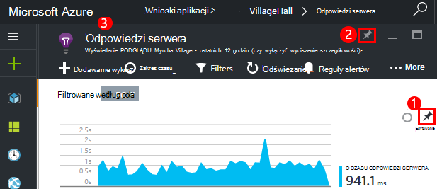

<properties
    pageTitle="Pulpity nawigacyjne i nawigacji w portalu wniosków aplikacji | Microsoft Azure"
    description="Tworzenie widoków klucza wykresy APM i kwerend."
    services="application-insights"
    documentationCenter=""
    authors="alancameronwills"
    manager="douge"/>

<tags
    ms.service="application-insights"
    ms.workload="tbd"
    ms.tgt_pltfrm="ibiza"
    ms.devlang="multiple"
    ms.topic="article" 
    ms.date="10/18/2016"
    ms.author="awills"/>

# Nawigacja i pulpity nawigacyjne w portalu wniosków aplikacji

Po zdefiniowaniu [wniosków aplikacji nad projektem](app-insights-overview.md)w projektu wniosków aplikacji zasobów w [Azure portal](https://portal.azure.com)pojawi się telemetrycznego dane dotyczące wydajności i użycia Twojej aplikacji.

## Znajdowanie swojej telemetrycznego

Zaloguj się do [portalu Azure](https://portal.azure.com) i przejdź do zasobu wniosków aplikacji utworzonego dla aplikacji.

Karta Przegląd (strony) dla aplikacji zawiera podsumowanie najważniejszych metryki diagnostyczne aplikacji, a jest bramę do innych funkcji w portalu.

Możesz dostosować dowolne inne wykresy i przypiąć je do pulpitu nawigacyjnego. W ten sposób możesz zabrać ze sobą razem klucza wykresy z innej aplikacji.

## Pulpity nawigacyjne

Najpierw, które są widoczne po zalogowaniu się do [portalu Microsoft Azure](https://portal.azure.com) jest pulpitu nawigacyjnego. W tym miejscu możesz zabrać ze sobą razem wykresy, które są najbardziej dla Ciebie ważne przez wszystkie usługi Azure zasobów, w tym telemetrycznego z [Programu Visual Studio aplikacji wnioski](app-insights-overview.md).
 

1. **Przejdź do określonych zasobów** , takich jak aplikacji w aplikacji wniosków: Użyj paska po lewej stronie.
2. **Powrót do bieżącego pulpitu nawigacyjnego**lub Przełącz do innych widoków ostatnio używane: Użyj menu rozwijanego w lewym górnym rogu.
3. **Przełączanie pulpitów nawigacyjnych**: tytuł pulpitu nawigacyjnego za pomocą menu rozwijanego
4. **Tworzenie, edytowanie i Udostępnij pulpitów nawigacyjnych** na pasku narzędzi pulpitu nawigacyjnego.
5. **Edytowanie pulpit nawigacyjny**: Umieść wskaźnik myszy na tytule, a następnie użyć jej górnym pasku do przenoszenia, dostosowywanie lub go usunąć.

## Dodawanie do pulpitu nawigacyjnego

Podczas przeglądania karta lub zestawu wykresów, który jest szczególnie interesujący, można przypiąć jego kopię do pulpitu nawigacyjnego. Zostanie wyświetlona jego następnym tam powrócić.

1. Wykres numeru PIN do pulpitu nawigacyjnego. Kopiowanie wykresu pojawia się na pulpicie nawigacyjnym.
2. Przypinanie całego karta do pulpitu nawigacyjnego — jest wyświetlany na pulpicie nawigacyjnym jako kafelka, które można klikać.
3. Kliknij lewym górnym rogu, aby powrócić do bieżącego pulpitu nawigacyjnego. Za pomocą menu rozwijanego można następnie powróć do widoku bieżącego.

Zwróć uwagę, że wykresy są pogrupowane w Kafelki: kafelka może zawierać więcej niż jeden wykres. Przypinanie kafelka całego do pulpitu nawigacyjnego.

### Przypinanie jakiekolwiek zapytania w analizy

Możesz także wykresy [analizy numeru pin](app-insights-analytics-using.md#pin-to-dashboard) do [udostępnionego](#share-dashboards-with-your-team) pulpitu nawigacyjnego. Pozwala na dodawanie wykresów jakiejkolwiek kwerendy dowolnego razem z pakietem metryki standardowy. (Jest opłata za tę funkcję).

## Dostosowywanie kafelka na pulpicie nawigacyjnym

Gdy kafelka na pulpicie nawigacyjnym, można dostosować.

1. Dodawanie wykresu do fragmentu. 
2. Ustawianie jednostki metryczne, grupowanie według wymiarów i stylu (tabela, wykres) wykresu.
3. Przeciągnij kursor wzdłuż diagramu, aby powiększyć; Kliknij przycisk Cofnij, aby zresetować przedziału czasu; Ustawianie właściwości filtru na wykresach na kafelku.
4. Ustawianie tytułu kafelków.

Kafelki przypięte z karty metryczne Eksploratora mają więcej opcji edytowania niż Kafelki przypięte z karta Przegląd.

Oryginalny kafelków, który możesz przypięte nie ma wpływu na zmiany.

## Przełączanie się między pulpitów nawigacyjnych

Można zapisać więcej niż jeden pulpitu nawigacyjnego i przełączać się między nimi. Gdy przypniesz wykresu lub karta, są one dodawane do bieżącego pulpitu nawigacyjnego.

Na przykład może być jeden pulpitu nawigacyjnego do wyświetlania pełnoekranowego w pokoju zespołu, a innej ogólnego rozwoju.

Na pulpicie nawigacyjnym, karta jest wyświetlana jako kafelka: kliknij go, aby przejść do karta. Wykres replikuje na wykresie w pierwotnej lokalizacji.

## Udostępnianie pulpitów nawigacyjnych

Po utworzeniu pulpitu nawigacyjnego, możesz udostępnić go innym użytkownikom.

Informacje o [rolach i kontroli dostępu](app-insights-resources-roles-access-control.md).

## Aplikacja nawigacji

Karta Przegląd jest bramy, aby uzyskać więcej informacji na temat aplikacji.

* **Wykres ani kafelków** - kliknij dowolny fragment lub wykresu, aby wyświetlić szczegółowe informacje o zostanie wyświetlona.

### Przyciski karta Przegląd

* [**Eksplorator metryki**](app-insights-metrics-explorer.md) - tworzenie własnych wykresów wydajności i użycia.
* [**Wyszukiwanie**](app-insights-diagnostic-search.md) — badanie określone wystąpienia zdarzenia, na przykład żądania, wyjątki lub dziennika śledzenia.
* [**Analiza**](app-insights-analytics.md) - zaawansowanych kwerend w swojej telemetrycznego.
* **Zakres czasu** — Dopasuj zakres wyświetlane przez wszystkie wykresy w karta.
* **Usuwanie** — Usuwanie zasobu wniosków aplikacji dla tej aplikacji. Należy również albo usuwanie pakietów aplikacji wniosków z kodu aplikacji, lub Edytuj [klucz oprzyrządowania](app-insights-create-new-resource.md#copy-the-instrumentation-key) w aplikacji do kierowania telemetrycznego do innego zasobu wniosków aplikacji.

### Karta podstawowe

* [Klucz oprzyrządowania](app-insights-create-new-resource.md#copy-the-instrumentation-key) — służy do identyfikowania tego zasobu aplikacji. 
* Cennik - dostęp do funkcji caps dostępne i ustawianie głośności.

### Pasek nawigacyjny aplikacji

* **Omówienie** — Return, aby karta Przegląd aplikacji.
* **Dziennik** - alertów i Azure zdarzenia administracyjne.
* [**Kontrola dostępu**](app-insights-resources-roles-access-control.md) — zapewniają dostęp do członków zespołu i inni użytkownicy.
* [**Znaczniki**](../resource-group-using-tags.md) — Użyj znaczników do grupy aplikacji z innymi osobami.

BADANIE

* [**Mapowanie aplikacji**](app-insights-app-map.md) — aktywnego mapy przedstawiające części aplikacji, określana na podstawie informacji o zależnościach.
* [**Diagnostyka aktywne**](app-insights-proactive-diagnostics.md) — Recenzja ostatnich alertów wydajności.
* [**Strumień na żywo**](app-insights-metrics-explorer.md#live-stream) — stałej zbiór metryki niezwykle szybkie przydatne podczas wdrażania nową kompilację lub debugowania.
* [**Dostępność / sieci Web testów**](app-insights-monitor-web-app-availability.md) — wysyłanie wezwań na zwykłą do aplikacji sieci web z wokół world.* 
* [**Błędy, wydajności**](app-insights-web-monitor-performance.md) wyjątków, awariami i czasy odpowiedzi dla żądania do aplikacji i żądania z Twojej aplikacji [zależności](app-insights-asp-net-dependencies.md).
* [**Wydajność**](app-insights-web-monitor-performance.md) — czas reakcji, czasy odpowiedzi zależności. 
* [Serwery](app-insights-web-monitor-performance.md) - liczników wydajności. Jeżeli dostępne [zainstalować Monitor stanu](app-insights-monitor-performance-live-website-now.md).

* **Przeglądarka** — widok strony i wydajności AJAX. Jeżeli dostępne, [instrumentu stron sieci web](app-insights-javascript.md).
* Zlicza **zastosowania** - widok strony, użytkowników i sesji. Jeżeli dostępne, [instrumentu stron sieci web](app-insights-javascript.md).

KONFIGUROWANIE

* **Wprowadzenie** — samouczek w tekście.
* **Właściwości** — klucza oprzyrządowania, subskrypcji i identyfikator zasobu.
* [Alerty](app-insights-alerts.md) — metryczne konfiguracji alertu.
* [Eksportowanie ciągły](app-insights-export-telemetry.md) — Konfigurowanie eksportu telemetrycznego do magazynu Azure.
* [Testowanie wydajności](app-insights-monitor-web-app-availability.md#performance-tests) — Konfigurowanie syntetycznych obciążenia w witrynie sieci Web.
* [Przydział ceny](app-insights-pricing.md) i [spożyciu próbki](app-insights-sampling.md).
* **Interfejs API programu Access** — tworzenie [Zwolnij adnotacji](app-insights-annotations.md) i interfejsu API dostępu do danych.
* [**Elementy pracy**](app-insights-diagnostic-search.md#create-work-item) — nawiązywanie połączenia z Praca w systemie śledzenia, dzięki czemu można tworzyć usterek podczas sprawdzania telemetrycznego.

Ustawienia

* [**Blokady**](..\resource-group-lock-resources.md) - blokowania Azure zasobów
* [**Skrypt automatyzacji**](app-insights-powershell.md) - eksportować definicję Azure zasobów, tak aby jako szablon służy do tworzenia nowych zasobów.

POMOC TECHNICZNA

* **Żądanie pomocy technicznej** — wymaga wykupienia subskrypcji. Zobacz też: [Uzyskiwanie pomocy](app-insights-get-dev-support.md).

## Co to jest dalej?

||
|---|---
|[Eksplorator metryki](app-insights-metrics-explorer.md) Filtrowanie i części metryki|
|[Wyszukiwanie diagnostyczne](app-insights-diagnostic-search.md) Znajdowanie i inspekcja zdarzenia, powiązanych zdarzeniach i utworzyć usterek |
|[Analizy](app-insights-analytics.md) Język zaawansowanych kwerend| 

