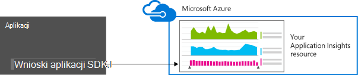
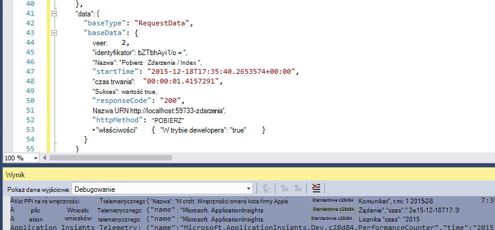
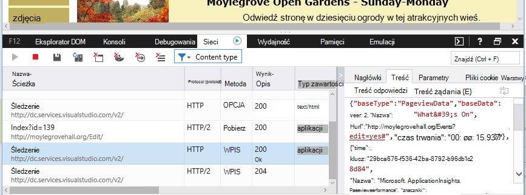

<properties 
    pageTitle="Przechowywanie danych i miejsca do magazynowania w aplikacji wniosków" 
    description="Deklaracja zasad przechowywania i prywatności" 
    services="application-insights" 
    documentationCenter=""
    authors="alancameronwills" 
    manager="douge"/>

<tags 
    ms.service="application-insights" 
    ms.workload="tbd" 
    ms.tgt_pltfrm="ibiza" 
    ms.devlang="na" 
    ms.topic="article" 
    ms.date="05/17/2016" 
    ms.author="awills"/>

# Zbieranie danych, przechowywanie i miejsca do magazynowania w aplikacji wniosków 

*Wnioski aplikacji jest w podglądzie.*

Po zainstalowaniu [Programu Visual Studio aplikacji wniosków] [ start] SDK w aplikacji, wysyła telemetrycznego o aplikacji w chmurze. Oczywiście odpowiedzialne programista chcesz dowiedzieć się dokładnie przesyłanych danych, co się dzieje z danych i jak można zachować kontrolę nad go. W szczególności może zostać wysłana danych poufnych, gdzie to jest przechowywane i zabezpieczeń jest to? 

Pierwszy, krótka odpowiedzi:

* Moduły standardowe telemetrycznego, które brakować "blok" są w stanie wysyłać poufne dane do usługi. Telemetrycznego dotyczy ładowania, wskaźniki wydajności i użycia, wyjątku raportów i innych danych diagnostycznych. Adresy URL; są widoczne w raportach diagnostyczne dane głównego użytkownika ale aplikacji nie powinny w każdym przypadku poufne dane należy umieścić w formacie zwykłego tekstu w adresie URL.
* Można wpisać kod wysyłające dodatkowe niestandardowe telemetrycznego ułatwiające przy użyciu narzędzia diagnostyczne i monitorowanie użycia. (Rozszerzania jest doskonałe funkcja wniosków aplikacji). Można, przez pomyłkę pisać kod, aby uwzględniała osobistych i innych informacji poufnych. Jeśli aplikacja działa z tych danych, należy stosować silne Recenzja procesów do tworzonego kodu.
* Podczas opracowywania i testowania aplikacji jest łatwe do sprawdzenia, co to jest wysyłany przez zestaw SDK. Dane są wyświetlane w oknie dane wyjściowe debugowania IDE i przeglądarki. 
* Dane są przechowywane w serwery [Microsoft Azure](http://azure.com) w USA. (Ale aplikacji można uruchamiać w dowolnym miejscu). Azure ma [silne zabezpieczenia przetwarza i spełnia szeroką gamę standardy zgodności](https://azure.microsoft.com/support/trust-center/). Tylko dla Ciebie i zespołem wyznaczonych mieć dostęp do danych. Pracownikami firmy Microsoft mogą ograniczyć dostęp do jej tylko w określonych warunkach ograniczone ze swoją wiedzę. Są szyfrowane podczas przesyłania, ale nie na serwerze.

Te odpowiedzi w pełnym rosnącego dalszej części tego artykułu. Jego opracowano z myślą o być niezależne, tak, aby pokazać dla współpracowników, którzy nie są częścią natychmiastowej zespołu.

## Co to jest aplikacja wniosków?

[Visual Studio aplikacji wniosków] [ start] jest oferowane przez firmę Microsoft, który pomoże Ci zwiększyć wydajność i użyteczności live aplikacji. Monitoruje aplikacji cały czas, który jest uruchomiony podczas testowania i po opublikowaniu lub wdrożony go. Wnioski aplikacji tworzy wykresy i tabele, w których są wyświetlane, na przykład, jakie godziny dnia, zostanie wyświetlony większość użytkowników, jak odpowiada aplikacji jest i jak jest obsługiwana przez zewnętrznych usług, których zależy. W przypadku awarii, błędy lub występują problemy z wydajnością, możesz wyszukiwać dane telemetrycznego szczegółowo diagnozowanie przyczyn. A Usługa wyśle do Ciebie wiadomości e-mail, w przypadku zmiany w dostępności i wydajności aplikacji.

Aby można było uzyskiwać tę funkcję, należy zainstalować SDK wniosków aplikacji w aplikacji, która staje się części jego kodu. Po uruchomieniu aplikacji zestawu SDK monitoruje działania i wysyła telemetrycznego z usługą wniosków aplikacji. Jest to obsługiwane przez [Microsoft Azure](http://azure.com)usługi w chmurze. (Ale wniosków aplikacji działa w przypadku dowolnej aplikacji, nie tylko te, które znajdują się w Azure).

Usługa wniosków aplikacji są przechowywane i analizuje telemetrycznego. Aby wyświetlić analizy lub wyszukiwania za pomocą telemetrycznego przechowywane, zaloguj się do konta Azure i otwórz zasób wniosków aplikacji dla aplikacji. Możesz także udostępnić dostęp do danych z innych członków zespołu lub z określoną subskrybentów Azure.

Możesz mieć dane wyeksportowane przez usługę wniosków aplikacji, na przykład do bazy danych lub zewnętrzne narzędzia. Zapewnia poszczególnych narzędzi specjalny klucz, który można uzyskać z usługi. Klucz może zostać cofnięta, w razie potrzeby. 

SDK wniosków aplikacji są dostępne dla zakresu typów aplikacji: hostowana w własne serwery J2EE lub ASP.NET lub Azure; usług sieci web sieci Web klienci - oznacza to, że kod działa na stronie sieci web; aplikacje komputerowe i usług; aplikacje urządzenie, takie jak Windows Phone, iOS i Android. Wszystkie wysłaniu telemetrycznego do tej samej usługi.

## Jakie dane czy go zbiera?

### Jak są dane są zbierane?

Istnieją trzy źródeł danych:

* Zestaw SDK, integracja z aplikacji [w fazie projektowania](app-insights-asp-net.md) lub [w czasie wykonywania](app-insights-monitor-performance-live-website-now.md). Istnieją różne SDK dla typów innej aplikacji. Istnieje także [SDK dla stron sieci web](app-insights-javascript.md), która ładuje do przeglądarki użytkownika końcowego oraz strony.

 * Każdy zestaw SDK zawiera liczbę [modułów](app-insights-configuration-with-applicationinsights-config.md), który umożliwia zbieranie informacji o różnych typach telemetrycznego różnych technik.
 * Po zainstalowaniu zestawu SDK w fazie projektowania umożliwia jego interfejs API wysyłanie własnych telemetrycznego oprócz modułów standardowych. Ten niestandardowy telemetrycznego może zawierać dowolne dane, które chcesz wysłać.
* W niektórych serwerach sieci web są również czynników, które razem aplikacji i wysyłanie telemetrycznego o Procesora, pamięci i użytkowanie sieci. Na przykład maszyny wirtualne Azure, Docker hosts i [Serwery J2EE](app-insights-java-agent.md) mogą mieć takich czynników.
* [Sprawdza dostępności](app-insights-monitor-web-app-availability.md) są procesów uruchomionych przez firmę Microsoft, które powodują wysyłanie wezwań do aplikacji sieci web w regularnych odstępach czasu. Wyniki są wysyłane do usługi wniosków aplikacji.

### Jakiego rodzaju dane są zbierane?

Dostępne są następujące główne kategorie:

* [Telemetrycznego serwer sieci web](app-insights-asp-net.md) — żądania HTTP.  Identyfikator URI, czas przetwarzania żądania, kod odpowiedzi, adres IP klienta. Identyfikator sesji.
* [Strony sieci Web](app-insights-javascript.md) — strona, liczby użytkowników i sesji. Czasem ładowania strony. Wyjątki. Połączenia AJAX.
* Wydajność liczniki — pamięci, Procesora, Jo, użytkowanie sieci.
* Klienta i serwera kontekst - OS, ustawienia regionalne, typu urządzenia, przeglądarki, rozdzielczość ekranu.
* [Wyjątki](app-insights-asp-net-exceptions.md) i awarie - **dokonuje zrzutu stosu**, należy utworzyć identyfikator, typ Procesora. 
* [Zależności między](app-insights-asp-net-dependencies.md) - połączenia usług zewnętrznych, takich jak AJAX pozostałe SQL. Identyfikator URI lub ciąg połączenia, czas trwania, sukcesu, polecenie.
* [Sprawdza dostępności](app-insights-monitor-web-app-availability.md) - czasu trwania badania i czynności, odpowiedzi.
* [Dzienniki śledzenia](app-insights-search-diagnostic-logs.md) i [niestandardowych telemetrycznego](app-insights-api-custom-events-metrics.md) - **coś kodu do dzienników lub telemetrycznego**.

[Więcej szczegółów](#data-sent-by-application-insights).

## Jak sprawdzić, co to są zbierane?

Jeśli opracowywania aplikacji, używając programu Visual Studio, uruchom aplikację w trybie debugowania (F5). Telemetrycznego pojawi się w oknie dane wyjściowe. W tym miejscu możesz skopiować je i sformatować go jako JSON za inspekcję łatwe. 

W oknie diagnostyki również jest bardziej czytelny widoku.

Dla stron sieci web Otwórz okno debugowania w przeglądarce.

### Czy mogę napisać kod, aby filtrować telemetrycznego przed wysłaniem?

Będzie możliwe pisząc [dodatek procesor telemetrycznego](app-insights-api-filtering-sampling.md).

## Jak długo są przechowywane dane? 

Punkty nieprzetworzonych danych (czyli elementy, które można sprawdzić w wyszukiwaniu diagnostyczne) są przechowywane przez 7 dni. Jeśli chcesz zachować dane dłuższe niż umożliwia [Eksportowanie ciągły](app-insights-export-telemetry.md) skopiować go do konta miejsca do magazynowania.

Zagregowane dane (oznacza to, że liczniki, średnie i innych danych statystycznych, które zostanie wyświetlony w Eksploratorze jednostki metryczne) są zachowywane w ziarno 1 minuty 30 dni, a 1 godzina lub 1 dzień (w zależności od typu) dla co najmniej 90 dni.

## Kto może uzyskiwać dostęp do danych?

Dane są widoczne dla Ciebie i, jeśli masz konto organizacji z członkami zespołu. 

Można eksportować przy wszystkich członków zespołu i może go skopiowany w innych lokalizacjach i przekazywane do innych osób.

#### Co robi z informacjami, które Moja aplikacja wysyła do wniosków aplikacji Microsoft?

Firma Microsoft używa danych tylko w celu włączenia usługi dla Ciebie.

## Miejsce, w którym są przechowywane dane 

* W USA. 

#### Można je przechowywać gdzieś inaczej, na przykład w Europie? 

* Nie obecnie. 

#### Czy to oznacza, że Moja aplikacja musi być hostowana w Stanach Zjednoczonych?

* Wartość nie. Aplikacja może zostać uruchomiony dowolnego miejsca, w hosty lokalnego lub w chmurze.

## Jak bezpieczne czy moje dane?  

Wnioski aplikacji jest usługą Azure w podglądzie. Gdy w podglądzie pracujemy nad do ochrony danych na zasady opisane w [Azure zabezpieczenia, prywatność i zgodność oficjalny dokument](http://go.microsoft.com/fwlink/?linkid=392408).

Dane są przechowywane na serwerach Microsoft Azure. W przypadku kont w Azure Portal opisano ograniczenia dotyczące kont w [Azure zabezpieczenia, prywatność i zgodność dokumentu](http://go.microsoft.com/fwlink/?linkid=392408). W przypadku kont w portalu usługi zespołu Visual Studio powoduje zastosowanie dokumentu [Ochrony danych usług programu Visual Studio zespołu](http://download.microsoft.com/download/8/E/E/8EE6A61C-44C2-4F81-B870-A267F1DF978C/MicrosoftVisualStudioOnlineDataProtection.pdf) . 

Dostęp do danych przez pracowników firmy Microsoft jest ograniczony. Możemy uzyskać dostęp do danych tylko z Twojej zgody, a jeśli jest to konieczne do obsługi aplikacji wnioski. 

Dane w agregacji w aplikacjach wszystkich klientów (na przykład szybkości danych i średni rozmiar śledzenia) są używane do poprawy wniosków aplikacji.

#### Telemetrycznego innej osoby może koliduje z Moje dane wniosków aplikacji?

Ta osoba może wysłać dodatkowe telemetrycznego do swojego konta przy użyciu klucza oprzyrządowania, które można znaleźć w kodzie stron sieci web. Za mało dodatkowych danych z metryki czy poprawnie reprezentuje wydajności i użycia Twojej aplikacji.

Jeśli udostępniasz kod innych projektów, pamiętaj, aby usunąć klucz oprzyrządowania.

## Dane są szyfrowane? 

Nie wewnątrz serwery obecnie.

Wszystkie dane są szyfrowane podczas przenoszenia go między centrami danych.

#### Dane są szyfrowane w drodze z mojej aplikacji na serwerach wniosków aplikacji?

Tak, firma Microsoft korzysta https do wysyłania danych do portalu z niemal wszystkich SDK, takich jak serwery sieci web, urządzeń i HTTPS stron sieci web. Jedynym wyjątkiem jest dane wysyłane z prostego HTTP stron sieci web. 

## Informacje umożliwiające identyfikację

#### Osobiście identyfikowalne dane osobowe mogła zostać wysłana do wniosków aplikacji? 

Tak, jest możliwe. 

Jako ogólne wskazówki:

* Większość standardowych telemetrycznego (czyli telemetrycznego wysyłane bez pisania kodów) nie zawiera jawne osoby. Jednak może być możliwe identyfikowanie osób według wnioskowanie ze zbioru zdarzeń.
* Wyjątku i śledzenia wiadomości mogą zawierać osoby
* Niestandardowe telemetrycznego - oznacza to, że połączenia takich jak TrackEvent napisanego w kodzie przy użyciu interfejsu API lub dziennik śledzenia - mogą zawierać dowolne dane, które możesz wybrać.

Tabela na końcu tego dokumentu zawiera szczegółowe opisy danych zebranych.

#### Mogę odpowiedzialny za przestrzeganie prawem i przepisami w odniesieniu do osoby?

Wartość Tak. To obowiązek upewnij się, że zbieranie i korzystanie z danych jest zgodny z prawem i przepisami i na warunkach Microsoft Online Services.

Klienci powinny odpowiednio informować o dane, które zbiera aplikacji i sposobu używania danych.

#### Czy użytkownicy wyłączyć wniosków aplikacji?

Nie bezpośrednio. Nie udostępniamy przełącznik, który użytkownicy mogą działać wyłączyć wniosków aplikacji.

Można jednak zaimplementować takich funkcji w aplikacji. Wszystkie SDK zawiera ustawienie interfejsu API, które wyłącza telemetrycznego zbioru. 

#### Moja aplikacja przypadkowo gromadzi informacje poufne. Czy wniosków aplikacji miniaturowe tych danych, nie zostanie zachowane

Wnioski aplikacji nie filtrowanie i usuwanie danych. Należy odpowiednio zarządzać danymi i Unikaj wysyłania tych danych do aplikacji wnioski.

## Dane wysyłane przez wniosków aplikacji

SDK różnią się między platformami, a jest wiele składników, które można zainstalować. (Odwołują się do [aplikacji wniosków — wprowadzenie][start].) Każdy składnik wysyła inne dane.

#### Kategorie danych przesyłanych w różnych scenariuszach

Działanie  | Klasy danych zebranych (zobacz następnej tabeli)
---|---
[Dodawanie aplikacji wniosków SDK do projektu sieci web .NET][greenbrown] | Kontekstu serwera Wnioskowane Liczników wydajności Żądania **Wyjątki** Sesji Użytkownicy
[Instalowanie Monitor stanu na usług IIS][redfield]|Zależności Kontekstu serwera Wnioskowane Liczników wydajności
[Dodawanie aplikacji wniosków SDK do aplikacji sieci web dla języka Java][java]|Kontekstu serwera Wnioskowane Żądanie Sesji Użytkownicy
[Dodawanie JavaScript SDK do strony sieci web][client]|ClientContext  Wnioskowane Strony ClientPerf AJAX
[Definiowanie domyślnych właściwości][apiproperties]|**Właściwości** informacje o wszystkich zdarzeniach standardowych i niestandardowych
[TrackMetric połączenia][api]|Wartości liczbowe **Właściwości**
[Połączenie śledzenia *][api]|Nazwa zdarzenia **Właściwości**
[TrackException połączenia][api]|**Wyjątki** Zrzut stosu **Właściwości**
Zestaw SDK nie może zbierać dane. Na przykład:   — Nie można uzyskać dostęp do liczników wydajności  -wyjątek w inicjator telemetrycznego | Narzędzia diagnostyczne SDK
 

Aby uzyskać [SDK dla innych platform][platforms], zobacz dokumenty.

#### Rodzaje zebranych danych

Dane zebrane zajęć | Zawiera (pełna lista) 
---|---
**Właściwości**|**Wszelkie dane - określona przez kodu**
DeviceContext |Identyfikator, IP, ustawień regionalnych modelu urządzenia, sieci, typ sieci, nazwę, rozdzielczość ekranu wystąpienie roli, nazwa roli, typu urządzenia
ClientContext |System operacyjny, ustawień regionalnych, język, sieci i rozdzielczości okna
Sesji | Identyfikator sesji
Kontekstu serwera |Nazwa komputera, ustawień regionalnych systemu operacyjnego, urządzenia, sesji użytkownika, kontekst użytkownika, operacja 
Wnioskowane |Lokalizacja Geo z adresu IP, sygnatura czasowa, systemu operacyjnego, przeglądarki
Metryki | Metryka nazwy i wartości
Zdarzenia | Nazwa zdarzenia i wartości
PageViews | Nazwa adresu URL i strony lub ekranu
Wydajności klienta | Nazwa adresu URL-strony, czas ładowania przeglądarki
AJAX | Połączenia HTTP ze strony sieci web do serwera
Żądania |Adres URL, czas trwania, kod odpowiedzi
Zależności|Typ (SQL, HTTP,...), parametry połączenia lub identyfikatora URI synchronizacji i asynchronicznych, czas trwania, sukcesu, instrukcji SQL (z Monitor stanu)
**Wyjątki** | Typ, **wiadomości**, stosy wywołań, numer źródłowego pliku i liniowy, identyfikator wątku
Ulega awarii | Identyfikator procesu, identyfikator procesu nadrzędnego, identyfikator wątku awarii; poprawki aplikacji, identyfikator, tworzenie;  Typ wyjątku, adres, dlatego; symbole zaciemnionego i rejestruje, adresy binarne rozpoczęcia i zakończenia, binarne nazwy i ścieżki, typ procesora
Śledzenie | Poziom ważności i **wiadomości**
Liczników wydajności | Czas procesora, dostępną pamięć, stawki żądanie, stawki wyjątku, bajtów prywatnych proces, Wy, czas trwania żądania, długość kolejki żądań
Dostępność | Kod odpowiedzi test sieci Web, czas trwania każdego kroku test, nazwa testowego, sygnatura czasowa, sukcesu, czas reakcji, testowej lokalizacji
Narzędzia diagnostyczne SDK | Śledzenie wiadomości lub wyjątku 

Możesz [wyłączyć niektóre dane według ApplicationInsights.config edycji][config]

## Środki

Ten produkt zawiera dane GeoLite2 utworzone przez MaxMind udostępniła [http://www.maxmind.com](http://www.maxmind.com).

## Klipy wideo

#### Wprowadzenie

> [AZURE.VIDEO application-insights-introduction]

#### Rozpoczynanie pracy

> [AZURE.VIDEO getting-started-with-application-insights]

<!--Link references-->

[api]: app-insights-api-custom-events-metrics.md
[apiproperties]: app-insights-api-custom-events-metrics.md#properties
[client]: app-insights-javascript.md
[config]: app-insights-configuration-with-applicationinsights-config.md
[greenbrown]: app-insights-asp-net.md
[java]: app-insights-java-get-started.md
[platforms]: app-insights-platforms.md
[pricing]: http://azure.microsoft.com/pricing/details/application-insights/
[redfield]: app-insights-monitor-performance-live-website-now.md
[start]: app-insights-overview.md

 