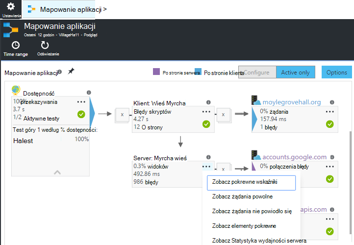
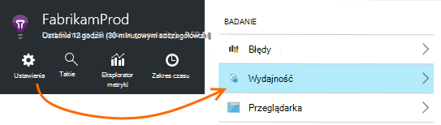
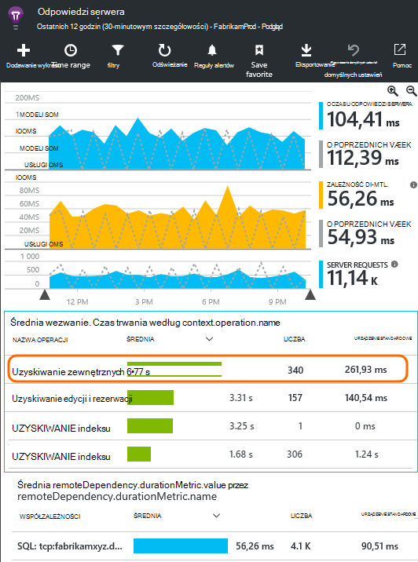
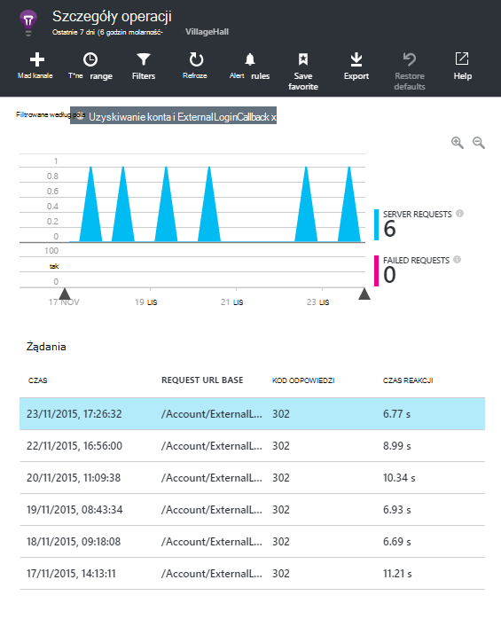
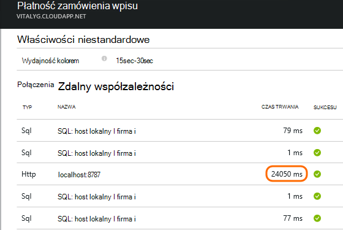
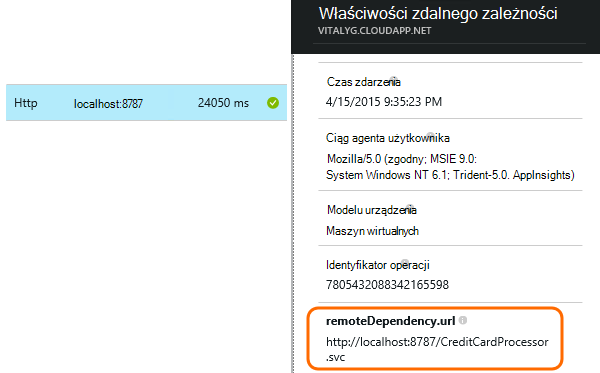
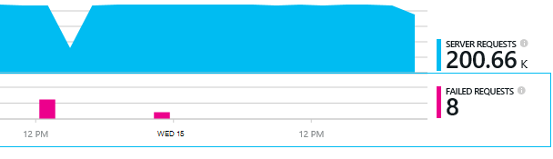
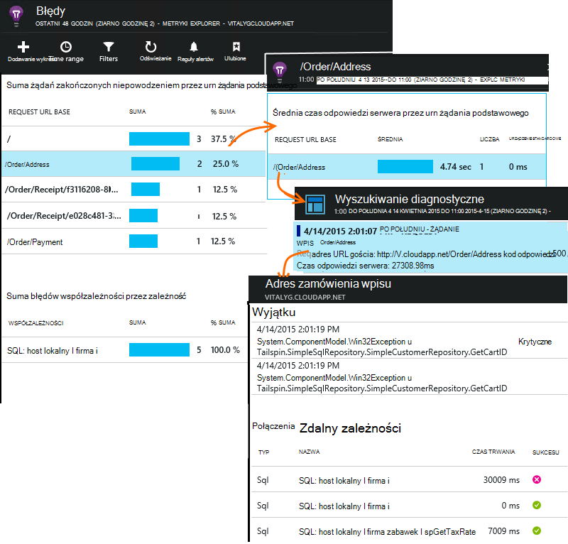

<properties 
    pageTitle="Diagnozowanie problemów związanych z zależnościami w aplikacji wniosków" 
    description="Znajdowanie błędów i spadek wydajności spowodowany współzależności" 
    services="application-insights" 
    documentationCenter=""
    authors="alancameronwills" 
    manager="douge"/>

<tags 
    ms.service="application-insights" 
    ms.workload="tbd" 
    ms.tgt_pltfrm="ibiza" 
    ms.devlang="na" 
    ms.topic="article" 
    ms.date="05/12/2016" 
    ms.author="awills"/>
 
# <a name="diagnosing-issues-with-dependencies-in-application-insights"></a>Diagnozowanie problemów związanych z zależnościami w aplikacji wniosków


*Zależność* jest składnik zewnętrzny wywoływana przez aplikację. Zazwyczaj to usługa o nazwie przy użyciu protokołu HTTP, lub bazy danych lub systemu plików. Lub za pomocą skryptu strony sieci web, może być połączenia AJAX na serwerze. W Visual Studio wniosków aplikacji także łatwe wyświetlanie czas oczekiwania aplikacji dla zależności i częstotliwość wywołanie zależności nie powiedzie się.

## <a name="where-you-can-use-it"></a>Gdzie można go używać

Okno monitorowania zależności jest obecnie dostępne dla:

* Aplikacje sieci web programu ASP.NET i usług uruchomionych na serwerze usług IIS lub Azure
* [Aplikacje sieci web języka Java](app-insights-java-agent.md)
* [Strony sieci Web](https://azure.microsoft.com/blog/ajax-collection-in-application-insights/)

Dla innych typów, takie jak aplikacje urządzenia można napisać własny monitora za pomocą [Interfejsu API TrackDependency](app-insights-api-custom-events-metrics.md#track-dependency).

Monitorowanie zależności w nowym polu raportów obecnie połączenia na następujące typy zależności:

* PROGRAMU ASP.NET
 * Bazy danych SQL
 * Sieci web programu ASP.NET i usługi WCF za pomocą powiązań oparte na HTTP
 * Lokalną lub zdalną połączeń protokołu HTTP
 * Azure DocumentDb, tabeli, magazyn obiektów blob i kolejki
* Java
 * Połączenia z bazą danych za pomocą sterownika [JDBC](http://docs.oracle.com/javase/7/docs/technotes/guides/jdbc/) , na przykład MySQL, SQL Server, PostgreSQL lub SQLite.
* Strony sieci Web
 * [Połączenia AJAX](app-insights-javascript.md)

Ponownie można napisać własny połączeń SDK monitorowanie innych zależności.

## <a name="to-set-up-dependency-monitoring"></a>Aby skonfigurować współzależność monitorowania

Zainstaluj odpowiedniego agenta serwera hosta.

Platformy | Instalowanie
---|---
Serwer usług IIS | Albo [zainstalować Monitor stanu na serwerze](app-insights-monitor-performance-live-website-now.md) lub [Uaktualnianie aplikacji .NET framework 4.6 lub nowszy](http://go.microsoft.com/fwlink/?LinkId=528259) i zainstaluj [Aplikację wniosków SDK](app-insights-asp-net.md) w aplikacji.
Azure w przeglądarce | [Rozszerzenie wniosków aplikacji](app-insights-azure-web-apps.md)
Serwer sieci web języka Java | [Aplikacje sieci web języka Java](app-insights-java-agent.md)
Strony sieci Web | [Monitor języka JavaScript](app-insights-javascript.md) (Nie dodatkowe ustawienia oprócz korzystania ze strony sieci web monitorowania)
Usługa w chmurze Azure |  [Użyj uruchamiania zadania](app-insights-cloudservices.md#dependencies) lub [Instalowanie .NET framework 4.6 +](../cloud-services/cloud-services-dotnet-install-dotnet.md)  

Monitor stanu dla serwerów programu IIS nie należy odbudować projektu źródła za pomocą aplikacji SDK wnioski. 

## <a name="application-map"></a>Mapowanie aplikacji

Mapowanie aplikacji działa jako pomocy wizualnej do odkrywanie zależności między składnikami aplikacji. 



Z pól można przejść do odpowiedniego zależności i innych wykresów.

Kliknij małą [x], aby zwinąć drzewo podrzędne.

Przypinanie mapy do [pulpitu nawigacyjnego](app-insights-dashboards.md)w miejsce, w którym będzie ona w pełni funkcjonalny.

Aby [uzyskać więcej informacji](app-insights-app-map.md).

## <a name="diagnosis"></a>Diagnozowanie problemów z wydajnością zależność na serwerze sieci web

Aby ocenić wyniki wezwań na serwerze:



Przewiń w dół do spojrzenie na siatce żądania:



Górny jeden trwa bardzo długo. Zobaczmy, jeśli firma Microsoft można znaleźć w miejsce, w którym czas.

Kliknij ten wiersz, aby wyświetlić indywidualne żądanie zdarzeń:




Kliknij dowolne wystąpienie długim pozwalają dalej.

> [AZURE.NOTE] Przewiń w dół się kawałek, aby wybrać opcję wystąpienie. Opóźnienia w potoku może oznacza, że dane dla wystąpienia górnym jest niekompletna.

Przewiń w dół do połączenia zdalnego zależności związane z tego żądania:



Ta funkcja wygląda większość obsługi czasu poświęconego tego żądania w połączeniu z usługą lokalny. 

Zaznacz ten wiersz, aby uzyskać więcej informacji:




Szczegóły zawiera wystarczających informacji do diagnozowania problemu.


## <a name="failures"></a>Błędy

W przypadku żądania nie powiodło się, kliknij wykres.



Kliknij typ żądania i żądania wystąpienia, w celu znalezienia zakończonego niepowodzeniem połączenia do zdalnego współzależności.





## <a name="custom-dependency-tracking"></a>Zależność niestandardowa śledzenia

Moduł standardowy śledzenia współzależności automatycznie wykrywa zależności zewnętrznych, takich jak bazy danych oraz interfejsy API pozostałych. Jednak może być pewne dodatkowe składniki traktowane w taki sam sposób. 

Można napisać kod, który wysyła informacje o zależnościach, przy użyciu samej [Interfejsu API TrackDependency](app-insights-api-custom-events-metrics.md#track-dependency) używanego przez moduł standardowy.

Na przykład jeśli konstruujesz kodu z zestawem napisanego nie samodzielnie rejestrowania chronometrażu wszystkie połączenia, aby dowiedzieć się, jakie udział ułatwia do Twoich czasów odpowiedzi. Aby te dane wyświetlane na wykresach zależności w aplikacji wniosków, wyślij go przy użyciu `TrackDependency`.

```C#

            var success = false;
            var startTime = DateTime.UtcNow;
            var timer = System.Diagnostics.Stopwatch.StartNew();
            try
            {
                success = dependency.Call();
            }
            finally
            {
                timer.Stop();
                telemetry.TrackDependency("myDependency", "myCall", startTime, timer.Elapsed, success);
            }
```

Jeśli chcesz wyłączyć moduł standardowy zależności śledzenia usuwanie odwołanie do DependencyTrackingTelemetryModule w [ApplicationInsights.config](app-insights-configuration-with-applicationinsights-config.md).


## <a name="ajax"></a>AJAX

Zobacz [strony sieci Web](app-insights-javascript.md).


 