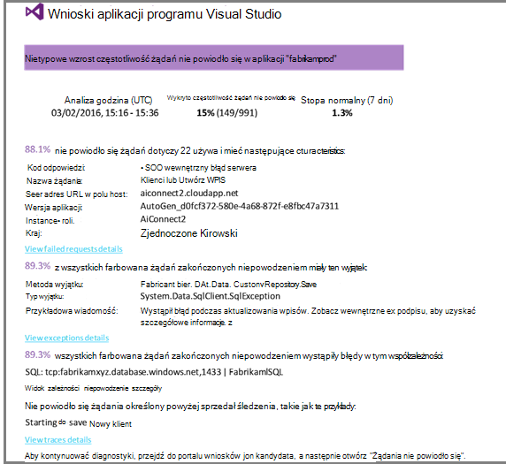

<properties
    pageTitle="Wykrywanie, sprawdzać, diagnozowanie"
    description="Analizowanie awarii i diagnozowanie problemów z wydajnością w aplikacjach"
    authors="alancameronwills"
    services="application-insights"
    documentationCenter=""
    manager="douge"/>

<tags
    ms.service="application-insights"
    ms.workload="tbd"
    ms.tgt_pltfrm="ibiza"
    ms.devlang="na"
    ms.topic="article" 
    ms.date="11/06/2015"
    ms.author="awills"/>

# Wykrywanie, sprawdzać i diagnozowanie z wniosków aplikacji

*Wnioski aplikacji jest w podglądzie.*

Dowiedz się, jak działa aplikacji ułatwia wniosków aplikacji i są używane w przypadku live. A w przypadku problemu go udostępnia informacje o jego ułatwia oceny wpływu i pomaga określić przyczynę.

Oto konta od zespołu rozwija aplikacji sieci web:

* *"Na kilka dni temu wdrożone"pomocnicze"poprawki. Nie możemy uruchomić przebieg ogólne testu, ale Niestety niektórych nieoczekiwane zmiany masz scalone ładunku, przyczyną niezgodności między z przodu i wstecz zostanie zakończone. Od razu wyjątki serwera wzrósł, alarmowy uruchamiany, a firma Microsoft zostały utworzone pamiętać sytuacji. Kilka kliknięć na z dala od komputera w portalu wniosków aplikacji, możemy masz wystarczających informacji z callstacks wyjątku, aby zawęzić problemu. Firma Microsoft wycofana natychmiast i ograniczone szkody. Wnioski aplikacji wprowadził tę część devops cyklu bardzo proste i sankcji."*

Zobaczmy, jak używane są typowe sieci web do zespołu opracowującego wniosków aplikacji do monitorowania wydajności. Pracujemy obecnie należy wykonać zespołu w banku Fabrikam, który rozwija systemu bankowego online (OBS).

Zespół działa na cykl w następujący sposób:

Wymagania dotyczące kanału informacyjnego w ich zaległości rozwoju (Lista zadań). Innymi słowy działają przebiegów, które często dostarczają oprogramowania pracy — zwykle w postaci ulepszeń i rozszerzenia istniejącej aplikacji. Aplikacja live często jest zaktualizowany przy użyciu nowych funkcji. W trakcie live zespołu monitoruje dla wydajności i użycia za pomocą aplikacji wnioski. Analiza kanały do ich zaległości rozwoju.

Zespół korzysta wniosków aplikacji monitorowanie aplikacji sieci web live uważnie:
* Wydajność. Chcesz dowiedzieć się, jak czas reakcji zależą od licznik żądania; ile Procesora, sieci, dysku i inne zasoby są używane; gdzie są gardła i.
* Błędy. Jeśli istnieją wyjątki lub nie powiodło się żądania, lub jeśli licznik wydajności odbywa się poza zakresem jej doświadczenia, zespołu nie trzeba znać szybko, dzięki czemu można wykonać akcję.
* Użycie. Po zwolnieniu nową funkcję zespołu chcesz się dowiedzieć, w jakim jest używany, oraz czy użytkownicy mają trudności z nim.

Załóżmy skoncentrować się na opinii część cyklu:

## Wykrywanie niskiej dostępności

Marcela Markova jest starszy Deweloper zespołu OBS i Trwa potencjalnego klienta na monitorowanie wydajności usługi online. Anna konfiguruje kilka [testów web][availability]:

* Test adresu URL pojedyncza strona głównym początkowa dla aplikacji usługi http://fabrikambank.com/onlinebanking/. Anna Ustawia kryteria kod HTTP 200 i tekst "Zapraszamy!". Jeśli ten test zakończy się niepowodzeniem, coś jest poważnie problem z siecią lub serwery lub być może problem wdrożenia. (Lub ktoś zmienił — Zapraszamy! wiadomość na stronie bez co jej wie).

* Szczegółowego badanie wielu krok, dzienniki w i otrzymuje bieżącego konta pozycje, sprawdzanie kilka kluczowe informacje na każdej stronie. Ten test sprawdza, czy łącze do bazy danych kont działa. Wybiera identyfikator klienta fikcyjny: niektóre z nich są zachowywane do celów testowych.

Testy Konfigurowanie Marcela ma pewność, że zespołu wiedzieli, szybko o dowolnej awarii.  

Błędy są wyświetlane jako czerwone kropki na wykresie test sieci web:

Ale co ważne, alert dotyczący niezgodności zostaną przesłane pocztą e-mail do zespołu opracowującego. W ten sposób wiedzą o go przed niemal wszystkich klientów.

## Monitorowanie wydajności metryki

Na stronie Przegląd w aplikacji wniosków jest wykresu, który zawiera wiele różnych [miar, kluczowych][perf].

Czas ładowania strony przeglądarki pochodzi z telemetrycznego wysłany bezpośrednio ze strony sieci web. Czas odpowiedzi serwera, licznik żądania serwera i liczba żądań zakończonych niepowodzeniem są wszystkie mierzone na serwerze sieci web i wysyłane do aplikacji wniosków stamtąd.

Marcela jest nieco związane z u graph odpowiedzi serwera wyświetla średni czas między, gdy serwer odbiera żądania HTTP z przeglądarki użytkownika, a gdy zwraca odpowiedź. Nie jest nietypowe wyświetlić zmiany na tym wykresie, jak zmienia się obciążenie systemu. Jednak w tym przypadku wydaje się, że korelacji między małych przyrostom w obliczeniach żądania, a następnie duży wzrośnie czas reakcji. Które mogą wskazywać, system działa tylko na poziomie limit. 

Użytkownik otwiera wykresy serwerów:

Wydaje się żadnych objawów ograniczenia zasobów, dlatego może nierówności na wykresach odpowiedzi serwera są tylko związek.

## Alerty

Jednak użytkownik chce śledzą czas odpowiedzi. Jeżeli znajdzie się zbyt duży, chce wiedzieć o ją natychmiast.

Aby Anna ustawia [alerty][metrics], jako większy niż typowy próg czasy odpowiedzi. Dzięki temu jej pewność, że użytkownik wie, związanych z nim gdy wolno czasy odpowiedzi.

Alerty można ustawić na szeroką gamę inne wskaźniki. Na przykład można otrzymywać wiadomości e-mail, jeśli liczba wyjątku staje się wysoki lub dostępną pamięć przechodzi niska lub jest alokacja maksymalna żądania klienta.

## Aktywne alerty diagnostyczne

Następnego dnia, otrzymują alertów poczty e-mail z aplikacji wnioski. Natomiast gdy użytkownik otwiera, Anna znajduje nie jest ustawiany Anna alert czasu odpowiedzi. Zamiast tego informuje on jej zostały szybkiego wzrost zakończonych niepowodzeniem żądań - oznacza to, że żądania, które zwrócone kod błędów 500 lub więcej.

Żądania nie powiodło się to, gdzie umieścić błąd - zwykle następuje wyjątek w kodzie użytkowników. Być może zobaczą komunikat napisem: "Niestety firma Microsoft nie można zaktualizować swoje dane teraz" lub, w bezwzględna embarrassing najgorszym zrzut stosu na ekranie użytkownika, dzięki uprzejmości serwer sieci web.

Ten alert jest niespodzianek, ponieważ podczas ostatniego she elementu, liczba żądań zakończonych niepowodzeniem był encouragingly niski. Niewielka liczba porażek jest oczekuje się na serwerze zajęty. 

Również nieco niespodzianek jej ponieważ użytkownik nie trzeba konfigurować tego alertu. W rzeczywistości aktywne diagnostyki jest udostępniana automatycznie z wniosków aplikacji. On automatycznie zmienia się w celu wzorzec normalny błąd Twojej aplikacji i błędy "jest używany do" na określonej stronie lub dużym obciążeniu lub połączone z innymi wskaźnikami. Tylko wtedy, gdy wzrost powyżej nadejdzie się spodziewać go podnosi alarmu.

To jest bardzo przydatne wiadomości e-mail. Po prostu nie go podwyższyć alarmu; tak zbyt wiele klasyfikowanie i diagnostyczne pracy.

Dzięki niemu dotyczy ilu użytkowników i strony sieci web lub operacji. Marcela można zdecydować, czy musi uzyskać całego zespołu, Praca nad tym jako rozwijania fire lub czy można je zignorować dopiero w przyszłym tygodniu.

Wiadomość e-mail również pokazuje, że określonego wyjątku wystąpił i — nawet więcej interesujące - awaria jest skojarzone z niepowodzeniu połączenia do konkretnej bazy danych. To wyjaśniono, dlaczego błędu niespodziewanie pojawiły się nawet zespołu Marcela osoby ostatnio nie wdrożono aktualizacje. 

Anna pinguje kierownik zespołu bazy danych. Tak, one wydane poprawki w ciągu ostatnich pół godziny; i Ojej, być może doszło zmiana pomocniczych schematu...

Tak problem polega na sposobem jest ustalany jeszcze przed badanie dzienniki, a w ciągu 15 minut jego wynikających. Jednak Marcela kliknie łącze, aby otworzyć aplikację wnioski. Zostanie otwarty bezpośrednio na żądanie nie powiodło się, a użytkownik może wyświetlać bazy danych nie powiodło się połączenie na liście skojarzone zależności połączeń. 

## Wykrywanie wyjątki

Przy odrobinie konfiguracji [Wyjątki](app-insights-asp-net-exceptions.md) przekazywanych wniosków aplikacji automatycznie. Są również można przechwytywać jawnie, wstawiając połączenia do [TrackException()](app-insights-api-custom-events-metrics.md#track-exception) do kodu:  

    var telemetry = new TelemetryClient();
    ...
    try
    { ...
    }
    catch (Exception ex)
    {
       // Set up some properties:
       var properties = new Dictionary <string, string>
         {{"Game", currentGame.Name}};

       var measurements = new Dictionary <string, double>
         {{"Users", currentGame.Users.Count}};

       // Send the exception telemetry:
       telemetry.TrackException(ex, properties, measurements);
    }

Zespół banku Fabrikam powstał sesji ćwiczeń zawsze wysyłania telemetrycznego na wyjątek, chyba że jest oczywiste odzyskiwania.  

W rzeczywistości nawet szerszy niż jest ich strategii: wysłaniu telemetrycznego w każdym przypadku klienta w przypadku sfrustrowana w ich potrzeb w celu czy odpowiadający mu wyjątek w kodzie lub nie. Na przykład jeśli systemu zewnętrznego przełączania między bankami zwraca komunikat "nie można ukończyć tej transakcji" jakiegoś powodu operacyjne (nie błąd klienta) następnie śledzą to zdarzenie.

    var successCode = AttemptTransfer(transferAmount, ...);
    if (successCode < 0)
    {
       var properties = new Dictionary <string, string>
            {{ "Code", returnCode, ... }};
       var measurements = new Dictionary <string, double>
         {{"Value", transferAmount}};
       telemetry.TrackEvent("transfer failed", properties, measurements);
    }

TrackException służy do zgłaszania wyjątków, ponieważ wysyła kopię stosu; TrackEvent jest używany do raportu inne zdarzenia. Można dołączyć wszystkie właściwości, które mogą być przydatne w zakresie diagnostyki.

Wyjątki i zdarzenia wyświetlane w [Diagnostyczne wyszukiwania] [ diagnostic] karta. Możesz przejść do ich tak, aby wyświetlić dodatkowe właściwości i układania śledzenia.

## Monitorowanie aktywności użytkownika

Gdy czas odpowiedzi jest zawsze dobrym i istnieje kilka wyjątków, informacje na temat Ulepsz proces użytkowników i ich więcej użytkowników do odpowiedniej osiągnięciu myśleć zespołu deweloperów.

Na przykład podróży typowy użytkownik za pośrednictwem witryny sieci web ma Wyczyść "lejek": wielu klientów przeglądać stawki różnego rodzaju pożyczki; Niektóre z nich Wypełnij formularz oferty; i osób, które uzyskiwanie oferty, kilka wtyczce wykupić pożyczki.

Analizując miejsce, w którym największej liczby odbiorców upuść firmy pracować sposób uzyskiwania wielu użytkowników za pośrednictwem u dołu lejka. W niektórych przypadkach może być błąd obsługi (interfejsu użytkownika) użytkownika — na przykład "przycisku" jest trudne do znalezienia lub instrukcje nie występują oczywiste. Najprawdopodobniej są bardziej znaczące przyczyny firm wszystko upuszczania: być może stawki pożyczki są zbyt wysoki.

Niezależnie od powodów, dane pomaga zespołu, praca się, co robią użytkowników. Można wstawiać kolejnych połączeń śledzenie pracy szczegółowe. TrackEvent() może służyć do zliczenia wszelkie akcje użytkownika z poprawnie szczegółowości klika przycisk poszczególnych, aby znaczną osiągnięcia takich jak opłaty wyłączanie pożyczki.

Wprowadzenie umożliwia zespołu o informacje dotyczące działań użytkownika. Dzisiaj gdy projekt nową funkcję, działają się, jak będą mogli korzystać z opinii na temat jego użyciem. Projekt śledzenia wywołuje funkcję od początku. Aby poprawić funkcję w każdym cyklu opracowywania używają opinii.

## Monitorowania  

Marcela po prostu nie znajdują się wokół Trwa oczekiwanie na alerty. Krótko po każdej ponownego rozmieszczenia, Anna trwa spojrzenie na [czas reakcji] [ perf] — zarówno ogólny rysunek i tabeli najmniejszą żądania, jak również liczby wyjątku.  

Anna Oceń wpływ na wydajność każdej wdrożenia zwykle porównanie co tydzień, przy czym ostatnia. Jest szybkiego powiększa, Anna podnosi który z odpowiednimi deweloperów.

## Klasyfikowanie

Klasyfikowanie - oceny ważności i stopień problem - po pierwszym krokiem wykrywania. Czy firma Microsoft wyróżnić zespołu o północy? Czy można go pozostać do następnego wygodny przerwy w zaległości? Istnieje kilka kluczowych pytań w klasyfikowanie.

Ile się dzieje? Na wykresach w karta Przegląd przekazać niektóre perspektywy problem. Na przykład aplikacji Fabrikam wygenerowanych cztery alerty test sieci web do następnego dnia. Spojrzenie na wykres rano, zespołu może zobacz wystąpiły faktycznie niektórych czerwone kropki, jakby była zielony nadal większość testów. Przechodzenie do na wykresie Dostępność szczegółów, było wyczyszczone, że były wszystkie przejściowymi problemami z jednego testu lokalizacji. Oczywiście została problemu sieć tylko jedna trasa i najprawdopodobniej będzie się Wyczyść.  

Natomiast ostrym i stabilny wzrostu na wykresie czasów wyjątku liczniki i odpowiedzi nie jest wyraźnie coś było awaryjne o.

Działanie klasyfikowanie przydatne jest spróbuj go samodzielnie. Jeśli wystąpi ten sam problem wiadomo, że jest prawdziwa.

Jaka część użytkowników to dotyczy? Aby uzyskać odpowiedzi drukowania, dzielenie współczynnik błędów za liczba sesji.

W przypadku powolnych odpowiedzi porównanie tabeli najmniejszą odpowiada wniosków o częstotliwości zastosowania każdej strony.

Jak ważne jest zablokowane scenariusz? Jeśli jest to problem funkcjonalności blokowanie sekcji określonego użytkownika, czy ma znaczenie znacznie? Jeśli klienci nie opłacanie rachunków ich, to jest poważne; Jeśli nie mogą zmieniać swoje preferencje koloru ekranu, być może ją może oczekiwać. Szczegóły zdarzenia lub wyjątku lub tożsamości powolne strony zawiera informację, gdzie występują problemy z klientami.

## Diagnostyka

Diagnostyka nie jest bardzo taka sama, jak debugowania. Przed rozpoczęciem śledzenia przez kod powinien mieć drukowania ogólny obraz tego, dlaczego, gdzie i kiedy występuje problem.

**Gdy on występuje?** Widok historycznych dostarczony przez wykresy zdarzeń i jednostki metryczne ułatwia przeniesionym efekty z możliwych przyczyn. W przypadku przerw wartości w czasie lub wyjątku wskaźniki odpowiedzi, obejrzyj licznik żądania: jeśli jego pików w tym samym czasie, a następnie wygląda problem z zasobów. Należy przypisać więcej Procesora i pamięci? Czy to zależność, która nie może zarządzać Załaduj?

**Jest to nam?**  Jeśli masz szybkiego spadek wydajności określonego typu żądania — na przykład gdy odbiorca chce rachunku —, a następnie istnieje możliwość może być zewnętrzny podsystemu zamiast aplikacji sieci web. W Eksploratorze metryki zaznacz stopa błąd zależności i czas trwania współzależności stawki i porównywanie ich historii ostatnich kilka liczby godzin i dni, z którego zostanie wykryty problem. Jeśli są korelacji zmian, zewnętrznych podsystemu może być stronę.  

Niektóre problemy współzależności wolne są geolokalizacja problemów. Fabrikam Bank używa Azure maszyn wirtualnych i wykryte, że zostały przypadkowo znajdują ich serwer sieci web i serwer konta z różnych krajów. Wyrazisty poprawy jakości została spowodowanych Migrowanie jeden z nich.

**Firma Microsoft czego?** Jeśli problem nie jest wyświetlany w zależności i nie jest wybrana zawsze istnieje, jest to prawdopodobnie spowodowane ostatnich zmian. Perspektywy historycznych dostarczony przez wykresy jednostki metryczne i zdarzeń ułatwia zmiany szybkiego być zgodne z wdrożenia. Który Zawęża wyszukiwanie problemu.

**Co się dzieje?** Niektóre problemy występują rzadko i może być trudne do śledzenia, testując w trybie offline. To wszystko, co można zrobić próba Przechwytywanie ten błąd, gdy występuje live. Można sprawdzić zrzuty stosu w raportach wyjątek. Ponadto można napisać połączeń śledzenia usługi framework Ulubione rejestrowania albo TrackTrace() lub TrackEvent().  

Fabrikam wystąpił problem przerw w przypadku transferów między kontami, ale tylko w przypadku niektórych typów kont. Aby lepiej zrozumieć, co zostało dzieje, są wstawiane połączeń TrackTrace() na najważniejszych punktów w kodzie Dołączanie Typ konta jako właściwość do każdego połączenia. Który wprowadzone ułatwia filtrować tylko te śledzenia w wyszukiwaniu diagnostyczne. Wartości parametru jako właściwości i miar one również dołączone do śledzenia połączeń.

## Praca z nim

Po zostały zdiagnozowana ten problem, można tworzyć plan go naprawić. Być może musisz cofnąć ostatnie zmiany lub może być może po prostu Zrealizuj i poprawka. Po zakończeniu fix wniosków aplikacji informujący, czy powiodło się.  

Fabrikam banku do zespołu opracowującego podjąć bardziej uporządkowanego podejście do pomiaru wydajności niż kiedyś przed wniosków aplikacji.

* Na stronie Omówienie wniosków aplikacji ich ustaw cele w odniesieniu do określonej miary.

* Projekt miary wydajności do aplikacji od początku, takich jak metryk pomiaru postępu użytkownika za pośrednictwem "lejki."  

## Użycie

Aby dowiedzieć się, co zrobić z aplikacji użytkowników można także wniosków aplikacji. Po uruchomieniu sprawniej, zespołu chcesz wiedzieć, które funkcje są najczęściej wykonywane co użytkowników, takich jak lub mają problemy z i jak często są wróć. Które ułatwi ich priorytety nadchodzące pracy. A można zaplanować miarą sukcesu poszczególnych funkcji w ramach cyklu opracowywania. [Przeczytaj więcej][usage].

## Aplikacje

Tak jest zastosowanie zespołu jak jeden wniosków aplikacji nie tylko do Rozwiązywanie problemów dotyczących poszczególnych, ale aby zwiększyć ich Cykl opracowywania. Mogę Życzymy go udzieliła Ci kilka sugestii pokazujących, jak wniosków aplikacji można zwiększyć wydajność własnych aplikacji.

## Klip wideo

[AZURE.VIDEO performance-monitoring-application-insights]

<!--Link references-->

[api]: app-insights-api-custom-events-metrics.md
[availability]: app-insights-monitor-web-app-availability.md
[diagnostic]: app-insights-diagnostic-search.md
[metrics]: app-insights-metrics-explorer.md
[perf]: app-insights-web-monitor-performance.md
[usage]: app-insights-web-track-usage.md
 
