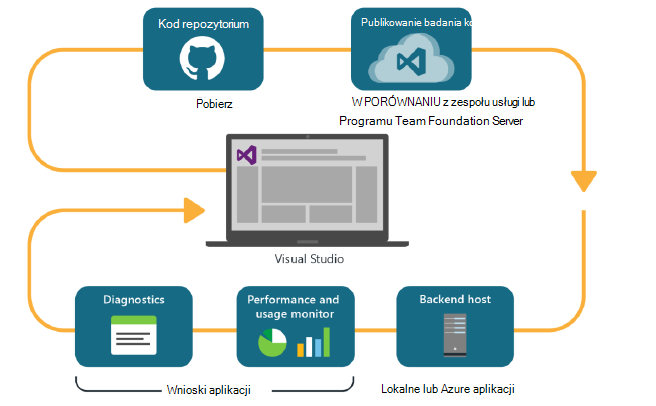
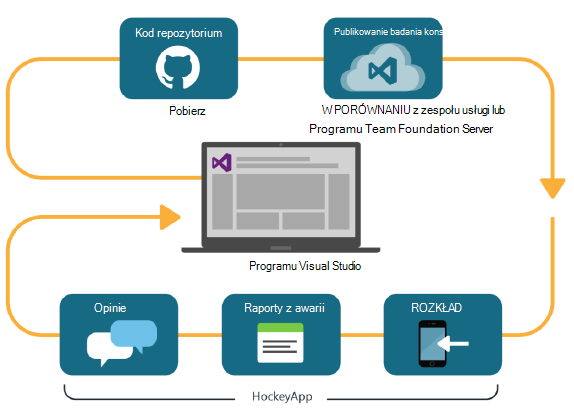

<properties
    pageTitle="Analizy Deweloper"
    description="DevOps przy użyciu programu Visual Studio, wniosków aplikacji i HockeyApp"
    authors="alancameronwills"
    services="application-insights"
    documentationCenter=""
    manager="douge"/>

<tags
    ms.service="application-insights"
    ms.workload="tbd"
    ms.tgt_pltfrm="ibiza"
    ms.devlang="na"
    ms.topic="article" 
    ms.date="05/18/2016"
    ms.author="awills"/>

# Deweloper analizy wniosków aplikacji i HockeyApp

*Wnioski aplikacji jest w podglądzie.*

Wiele projektów działać szybkiego cyklu [DevOps](https://en.wikipedia.org/wiki/DevOps) . Ich tworzenie i rozpowszechnianie ich aplikacji, uzyskiwanie opinii na temat sposób wykonywania i użytkowników do czego go, a następnie użyj tej wiedzy planowanie dodatkowo programistycznych. 

Monitorowanie użycia i wydajności, jest dostęp do telemetrycznego z live aplikacji, a także opinii użytkowników, się. 

Wiele systemów są tworzone na podstawie wielu składników: usługi sieci web, procesorów wewnętrznej bazy danych lub magazynów danych i oprogramowanie klienckie działa w przeglądarce lub aplikacji w przypadku telefonu lub innego urządzenia. Telemetrycznego z tych różnych składników musi być razem.

Niektóre wersje ograniczono rozkładu wyznaczonych testerzy; Udostępniamy również organizację flighting (testy nowe funkcje z ograniczonymi uprawnieniami grup odbiorców) i A | B badania (równoległe testy alternatywny interfejsu użytkownika).

Zarządzanie dystrybucji i integracji kontroli nad wieloma składniki klienta i serwera nie jest uproszczony zadania. Ten proces jest podstawowe części architektury aplikacji: Firma Microsoft nie można utworzyć system tym rodzaju bez cyklu iteracyjne projektowanie i dobre narzędzia monitorowania.

W tym artykule opisano sposób dopasowania monitorowania aspektów cykl devOps się przy użyciu innych części tego procesu. 

Jeśli chcesz przyjrzeć się konkretnym przykładzie, jest [interesujące analiza przypadku](http://aka.ms/mydrivingdocs) zawierającej wiele składników klienta i serwera.

## Cykl DevOps

Visual Studio i analizy Deweloper narzędzia zapewniają środowisko devOps dobrze zintegrowany. Na przykład Oto Typowy cykl dla aplikacji sieci web (który może być Java, Node.js lub ASP.NET):

* Deweloper sprawdza repozytorium kod lub scala gałąź głównym. Repozytorium jest cyfra na tej ilustracji, ale być może również [Kontrola wersji programu Team Foundation](https://www.visualstudio.com/docs/tfvc/overview).
* Zmiany wyzwolenia test kompilacji i jednostki. Usługa kompilacji może być [Visual Studio Team Services](https://www.visualstudio.com/docs/vsts-tfs-overview)lub partnera lokalnego programu Team Foundation Server. 
* Tworzenie powiedzie i testu jednostki można [wyzwalacza automatyczne wdrażanie](https://www.visualstudio.com/docs/release/author-release-definition/more-release-definition). Host aplikacji sieci web może być własny serwer sieci web albo Microsoft Azure. 
* Telemetrycznego z żywo aplikacji są wysyłane do [Aplikacji wniosków](app-insights-overview.md), zarówno z serwera i [z przeglądarki klienta](app-insights-javascript.md). Można analizować wydajność wzorców aplikacji i zastosowania. Zaawansowane [Narzędzia wyszukiwania](app-insights-analytics.md) pomocy diagnozowanie problemów. [Alerty](app-insights-alerts.md) upewnij się, że wiesz o problemie, zaraz po jego powstanie. 
* Następnym cyklu opracowywania jest informowany przez analizę telemetrycznego live.

### Urządzenia i aplikacji klasycznych

Urządzeń i aplikacji komputerowych rozkład część cyklu różni się nieco, ponieważ nie możemy po prostu przekazywanie do jeden lub dwa serwery. Zamiast tego pomyślnego kompilacji i testu jednostki można [wyzwalacza przekazywanie do HockeyApp](https://support.hockeyapp.net/kb/third-party-bug-trackers-services-and-webhooks/how-to-use-hockeyapp-with-visual-studio-team-services-vsts-or-team-foundation-server-tfs). HockeyApp nadzoruje dystrybucyjnej z zespołem użytkowników testowych (lub ogółowi społeczeństwa, jeśli wolisz). 

HockeyApp zbiera również wydajność i danych dotyczących użycia w formularzach programu:

* Słowo po słowie użytkownika Reaguj zrzutów ekranu
* Raporty z awarii
* Niestandardowe telemetrycznego wpisane przez użytkownika.

Ponownie cykl devOps zostanie zakończone po wykonaniu planów przyszłych rozwoju świetle opinii uzyskanego.

## Konfigurowanie analizy Deweloper

Dla każdego składnika aplikacji - urządzeń przenośnych lub w sieci web lub pulpitu — czynności są zasadniczo takie same. Dla wielu typów aplikacji Visual Studio wykonuje automatycznie niektóre z następujących czynności.

1. Dodaj odpowiednie SDK do aplikacji. W przypadku aplikacji urządzenie jest HockeyApp, a dla usług sieci web jest wniosków aplikacji. Każda zawiera kilka wariantów dla różnych platform. (Jest również można użyć dowolnej SDK dla aplikacji komputerowych, ale zaleca się HockeyApp.)
2. Zarejestruj się w aplikacji za pomocą portalu wniosków aplikacji lub HockeyApp w zależności od SDK został użyty. Jest to miejsce, w którym pojawi się analizy z Twojej aplikacji live. Zostanie wyświetlony klucz oprzyrządowania lub identyfikator skonfigurowanego do aplikacji, tak aby zestawu SDK miejsce wysłać jego telemetrycznego.
3. Dodawanie kodu niestandardowego (Jeśli to konieczne) do rejestrowania zdarzeń lub miar, ułatwiające Diagnostyka lub do analizowania wydajności i użycia. Istnieje wiele monitorowania wbudowane, więc nie będzie wymagało na pierwszy cykl.
3. W przypadku aplikacji urządzenia:
 * Przekaż Kompilacja debugowania do HockeyApp. Stamtąd należy rozpowszechnić go do zespołu użytkowników testowych. W przypadku, gdy wysyłasz kolejnych tworzy, zostanie powiadomiony zespołu.
 * Po skonfigurowaniu usługi ciągły budowania usługi, tworzenie definicji wersji, która używa wtyczki kroku przekazywanie do HockeyApp.

### Analizy i Eksportuj do telemetrycznego HockeyApp

Możesz badanie HockeyApp niestandardowe i zaloguj się przy użyciu analizy i eksportowanie ciągły funkcji aplikacji wniosków przez [Skonfigurowanie mostka](app-insights-hockeyapp-bridge-app.md)telemetrycznego.

## Następne kroki
 
Poniżej przedstawiono szczegółowe instrukcje dla różnych typów aplikacji:

* [Aplikacja sieci web programu ASP.NET](app-insights-asp-net.md) 
* [Aplikacja sieci web języka Java](app-insights-java-get-started.md)
* [Node.js aplikacji sieci web](https://github.com/Microsoft/ApplicationInsights-node.js)
* [aplikacji w systemie iOS](https://support.hockeyapp.net/kb/client-integration-ios-mac-os-x-tvos/hockeyapp-for-ios)
* [Mac OS X aplikacji](https://support.hockeyapp.net/kb/client-integration-ios-mac-os-x-tvos/hockeyapp-for-mac-os-x)
* [Aplikacja systemu android](https://support.hockeyapp.net/kb/client-integration-android/hockeyapp-for-android-sdk)
* [Aplikacja Universal systemu Windows](https://support.hockeyapp.net/kb/client-integration-windows-and-windows-phone/how-to-create-an-app-for-uwp)
* [Windows Phone 8 lub 8.1 aplikacji](https://support.hockeyapp.net/kb/client-integration-windows-and-windows-phone/hockeyapp-for-windows-phone-silverlight-apps-80-and-81)
* [Prezentacja Windows Foundation aplikacji](https://support.hockeyapp.net/kb/client-integration-windows-and-windows-phone/hockeyapp-for-windows-wpf-apps)

