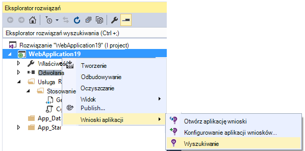

<properties 
    pageTitle="Używanie funkcji wyszukiwania diagnostyczne | Microsoft Azure" 
    description="Wyszukiwanie i filtrowanie pojedynczych zdarzeń żądania, dziennika śledzenia." 
    services="application-insights" 
    documentationCenter=""
    authors="alancameronwills" 
    manager="douge"/>

<tags 
    ms.service="application-insights" 
    ms.workload="tbd" 
    ms.tgt_pltfrm="ibiza" 
    ms.devlang="na" 
    ms.topic="article" 
    ms.date="06/09/2016" 
    ms.author="awills"/>
 
# Używanie funkcji wyszukiwania diagnostyczne w aplikacji wniosków

Diagnostyczne wyszukiwania jest funkcją [Wniosków aplikacji] [ start] że umożliwia znajdowanie i eksplorowanie telemetrycznego poszczególne elementy, takie jak liczbę wyświetleń stron, wyjątki lub sieci web żądania. I dziennika śledzenia i zdarzenia, które mają kodowane można przeglądać.

## Gdzie możesz zobaczyć diagnostyki wyszukiwania?

### W portalu Azure

Wyszukiwanie diagnostyczne można otworzyć jawnie:

Zostanie wyświetlona również po kliknięciu za pośrednictwem niektórych elementów siatki. W tym przypadku filtrów wstępnie są ustawione na skoncentrowanie się na typ wybranego elementu. 

Na przykład jeśli aplikacja jest usługi sieci web, karta Przegląd pokazuje wykres wielkości żądania. Kliknij go, a następnie przejść do bardziej szczegółowe wykresu z listy pokazujący, ile żądań wprowadzono dla każdego adresu URL. Kliknij każdy wiersz i zostanie wyświetlona lista poszczególnych wniosków dla tego adresu URL:

Główną diagnostyki wyszukiwania jest listą elementów telemetrycznego - żądania serwera strony widoków, zdarzenia niestandardowe, które mają kodowane i tak dalej. U góry listy jest podsumowanie zestawienie liczniki zdarzeń w czasie.

Zdarzenia zazwyczaj wyświetlane w diagnostyczne wyszukiwania przed wyświetleniem w Eksploratorze metryczne. Mimo że karta odświeża się w określonych odstępach, Jeśli czekasz dla określonego zdarzenia można kliknij przycisk Odśwież.

### W programie Visual Studio

Otwórz okno wyszukiwania w programie Visual Studio:

Okno wyszukiwania zawiera te same funkcje co portalu sieci web:

## Próbki

Jeśli aplikacji generuje wiele telemetrycznego (i używasz 2.0.0-beta3 wersję programu ASP.NET SDK lub nowszy), moduł adaptacyjne przy próbkowaniu zostanie automatycznie zmniejszyć objętość wysyłaną do portalu, wysyłając przedstawiciela ułamek zdarzeń. Jednak zdarzenia, które są związane z tym samym żądanie zaznaczone lub wyczyszczone grupowo, dlatego możesz przechodzić między powiązane z nimi zdarzenia. 

[Więcej informacji na temat pobierania](app-insights-sampling.md).

## Sprawdzanie pojedynczych elementów

Wybierz dowolny element telemetrycznego, aby wyświetlić pola klucza i powiązanych elementów. Jeśli chcesz wyświetlić pełny zestaw pól, kliknij przycisk "...". 

Aby uzyskać pełny zestaw pól, użyj prostego ciągów (bez symboli wieloznacznych). Dostępne pola zależy od typu danych telemetrycznych.

## Tworzenie elementu pracy

Możesz utworzyć błędu w Visual Studio Team Services ze szczegółami z dowolnego elementu telemetrycznego. 

Gdy to zrobisz, po raz pierwszy, zostanie wyświetlony monit o skonfigurować łącza do swojego konta usługi zespołu i programu project.

(Możesz również wyświetlić Karta Konfiguracja w obszarze Ustawienia > elementów pracy.)

## Filtrowanie typów zdarzeń

Otwórz karta filtr i wybierz typy zdarzeń, które mają być wyświetlane. (Jeśli później, chcesz przywrócić filtry, z którymi jest otwarta karta, kliknij przycisk Resetuj).

Dostępne są następujące typy zdarzeń:

* **Śledzenie** — dzienniki diagnostyczne, łącznie z TrackTrace, log4Net, NLog i System.Diagnostic.Trace połączeń.
* **Żądanie** - żądania HTTP otrzymane przez aplikację serwera, w tym stron, skryptów, obrazy, pliki stylów i danych. Te zdarzenia są używane do tworzenia i odpowiadania na wezwania omówienie wykresy.
* **Widok strony** — telemetrycznego wysłane przez klienta w sieci web służy do tworzenia strony Wyświetlanie raportów. 
* **Zdarzenia niestandardowe** — w przypadku wstawienia połączenia do TrackEvent() w celu [Monitorowanie użycia][track], możesz je przeszukiwać tutaj.
* **Wyjątek** — nie przechwycony wyjątki na serwerze, a które logowania przy użyciu TrackException().

## Filtrowanie wartości właściwości

Można filtrować zdarzenia na wartości ich właściwości. Dostępne właściwości są zależne od wybranych typów zdarzeń. 

Wybierz na przykład się żądania za pomocą kodu określonych odpowiedzi.

Wybranie pozycji nie wartości określonej właściwości działa tak samo jak wybranie wszystkich wartości; Przełączenie wyłączanie filtrowania w tej właściwości.

### Zawęzić kryteria wyszukiwania

Zwróć uwagę, że liczby po prawej stronie wartości filtru Pokaż, ile wystąpień znajdują się w bieżącym filtrowanego zestawu. 

W tym przykładzie go ma wyczyść który `Reports/Employees` żądanie wyników w większości błędów 500:

Ponadto jeśli chcesz również Zobacz, jakie inne zdarzenia zostały dzieje w tym czasie możesz sprawdzić **zdarzenia Dołącz z niezdefiniowaną właściwości**.

## Usuwanie ruchu test robotów i sieci web

Za pomocą filtru **ruchu rzeczywistą lub syntetycznego** i sprawdź **rzeczywistą**.

Można również filtrować przez **źródło syntetycznych ruchu**.

## Przeprowadzanie inspekcji poszczególnych wystąpień

Dodaj tej nazwy żądania Ustaw filtr, a następnie przeprowadź inspekcję poszczególne wystąpienia tego zdarzenia.

Dla zdarzeń żądania szczegóły Pokaż wyjątków, które wystąpiły podczas przetwarzania żądania.

Kliknij wyjątków, aby wyświetlić jej szczegóły, w tym śledzenia stosu.

## Znajdowanie zdarzeń z tej samej właściwości

Znajdź wszystkie elementy o tej samej wartości właściwości:

## Wyszukiwanie według wartość metryki

Pobierz wszystkie żądania czas reakcji > 5s.  Godziny są przedstawione w znaczniki: znaczniki 10 000 = 1 MS.

## Wyszukiwanie danych

Można wyszukiwać terminy w innych wartości właściwości. Jest to szczególnie przydatne, jeśli w języku [zdarzenia niestandardowe] [ track] o wartościach właściwości. 

Warto ustawiono czasu zakres wyszukiwania w zakresie krótszej są szybciej. 

Wyszukaj terminy, nie podciągów. Terminy są ciągi alfanumeryczne tym niektóre znaki interpunkcyjne, takie jak "." i "_". Na przykład:

terminów|*nie* jest takie samo przez|ale są one zgodne
---|---|---
HomeController.About|informacje o Strona główna|h\*o Strona główna\*
IsLocal|lokalne jest \*lokalne|ISL\* islocal i\*l\*
Opóźnienie nowy|w d|Nowy Opóźnienie n\* d i\*

Poniżej przedstawiono wyszukiwanych wyrażeń, których można używać:

Przykładowa kwerenda | Efekt 
---|---
powolne|Znajdź wszystkie zdarzenia w zakres dat, w których pola zawiera termin "powolne"
Baza danych?|Dopasowania database01, databaseAB... ? nie jest dozwolona na początku wyszukiwany termin.
Baza danych * |Pasuje do bazy danych, database01, databaseNNNN  * jest niedozwolone na początku wyszukiwanego terminu
bananów i firmy Apple|Znajdź zdarzenia, które zawierają oba wyrazy. Za pomocą kapitału "i" nie "i".
banan lub firmy Apple banan firmy Apple|Znajdź zdarzenia, które zawierają którykolwiek terminów. Za pomocą "Lub", nie "lub". < /br/ > krótkiej formularza.
Apple nie bananów Apple-bananów|Znajdź zdarzenia, które zawierają jeden warunek, ale nie dla drugiego. Krótki formularz.
Aplikacja * i bananów-(grape pear)|Operatory logiczne i nawiasy.
"Metryczne": 0-500 "Metryczne": 500 do * | Znajdź zdarzenia, które zawierają miary nazwanego zakresu wartości.

## Zapisywanie wyników wyszukiwania

Po ustawieniu wszystkie filtry, które mają możesz zapisać wyszukiwanie jako ulubionej. Jeśli pracujesz w konto organizacji, możesz wybrać, czy chcesz go udostępnić innym członkom zespołu.

Aby wyświetlić wyszukiwania ponownie, **Przejdź do pozycji Karta Przegląd** i Otwórz Ulubione:

Jeśli został zapisany z przedziału czasu względne, ponownie otwarty karta zawiera najnowszych danych. Jeśli został zapisany z zakresu czasu bezwzględnego, zostanie wyświetlone te same dane zawsze.

## Wysyłanie więcej telemetrycznego analizy aplikacji

Oprócz telemetrycznego w nowym polu, wysyłane przez SDK wniosków aplikacji możesz wykonać następujące czynności:

* Przechwytywanie dziennika śledzenia z usługi framework Ulubione rejestrowania w [.NET] [ netlogs] lub [Java][javalogs]. Oznacza to, możesz przeszukać wyników śledzenia dziennika i powiązania ich z wyświetleń stron, wyjątki i inne zdarzenia. 
* [Pisanie kodu] [ track] do wysłania zdarzenia niestandardowe, liczbę wyświetleń stron i wyjątki. 

[Dowiedz się, jak wysłać dzienniki i telemetrycznego niestandardowych do wniosków aplikacji][trace].

## Pytania i odpowiedzi

### Ile kosztuje dane są zachowywane?

Do 500 zdarzenia z każdą z nich na sekundę. Zdarzenia są zachowywane przez siedem dni.

### Jak wyświetlić dane wpisu do moich wezwań na serwerze?

Firma Microsoft nie rejestrowanie danych wpisu automatycznie, ale można użyć [połączenia TrackTrace i dziennika][trace]. Umieść dane wpisu w parametrze wiadomości. Nie można filtrować wiadomości tak jak właściwości, ale nie limit rozmiaru.

## Następne kroki

* [Wysyłanie dzienników i niestandardowe telemetrycznego do wniosków aplikacji][trace]
* [Konfigurowanie dostępności i badania czas reakcji][availability]
* [Rozwiązywanie problemów][qna]

<!--Link references-->

[availability]: app-insights-monitor-web-app-availability.md
[javalogs]: app-insights-java-trace-logs.md
[netlogs]: app-insights-asp-net-trace-logs.md
[qna]: app-insights-troubleshoot-faq.md
[start]: app-insights-overview.md
[trace]: app-insights-search-diagnostic-logs.md
[track]: app-insights-api-custom-events-metrics.md

 