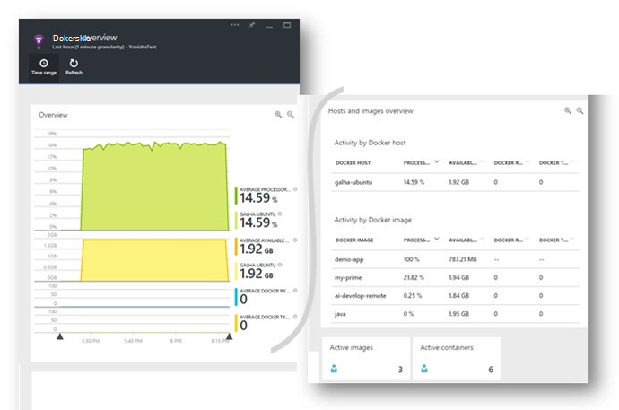
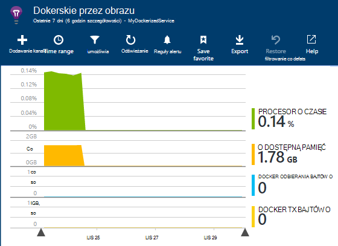

<properties 
    pageTitle="Monitorowanie aplikacji Docker w aplikacji wniosków" 
    description="Docker liczników wydajności, zdarzeń i wyjątki mogą być wyświetlane w aplikacji wniosków, wraz z telemetrycznego z konteneryzowanego aplikacji." 
    services="application-insights" 
    documentationCenter=""
    authors="alancameronwills" 
    manager="douge"/>

<tags 
    ms.service="application-insights" 
    ms.workload="tbd" 
    ms.tgt_pltfrm="ibiza" 
    ms.devlang="na" 
    ms.topic="article" 
    ms.date="12/01/2015" 
    ms.author="awills"/>
 
# <a name="monitor-docker-applications-in-application-insights"></a>Monitorowanie aplikacji Docker w aplikacji wniosków

Cykl życia wydarzeń i liczników wydajności z kontenerów [Docker](https://www.docker.com/) można wykresie na wniosków aplikacji. Zainstaluj obraz [Wniosków aplikacji](app-insights-overview.md) w kontenerze w hosta i wyświetli liczniki wydajności hoście, a także inne obrazy.

Z Docker należy rozpowszechnić Twoje aplikacje w kontenerach najprostsze zawierający wszystkie zależności. Ta osoba jest uruchamiany dla dowolnego komputera-hosta uruchamianej aparat Docker.

Po uruchomieniu [aplikacji wniosków obrazu](https://hub.docker.com/r/microsoft/applicationinsights/) na hoście Docker, otrzymasz następujące korzyści:

* Cykl życia telemetrycznego o wszystkich kontenerów uruchomiony na hoście - uruchomić, zatrzymać i tak dalej.
* Liczniki wydajności dla wszystkich kontenerów. Procesor, pamięć, obciążenie sieci i inne.
* Jeśli [zainstalowano SDK wniosków aplikacji](app-insights-java-live.md) w aplikacji działa w kontenery, wszystkie telemetrycznego tych aplikacji będą mieć dodatkowe właściwości identyfikujące maszyna kontenerów i hosta. Więc na przykład jeśli masz wystąpień aplikacji działa w więcej niż jednego hosta można łatwo będzie do filtrowania z telemetrycznego aplikacji przez hosta.




## <a name="set-up-your-application-insights-resource"></a>Konfigurowanie zasobu wniosków aplikacji

1. Zaloguj się do [Portalu Microsoft Azure](https://azure.com) i otwórz zasób wniosków aplikacji dla aplikacji; lub [Utwórz nowy](app-insights-create-new-resource.md). 

    *Zasobów należy używać?* Jeśli aplikacje, które są uruchomione na hoście zostały opracowane przez inną osobę, następnie musisz [utworzyć nowy zasób wniosków aplikacji](app-insights-create-new-resource.md). Jest to miejsce, w którym wyświetlania i analizowania danych telemetrycznych. (Wybierz "Inne" dla danego typu aplikacji).

    Jednak jeśli Deweloper aplikacji, następnie mamy nadzieję [dodane SDK wniosków aplikacji](app-insights-java-live.md) do każdego z nich. Jeśli są one wszystkie naprawdę składniki aplikacji biznesowej, a następnie można skonfigurować każdy z nich z wysyłką telemetrycznego jeden zasób, a za pomocą tego samego zasobu wyświetlanie danych Docker cykl życia i wydajności. 

    Scenariusz trzecia jest opracowanych najczęściej aplikacje, że korzystają z oddzielnych zasobów, aby wyświetlić ich telemetrycznego. W takim przypadku zostaną prawdopodobnie warto utworzyć zasób osobnych danych Docker. 

2.  Dodawanie kafelka Docker: wybierz pozycję **Dodaj kafelków**, przeciągnij kafelków Docker z galerii i kliknij przycisk **Gotowe**. 

    


3. Kliknij listę rozwijaną **Essentials** i skopiuj klucz oprzyrządowania. Które będą używane określić zestawu SDK, gdzie można wysłać jego telemetrycznego.


    

Pozostaw to okno przeglądarki zawsze pod ręką, jak będzie wrócić do go, aby szybko przeglądać usługi telemetrycznego.


## <a name="run-the-application-insights-monitor-on-your-host"></a>Uruchom monitor wniosków aplikacji na hoście
 
Teraz, gdy masz innym na wyświetlanie telemetrycznego możesz skonfigurować konteneryzowanego aplikację, która będzie zbieranie i wyślij ją.

1.  Podłącz do hosta Docker. 
2.  Edytowanie klucza oprzyrządowania do tego polecenia, a następnie uruchom go:
 
    ```

    docker run -v /var/run/docker.sock:/docker.sock -d microsoft/applicationinsights ikey=000000-1111-2222-3333-444444444
    ```

Tylko jeden obraz wniosków aplikacji jest wymagany na Docker hosta. Jeśli aplikacja zostanie wdrożony na wiele hostów Docker, powtórzyć polecenia na każdym hoście.

## <a name="update-your-app"></a>Aktualizowanie aplikacji

Jeśli aplikacja jest narzędzia przy użyciu [Aplikacji wniosków SDK dla języka Java](app-insights-java-get-started.md), Dodaj następujący wiersz do pliku ApplicationInsights.xml w projekcie, w obszarze `<TelemetryInitializers>` elementu:

```xml

    <Add type="com.microsoft.applicationinsights.extensibility.initializer.docker.DockerContextInitializer"/> 
```

Spowoduje to dodanie Docker informacje, takie jak kontener i identyfikator hosta każdego elementu telemetrycznego wysyłanych z aplikacji.

## <a name="view-your-telemetry"></a>Wyświetlanie swojej telemetrycznego

Wróć do zasobu wniosków aplikacji w portalu Azure.

Kliknij Kafelek Docker.

Wkrótce pojawi się danych przychodzącej z aplikacji Docker, zwłaszcza jeśli masz inne kontenery uruchomionych aparat Docker.


Poniżej przedstawiono kilka widoki, do których masz dostęp.

### <a name="perf-counters-by-host-activity-by-image"></a>Liczników wydajności przez hosta, działania obrazu





Kliknij dowolną nazwę hosta lub obraz, aby uzyskać więcej szczegółów.


Aby dostosować widok, kliknij dowolny wykres, siatki, nagłówek, lub użyj Dodawanie wykresu. 

[Dowiedz się więcej o Eksploratora metryki](app-insights-metrics-explorer.md).

### <a name="docker-container-events"></a>Docker kontenera zdarzenia


Aby zbadać pojedynczych zdarzeń, kliknij przycisk [Wyszukaj](app-insights-diagnostic-search.md). Wyszukiwanie i filtrowanie zdarzenia, które chcesz znaleźć. Kliknij dowolne zdarzenie, aby uzyskać więcej szczegółów.
 
### <a name="exceptions-by-container-name"></a>Wyjątki według nazwy kontenera
 


### <a name="docker-context-added-to-app-telemetry"></a>Kontekst docker dodane do telemetrycznego aplikacji

Żądanie telemetrycznego wysyłane z poziomu aplikacji działają z SDK AI, wzbogaconego w kontekście Docker:


Czas procesora i pamięci liczniki wydajności, wzbogaconego oraz pogrupowane według nazwy kontenera Docker:


## <a name="q--a"></a>Pytania i odpowiedzi

*Co oznacza wniosków aplikacji udzielenia mi, którego nie można uzyskać dostęp z Docker?*

* Szczegółowy podział liczniki wydajności, kontenera i obraz.
* Integracja danych kontener i aplikacji w jednym pulpitu nawigacyjnego.
* [Eksportowanie telemetrycznego](app-insights-export-telemetry.md) dalszej analizy bazy danych, usługi Power BI i innych pulpitu nawigacyjnego.

*Jak uzyskać telemetrycznego z samej aplikacji?*

* Zainstaluj aplikację wniosków SDK w aplikacji. Dowiedz się, jak uzyskać: [Java aplikacji web apps](app-insights-java-get-started.md), [aplikacje sieci web systemu Windows](app-insights-asp-net.md).
