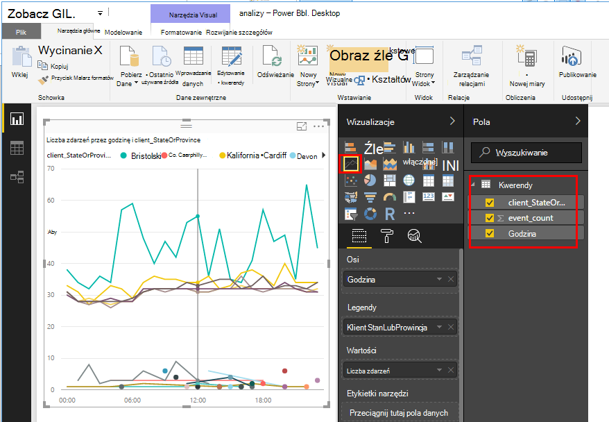

<properties 
    pageTitle="Eksportowanie do usługi Power BI z wniosków aplikacji | Microsoft Azure" 
    description="Analiza kwerendy mogą być wyświetlane w usłudze Power BI." 
    services="application-insights" 
    documentationCenter=""
    authors="noamben" 
    manager="douge"/>

<tags 
    ms.service="application-insights" 
    ms.workload="tbd" 
    ms.tgt_pltfrm="ibiza" 
    ms.devlang="na" 
    ms.topic="article" 
    ms.date="10/18/2016" 
    ms.author="awills"/>

# Kanał informacyjny usługi Power BI wniosków aplikacji

[Power BI](http://www.powerbi.com/) jest zestaw narzędzi do analizy biznesowej, które ułatwiają analizowanie danych oraz udostępnianie opinii. Pulpity nawigacyjne sformatowany są dostępne na wszystkich urządzeniach. Można połączyć dane z wielu źródeł, w tym analizy kwerend [Programu Visual Studio aplikacji wnioski](app-insights-overview.md).

Istnieją trzy metody zalecane eksportowania danych wniosków aplikacji usługi Power BI. Można użyć ich oddzielnie lub razem.

* [**Karta power BI**](#power-pi-adapter) — Konfigurowanie Tworzenie pulpitu nawigacyjnego telemetrycznego z Twojej aplikacji. Ustawianie wykresów jest wstępnie zdefiniowane, ale można dodać własne kwerendy z innych źródeł.
* [**Eksportowanie analizy kwerendy**](#export-analytics-queries) - pisać zapytania przy użyciu analizy i go wyeksportować do usługi Power BI. Kwerendy można umieścić na pulpicie nawigacyjnym oraz innych danych.
* [**Eksportuj stałego i analizy strumieniu**](app-insights-export-stream-analytics.md) — to wymaga więcej pracy, aby skonfigurować. Okazuje się przydatne, jeśli chcesz zachować dane przez dłuższy czas. W przeciwnym razie zaleca się innych metod.

## Power BI karty

Ta metoda tworzy Tworzenie pulpitu nawigacyjnego telemetrycznego. Jest wstępnie zdefiniowanego początkowego zestawu danych, ale można dodać więcej danych do niego.

### Uzyskiwanie karty

1. Zaloguj się do [usługi Power BI](https://app.powerbi.com/).
2. Otwórz **Pobieranie danych** **usług**, **wniosków aplikacji**

    

3. Udostępnianie szczegółowych informacji zasobu wniosków aplikacji.

    

4. Zaczekaj minutę lub dwie danych do zaimportowania.

    

Pulpit nawigacyjny, można edytować połączenie wykresów wniosków aplikacji z działaniami innych źródeł i z kwerendami analizy. Istnieje Galeria wizualizacji, gdzie można uzyskać więcej wykresów i każdego wykresu ma parametry, które można ustawić.

Po wykonaniu początkowej importu pulpitu nawigacyjnego i raporty nadal aktualizowane codziennie. Można kontrolować harmonogram odświeżania w zestawie danych.

## Eksportowanie analizy kwerendy

Tą drogą umożliwia jakiekolwiek zapytania analizy, który chcesz zapisać, a następnie wyeksportować który do pulpitu nawigacyjnego Power BI. (Możesz dodać do pulpitu nawigacyjnego utworzone przez kartę.)

### Jedna godzina: Instalowanie Power BI Desktop

Aby zaimportować kwerendy wniosków aplikacji, należy użyć klasycznej wersji programu Power BI. Ale następnie można opublikować go w sieci Web lub do obszaru roboczego chmury usługi Power BI. 

Zainstaluj [Power BI Desktop](https://powerbi.microsoft.com/en-us/desktop/).

### Eksportowanie kwerenda analizy

1. [Analizy otwieranie i zapisywanie kwerendy](app-insights-analytics-tour.md).
2. Przetestuj i uściślić zapytanie, dopóki nie jest zadowalająca wyniki.
3. W menu **Eksportuj** wybierz pozycję **Power BI (M)**. Zapisz plik tekstowy.

    
4. W Power BI Desktop wybierz pozycję **Pobierz dane, puste zapytanie** , a następnie w edytorze zapytań w obszarze **Widok** wybierz **Zaawansowane edytora zapytań**.

    Wklej wyeksportowanego skryptu języka M w edytorze zapytań zaawansowanych.

    

5. Może być o podanie poświadczeń, aby umożliwić Power BI uzyskać dostęp do Azure. Używanie "konta organizacji" Zaloguj się przy użyciu konta Microsoft.

    

6. Wizualizacja kwerendy i wybierz przycisk pola dla osi x, y i segmentacji wymiaru.

    

7. Publikowanie raportu do obszaru roboczego chmury usługi Power BI. W tym miejscu możesz osadzić zsynchronizowane wersji do innych stron sieci web.

    
 
8. Ręcznie odświeżyć raport w określonych odstępach lub skonfigurować zaplanowane odświeżanie na stronie opcje.

## Dotyczące pobierania

Jeśli aplikacja wysyła wiele danych, funkcja adaptacyjne przy próbkowaniu może działać i Wyślij tylko procent swojego telemetrycznego. Jest to wartość PRAWDA, jeśli ręcznie ustawiono przy próbkowaniu w zestawie SDK lub na spożyciu. [Dowiedz się więcej na temat pobierania.](app-insights-sampling.md)
 

## Następne kroki

* [Power BI — informacje](http://www.powerbi.com/learning/)
* [Samouczek analizy](app-insights-analytics-tour.md)
