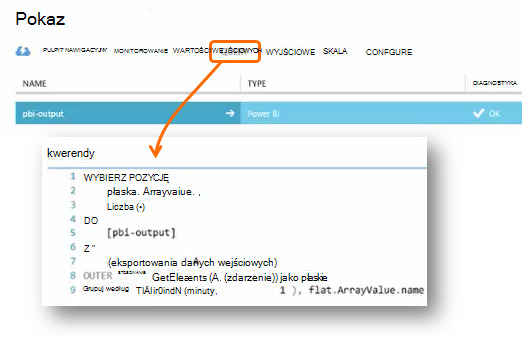

<properties 
    pageTitle="Przetwarzanie danych wyeksportowanego z aplikacji wniosków za pomocą analizy strumieniu | Microsoft Azure" 
    description="Analizy strumieniu stale można przekształcić, filtrowania i kierowanie dane, które są eksportowane z wniosków aplikacji." 
    services="application-insights" 
    documentationCenter=""
    authors="noamben" 
    manager="douge"/>

<tags 
    ms.service="application-insights" 
    ms.workload="tbd" 
    ms.tgt_pltfrm="ibiza" 
    ms.devlang="na" 
    ms.topic="article" 
    ms.date="10/18/2016" 
    ms.author="awills"/>

# <a name="use-stream-analytics-to-process-exported-data-from-application-insights"></a>Za pomocą analizy strumieniu przetwarzania wyeksportowane dane z wniosków aplikacji

[Analizy strumieniu Azure](https://azure.microsoft.com/services/stream-analytics/) to idealne narzędzie do przetwarzania danych [wyeksportowanego z aplikacji wnioski](app-insights-export-telemetry.md). Analizy strumieniu mogą pobierać dane z różnych źródeł. Go Przekształcanie i filtrować dane, a jest rozsyłana do różnych pochłaniacze.

W tym przykładzie utworzymy karty, które pobiera dane z aplikacji wniosków, zmienia nazwę, przetwarza niektórych pól i przewody go do usługi Power BI.

> [AZURE.WARNING] Istnieje wiele lepiej i łatwiej [zalecane sposoby ich wyświetlania danych wniosków aplikacji w usłudze Power BI](app-insights-export-power-bi.md). Ścieżka przedstawione w tym miejscu jest po prostu przykład ilustrujący sposób przetwarzania wyeksportowane dane.


## <a name="create-storage-in-azure"></a>Tworzenie magazynu platformy Azure

Ciągły eksportu zawsze wyświetla dane konto Azure miejsca do magazynowania, musisz najpierw utworzyć magazyn.

1.  Utwórz konto "klasycznego" miejsca do magazynowania w ramach subskrypcji w [portalu Azure](https://portal.azure.com).

    

2. Tworzenie kontenera

    

3. Skopiuj kod dostępu miejsca do magazynowania

    Musisz go, aby szybko skonfigurować dane wejściowe usługę analizy strumieniu.

    

## <a name="start-continuous-export-to-azure-storage"></a>Rozpocznij ciągły eksportowanie do magazynu platformy Azure

[Eksportowanie ciągły](app-insights-export-telemetry.md) przeniesienie danych z aplikacji spostrzeżeń Azure miejsca do magazynowania.

1. W portalu Azure przejdź do zasobu wniosków aplikacji utworzonej aplikacji.

    

2. Tworzenie ciągły eksportu.

    


    Wybierz wcześniej utworzone konto miejsca do magazynowania:

    
    
    Ustawianie typów zdarzeń, które mają być wyświetlane:

    

3. Poinformuj części zebrać danych. Usiąść i umożliwić użytkownikom za pomocą aplikacji dla trochę czasu. Telemetrycznego rozpocznie się, a zobaczysz pozycję wykresy statystyczne w [Eksploratorze metryczne](app-insights-metrics-explorer.md) i zdarzeń z [diagnostyki wyszukiwania](app-insights-diagnostic-search.md). 

    A także dane zostaną eksportowanie do magazynu. 

4. Sprawdź, czy wyeksportowane dane. W programie Visual Studio, wybierz pozycję **Wyświetlanie / chmury Eksploratora**i otwórz Azure / miejsca do magazynowania. (Jeśli nie masz tej opcji menu, należy zainstalować Azure SDK: Otwórz okno dialogowe Nowy projekt i otwórz Visual C# / chmury / pobieranie programu Microsoft Azure SDK dla środowiska .NET.)

    

    Zanotuj części wspólnej nazwy ścieżkę, która pochodzi z nazwy i oprzyrządowania klawisz aplikacji. 

Zdarzenia są zapisywane w blob pliki w formacie JSON. Każdy plik może zawierać jedno lub więcej zdarzeń. Dlatego chcemy odczytuje dane zdarzenie i filtrować pola, które będą. Dostępne są wszystkie typy firma Microsoft może wykonać z danymi, ale nasz plan dzisiaj jest za pomocą analizy strumieniu potoku danych usługi Power BI.

## <a name="create-an-azure-stream-analytics-instance"></a>Tworzenie wystąpieniem analizy strumieniu Azure

Wybierz usługę Azure analizy strumieniu z [Klasyczny Portal Azure](https://manage.windowsazure.com/)i utworzyć nowe zadanie analizy strumieniu:


Po utworzeniu nowego zadania rozwinąć jego szczegóły:


### <a name="set-blob-location"></a>Ustawianie lokalizacji obiektów blob

Ustaw go, aby pobrać dane wejściowe z obiektów blob z ciągłym Eksportuj:


Teraz musisz klucz podstawowy dostęp z konta miejsca do magazynowania, w której wspomniano wcześniej. Ustaw ten jako klucz konta miejsca do magazynowania.


### <a name="set-path-prefix-pattern"></a>Ustawianie ścieżka prefiks wzorzec 


**Pamiętaj ustawić Format daty YYYY-MM-DD (z kreski).**

Ścieżka prefiks wzorzec Określa miejsce, w którym analizy strumieniu znajduje pliki wejściowe w magazynie. Należy ustawić odpowiadają w sposób ciągły eksportowanie są przechowywane dane. Ustaw ją w następujący sposób:

    webapplication27_12345678123412341234123456789abcdef0/PageViews/{date}/{time}

W tym przykładzie:

* `webapplication27`to nazwa zasobu wniosków aplikacji **Wszystkie małe litery**.
* `1234...`jest kluczem oprzyrządowania zasobu wniosków aplikacji, **z pominięciem kreski**. 
* `PageViews`jest to typ danych, które chcesz przeanalizować. Dostępne typy zależą od ustawionych w ciągły Eksportowanie filtru. Sprawdź eksportowanych danych, aby wyświetlić inne dostępne typy i zobacz [Eksportowanie modelu danych](app-insights-export-data-model.md).
* `/{date}/{time}`deseń jest zapisywany dosłownie.

> [AZURE.NOTE] Inspekcja magazynu, który ma upewnij się, że ścieżka uzyskać prawo.

### <a name="finish-initial-setup"></a>Zakończenie początkowej konfiguracji

Potwierdzenie formatowania szeregowania:


Zamknij kreatora i poczekaj, aby zakończyć instalację.

> [AZURE.TIP] Aby pobrać dane za pomocą polecenia próbki. Pozostaw je jako test próbki debugowania zapytania.

## <a name="set-the-output"></a>Ustawianie wynik

Teraz zaznacz zadanie i Ustaw dane wyjściowe.


Podaj swojego **konta służbowe** Aby autoryzować analizy strumieniu dostępu do zasobu usługi Power BI. Następnie magazynowa nazwę dane wyjściowe, a dla zestawu danych usługi Power BI docelowej i tabeli.


## <a name="set-the-query"></a>Ustawianie kwerendy

Kwerenda decyduje tłumaczenia z wejścia w celu wyprowadzenia.




Aby sprawdzić, czy zostanie wyświetlony wynik prawym, należy użyć funkcji Test. Nadaj dane przykładowe zajęła ze strony danych wejściowych. 

### <a name="query-to-display-counts-of-events"></a>Aby wyświetlić liczby wydarzeń

Wklej tę kwerendę:

```SQL

    SELECT
      flat.ArrayValue.name,
      count(*)
    INTO
      [pbi-output]
    FROM
      [export-input] A
    OUTER APPLY GetElements(A.[event]) as flat
    GROUP BY TumblingWindow(minute, 1), flat.ArrayValue.name
```

* Eksportowanie wprowadzania jest alias, który firma Microsoft przekazała strumieniu wprowadzania
* dane wyjściowe pbi są wyjściowy alias, możemy zdefiniowanych przez
* Używamy [Zewnętrzne GetElements stosowanie](https://msdn.microsoft.com/library/azure/dn706229.aspx) , ponieważ nazwa zdarzenie jest zagnieżdżone arrray JSON. Następnie wybierz wybiera nazwę zdarzenia, wraz z liczbą liczbę wystąpień o tej nazwie w danym okresie. Klauzula [Group By](https://msdn.microsoft.com/library/azure/dn835023.aspx) grup elementów na okresy 1 minuty.


### <a name="query-to-display-metric-values"></a>Kwerendy w celu wyświetlenia wartości metryki


```SQL

    SELECT
      A.context.data.eventtime,
      avg(CASE WHEN flat.arrayvalue.myMetric.value IS NULL THEN 0 ELSE  flat.arrayvalue.myMetric.value END) as myValue
    INTO
      [pbi-output]
    FROM
      [export-input] A
    OUTER APPLY GetElements(A.context.custom.metrics) as flat
    GROUP BY TumblingWindow(minute, 1), A.context.data.eventtime

``` 

* To zapytanie alarmy próbne do telemetrycznego metryki godziny zdarzenia i wartość metryki. Wartości metryki znajdują się wewnątrz tablicy, więc firma Microsoft korzysta z wzorcem zewnętrzne GetElements stosowanie wyodrębniać wiersze. "myMetric" to nazwa metryki w tym przypadku. 

### <a name="query-to-include-values-of-dimension-properties"></a>Zapytania, aby uwzględnić wartości właściwości wymiaru

```SQL

    WITH flat AS (
    SELECT
      MySource.context.data.eventTime as eventTime,
      InstanceId = MyDimension.ArrayValue.InstanceId.value,
      BusinessUnitId = MyDimension.ArrayValue.BusinessUnitId.value
    FROM MySource
    OUTER APPLY GetArrayElements(MySource.context.custom.dimensions) MyDimension
    )
    SELECT
     eventTime,
     InstanceId,
     BusinessUnitId
    INTO AIOutput
    FROM flat

```

* Ta kwerenda zawiera wartości właściwości wymiaru bez w zależności od określonego wymiaru w stałej indeksu w tablicy wymiaru.

## <a name="run-the-job"></a>Uruchamianie zadania

Możesz wybrać daty w przeszłości, aby uruchomić zadanie z. 


Poczekaj, aż zadanie jest uruchomione.

## <a name="see-results-in-power-bi"></a>Wyniki w usłudze Power BI

> [AZURE.WARNING] Istnieje wiele lepiej i łatwiej [zalecane sposoby ich wyświetlania danych wniosków aplikacji w usłudze Power BI](app-insights-export-power-bi.md). Ścieżka przedstawione w tym miejscu jest po prostu przykład ilustrujący sposób przetwarzania wyeksportowane dane.

Otwórz Power BI pracy lub szkolne konto, a następnie wybierz zestaw danych i tabeli, określony jako wynik zadania analizy strumieniu.


Teraz można użyć tego zestawu danych w raportach i pulpitów nawigacyjnych w [Usłudze Power BI](https://powerbi.microsoft.com).


## <a name="no-data"></a>Brak danych?

* Sprawdź, że [Ustawianie formatu daty](#set-path-prefix-pattern) poprawnie YYYY-MM-DD (z kreski).


## <a name="video"></a>Klip wideo

Zeev Jan Noam przedstawiono sposób przetwarzania eksportowanych danych za pomocą analizy strumieniu.

> [AZURE.VIDEO export-to-power-bi-from-application-insights]

## <a name="next-steps"></a>Następne kroki

* [Eksportowanie ciągły](app-insights-export-telemetry.md)
* [Szczegółowe dane modelu odwołanie do wartości i typy właściwości.](app-insights-export-data-model.md)
* [Wnioski aplikacji](app-insights-overview.md)
* [Więcej przykładów i instruktaży](app-insights-code-samples.md)
 
