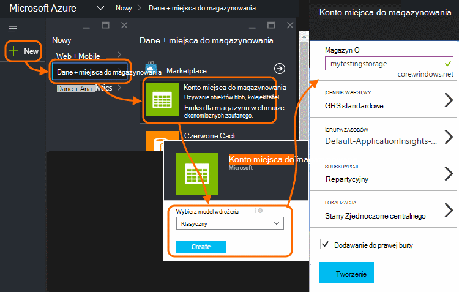
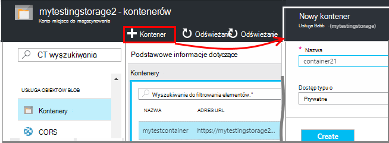
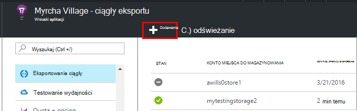
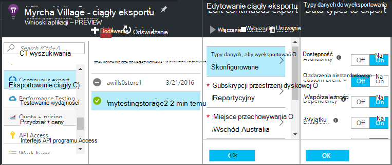
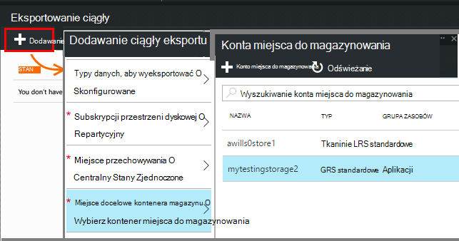
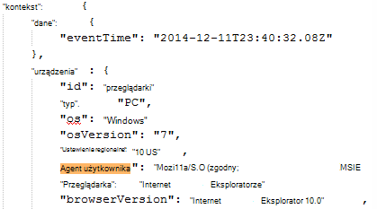
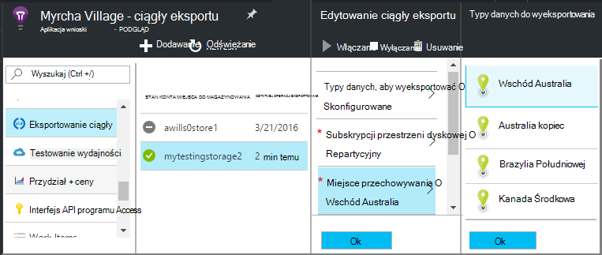

<properties 
    pageTitle="Ciągły eksportu telemetrycznego z wniosków aplikacji | Microsoft Azure" 
    description="Eksportowanie danych diagnostyczne i zastosowania do magazynu platformy Microsoft Azure, a następnie pobierz go stamtąd." 
    services="application-insights" 
    documentationCenter=""
    authors="alancameronwills" 
    manager="douge"/>

<tags 
    ms.service="application-insights" 
    ms.workload="tbd" 
    ms.tgt_pltfrm="ibiza" 
    ms.devlang="na" 
    ms.topic="article" 
    ms.date="10/18/2016" 
    ms.author="awills"/>
 
# Eksportowanie danych telemetrycznych z wniosków aplikacji

Chcesz zachować usługi telemetrycznego przez okres dłuższy niż okres przechowywania standardowe? Lub przetwarzać dane w inny sposób specjalistyczne? Eksportowanie ciągły to idealne rozwiązanie w tym. Zdarzenia, które są widoczne w portalu wniosków aplikacji można eksportować do magazynu platformy Microsoft Azure w formacie JSON. Stamtąd możesz pobrać dane i pisanie niezależnie od kodu możesz trzeba go procesu.  

Ciągły eksportu jest dostępna w bezpłatny okres próbny i na [Standard i Premium ceny planów](https://azure.microsoft.com/pricing/details/application-insights/).

Przed skonfigurowaniem ciągły eksportu są niektóre rozwiązania alternatywne, które warto rozważyć:

* [Przycisk Eksportuj](app-insights-metrics-explorer.md#export-to-excel) w górnej części karta metryki lub wyszukiwania umożliwia przełączanie tabele i wykresy do arkusza kalkulacyjnego programu Excel. 
* [Analizy](app-insights-analytics.md) przewiduje telemetrycznego języka kwerend zaawansowane, a także wyniki można wyeksportować.
* Jeśli szukasz [Eksplorowanie danych w usłudze Power BI](http://blogs.msdn.com/b/powerbi/archive/2015/11/04/explore-your-application-insights-data-with-power-bi.aspx), jest to bez użycia eksportowanie ciągły.

## Tworzenie konta miejsca do magazynowania

Jeśli nie masz jeszcze konta "klasycznego" przestrzeni dyskowej, utworzyć teraz.

1. Utwórz konto miejsca do magazynowania w ramach subskrypcji w [portalu Azure](https://portal.azure.com).

    

2. Tworzenie kontenera.

    

## Konfigurowanie eksportowanie ciągły

W aplikacji karta Przegląd w portalu wniosków aplikacji otwórz eksportowanie ciągły: 

Dodaj ciągły eksportu i wybierz typy zdarzeń, które chcesz wyeksportować.

Wybierz lub Utwórz [konto Azure miejsca do magazynowania](../storage/storage-introduction.md) , miejsce, w którym mają być przechowywane dane:

Po utworzeniu eksportowanie rozpoczyna się rozpoczęcie. (Tylko dane możesz pobrać otrzymywanej po utworzeniu eksportowania.) 

Mogą występować opóźnienia o godzinę przed dane są wyświetlane w obiekcie blob.

Jeśli chcesz zmienić typy zdarzeń później, po prostu edytować eksportowania:

Aby zakończyć strumień, kliknij przycisk Wyłącz. Gdy ponownie kliknij Włącz strumienia uruchomi się ponownie z nowymi danymi. Nie możesz uzyskać dane, które otrzymano w portalu podczas eksportowania została wyłączona.

Aby zakończyć strumień trwale, Usuń Eksportuj. Ten sposób nie powoduje usunięcia danych z magazynu.

#### Nie można dodać lub zmienić eksportu?

* Aby dodać lub zmienić Eksport, potrzebne uprawnienia właściciela, współautorów lub współautora wniosków aplikacji. [Więcej informacji o rolach][roles].

## Jakie zdarzenia uzyskać?

Wyeksportowane dane jest telemetrycznego nieprzetworzonych, otrzymają z poziomu aplikacji, ale dodajemy danych lokalizacji, której możemy obliczyć z adresu IP klienta. 

Dane, które zostały odrzucone przez [Pobieranie próbek](app-insights-sampling.md) jest niedostępna w wyeksportowane dane.

Inne wskaźniki obliczeniowe nie są uwzględniane. Na przykład firma Microsoft nie eksportować średnia wykorzystania Procesora, ale możemy eksportowanie telemetrycznego nieprzetworzonych, z której jest obliczana średnia.

Dane zawierają również wyniki wszystkie niezbędne [testy web dostępność](app-insights-monitor-web-app-availability.md) skonfigurowano. 

> [AZURE.NOTE] **Próbki.** Jeśli aplikacja wysyła wiele danych i korzystania z SDK wniosków aplikacji dla programu ASP.NET wersji 2.0.0-beta3 lub nowszym, funkcja adaptacyjne przy próbkowaniu może działać i Wyślij tylko procent swojego telemetrycznego. [Dowiedz się więcej na temat pobierania.](app-insights-sampling.md)

## Sprawdzanie danych

Można sprawdzić magazynowania bezpośrednio w portalu. Kliknij przycisk **Przeglądaj**, wybierz swoje konto miejsca do magazynowania, a następnie otwórz **kontenerów**.

Aby sprawdzić Azure miejsca do magazynowania w programie Visual Studio, otwórz **Widok** **Eksploratora chmury**. (Jeśli nie masz tego polecenia menu, należy zainstalować Azure SDK: Otwórz okno dialogowe **Nowy projekt** , a następnie rozwiń Visual C# / w chmurze i wybierz pozycję **Pobierz Microsoft Azure SDK dla środowiska .NET**.)

Po otwarciu usługi Magazyn obiektów blob pojawi się kontenera z zestawu obiektów blob plików. Identyfikator URI każdego pliku, określana na podstawie nazwy zasobów wniosków aplikacji, jego kluczy oprzyrządowania telemetrycznego — typ i Data/Godzina. (Nazwa zasobu jest pisany wyłącznie małymi literami, a klawisz oprzyrządowania pomija kreski).

Data i godzina są UTC i gdy telemetrycznego został złożony w magazynie — nie czas, który został wygenerowany. Dlatego jeśli piszesz kodu do pobierania danych, jego można przesuwać liniowo danych.

Oto formularza ścieżki:

    $"{applicationName}_{instrumentationKey}/{type}/{blobDeliveryTimeUtc:yyyy-MM-dd}/{ blobDeliveryTimeUtc:HH}/{blobId}_{blobCreationTimeUtc:yyyyMMdd_HHmmss}.blob"
  
Gdzie 

-   `blobCreationTimeUtc`jest godzina utworzenia blob wewnętrznego tymczasowej miejsca do magazynowania
-   `blobDeliveryTimeUtc`raz, kiedy obiektów blob jest kopiowana do magazynu docelowego eksportu

## Format danych

* Każdy obiektów blob jest plik tekstowy, który zawiera wiele "\n'-separated wierszy. Zawiera on telemetrycznego przetwarzania w czasie około pół minuty.
* Każdy wiersz reprezentuje telemetrycznego punkt danych, takich jak żądania lub na stronie widoku.
* Każdy wiersz jest sformatowany dokument JSON. Jeśli znajdują się i stare go, otwórz go w programie Visual Studio i wybierz pozycję Edytuj, zaawansowane, plik w formacie:

Czas trwania znajdują się w znaczniki osi, w którym znaczniki 10 000 = 1 MS. Na przykład tych wartości Pokaż czas 1 MS, aby wysłać żądanie z poziomu przeglądarki 3ms uzyskanie go i 1.8s do przetwarzania strony w przeglądarce:

    "sendRequest": {"value": 10000.0},
    "receiveRequest": {"value": 30000.0},
    "clientProcess": {"value": 17970000.0}

[Szczegółowe dane modelu odwołanie do wartości i typy właściwości.](app-insights-export-data-model.md)

## Przetwarzanie danych

Na małą skalę można napisać kodu pobierają dane, przeczytaj ją do arkusza kalkulacyjnego i tak dalej. Na przykład:

    private IEnumerable<T> DeserializeMany<T>(string folderName)
    {
      var files = Directory.EnumerateFiles(folderName, "*.blob", SearchOption.AllDirectories);
      foreach (var file in files)
      {
         using (var fileReader = File.OpenText(file))
         {
            string fileContent = fileReader.ReadToEnd();
            IEnumerable<string> entities = fileContent.Split('\n').Where(s => !string.IsNullOrWhiteSpace(s));
            foreach (var entity in entities)
            {
                yield return JsonConvert.DeserializeObject<T>(entity);
            }
         }
      }
    }

Uzyskać większy próbki kodu, zobacz [Korzystanie z roli Pracownik][exportasa].

## Usuwanie starych danych
Pamiętaj, że jesteś odpowiedzialne za zarządzanie możliwości przechowywania i usuwania starych danych, w razie potrzeby. 

## Jeśli wygenerować klucz miejsca do magazynowania...

Jeśli zmienisz klucz na Twoim magazynie ciągły eksportu przestaną działać. Pojawi się powiadomienie na koncie Azure. 

Karta ciągły eksportowanie otwieranie i edytowanie eksportowanie. Edytowanie docelowym eksportu, ale tylko pozostawić tego samego magazynu zaznaczone. Kliknij przycisk OK, aby potwierdzić.

Eksportowanie ciągły uruchomi się ponownie.

## Eksportowanie próbki

* [Eksportowanie do SQL za pomocą roli pracownika][exportcode]
* [Eksportowanie do SQL za pomocą analizy strumieniu][exportasa]
* [Przykładowe analizy strumieniu 2](app-insights-export-stream-analytics.md)

W większej skali należy rozważyć, czy [usługi HDInsight](https://azure.microsoft.com/services/hdinsight/) - klastrów Hadoop w chmurze. Usługa HDInsight zawiera różnych technologii w celu zarządzania i analizowanie danych duży.

## Pytania i odpowiedzi

* *Ale wszystko, co ma to jednorazowego pobrania wykresu.*  
 
    Tak, możesz skorzystać. W górnej części karta kliknij polecenie [Eksportuj dane](app-insights-metrics-explorer.md#export-to-excel).

* *Skonfigurować eksportu, ale nie ma żadnych danych w magazynie my.*

    Wnioski aplikacji dotarła telemetrycznego dowolnego z Twojej aplikacji ponieważ ustawić eksport? Tylko otrzymasz nowe dane.

* *Próba Konfigurowanie eksportu, ale odmowa dostępu*

    Jeśli konto jest własnością Twojej organizacji, musisz być członkiem grupy Właściciele lub współautorów.

* *Można wyeksportować bezpośrednio do sklep lokalnego?* 

    Nie, bardzo nam przykro. Nasze mechanizm eksportu obecnie działa tylko z Azure miejsca do magazynowania w tej chwili.  

* *Czy istnieje wszelkie ograniczenia ilości danych, które umieszczasz w magazynie my?* 

    Wartość nie. Firma Microsoft będzie zachować przekazywanie danych dopóki nie zostaną usunięte Eksportuj. Firma Microsoft będzie Zatrzymaj, jeśli firma Microsoft odwołań zewnętrznych limity dotyczące magazyn obiektów blob, ale jest to bardzo duży. Jest kontrolowania ilości miejsca do magazynowania używasz.  

* *Ile blob zobacz w magazynie*

 * Dla każdego typu danych wybrane do wyeksportowania nowych obiektów blob jest tworzony co minutę (Jeśli dane są dostępne). 
 * Ponadto w przypadku aplikacji z duży ruch partition dodatkowe jednostki są przydzielane. W tym przypadku każdej jednostki tworzy obiektów blob co minutę.

* *Mam generowane klucz, aby Moje miejsce do magazynowania lub zmieniona nazwa kontenera, a teraz nie działa Eksportuj.*

    Edytowanie eksportowania i otwórz karta docelowym eksportu. Pozostaw tego samego magazynu, jak wcześniej zaznaczone, a następnie kliknij przycisk OK, aby potwierdzić. Eksportowanie uruchomi się ponownie. Jeśli zmiany w ciągu ostatnich kilku dni, nie utracić danych.

* *Czy można wstrzymać eksportowania?*

    Wartość Tak. Kliknij przycisk Wyłącz.

## Przykłady kodu

* [Analizy wyeksportowane JSON przy użyciu roli pracownika][exportcode]
* [Przykładowe analizy strumieniu](app-insights-export-stream-analytics.md)
* [Eksportowanie do SQL za pomocą analizy strumieniu][exportasa]

* [Szczegółowe dane modelu odwołanie do wartości i typy właściwości.](app-insights-export-data-model.md)

<!--Link references-->

[exportcode]: app-insights-code-sample-export-telemetry-sql-database.md
[exportasa]: app-insights-code-sample-export-sql-stream-analytics.md
[roles]: app-insights-resources-roles-access-control.md

 
