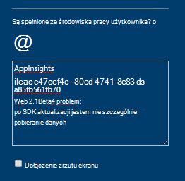
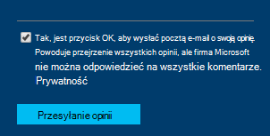

<properties 
    pageTitle="Jak uzyskać pomoc techniczną od zespołu opracowywania aplikacji wniosków | Microsoft Azure" 
    description="Jeśli masz wielkość liter, która wymaga specjalnych pomocy technicznej z zespołu opracowującego wniosków aplikacji jest jak można przesłać szczegóły, aby uzyskać pomoc." 
    services="application-insights" 
    documentationCenter=""
    authors="alexbulankou" 
    manager="douge"/>
 
<tags 
    ms.service="application-insights" 
    ms.workload="tbd" 
    ms.tgt_pltfrm="ibiza" 
    ms.devlang="na" 
    ms.topic="article" 
    ms.date="06/01/2016" 
    ms.author="albulank"/>
    
# <a name="how-to-get-technical-support-from-application-insights-development-team"></a>Jak uzyskać pomoc techniczną od zespołu opracowującego wniosków aplikacji
    
Jeśli masz problem techniczny z [Programu Visual Studio aplikacji wniosków](app-insights-overview.md), dostępne są następujące opcje uzyskania pomocy:

## <a name="1-check-the-documents"></a>1. sprawdza dokumenty

* Brak danych? Sprawdzanie: [próbki](app-insights-sampling.md) [przydziałów ograniczania](app-insights-pricing.md).
* Rozwiązywanie problemów: [ASP.NET](app-insights-troubleshoot-faq.md) | [języka Java](app-insights-java-troubleshoot.md)

## <a name="2-search-the-forums"></a>2. fora wyszukiwania

* [Forum w witrynie MSDN](https://social.msdn.microsoft.com/Forums/vstudio/home?forum=ApplicationInsights)
* [Zdarzeń StackOverflow](http://stackoverflow.com/questions/tagged/ms-application-insights)

## <a name="3-azure-support-plan"></a>3. Plan azure pomocy technicznej?

Istnieją sytuacje, w którym chcesz deweloperów, którzy chcą przypadku. 

Jeśli masz [plan z platformy Microsoft Azure obsługuje](https://azure.microsoft.com/support/plans/) możesz [otworzyć bilet pomocy technicznej](https://portal.azure.com/?#blade/Microsoft_Azure_Support/HelpAndSupportBlade).

## <a name="4-contact-the-application-insights-team"></a>4. Skontaktuj się z zespołem wniosków aplikacji

Jeśli nie masz plan pomocy technicznej, działu rozwoju jest powinno klientom najlepsze Obsługa nakładu wniosków aplikacji jak możemy przygotować punktu kontrolnego ogólnodostępną. Firma Microsoft jest wprowadzenie do **nowych opcji pomocy technicznej**: można opis sprawy z nami za przesyłanie formularza opinii na Azure portal i Deweloper na liście kontaktów zespołu wniosków aplikacji Wstecz w celu rozwiązania problemu.


1. W [portalu wniosków aplikacji](https://portal.azure.com)kliknij uśmiechniętą buźkę w prawym górnym rogu:  

       

2. W polu Komentarz upewnij się określić **AppInsights** w pierwszym wierszu, a następnie zawiera następujące informacje:   

    ```

    AppInsights   
    ikey: <instrumentation key>   
    sdk: <SDK that you are using, including name and version>  
    issue: <please describe the problem you are having>

    ```   

       

3. Sprawdź, "Tak, jest ok, aby wysłać pocztą e-mail, możesz". 

      

Odtwarzania w zespole wniosków aplikacji będzie się możesz szybko. Jak możemy są udostępniane tej usługi na konkretnej sytuacji, nie formalne Umowa dotycząca poziomu usług mogą być podawane w tym momencie.


