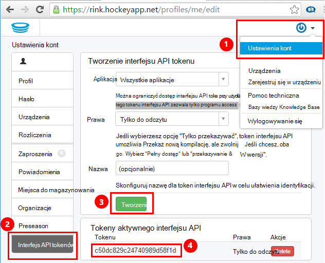
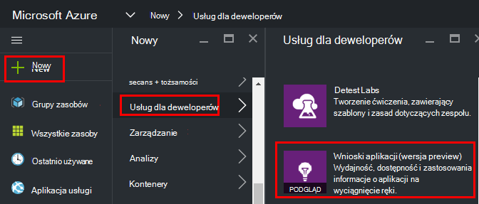
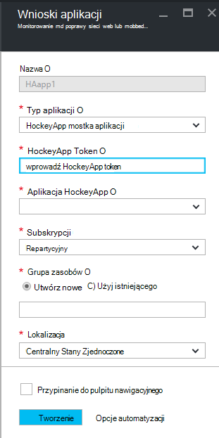
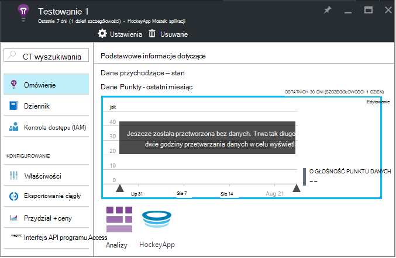
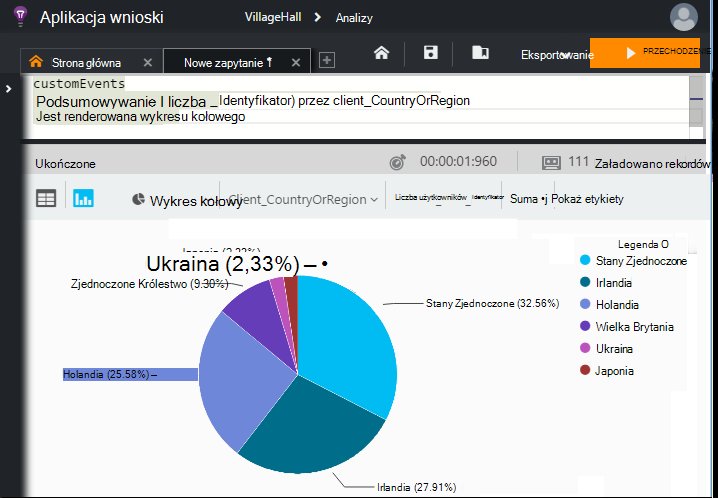

<properties 
    pageTitle="Eksplorowanie danych HockeyApp w aplikacji wniosków | Microsoft Azure" 
    description="Analizowanie użycie i wydajność Azure aplikacji przy użyciu aplikacji wnioski." 
    services="application-insights" 
    documentationCenter="windows"
    authors="alancameronwills" 
    manager="douge"/>

<tags 
    ms.service="application-insights" 
    ms.workload="tbd" 
    ms.tgt_pltfrm="ibiza" 
    ms.devlang="na" 
    ms.topic="article" 
    ms.date="08/25/2016" 
    ms.author="awills"/>

#  Eksplorowanie danych HockeyApp w aplikacji wniosków

[HockeyApp](https://azure.microsoft.com/services/hockeyapp/) jest zalecane platformą monitorowania live aplikacji komputerowych i przenośnych. Z HockeyApp można wysyłać niestandardowych i śledzenia telemetrycznego monitorowanie użycia i pomoc w zakresie diagnostyki (oprócz wprowadzenie danych awarii). Ten strumień telemetrycznego można wyszukiwać za pomocą zaawansowanych funkcji [analizy](app-insights-analytics.md) programu [Visual Studio aplikacji wnioski](app-insights-overview.md). Ponadto można [wyeksportować niestandardowe i śledzenia telemetrycznego](app-insights-export-telemetry.md). Aby włączyć te funkcje, możesz skonfigurować mostka przekazuje dane HockeyApp wniosków aplikacji.

## Aplikacja HockeyApp mostka

Aplikacja mostka HockeyApp jest podstawową funkcję, która umożliwia dostęp do danych HockeyApp w aplikacji wniosków w analizy i eksportowanie ciągły funkcje. Wszystkie dane zebrane przez HockeyApp po utworzeniu aplikacji mostka HockeyApp będą dostępne z tych funkcji. Zobaczmy, jak skonfigurować jednej z tych aplikacji mostka.

W HockeyApp Otwórz ustawienia kont, [Tokeny interfejsu API](https://rink.hockeyapp.net/manage/auth_tokens). Utwórz nowy token albo użyć ponownie istniejącego wzornika. Prawa minimalne wymagane są "tylko do odczytu". Wykonaj kopię API token.

Otwórz portal Microsoft Azure i [utworzyć zasób wniosków aplikacji](app-insights-create-new-resource.md). Ustaw typ aplikacji "HockeyApp mostka aplikacji":

Nie należy ustawić nazwę — spowoduje to automatyczne ustawienie od nazwy HockeyApp.

Pola mostka HockeyApp są wyświetlane. 

Wprowadź token HockeyApp, których wspomniano wcześniej. Ta akcja wypełnia menu rozwijanego "HockeyApp aplikacji" z aplikacjami HockeyApp. Wybierz ten, którego chcesz użyć, a następnie wykonaj pozostałe pola. 

Otwieranie nowego zasobu. 

Należy zauważyć, że dane zajmie trochę czasu zacząć ułożony.

To wszystko! Wszystkie dane zebrane w aplikacji narzędzia HockeyApp od tego momentu teraz jest również dostępne w programie funkcje analizy i eksportowanie ciągły wniosków aplikacji.

Krótko Przeanalizujmy każdy z tych funkcji, które są obecnie dostępne.

## Analizy

Analiza jest użyteczny ad hoc kwerend danych, co umożliwia diagnozowanie i analizowania usługi telemetrycznego i szybko odkryć przyczyn i desenie.

* [Dowiedz się więcej na temat analizy](app-insights-analytics-tour.md)
* [Wprowadzenie wideo](https://channel9.msdn.com/events/Build/2016/T666)
* [Zaawansowane pojęcia wideo](https://channel9.msdn.com/Events/Build/2016/P591)

## Eksportowanie ciągły

Eksportowanie ciągły umożliwia eksportowanie danych do kontenera magazyn obiektów Blob platformy Azure. To jest bardzo przydatne, jeśli chcesz zachować dane przez okres dłuższy niż okres przechowywania obecnie oferowanych przez wniosków aplikacji. Możesz zachować dane w magazynie obiektów blob, procesu go do bazy danych SQL lub danych preferowanej składu rozwiązanie.

[Dowiedz się więcej o ciągły eksportowanie](app-insights-export-telemetry.md)

## Następne kroki

* [Zastosować analizy danych](app-insights-analytics-tour.md)

