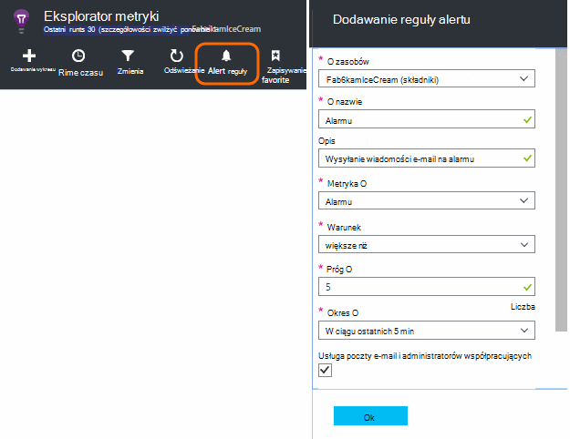
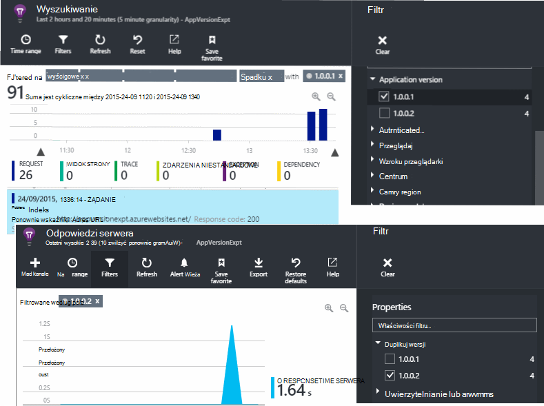

<properties 
    pageTitle="Jak mogę... w aplikacji wniosków | Microsoft Azure" 
    description="Często zadawane pytania w aplikacji wnioski." 
    services="application-insights" 
    documentationCenter=""
    authors="alancameronwills" 
    manager="douge"/>

<tags 
    ms.service="application-insights" 
    ms.workload="tbd" 
    ms.tgt_pltfrm="ibiza" 
    ms.devlang="na" 
    ms.topic="article" 
    ms.date="02/05/2016" 
    ms.author="awills"/>

# <a name="how-do-i--in-application-insights"></a>Jak mogę... w wniosków aplikacji?

## <a name="get-an-email-when-"></a>Otrzymasz wiadomość e-mail, gdy...

### <a name="email-if-my-site-goes-down"></a>Poczty e-mail, jeśli Moja witryna przejście w dół

Ustawianie [sprawdzić dostępność w sieci web](app-insights-monitor-web-app-availability.md).

### <a name="email-if-my-site-is-overloaded"></a>Poczty e-mail, jeśli nadmiernie Moja witryna

Ustawianie [alertu](app-insights-alerts.md) na **czas odpowiedzi serwera**. Próg od 1 do 2 sekund powinna działać.


Aplikacji może również wyświetlać znaki obciążenie zwracanie kody błędu. Ustawianie alertu dotyczącego **zapytań nie powiodło się**.

Jeśli chcesz ustawić alert na **Wyjątki serwera**, może być konieczne wykonaj [pewne dodatkowe ustawienia](app-insights-asp-net-exceptions.md) , aby można było wyświetlić dane.

### <a name="email-on-exceptions"></a>Wyślij wiadomość e-mail na wyjątki

1. [Konfigurowanie monitorowania wyjątku](app-insights-asp-net-exceptions.md)
2. [Ustawianie alertu](app-insights-alerts.md) metryki Statystyka wyjątku


### <a name="email-on-an-event-in-my-app"></a>Wyślij wiadomość e-mail na zdarzenia w aplikacji

Załóżmy, że chcesz otrzymać wiadomość e-mail po wystąpieniu zdarzenia. Wnioski aplikacji nie obsługuje tej funkcji bezpośrednio, ale może [powiadomić gdy metryki przecina progu](app-insights-alerts.md). 

Alerty można ustawić na [niestandardowej metryki](app-insights-api-custom-events-metrics.md#track-metric)jednak zdarzenia nie niestandardowe. Pisanie kodu Aby zwiększyć metryki po wystąpieniu zdarzenia:

    telemetry.TrackMetric("Alarm", 10);

lub:

    var measurements = new Dictionary<string,double>();
    measurements ["Alarm"] = 10;
    telemetry.TrackEvent("status", null, measurements);

Ponieważ alerty mają dwa stany, należy wysyłać niskiej wartości, gdy można uznać w alercie zakończone:

    telemetry.TrackMetric("Alarm", 0.5);

Tworzenie wykresu w [Eksploratorze metryczne](app-insights-metrics-explorer.md) , aby wyświetlić usługi alarmu:


Teraz ustawić alert uruchomienie gdy Metryka powyżej średniej wartości na krótko:




Ustawianie okresu uśredniania do minimum. 

Zostanie wyświetlony wiadomości e-mail, zarówno podczas Metryka przechodzi powyżej i poniżej progu.

Niektóre kwestie do rozważenia:

* Alert ma dwa stany ("alert" i "prawidłowy"). Stan jest obliczane tylko wtedy, gdy nadchodzi metryki.
* Wiadomości e-mail są wysyłane tylko wtedy, gdy stan ulega zmianie. Jest to dlaczego musisz wysłać obu wysokiej i niskiej wartości metryki. 
* Aby ocenić alert, średnia, jest przyjmowana otrzymanej wartości w poprzednim okresie. Ma to miejsce każdorazowo po odebraniu metryki częściej niż okres, w którym możesz ustawić mogą być wysyłane wiadomości e-mail.
* Ponieważ wiadomości e-mail są wysyłane zarówno na "alert" i "prawidłowy", warto rozważyć ponownie zastanawiająca one-shot wydarzenia jako warunku dwa. Na przykład zamiast zdarzenie "wykonano zadanie" mają warunku "zadanie w toku", gdzie znaleźć wiadomości e-mail na początku i końcu zadania.

### <a name="set-up-alerts-automatically"></a>Skonfiguruj alerty automatycznie

[Tworzenie nowych alertów przy użyciu programu PowerShell](app-insights-alerts.md#set-alerts-by-using-powershell)

## <a name="use-powershell-to-manage-application-insights"></a>Zarządzanie wniosków aplikacji przy użyciu programu PowerShell

* [Tworzenie nowych zasobów](app-insights-powershell-script-create-resource.md)
* [Tworzenie nowych alertów](app-insights-alerts.md#set-alerts-by-using-powershell)

## <a name="application-versions-and-stamps"></a>Wersji aplikacji i sygnatury

### <a name="separate-the-results-from-dev-test-and-prod"></a>Oddzielenia wyniki deweloperów, testowanie i zlecenie

* Dla różnych environmnents skonfigurować różnych ikeys
* Dla różnych sygnatury (deweloperów, testowanie, produktu) znakowanie telemetrycznego z innych wartości właściwości

[Dowiedz się więcej](app-insights-separate-resources.md)
 

### <a name="filter-on-build-number"></a>Filtrować według numerów kompilacji

Podczas publikowania nowej wersji aplikacji chcesz mieć możliwość oddzielenia telemetrycznego różnych wersjach.

Właściwość wersja aplikacji można ustawić tak, aby można filtrować wyniki [wyszukiwania](app-insights-diagnostic-search.md) i [metryczne Eksploratora](app-insights-metrics-explorer.md) . 




Istnieje kilka różnych metod ustawienie właściwości aplikacji.

* Ustawianie bezpośrednio:

    `telemetryClient.Context.Component.Version = typeof(MyProject.MyClass).Assembly.GetName().Version;`

* Zawijanie tego wiersza w [Inicjator telemetrycznego](app-insights-api-custom-events-metrics.md#telemetry-initializers) aby upewnić się, że wszystkie wystąpienia TelemetryClient są ustawione spójne.

* [ASP.NET] Ustawianie wersji `BuildInfo.config`. Moduł sieci web wpłynie na wersję z węzła BuildLabel. Dołącz ten plik w projekcie i pamiętaj, aby ustawić właściwość zawsze Kopiuj w Eksploratorze rozwiązań.

    ```XML

    <?xml version="1.0" encoding="utf-8"?>
    <DeploymentEvent xmlns:xsi="http://www.w3.org/2001/XMLSchema-instance" xmlns:xsd="http://www.w3.org/2001/XMLSchema" xmlns="http://schemas.microsoft.com/VisualStudio/DeploymentEvent/2013/06">
      <ProjectName>AppVersionExpt</ProjectName>
      <Build type="MSBuild">
        <MSBuild>
          <BuildLabel kind="label">1.0.0.2</BuildLabel>
        </MSBuild>
      </Build>
    </DeploymentEvent>

    ```
* [ASP.NET] Automatyczne generowanie BuildInfo.config w MSBuild. W tym celu należy dodać kilka wierszy do pliku .csproj:

    ```XML

    <PropertyGroup>
      <GenerateBuildInfoConfigFile>true</GenerateBuildInfoConfigFile>    <IncludeServerNameInBuildInfo>true</IncludeServerNameInBuildInfo>
    </PropertyGroup> 
    ```

    Spowoduje to wygenerowanie pliku o nazwie *yourProjectName*. BuildInfo.config. Proces publikowania zmienia ją BuildInfo.config.

    Etykieta Konstruuj zawiera symbolu zastępczego (AutoGen_...), podczas tworzenia przy użyciu programu Visual Studio. Jednak podczas skonstruowane za pomocą MSBuild, zostanie wypełniona numer wersji poprawne.

    Aby umożliwić MSBuild do generowania numerów wersji, określ wersji, takich jak `1.0.*` w AssemblyReference.cs

## <a name="monitor-backend-servers-and-desktop-apps"></a>Monitorowanie serwerów wewnętrznej bazy danych i aplikacji komputerowych

[Używanie modułu Windows Server SDK](app-insights-windows-desktop.md).


## <a name="visualize-data"></a>Wizualizowanie danych

#### <a name="dashboard-with-metrics-from-multiple-apps"></a>Pulpit nawigacyjny z metryki z wielu aplikacji

* W [Eksploratorze metryki](app-insights-metrics-explorer.md)Dostosowywanie wykresu, a następnie zapisz go jako ulubionej. Przypiąć go do Azure pulpitu nawigacyjnego.


#### <a name="dashboard-with-data-from-other-sources-and-application-insights"></a>Pulpit nawigacyjny z danych z innych źródeł i wniosków aplikacji

* [Eksportowanie telemetrycznego usługi Power BI](app-insights-export-power-bi.md). 

Lub

* Korzystaj z programu SharePoint jako pulpitu nawigacyjnego wyświetlanie danych w składnikach web Part programu SharePoint. [Korzystanie z ciągłym eksportu i analizy strumieniu do eksportowania do programu SQL](app-insights-code-sample-export-sql-stream-analytics.md).  Sprawdź bazę danych przy użyciu PowerView i tworzenie składnika web part programu SharePoint dla PowerView.


<a name="search-specific-users"></a>
### <a name="filter-out-anonymous-or-authenticated-users"></a>Odfiltrowywania anonimowym lub uwierzytelnionym użytkownikom

Jeśli użytkownicy się zalogować, możesz ustawić [uwierzytelniony identyfikator użytkownika](app-insights-api-custom-events-metrics.md#authenticated-users). (Go nie zostanie przeprowadzona automatycznie.) 

Następnie możesz:

* Wyszukiwanie na identyfikatory określonego użytkownika


* Filtrowanie metryki anonimowym lub uwierzytelnionym użytkownikom


## <a name="modify-property-names-or-values"></a>Modyfikowanie wartości lub nazwy właściwości

Tworzenie [filtru](app-insights-api-filtering-sampling.md#filtering). Dzięki temu można zmodyfikować lub filtrowanie telemetrycznego przed wysłaniem z Twojej aplikacji analizy aplikacji.

## <a name="list-specific-users-and-their-usage"></a>Lista określonych użytkowników i ich zastosowania

Jeśli chcesz, aby [wyszukać określonych użytkowników](#search-specific-users), można ustawić [uwierzytelniony identyfikator użytkownika](app-insights-api-custom-events-metrics.md#authenticated-users).

Jeśli chcesz, aby listy użytkowników z danymi, takich jak strony wyglądają na lub częstotliwość logowania, masz do wyboru dwie opcje:

* [Zestaw uwierzytelniony identyfikator użytkownika](app-insights-api-custom-events-metrics.md#authenticated-users), [Eksportowanie do bazy danych](app-insights-code-sample-export-sql-stream-analytics.md) i użyj odpowiednie narzędzia do analizowania danych użytkownika.
* Jeśli masz małą liczbę użytkowników, Wyślij zdarzenia niestandardowe lub miar, przy użyciu danych zainteresowania nazwą metryczne wartość lub zdarzenie, a ustawienie użytkownika jako właściwości. Aby przeprowadzić analizę wyświetleń stron, Zamień standardowy połączenie trackPageView języka JavaScript. Aby przeprowadzić analizę telemetrycznego po stronie serwera, umożliwia dodawanie użytkownika do wszystkich telemetrycznego serwera inicjator telemetrycznego. Możesz następnie filtr i części metryki oraz wyszukiwania identyfikatora użytkownika.


## <a name="reduce-traffic-from-my-app-to-application-insights"></a>Zmniejszenie ruchu związanego z aplikacji do wniosków aplikacji

* W [ApplicationInsights.config](app-insights-configuration-with-applicationinsights-config.md)wyłączyć moduły, w których nie potrzebujesz, takie zbierających licznik wydajności.
* Użyj [przy próbkowaniu i filtrowania](app-insights-api-filtering-sampling.md) w zestawie SDK.
* Na stronach sieci web ograniczyć liczbę połączeń Ajax zgłoszone dla każdego widoku strony. W wstawek skryptu po `instrumentationKey:...` , wstawianie: `,maxAjaxCallsPerView:3` (lub odpowiednią liczbę).
* Jeśli używasz [TrackMetric](app-insights-api-custom-events-metrics.md#track-metric)obliczyć agregacji partii metryczne przed wysłaniem wynik. Ma przeciążeń TrackMetric(), które znajdują się w tym.


Dowiedz się więcej na temat [ceny i przydziałów](app-insights-pricing.md).

## <a name="disable-telemetry"></a>Wyłączanie telemetrycznego

Do **dynamicznie zatrzymać i uruchomić** zbierania i przekazywania telemetrycznego z serwera:

```

    using  Microsoft.ApplicationInsights.Extensibility;

    TelemetryConfiguration.Active.DisableTelemetry = true;
```


**Wyłączanie wybranych zbierających standardowy** — na przykład liczniki wydajności, żądania HTTP lub zależności — usuwanie lub komentarz w odpowiednich pozycjach [ApplicationInsights.config](app-insights-api-custom-events-metrics.md). Można w tym, na przykład, jeśli chcesz wysłać danych TrackRequest.


## <a name="view-system-performance-counters"></a>Przeglądanie liczników wydajności systemu

Wskaźniki, które można wyświetlić w Eksploratorze metryki należą zestawu systemu liczników wydajności. Ma wstępnie zdefiniowanego karta zatytułowany **serwerów** wyświetla kilka z nich.


### <a name="if-you-see-no-performance-counter-data"></a>Jeśli widzisz nie danych licznika wydajności

* **Serwer usług IIS** na własnym komputerze lub na maszyny. [Instalowanie Monitor stanu](app-insights-monitor-performance-live-website-now.md). 
* **Azure witryny sieci web** — nie obsługujemy jeszcze liczników wydajności. Istnieje kilka miar, które otrzymujesz w ramach standardowych Panelu sterowania Azure witryny sieci web.
* **Serwera UNIX** - [zainstalować collectd](app-insights-java-collectd.md)

### <a name="to-display-more-performance-counters"></a>Aby wyświetlić więcej liczniki wydajności

* Najpierw [Dodawanie nowego wykresu](app-insights-metrics-explorer.md) i sprawdź, czy licznik jest w basic ustawiony którego oferujemy.
* W przeciwnym razie [Dodawanie liczników do zestawu zebranych przez modułu licznika wydajności](app-insights-performance-counters.md).


