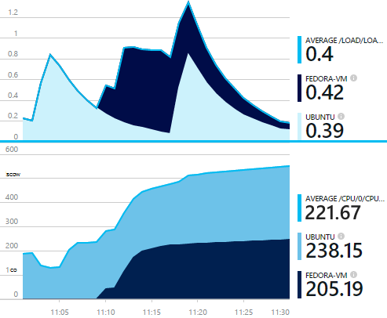

<properties 
    pageTitle="collectd: statystyki wydajności dla języka Java systemem UNIX w aplikacji wniosków" 
    description="Rozszerzone monitorowania Java witryny sieci Web przy użyciu wtyczki CollectD wniosków aplikacji" 
    services="application-insights" 
    documentationCenter="java"
    authors="alancameronwills" 
    manager="douge"/>

<tags 
    ms.service="application-insights" 
    ms.workload="tbd" 
    ms.tgt_pltfrm="ibiza" 
    ms.devlang="na" 
    ms.topic="article" 
    ms.date="08/24/2016" 
    ms.author="awills"/>
 
# <a name="collectd-unix-performance-metrics-in-application-insights"></a>collectd: Unix wskaźniki w aplikacji wniosków

*Wnioski aplikacji jest w podglądzie.*

Eksplorowanie wskaźniki systemu Unix w [Aplikacji wniosków](app-insights-overview.md), zainstaluj [collectd](http://collectd.org/)razem z jego wtyczkę wnioski aplikacji. To rozwiązanie Otwórz źródło zbiera różne statystyki systemu i sieci.

Zazwyczaj służy collectd Jeśli masz już [narzędzia Java usługi sieci web przy użyciu aplikacji wniosków][java]. Oferuje więcej danych, pomagające w celu poprawienia wydajności usługi aplikacji lub diagnozowanie problemów. 



## <a name="get-your-instrumentation-key"></a>Uzyskiwanie klucza oprzyrządowania

W [portalu Microsoft Azure](https://portal.azure.com)otwarcia zasobu [Wniosków aplikacji](app-insights-overview.md) , w którym chcesz je umieścić. (Lub [utworzyć nowy zasób](app-insights-create-new-resource.md).)

Wykonaj kopię klucza oprzyrządowania, który identyfikuje zasób.


## <a name="install-collectd-and-the-plug-in"></a>Zainstaluj collectd i wtyczki

Na komputerach serwerów Unix:

1. Instalowanie [collectd](http://collectd.org/) wersji 5.4.0 lub nowszym.
2. Pobierz [dodatek writer collectd wniosków aplikacji](https://aka.ms/aijavasdk). Zanotuj numer wersji.
3. Kopiowanie wtyczkę JAR do `/usr/share/collectd/java`.
3. Edytowanie `/etc/collectd/collectd.conf`:
 * Upewnij się, że ten [dodatek Java](https://collectd.org/wiki/index.php/Plugin:Java) jest włączona.
 * Aktualizowanie JVMArg dla java.class.path, aby uwzględnić następujące SŁOIK. Numer wersji do pasuje do pobranego aktualizacji:
  * `/usr/share/collectd/java/applicationinsights-collectd-1.0.5.jar`
 * Dodaj następujący fragment przy użyciu klucza oprzyrządowania z zasobu:

```

     LoadPlugin "com.microsoft.applicationinsights.collectd.ApplicationInsightsWriter"
     <Plugin ApplicationInsightsWriter>
        InstrumentationKey "Your key"
     </Plugin>
```

Oto przykładowy plik konfiguracyjny części:

    ...
    # collectd plugins
    LoadPlugin cpu
    LoadPlugin disk
    LoadPlugin load
    ...

    # Enable Java Plugin
    LoadPlugin "java"

    # Configure Java Plugin
    <Plugin "java">
      JVMArg "-verbose:jni"
      JVMArg "-Djava.class.path=/usr/share/collectd/java/applicationinsights-collectd-1.0.5.jar:/usr/share/collectd/java/collectd-api.jar"

      # Enabling Application Insights plugin
      LoadPlugin "com.microsoft.applicationinsights.collectd.ApplicationInsightsWriter"
                
      # Configuring Application Insights plugin
      <Plugin ApplicationInsightsWriter>
        InstrumentationKey "12345678-1234-1234-1234-123456781234"
      </Plugin>

      # Other plugin configurations ...
      ...
    </Plugin>
.   ...

Konfigurowanie innych [wtyczek collectd](https://collectd.org/wiki/index.php/Table_of_Plugins), które może zbierać różne danych z różnych źródeł.

Uruchom ponownie collectd zgodnie z jego [ręcznego](https://collectd.org/wiki/index.php/First_steps).

## <a name="view-the-data-in-application-insights"></a>Wyświetlanie danych w aplikacji wniosków

Zasób aplikacji wniosków, otwórz [Explorer metryki i dodawanie wykresów][metrics], wybierając metryki mają być wyświetlane w kategorii niestandardowej.


Domyślnie metryki łączy się na wszystkich komputerach hosta, z których zostały pobrane metryki. Aby wyświetlić metryki na hoście, karta szczegóły wykresu, włączanie grupowania, a następnie wybierz pozycję do grupowania według CollectD hosta.


## <a name="to-exclude-upload-of-specific-statistics"></a>Aby wykluczyć przekazywania poszczególnych statystyk

Domyślnie wtyczkę wnioski aplikacji wysyła wszystkich danych zebranych przez enabled collectd, przeczytaj wtyczki. 

Aby wykluczyć dane z określonych wtyczki lub źródeł danych:

* Edytowanie pliku konfiguracji. 
* W `<Plugin ApplicationInsightsWriter>`, Dodaj dyrektywy wiersze w następujący sposób:

Dyrektywy | Efekt
---|---
`Exclude disk` | Wykluczanie wszystkich danych zebranych przez `disk` wtyczkę
`Exclude disk:read,write` | Wykluczanie źródeł o nazwie `read` i `write` z `disk` wtyczkę.

Oddzielne dyrektywy z nowego wiersza.


## <a name="problems"></a>Problemy?

*Nie widzę danych w portalu*

* Otwieranie [wyszukiwania] [ diagnostic] użytkownikom, jeśli po przyjściu zdarzeniach nieprzetworzonych. Czasami ta osoba trwać dłużej są wyświetlane w Eksploratorze metryki.
* Może być konieczne [Ustawianie wyjątki zapory dla danych wychodzących](app-insights-ip-addresses.md)
* Włącz śledzenie w wtyczkę wnioski aplikacji. Dodaj następujący wiersz w `<Plugin ApplicationInsightsWriter>`:
 *  `SDKLogger true`
* Otwórz terminal i rozpocząć collectd w trybie pełnym, aby wyświetlić wszelkich problemów, które jest raportowanie:
 * `sudo collectd -f`


<!--Link references-->

[api]: app-insights-api-custom-events-metrics.md
[apiexceptions]: app-insights-api-custom-events-metrics.md#track-exception
[availability]: app-insights-monitor-web-app-availability.md
[diagnostic]: app-insights-diagnostic-search.md
[eclipse]: app-insights-java-eclipse.md
[java]: app-insights-java-get-started.md
[javalogs]: app-insights-java-trace-logs.md
[metrics]: app-insights-metrics-explorer.md
[usage]: app-insights-web-track-usage.md

 
