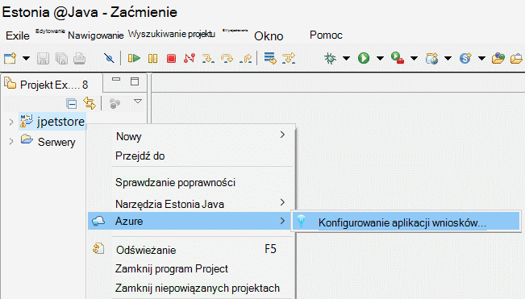
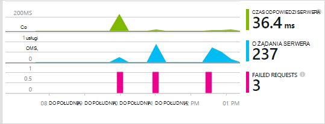
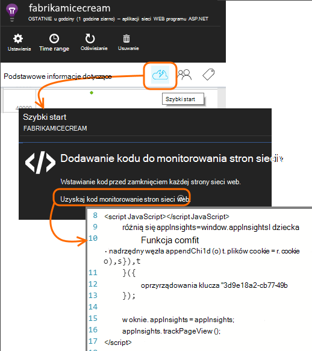

<properties 
    pageTitle="Wprowadzenie do aplikacji wniosków z języka Java w Zaćmienie" 
    description="Dodawanie wydajności i użycia monitorowania do witryny Java z wniosków aplikacji za pomocą wtyczki Zaćmienie" 
    services="application-insights" 
    documentationCenter="java"
    authors="alancameronwills" 
    manager="douge"/>

<tags 
    ms.service="application-insights" 
    ms.workload="tbd" 
    ms.tgt_pltfrm="ibiza" 
    ms.devlang="na" 
    ms.topic="article" 
    ms.date="03/02/2016" 
    ms.author="awills"/>
 
# Wprowadzenie do aplikacji wniosków z języka Java w Zaćmienie

SDK wniosków aplikacji wysyła telemetrycznego aplikacji sieci web Java tak, aby można analizować użycie i wydajność. Zaćmienie wtyczkę w przypadku aplikacji wniosków automatycznie instaluje zestawu SDK w projekcie, aby wyjść z telemetrycznego pola, a także interfejs API, który służy do zapisu telemetrycznego niestandardowe.   

## Wymagania wstępne

Obecnie wtyczki działa dla środowiska Maven i dynamicznego projektów sieci Web w Zaćmienie. ([Dodawanie aplikacji wniosków z innymi typami projektu Java][java].)

Potrzebujesz:

* Oracle JRE 1,6 lub nowszy
* Subskrypcję usługi [Microsoft Azure](https://azure.microsoft.com/). (Może rozpoczynać się od [bezpłatna wersja próbna](https://azure.microsoft.com/pricing/free-trial/)).
* [Zaćmienie IDE dla deweloperów Estonia Java](http://www.eclipse.org/downloads/)indygo lub nowszym.
* Windows 7 lub nowszy lub Windows Server 2008 lub nowszego

## Zainstaluj zestaw SDK na Zaćmienie (raz)

Musisz zrobić to jeden raz na komputerze. Ten krok jest instalowana zestaw narzędzi, które następnie można dodać zestawu SDK do każdego dynamiczne projektu sieci Web.

1. W Zaćmienie kliknij pozycję Pomoc, zainstaluj nowe oprogramowanie.

    

2. Zestaw SDK znajduje się w http://dl.windowsazure.com/eclipse w obszarze zestaw narzędzi Azure. 
3. Wyczyść pole wyboru, **skontaktuj się z wszystkich witryn aktualizacji...**

    

Wykonaj pozostałe kroki dla każdego języka Java projektu.

## Tworzenie zasób wniosków aplikacji platformy Azure

1. Zaloguj się do [portalu Azure](https://portal.azure.com).
2. Tworzenie nowego zasobu wniosków aplikacji.  

      
3. Ustaw typ aplikacji Java aplikacji sieci web.  

      
4. Znajdź klucz oprzyrządowania nowego zasobu. Konieczne będzie wkrótce Wklej to w projekcie kodu.  

      

## Dodawanie aplikacji wniosków do projektu

1. Dodawanie aplikacji wniosków z menu kontekstowego Java projektu sieci web.

    

2. Wklej klucz oprzyrządowania uzyskanego od Azure portal.

    

Klucz są wysyłane wraz z każdego elementu telemetrycznego i informuje wniosków aplikacji, aby ją wyświetlić w zasobu.

## Uruchom aplikację i Zobacz metryka

Uruchamianie aplikacji.

Wróć do zasobu wniosków aplikacji platformy Microsoft Azure.

Dane żądania HTTP pojawią się na karta Przegląd. (Jeśli nie istnieje, poczekaj chwilę i kliknij przycisk Odśwież).

 

Kliknij dowolny wykres, aby wyświetlić szczegółowe metryki. 

[Dowiedz się więcej na temat metryki.][metrics]

 

I podczas przeglądania właściwości żądania, można zobaczyć zdarzenia telemetrycznego skojarzone z nim, takie jak żądania i wyjątki.
 

## Telemetrycznego po stronie klienta

Na karta Szybki Start kliknij kod Get monitorowanie stron sieci web: 

Wstawianie wstawkę kodu w nagłówku pliki HTML.

#### Wyświetlanie danych po stronie klienta

Otwórz zaktualizowaną stron sieci web i używać ich. Zaczekaj minutę lub dwie, a następnie wróć do wniosków aplikacji i otwórz karta zastosowania. (Od karta Przegląd przewiń w dół i kliknij pozycję użycie).

Strony widoku, użytkownik i sesja metryki pojawią się na karta zastosowania:

[Dowiedz się więcej o konfigurowaniu telemetrycznego po stronie klienta.][usage]

## Publikowanie aplikacji

Teraz można publikować aplikacji na serwerze, użyj Poinformuj osoby, a także czujki telemetrycznego wyświetlane w portalu.

* Upewnij się, że ustawienia zapory umożliwiają aplikacji z wysyłką telemetrycznego następujące porty:

 * DC.Services.VisualStudio.com:443
 * DC.Services.VisualStudio.com:80
 * F5.Services.VisualStudio.com:443
 * F5.Services.VisualStudio.com:80

* Na serwerach systemu Windows należy zainstalować:

 * [Microsoft Visual C++ do dystrybucji](http://www.microsoft.com/download/details.aspx?id=40784)

    (Dzięki temu liczniki wydajności).

## Wyjątki i niepowodzenia żądań

Nieobsługiwany wyjątki są zbierane automatycznie:

Zbieranie danych na inne wyjątki, masz dwie opcje:

* [Wstawianie połączenia do TrackException w kodzie](app-insights-api-custom-events-metrics.md#track-exception). 
* [Instalowanie agenta Java na serwerze](app-insights-java-agent.md). Określanie metody, które chcesz obserwować.

## Monitorowanie metody połączenia i zależności zewnętrznych

[Instalowanie agenta Java](app-insights-java-agent.md) do logowania określone metody wewnętrznych i wywołań za pośrednictwem JDBC, z danymi chronometraż.

## Liczniki wydajności

Na swojej karta Przegląd przewiń w dół i kliknij **serwerów** . Pojawi się zakres liczników wydajności.

### Dostosowywanie wydajności licznika

Aby wyłączyć zbiór standardowy zestaw liczników wydajności, Dodaj poniższy kod w obszarze węzła głównego pliku ApplicationInsights.xml:

    <PerformanceCounters>
       <UseBuiltIn>False</UseBuiltIn>
    </PerformanceCounters>

### Zbieranie liczników wydajności dodatkowe

Możesz określić liczniki dodatkowe zbierane.

#### Liczniki JMX (udostępniane przez środowiska Java)

    <PerformanceCounters>
      <Jmx>
        <Add objectName="java.lang:type=ClassLoading" attribute="TotalLoadedClassCount" displayName="Loaded Class Count"/>
        <Add objectName="java.lang:type=Memory" attribute="HeapMemoryUsage.used" displayName="Heap Memory Usage-used" type="composite"/>
      </Jmx>
    </PerformanceCounters>

*   `displayName`— Nazwa wyświetlana w portalu wniosków aplikacji.
*   `objectName`— JMX nazwę obiektu.
*   `attribute`Atrybut nazwę obiektu JMX do pobrania
*   `type`(opcjonalnie) — typ atrybutu JMX obiektu:
 *  Wartość domyślna: prosty typ przykład int lub początkowym.
 *  `composite`: danych liczników wydajności jest w formacie "Attribute.Data"
 *  `tabular`: danych liczników wydajności jest w formacie wiersza tabeli

#### Liczniki wydajności systemu Windows

Każdy [Licznik wydajności systemu Windows](https://msdn.microsoft.com/library/windows/desktop/aa373083.aspx) jest członkiem kategorii (w taki sam sposób, że pole jest członkiem klasy). Kategorie mogą być globalnego, można mieć numerowana lub nazwane wystąpienia.

    <PerformanceCounters>
      <Windows>
        <Add displayName="Process User Time" categoryName="Process" counterName="%User Time" instanceName="__SELF__" />
        <Add displayName="Bytes Printed per Second" categoryName="Print Queue" counterName="Bytes Printed/sec" instanceName="Fax" />
      </Windows>
    </PerformanceCounters>

*   displayName — Nazwa wyświetlana w portalu wniosków aplikacji.
*   NazwaKategorii — kategorii licznika wydajności (obiekt wydajności), z którą jest skojarzony ten licznik wydajności.
*   counterName — nazwę licznika wydajności.
*   nazwa_wystąpienia — nazwę wystąpienia kategorii licznika wydajności lub ciąg pusty (""), jeśli kategoria zawiera jedno wystąpienie. Jeśli CategoryName proces, a licznika chcesz zebrać pochodzi z bieżącego procesu maszyny wirtualnej Java, na której aplikacji jest uruchomiony, określ `"__SELF__"`.

Liczniki wydajności są wyświetlane jako niestandardowe metryki w [Eksploratorze metryki][metrics].

### Liczniki wydajności systemu UNIX

* [Instalowanie collectd z wtyczkę wnioski aplikacji](app-insights-java-collectd.md) uzyskanie szeroką gamę systemu i sieci danych.

## Dostępność testy sieci web

Wnioski aplikacji można sprawdzić witryny sieci Web w regularnych odstępach czasu, aby sprawdzić, czy jest i odpowiada również. [Aby skonfigurować][availability], przewiń w dół do kliknij pozycję Dostępność.

Zostanie wyświetlony wykresy czasu odpowiedzi oraz powiadomienia e-mail, jeśli awarii witryny.

[Więcej informacji o dostępności testy sieci web.][availability] 

## Dzienniki diagnostyczne

Jeśli korzystasz z Logback lub Log4J (wersja 1.2 lub 2.0) do śledzenia, możesz mieć do dzienników automatycznie wysyłane do aplikacji wniosków miejsce, w którym można eksplorować i wyszukiwanie od nich.

[Dowiedz się więcej o dzienniki diagnostyczne][javalogs]

## Niestandardowe telemetrycznego 

Wstawianie kilka wierszy kodu w aplikacji sieci web języka Java, aby dowiedzieć się, co robią użytkowników z nim lub diagnozowanie problemów. 

Kod można wstawić zarówno na stronie sieci web JavaScript i Java po stronie serwera.

[Dowiedz się więcej o telemetrycznego niestandardowe][track]

## Następne kroki

#### Wykrywanie i diagnozowanie problemów

* [Dodawanie telemetrycznego klienta sieci web] [ usage] uzyskanie telemetrycznego wydajności w kliencie sieci web.
* [Ustawianie testów web] [ availability] aby upewnić się, pozostaje aplikacji i odpowiadać na żywo.
* [Wyszukiwanie zdarzeń i dzienników] [ diagnostic] diagnozowanie problemów.
* [Przechwytywanie śledzenia Log4J lub Logback][javalogs]

#### Śledzenie użycia

* [Dodawanie telemetrycznego klienta sieci web] [ usage] monitor liczbę wyświetleń stron i metryk podstawowe użytkownika.
* [Śledzenie zdarzeń niestandardowych i metryk] [ track] Aby dowiedzieć się, jak używać aplikacji zarówno klienta i serwera.

<!--Link references-->

[availability]: app-insights-monitor-web-app-availability.md
[diagnostic]: app-insights-diagnostic-search.md
[java]: app-insights-java-get-started.md
[javalogs]: app-insights-java-trace-logs.md
[metrics]: app-insights-metrics-explorer.md
[track]: app-insights-api-custom-events-metrics.md
[usage]: app-insights-web-track-usage.md

 