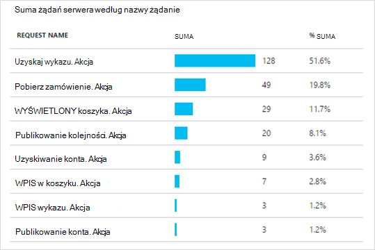

<properties
    pageTitle="Analizy aplikacji sieci web Java przy użyciu aplikacji wniosków | Microsoft Azure"
    description="Monitorowanie wydajności i użycia witryny sieci Web przy użyciu aplikacji wniosków Java. "
    services="application-insights"
    documentationCenter="java"
    authors="alancameronwills"
    manager="douge"/>

<tags
    ms.service="application-insights"
    ms.workload="tbd"
    ms.tgt_pltfrm="ibiza"
    ms.devlang="na"
    ms.topic="get-started-article"
    ms.date="08/17/2016"
    ms.author="awills"/>

# Wprowadzenie do aplikacji wniosków w projekcie web języka Java

*Wnioski aplikacji jest w podglądzie.*

[AZURE.INCLUDE [app-insights-selector-get-started](../../includes/app-insights-selector-get-started.md)]

[Wnioski aplikacji](https://azure.microsoft.com/services/application-insights/) to usługa extensible analizy, która pomoże zrozumieć wydajności i użycia live aplikacji. [Wykrywanie i diagnozowanie problemów z wydajnością i wyjątki](app-insights-detect-triage-diagnose.md)i [Pisanie kodu] [ api] do śledzenia, co zrobić z aplikacji użytkowników.

Wnioski aplikacji obsługuje aplikacje Java systemem Linux, Unix lub systemu Windows.

Potrzebujesz:

* Oracle JRE 1,6 lub nowszej lub Zulu JRE 1,6 lub nowszy
* Subskrypcję usługi [Microsoft Azure](https://azure.microsoft.com/). (Może rozpoczynać się od [bezpłatna wersja próbna](https://azure.microsoft.com/pricing/free-trial/)).

*Jeśli masz aplikację sieci web, która już istnieje, można wykonać procedury alternatywne Dodawanie [SDK w czasie wykonywania na serwerze sieci web](app-insights-java-live.md). Zamiast tego uniknąć odbudowanie kodu, ale nie jest dostępna opcja pisanie kodu do śledzenia aktywności użytkownika.*

## 1. uzyskania klucza oprzyrządowania wniosków aplikacji

1. Zaloguj się do [portalu Microsoft Azure](https://portal.azure.com).
2. Utwórz zasób wniosków aplikacji. Ustaw typ aplikacji Java aplikacji sieci web.

    
4. Znajdź klucz oprzyrządowania nowego zasobu. Konieczne będzie wkrótce wkleić ten klucz do projektu kodu.

    

## 2. Dodawanie SDK wniosków aplikacji dla języka Java do projektu

*Wybierz odpowiedni sposób projektu.*

#### Jeśli korzystasz z Zaćmienie, aby utworzyć projekt środowiska Maven lub dynamiczne Web...

Za pomocą [Aplikacji wniosków SDK dla języka Java wtyczki][eclipse].

#### Jeśli korzystasz z środowiska Maven...

Jeśli projekt jest skonfigurowana do używania środowiska Maven dla kompilacji, Scal poniższy kod do pliku pom.xml.

Następnie Odśwież współzależności projektów uzyskanie pobrane pliki binarne.

    <repositories>
       <repository>
          <id>central</id>
          <name>Central</name>
          <url>http://repo1.maven.org/maven2</url>
       </repository>
    </repositories>

    <dependencies>
      <dependency>
        <groupId>com.microsoft.azure</groupId>
        <artifactId>applicationinsights-web</artifactId>
        <!-- or applicationinsights-core for bare API -->
        <version>[1.0,)</version>
      </dependency>
    </dependencies>

* *Tworzenie lub sumy kontrolnej błędów sprawdzania poprawności?* Spróbuj użyć określonej wersji, takich jak: `<version>1.0.n</version>`. W [wersji SDK](https://github.com/Microsoft/ApplicationInsights-Java#release-notes) lub w naszym [artefakty środowiska Maven](http://search.maven.org/#search%7Cga%7C1%7Capplicationinsights)można znaleźć najnowszą wersję.
* *Wymagana aktualizacja do nowej SDK?* Odświeżanie zależności projektu.

#### Jeśli korzystasz z Gradle...

Jeśli projekt jest skonfigurowana do używania Gradle dla kompilacji, Scal poniższy kod do pliku build.gradle.

Następnie Odśwież współzależności projektów uzyskanie pobrane pliki binarne.

    repositories {
      mavenCentral()
    }

    dependencies {
      compile group: 'com.microsoft.azure', name: 'applicationinsights-web', version: '1.+'
      // or applicationinsights-core for bare API
    }

* Błędy sprawdzania poprawności kompilacji lub sumy kontrolnej *? Spróbuj użyć określonej wersji, takich jak:* `version:'1.0.n'`. *Najnowsza wersja znajdziesz w [wersji SDK](https://github.com/Microsoft/ApplicationInsights-Java#release-notes).*
* *Aby zaktualizować do nowego zestawu SDK*
 * Odświeżanie zależności projektu.

#### W przeciwnym razie...

Ręczne dodawanie zestawu SDK:

1. Pobierz [aplikację wniosków SDK dla języka Java](https://aka.ms/aijavasdk).
2. Wyodrębnianie plików binarnych z pliku zip i dodaj je do projektu.

### Pytania...

* *Co to jest relacji między `-core` i `-web` składniki w zip?*

 * `applicationinsights-core`Umożliwia API systemu od zera. Zawsze należy tego składnika.
 * `applicationinsights-web`Umożliwia śledzenia liczników żądania HTTP i czasy odpowiedzi. Jeśli nie chcesz, aby ten telemetrycznego zbierane automatycznie, można pominąć tego składnika. Na przykład, jeśli chcesz napisać własny.

* *Aby zaktualizować zestawu SDK, możemy publikowania zmian*
 * Pobierz najnowszą [Aplikację wniosków SDK dla języka Java](https://aka.ms/qqkaq6) i zamienić starych.
 * Zmiany zostały opisane w [wersji SDK](https://github.com/Microsoft/ApplicationInsights-Java#release-notes).

## 3. Dodaj plik XML wniosków aplikacji

Dodawanie ApplicationInsights.xml do folderu zasobów w projekcie lub upewnij się, że jest dodawana do ścieżki klas wdrożenia projektu. Skopiuj następujący kod XML do niego.

Należy zastąpić klucz oprzyrządowania uzyskanego od Azure portal.

    <?xml version="1.0" encoding="utf-8"?>
    <ApplicationInsights xmlns="http://schemas.microsoft.com/ApplicationInsights/2013/Settings" schemaVersion="2014-05-30">

      <!-- The key from the portal: -->

      <InstrumentationKey>** Your instrumentation key **</InstrumentationKey>

      <!-- HTTP request component (not required for bare API) -->

      <TelemetryModules>
        <Add type="com.microsoft.applicationinsights.web.extensibility.modules.WebRequestTrackingTelemetryModule"/>
        <Add type="com.microsoft.applicationinsights.web.extensibility.modules.WebSessionTrackingTelemetryModule"/>
        <Add type="com.microsoft.applicationinsights.web.extensibility.modules.WebUserTrackingTelemetryModule"/>
      </TelemetryModules>

      <!-- Events correlation (not required for bare API) -->
      <!-- These initializers add context data to each event -->

      <TelemetryInitializers>
        <Add   type="com.microsoft.applicationinsights.web.extensibility.initializers.WebOperationIdTelemetryInitializer"/>
        <Add type="com.microsoft.applicationinsights.web.extensibility.initializers.WebOperationNameTelemetryInitializer"/>
        <Add type="com.microsoft.applicationinsights.web.extensibility.initializers.WebSessionTelemetryInitializer"/>
        <Add type="com.microsoft.applicationinsights.web.extensibility.initializers.WebUserTelemetryInitializer"/>
        <Add type="com.microsoft.applicationinsights.web.extensibility.initializers.WebUserAgentTelemetryInitializer"/>

      </TelemetryInitializers>
    </ApplicationInsights>

* Klucz oprzyrządowania są wysyłane wraz z każdego elementu telemetrycznego i informuje wniosków aplikacji, aby ją wyświetlić w zasobu.
* Składnik żądania HTTP jest opcjonalna. Automatycznie wysyła telemetrycznego o żądania i czasy odpowiedzi do portalu.
* Zdarzenia korelacji jest dodatkiem do składnika żądania HTTP. Przypisuje identyfikator do każdego żądania odebranych przez serwer i dodaje ten identyfikator jako właściwość do każdego elementu telemetrycznego jako właściwości "Operation.Id". Umożliwia przeniesionym telemetrycznego skojarzonego z każdego żądania przez ustawienie filtru w [wyszukiwaniu diagnostyczne][diagnostic].
* Klucz wniosków aplikacji można przekazać dynamicznie z portalu Azure jako właściwość system (-DAPPLICATION_INSIGHTS_IKEY = your_ikey). W przypadku nie zdefiniowano właściwości sprawdza zmiennej środowiska (APPLICATION_INSIGHTS_IKEY) w obszarze Ustawienia aplikacji Azure. W przypadku nieokreślone obu właściwości z ApplicationInsights.xml jest używana wartość domyślna InstrumentationKey. Ta sekwencja ułatwia dynamiczne zarządzanie InstrumentationKeys różne dla różnych środowiskach.

### Inny sposób ustawić klucz oprzyrządowania

Aplikacja wniosków SDK wyszukuje klucz w następującej kolejności:

1. Właściwość systemu:-DAPPLICATION_INSIGHTS_IKEY = your_ikey
2. Zmienna środowiska: APPLICATION_INSIGHTS_IKEY
3. Plik konfiguracyjny: ApplicationInsights.xml

Możesz też [ustawić go w kodzie](app-insights-api-custom-events-metrics.md#ikey):

    telemetryClient.InstrumentationKey = "...";

## 4. dodać filtr HTTP

Ostatnim krokiem konfiguracji umożliwia składnika żądania HTTP do logowania każdego żądania sieci web. (Nie muszą czy chcesz po prostu API systemu od zera).

Znajdź i Otwórz plik web.xml w projekcie i scalanie poniższy kod węźle aplikacji sieci web, gdzie są skonfigurowane filtry aplikacji.

Aby uzyskać najbardziej dokładne wyniki, filtr powinny być mapowane przed wszystkie inne filtry.

    <filter>
      <filter-name>ApplicationInsightsWebFilter</filter-name>
      <filter-class>
        com.microsoft.applicationinsights.web.internal.WebRequestTrackingFilter
      </filter-class>
    </filter>
    <filter-mapping>
       <filter-name>ApplicationInsightsWebFilter</filter-name>
       <url-pattern>/*</url-pattern>
    </filter-mapping>

#### Jeśli korzystasz z sieci Web Wiosenna MVC 3.1 lub nowszy

Edytować te elementy, aby uwzględnić pakiet aplikacji wniosków:

    <context:component-scan base-package=" com.springapp.mvc, com.microsoft.applicationinsights.web.spring"/>

    <mvc:interceptors>
        <mvc:interceptor>
            <mvc:mapping path="/**"/>
            <bean class="com.microsoft.applicationinsights.web.spring.RequestNameHandlerInterceptorAdapter" />
        </mvc:interceptor>
    </mvc:interceptors>

#### Jeśli korzystasz z Struts 2

Dodaj ten element do pliku konfiguracji poprzeczne (zwykle o nazwie struts.xml lub default.xml poprzeczne):

     <interceptors>
       <interceptor name="ApplicationInsightsRequestNameInterceptor" class="com.microsoft.applicationinsights.web.struts.RequestNameInterceptor" />
     </interceptors>
     <default-interceptor-ref name="ApplicationInsightsRequestNameInterceptor" />

(Jeśli masz interceptors zdefiniowane w stosie domyślne interceptor po prostu można dodawać do tego stosu.)

## 5 uruchomienie aplikacji

Uruchom go w trybie debugowania na tym komputerze rozwoju albo publikowanie do serwera.

## 6. Wyświetlanie swojego telemetrycznego w aplikacji wniosków

Wróć do zasobu wniosków aplikacji w [portalu Microsoft Azure](https://portal.azure.com).

Dane żądania HTTP są wyświetlane na karta Przegląd. (Jeśli nie istnieje, poczekaj chwilę i kliknij przycisk Odśwież).

[Dowiedz się więcej na temat metryki.][metrics]

Kliknij wykres, aby wyświetlić szczegółowe metryki zagregowane.

> Wnioski aplikacji założono, format żądania HTTP dla aplikacji MVC jest: `VERB controller/action`. Na przykład `GET Home/Product/f9anuh81`, `GET Home/Product/2dffwrf5` i `GET Home/Product/sdf96vws` są pogrupowane w `GET Home/Product`. Grupy umożliwia zrozumiałej agregacji żądania, takie jak liczba żądań i Średni czas wykonywania dla żądania.

### Dane wystąpienia 

Kliknij typ żądanie, aby wyświetlić poszczególne wystąpienia. 

Dwa typy danych są wyświetlane w aplikacji wniosków: zagregowane dane przechowywane i wyświetlone jako średnie, liczniki i sumy; i wystąpienia danych — poszczególne raporty żądania HTTP, wyjątki, liczbę wyświetleń stron lub zdarzenia niestandardowe.

Podczas wyświetlania właściwości żądania widać zdarzenia telemetrycznego skojarzone z nim, takie jak żądania i wyjątki.

### Analiz: Język kwerend zaawansowanych

Jak zebrać większej ilości danych, można uruchomić kwerendy zarówno do agregowanie danych i w celu znalezienia poszczególne wystąpienia. [Analiza]() jest użyteczny zarówno dla opis wydajności i użycia i w celach diagnostycznych.

## 7. Instalowanie aplikacji na serwerze

Teraz można publikować aplikacji na serwerze, użyj Poinformuj osoby, a także czujki telemetrycznego wyświetlane w portalu.

* Upewnij się, że ustawienia zapory umożliwiają aplikacji z wysyłką telemetrycznego następujące porty:

 * DC.Services.VisualStudio.com:443
 * F5.Services.VisualStudio.com:443

* Na serwerach systemu Windows należy zainstalować:

 * [Microsoft Visual C++ do dystrybucji](http://www.microsoft.com/download/details.aspx?id=40784)

    (Ten składnik umożliwia liczniki wydajności).

## Wyjątki i niepowodzenia żądań

Nieobsługiwany wyjątki są zbierane automatycznie:

Zbieranie danych na inne wyjątki, masz dwie opcje:

* [Wstawianie połączenia do trackException() w kodzie][apiexceptions]. 
* [Instalowanie agenta Java na serwerze](app-insights-java-agent.md). Określanie metody, które chcesz obserwować.

## Monitorowanie metody połączenia i zależności zewnętrznych

[Instalowanie agenta Java](app-insights-java-agent.md) do logowania określone metody wewnętrznych i wywołań za pośrednictwem JDBC, z danymi chronometraż.

## Liczniki wydajności

Otwieranie **ustawień** **serwerów**, aby zobaczyć zakresem liczników wydajności.

### Dostosowywanie wydajności licznika

Aby wyłączyć zbiór standardowy zestaw liczników wydajności, Dodaj poniższy kod w obszarze węzła głównego pliku ApplicationInsights.xml:

    <PerformanceCounters>
       <UseBuiltIn>False</UseBuiltIn>
    </PerformanceCounters>

### Zbieranie liczników wydajności dodatkowe

Możesz określić liczniki dodatkowe zbierane.

#### Liczniki JMX (udostępniane przez środowiska Java)

    <PerformanceCounters>
      <Jmx>
        <Add objectName="java.lang:type=ClassLoading" attribute="TotalLoadedClassCount" displayName="Loaded Class Count"/>
        <Add objectName="java.lang:type=Memory" attribute="HeapMemoryUsage.used" displayName="Heap Memory Usage-used" type="composite"/>
      </Jmx>
    </PerformanceCounters>

*   `displayName`— Nazwa wyświetlana w portalu wniosków aplikacji.
*   `objectName`— JMX nazwę obiektu.
*   `attribute`Atrybut nazwę obiektu JMX do pobrania
*   `type`(opcjonalnie) — typ atrybutu JMX obiektu:
 *  Wartość domyślna: prosty typ przykład int lub początkowym.
 *  `composite`: danych liczników wydajności jest w formacie "Attribute.Data"
 *  `tabular`: danych liczników wydajności jest w formacie wiersza tabeli

#### Liczniki wydajności systemu Windows

Każdy [Licznik wydajności systemu Windows](https://msdn.microsoft.com/library/windows/desktop/aa373083.aspx) jest członkiem kategorii (w taki sam sposób, że pole jest członkiem klasy). Kategorie mogą być globalnego, można mieć numerowane lub nazwane wystąpienia.

    <PerformanceCounters>
      <Windows>
        <Add displayName="Process User Time" categoryName="Process" counterName="%User Time" instanceName="__SELF__" />
        <Add displayName="Bytes Printed per Second" categoryName="Print Queue" counterName="Bytes Printed/sec" instanceName="Fax" />
      </Windows>
    </PerformanceCounters>

*   displayName — Nazwa wyświetlana w portalu wniosków aplikacji.
*   NazwaKategorii — kategorii licznika wydajności (obiekt wydajności), z którą jest skojarzony ten licznik wydajności.
*   counterName — nazwę licznika wydajności.
*   nazwa_wystąpienia — nazwę wystąpienia kategorii licznika wydajności lub ciąg pusty (""), jeśli kategoria zawiera jedno wystąpienie. Jeśli CategoryName proces, a licznika chcesz zebrać pochodzi z bieżącego procesu maszyny wirtualnej Java, na której aplikacji jest uruchomiony, określ `"__SELF__"`.

Liczniki wydajności są wyświetlane jako niestandardowe metryki w [Eksploratorze metryki][metrics].

### Liczniki wydajności systemu UNIX

* [Instalowanie collectd z wtyczkę wnioski aplikacji](app-insights-java-collectd.md) uzyskanie szeroką gamę systemu i sieci danych.

## Pobieranie danych użytkowników i sesji

Przycisk OK wysyłasz telemetrycznego na serwerze sieci web. Teraz pozwala sprawdzić 360 stopni aplikacji, można dodać więcej monitorowania:

* [Dodawanie do stron sieci web telemetrycznego] [ usage] monitor liczbę wyświetleń stron i metryk użytkownika.
* [Ustawianie testów web] [ availability] aby upewnić się, pozostaje aplikacji i odpowiadać na żywo.

## Przechwytywanie dziennika śledzenia

Za pomocą aplikacji wniosków do dzienników wycinek i kości z Log4J, Logback lub innych systemów rejestrowania. Dzienniki mogą być zgodne z żądania HTTP i innych telemetrycznego. [Dowiedz się, jak][javalogs].

## Wyślij własne telemetrycznego

Teraz, gdy zainstalowano zestawu SDK, umożliwia API wysyłanie własnych telemetrycznego.

* [Śledzenie zdarzeń niestandardowych i metryki] [ api] Aby dowiedzieć się, co robią użytkowników z aplikacją.
* [Wyszukiwanie zdarzeń i dzienników] [ diagnostic] diagnozowanie problemów.

## Dostępność testy sieci web

Wnioski aplikacji można sprawdzić witryny sieci Web w regularnych odstępach czasu, aby sprawdzić, czy jest i odpowiada również. [Aby skonfigurować][availability], kliknij pozycję testy sieci Web.

Zostanie wyświetlony wykresy czasy odpowiedzi oraz powiadomienia e-mail, jeśli awarii witryny.

[Więcej informacji o dostępności testy sieci web.][availability] 

## Masz pytania? Problemy?

[Rozwiązywanie problemów z języka Java](app-insights-java-troubleshoot.md)

## Następne kroki

Aby uzyskać więcej informacji zobacz [Centrum deweloperów języka Java](/develop/java/).

<!--Link references-->

[api]: app-insights-api-custom-events-metrics.md
[apiexceptions]: app-insights-api-custom-events-metrics.md#track-exception
[availability]: app-insights-monitor-web-app-availability.md
[diagnostic]: app-insights-diagnostic-search.md
[eclipse]: app-insights-java-eclipse.md
[javalogs]: app-insights-java-trace-logs.md
[metrics]: app-insights-metrics-explorer.md
[usage]: app-insights-web-track-usage.md
