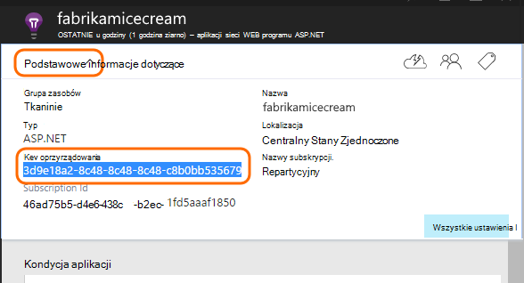

<properties 
    pageTitle="Wnioski aplikacji dla aplikacji sieci web języka Java, które już są na żywo" 
    description="Uruchomić aplikacji sieci web, który jest już uruchomiony na serwerze monitorowania" 
    services="application-insights" 
    documentationCenter="java"
    authors="alancameronwills" 
    manager="douge"/>

<tags 
    ms.service="application-insights" 
    ms.workload="tbd" 
    ms.tgt_pltfrm="ibiza" 
    ms.devlang="na" 
    ms.topic="article" 
    ms.date="08/24/2016" 
    ms.author="awills"/>
 
# Wnioski aplikacji dla aplikacji sieci web języka Java, które już są na żywo

*Wnioski aplikacji jest w podglądzie.*

Jeśli masz aplikację sieci web, który jest już uruchomiony na serwerze J2EE, możesz rozpocząć monitorowanie go za pomocą [Aplikacji wniosków](app-insights-overview.md) bez konieczności zmiany kodu lub ponownego kompilowania projektu. Po wybraniu tej opcji, możesz uzyskać informacji na temat żądania HTTP wysyłane do serwera, nieobsługiwanego wyjątki i liczników wydajności.

Konieczne będzie subskrypcję usługi [Microsoft Azure](https://azure.com).

> [AZURE.NOTE] Procedura na tej stronie zestawu SDK są dodawane do aplikacji sieci web w czasie rzeczywistym. Ten oprzyrządowania środowisko uruchomieniowe jest przydatne, jeśli nie chcesz, aby zaktualizować lub odbudowanie kod źródłowy. Jeśli to możliwe, zalecamy jednak możesz [dodać SDK do kodu źródłowego](app-insights-java-get-started.md) zamiast tego. Która zapewnia więcej opcji, takich jak pisania kodu do śledzenia aktywności użytkownika.

## 1. uzyskania klucza oprzyrządowania wniosków aplikacji

1. Zaloguj się do [portalu Microsoft Azure](https://portal.azure.com)
2. Tworzenie nowego zasobu wniosków aplikacji

    
3. Ustaw typ aplikacji Java aplikacji sieci web.

    
4. Znajdź klucz oprzyrządowania nowego zasobu. Konieczne będzie wkrótce wkleić ten klucz do projektu kodu.

    

## 2. ten zestaw SDK pobrać

1. Pobierz [aplikację wniosków SDK dla języka Java](https://aka.ms/aijavasdk). 
2. Na serwerze pobierającego zawartość zestawu SDK do katalogu, z której są ładowane plików binarnych programu project. Jeśli używasz Tomcat ten katalog będzie się zazwyczaj w obszarze`webapps\<your_app_name>\WEB-INF\lib`

## 3. Dodawanie pliku xml wniosków aplikacji

Tworzenie ApplicationInsights.xml w folderze, w której dodawana zestawu SDK. Należy umieścić w nim następujący kod XML.

Należy zastąpić klucz oprzyrządowania uzyskanego od Azure portal.

    <?xml version="1.0" encoding="utf-8"?>
    <ApplicationInsights xmlns="http://schemas.microsoft.com/ApplicationInsights/2013/Settings" schemaVersion="2014-05-30">

      <!-- The key from the portal: -->

      <InstrumentationKey>** Your instrumentation key **</InstrumentationKey>

      <!-- HTTP request component (not required for bare API) -->

      <TelemetryModules>
        <Add type="com.microsoft.applicationinsights.web.extensibility.modules.WebRequestTrackingTelemetryModule"/>
        <Add type="com.microsoft.applicationinsights.web.extensibility.modules.WebSessionTrackingTelemetryModule"/>
        <Add type="com.microsoft.applicationinsights.web.extensibility.modules.WebUserTrackingTelemetryModule"/>
      </TelemetryModules>

      <!-- Events correlation (not required for bare API) -->
      <!-- These initializers add context data to each event -->

      <TelemetryInitializers>
        <Add   type="com.microsoft.applicationinsights.web.extensibility.initializers.WebOperationIdTelemetryInitializer"/>
        <Add type="com.microsoft.applicationinsights.web.extensibility.initializers.WebOperationNameTelemetryInitializer"/>
        <Add type="com.microsoft.applicationinsights.web.extensibility.initializers.WebSessionTelemetryInitializer"/>
        <Add type="com.microsoft.applicationinsights.web.extensibility.initializers.WebUserTelemetryInitializer"/>
        <Add type="com.microsoft.applicationinsights.web.extensibility.initializers.WebUserAgentTelemetryInitializer"/>

      </TelemetryInitializers>
    </ApplicationInsights>

* Klucz oprzyrządowania są wysyłane wraz z każdego elementu telemetrycznego i informuje wniosków aplikacji, aby ją wyświetlić w zasobu.
* Składnik żądania HTTP jest opcjonalna. Automatycznie wysyła telemetrycznego o żądania i czasy odpowiedzi do portalu.
* Zdarzenia korelacji jest dodatkiem do składnika żądania HTTP. Przypisuje identyfikator do każdego żądania odebranych przez serwer i dodaje ten identyfikator jako właściwość do każdego elementu telemetrycznego jako właściwości "Operation.Id". Umożliwia przeniesionym telemetrycznego skojarzone z każdego żądania przez ustawienie filtru w [wyszukiwaniu diagnostyczne](app-insights-diagnostic-search.md).

## 4. dodać filtr HTTP

Znajdź i Otwórz plik web.xml w projekcie i scalanie następujące wstawkę kodu węźle aplikacji sieci web, gdzie są skonfigurowane filtry aplikacji.

Aby uzyskać najbardziej dokładne wyniki, filtr powinny być mapowane przed wszystkie inne filtry.

    <filter>
      <filter-name>ApplicationInsightsWebFilter</filter-name>
      <filter-class>
        com.microsoft.applicationinsights.web.internal.WebRequestTrackingFilter
      </filter-class>
    </filter>
    <filter-mapping>
       <filter-name>ApplicationInsightsWebFilter</filter-name>
       <url-pattern>/*</url-pattern>
    </filter-mapping>

## 5. wyjątki zapory wyboru

Może być konieczne [ustawić wyjątki wysyłanie poczty wychodzącej danych](app-insights-ip-addresses.md).

## 6. ponownie uruchom aplikację sieci web

## 7. Wyświetlanie swojego telemetrycznego w aplikacji wniosków

Wróć do zasobu wniosków aplikacji w [portalu Microsoft Azure](https://portal.azure.com).

Telemetrycznego o żądania HTTP pojawi się na karta Przegląd. (Jeśli nie istnieje, poczekaj chwilę i kliknij przycisk Odśwież).

 

Kliknij wykres, aby wyświetlić szczegółowe metryki. 

 

I podczas przeglądania właściwości żądania, można zobaczyć zdarzenia telemetrycznego skojarzone z nim, takie jak żądania i wyjątki.
 

[Dowiedz się więcej na temat metryki.](app-insights-metrics-explorer.md)

## Następne kroki

* [Dodaj telemetrycznego do stron sieci web](app-insights-web-track-usage.md) monitor liczbę wyświetleń stron i metryk użytkownika.
* [Ustawianie testów sieci web](app-insights-monitor-web-app-availability.md) do upewnij się, że aplikacja pozostaje i odpowiadać na żywo.
* [Przechwytywanie dziennika śledzenia](app-insights-java-trace-logs.md)
* [Dzienniki zdarzeń wyszukiwania i](app-insights-diagnostic-search.md) diagnozowanie problemów.

 
