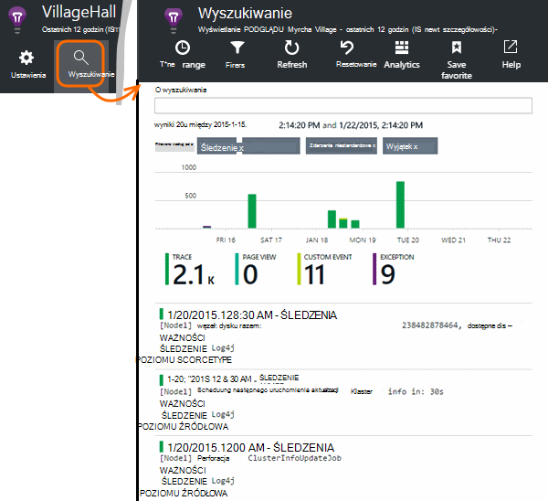

<properties 
    pageTitle="Eksplorowanie Java dzienniki śledzenia w aplikacji wniosków" 
    description="Wyszukiwanie Log4J lub Logback śledzenia w aplikacji wniosków" 
    services="application-insights" 
    documentationCenter="java"
    authors="alancameronwills" 
    manager="douge"/>

<tags 
    ms.service="application-insights" 
    ms.workload="tbd" 
    ms.tgt_pltfrm="ibiza" 
    ms.devlang="na" 
    ms.topic="article" 
    ms.date="07/12/2016" 
    ms.author="awills"/>

# Eksplorowanie Java dzienniki śledzenia w aplikacji wniosków

Jeśli korzystasz z Logback lub Log4J (wersja 1.2 lub 2.0) do śledzenia, możesz mieć do dzienników automatycznie wysyłane do aplikacji wniosków miejsce, w którym można eksplorować i wyszukiwanie od nich.

Instalowanie [Aplikacji wniosków SDK dla języka Java][java], jeśli jeszcze tego nie zrobiono tego który.

## Dodawanie bibliotek rejestrowania do projektu

*Wybierz odpowiedni sposób projektu.*

#### Jeśli korzystasz z środowiska Maven...

Projektu jest już skonfigurowana do używania środowiska Maven dla kompilacji, jedną z następujących wstawki kodu scalić plik pom.xml.

Następnie Odśwież współzależności projektów, pobieranie plików binarnych pobierane.

*Logback*

    <dependencies>
       <dependency>
          <groupId>com.microsoft.azure</groupId>
          <artifactId>applicationinsights-logging-logback</artifactId>
          <version>[1.0,)</version>
       </dependency>
    </dependencies>

*Log4J 2.0*

    <dependencies>
       <dependency>
          <groupId>com.microsoft.azure</groupId>
          <artifactId>applicationinsights-logging-log4j2</artifactId>
          <version>[1.0,)</version>
       </dependency>
    </dependencies>

*Log4J w wersji 1.2*

    <dependencies>
       <dependency>
          <groupId>com.microsoft.azure</groupId>
          <artifactId>applicationinsights-logging-log4j1_2</artifactId>
          <version>[1.0,)</version>
       </dependency>
    </dependencies>

#### Jeśli korzystasz z Gradle...

Jeśli projekt jest skonfigurowana do używania Gradle dla kompilacji, Dodaj jedną z następujących wierszy do `dependencies` grupy w pliku build.gradle:

Następnie Odśwież współzależności projektów, pobieranie plików binarnych pobierane.

**Logback**

    compile group: 'com.microsoft.azure', name: 'applicationinsights-logging-logback', version: '1.0.+'

**Log4J 2.0**

    compile group: 'com.microsoft.azure', name: 'applicationinsights-logging-log4j2', version: '1.0.+'

**Log4J w wersji 1.2**

    compile group: 'com.microsoft.azure', name: 'applicationinsights-logging-log4j1_2', version: '1.0.+'

#### W przeciwnym razie...

Pobieranie i wyodrębnianie odpowiednie appender, a następnie dodaj odpowiednią bibliotekę do projektu:

Rejestratora | Plik do pobrania | Biblioteka
----|----|----
Logback|[Zestaw SDK z Logback appender](https://aka.ms/xt62a4)|applicationinsights rejestrowanie logback
Log4J 2.0|[Zestaw SDK z Log4J appender w wersji 2](https://aka.ms/qypznq)|applicationinsights rejestrowanie log4j2 
Log4j w wersji 1.2|[Zestaw SDK z Log4J appender wersji 1.2](https://aka.ms/ky9cbo)|applicationinsights rejestrowanie log4j1_2 

## Dodawanie appender do swojego framework rejestrowania

Aby rozpocząć pobieranie śledzenia, Scal odpowiednich wstawkę kodu do pliku konfiguracji Log4J lub Logback: 

*Logback*

    <appender name="aiAppender" 
      class="com.microsoft.applicationinsights.logback.ApplicationInsightsAppender">
    </appender>
    <root level="trace">
      <appender-ref ref="aiAppender" />
    </root>

*Log4J 2.0*

    <Configuration packages="com.microsoft.applicationinsights.Log4j">
      <Appenders>
        <ApplicationInsightsAppender name="aiAppender" />
      </Appenders>
      <Loggers>
        <Root level="trace">
          <AppenderRef ref="aiAppender"/>
        </Root>
      </Loggers>
    </Configuration>

*Log4J w wersji 1.2*

    <appender name="aiAppender" 
         class="com.microsoft.applicationinsights.log4j.v1_2.ApplicationInsightsAppender">
    </appender>
    <root>
      <priority value ="trace" />
      <appender-ref ref="aiAppender" />
    </root>

Appenders wniosków aplikacji można odwoływać się przez dowolnego rejestratora skonfigurowany ale niekoniecznie rejestratora głównego (jak pokazano przykłady kodu powyżej).

## Przegląd wyników śledzenia w portalu wniosków aplikacji

Teraz, gdy skonfigurowano projektu z wysyłką śledzenia wniosków aplikacji, można wyświetlać i wyszukiwanie ścieżki śledzenia w portalu wniosków aplikacji usługi [wyszukiwania] [ diagnostic] karta.

## Następne kroki

[Wyszukiwanie diagnostyczne][diagnostic]

<!--Link references-->

[diagnostic]: app-insights-diagnostic-search.md
[java]: app-insights-java-get-started.md

 
