<properties
    pageTitle="Aplikacje sieci web wniosków aplikacji dla języka JavaScript | Microsoft Azure"
    description="Uzyskaj widok i sesji liczby stron, dane klienta sieci web i śledzenie upodobania. Wykrywanie wyjątki i występują problemy z wydajnością na stronach sieci web JavaScript."
    services="application-insights"
    documentationCenter=""
    authors="alancameronwills"
    manager="douge"/>

<tags
    ms.service="application-insights"
    ms.workload="tbd"
    ms.tgt_pltfrm="ibiza"
    ms.devlang="na"
    ms.topic="get-started-article"
    ms.date="08/15/2016"
    ms.author="awills"/>

# Wnioski aplikacji dla stron sieci web

[AZURE.INCLUDE [app-insights-selector-get-started-dotnet](../../includes/app-insights-selector-get-started-dotnet.md)]

Dowiedz się o wydajności i zastosowania strony sieci web lub aplikacji. Jeśli dodasz Visual Studio aplikacji wniosków do skryptu strony zostanie wyświetlony chronometrażu ładowaniu stron AJAX połączeń, liczniki i szczegóły wyjątki przeglądarki, AJAX błędów, a także użytkowników i liczby sesji. Czy wszystkie te części, strony, klienta systemu operacyjnego i wersji przeglądarki, geo lokalizacji i innych wymiarów. Można także ustawiać alerty na liczby awarii lub spowolnić ładowanie strony.

Za pomocą aplikacji wniosków z dowolnej strony sieci web — wystarczy dodać krótki fragment kodu JavaScript. W przypadku [języka Java](app-insights-java-get-started.md) lub [ASP.NET](app-insights-asp-net.md)usługi sieci web można zintegrować telemetrycznego z serwera i klientów.

Potrzebujesz subskrypcję usługi [Microsoft Azure](https://azure.com). Jeśli zespół ma subskrypcji organizacji, poproś właściciela, aby dodać Account Microsoft. Aby rozwoju i użyj niewielkich nie kosztów nic jest bezpłatne warstwy cennik.

## Konfigurowanie aplikacji wniosków strony sieci web

Najpierw musisz dodać aplikację wniosków do stron sieci web? Może być już zostało to zrobione. Jeśli chcesz dodać wniosków aplikacji do aplikacji sieci web w oknie dialogowym Nowy projekt w programie Visual Studio, następnie dodano skrypt. W takim przypadku nie musisz wykonywać dalszych.

W przeciwnym razie należy dodać wstawki kodu stron sieci web w następujący sposób.

### Otwórz zasób wniosków aplikacji

Zasób wniosków aplikacji jest, gdzie dane dotyczące wydajności i użycia na stronie jest wyświetlany. 

Zaloguj się do [portalu Azure](https://portal.azure.com).

Jeśli już skonfigurowana monitorowania po stronie serwera aplikacji, masz już zasobu:

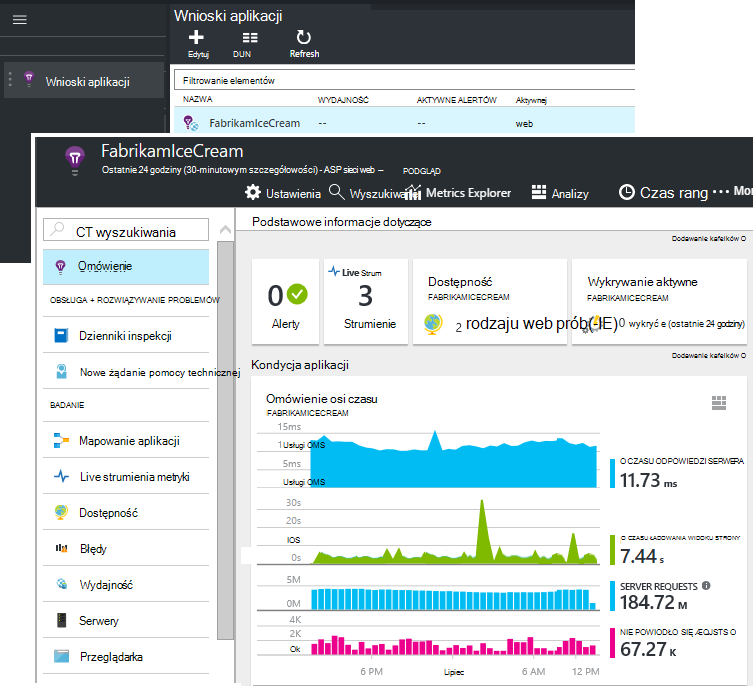

Jeśli nie istnieje, utwórz go:

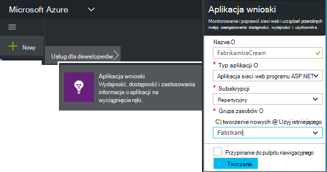

*Już pytania?* [Więcej informacji na temat tworzenia zasobu](app-insights-create-new-resource.md).

### Dodawanie skryptu SDK do aplikacji lub strony sieci web

W przewodniku Szybki Start uzyskać skrypt dla stron sieci web:

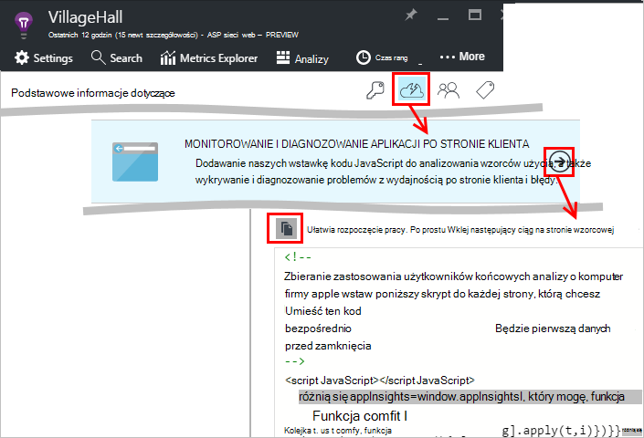

Wstawianie skrypt tuż przed `</head>` znacznika każdej strony, które chcesz śledzić. Jeśli witryny sieci Web zawiera strony wzorcowej, możesz umieścić skrypt istnieje. Na przykład:

* W projekcie ASP.NET MVC chcesz umieścić ją w`View\Shared\_Layout.cshtml`
* W witrynie programu SharePoint, w Panelu sterowania otwórz [Ustawienia witryny i strony wzorcowej](app-insights-sharepoint.md).

Skrypt zawiera klucz oprzyrządowania kierujący danych zasobu wniosków aplikacji. 

([Szczegółowego wyjaśnienie skryptu](http://apmtips.com/blog/2015/03/18/javascript-snippet-explained/))

*(Jeśli korzystasz z ramy znanego strony sieci web, poszukaj karty wniosków aplikacji. For example, ma [modułu AngularJS](http://ngmodules.org/modules/angular-appinsights).)*

## Szczegółowe konfiguracji

Istnieje kilka [Parametry](https://github.com/Microsoft/ApplicationInsights-JS/blob/master/API-reference.md#config) , które można ustawić, ale w większości przypadków nie należy. Na przykład możesz wyłączyć lub ograniczyć liczbę połączeń Ajax zgłoszone na widok strony (w celu zmniejszenia ruchu). Można także ustawić tryb debugowania mają telemetrycznego przenosić szybko potoku bez jest przetwarzany wsadowo.

Aby ustawić te parametry, Wyszukaj ten wiersz wstawkę kodu i dodać więcej elementów przecinkami po nim:

    })({
      instrumentationKey: "..."
      // Insert here
    });

[Dostępne parametry](https://github.com/Microsoft/ApplicationInsights-JS/blob/master/API-reference.md#config) to:

    // Send telemetry immediately without batching.
    // Remember to remove this when no longer required, as it
    // can affect browser performance.
    enableDebug: boolean,

    // Don't log browser exceptions.
    disableExceptionTracking: boolean,

    // Don't log ajax calls.
    disableAjaxTracking: boolean,

    // Limit number of Ajax calls logged, to reduce traffic.
    maxAjaxCallsPerView: 10, // default is 500

    // Time page load up to execution of first trackPageView().
    overridePageViewDuration: boolean,

    // Set these dynamically for an authenticated user.
    appUserId: string,
    accountId: string,

## Uruchamianie aplikacji

Uruchamianie aplikacji sieci web, z niej korzystać podczas do generowania telemetrycznego i poczekaj kilka sekund. Można uruchomić go przy użyciu klawisza **F5** na komputerze rozwoju lub opublikować go i umożliwić użytkownikom odtwarzanie z nim.

Jeśli chcesz sprawdzić telemetrycznego, wysyłania aplikacji sieci web do wniosków aplikacji, za pomocą narzędzia debugowania w przeglądarce (**F12** na wiele przeglądarek). Dane są wysyłane do dc.services.visualstudio.com.

## Eksplorowanie danych wydajności przeglądarki

Otwórz karta przeglądarki, aby wyświetlić dane dotyczące wydajności zagregowane z przeglądarki użytkownika.

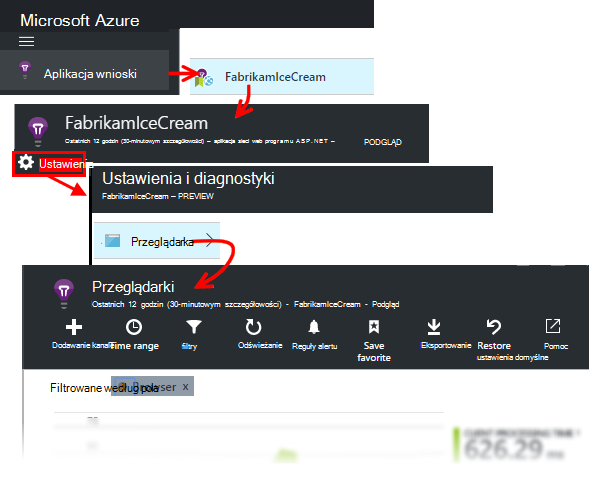

*Jeszcze nie danych? Kliknij pozycję * *odświeżanie* * w górnej części strony. Nadal nic? Zobacz [Rozwiązywanie problemów ze](app-insights-troubleshoot-faq.md).*

Karta przeglądarki jest [Karta eksploratora metryk](app-insights-metrics-explorer.md) ze wstępnie ustawionych filtrów i opcje wykresu. Jeśli i zapisz wynik jako ulubionej możesz edytować zakres czasu, filtry i konfiguracji wykresu. Kliknij przycisk **Przywróć domyślne** , aby powrócić do pierwotnej konfiguracji karta.

## Wydajność ładowania strony

U góry jest wykres segmentowany czasem ładowania strony. Całkowita wysokość wykresu reprezentuje Średni czas na ładowanie i wyświetlanie stron z Twojej aplikacji w przeglądarce użytkownika. Czas mierzona jest z przeglądarka wysyła początkowe żądanie HTTP do wszystkich synchroniczne obciążenia, które zostały przetworzone zdarzenia, w tym układu i uruchamianie skryptów. Nie zawiera asynchroniczne zadań, takich jak ładowanie składników web Part z AJAX połączeń.

Wykres segmenty czas ładowania strony sumy do [standardowego chronometrażu zdefiniowanych przez W3C](http://www.w3.org/TR/navigation-timing/#processing-model). 

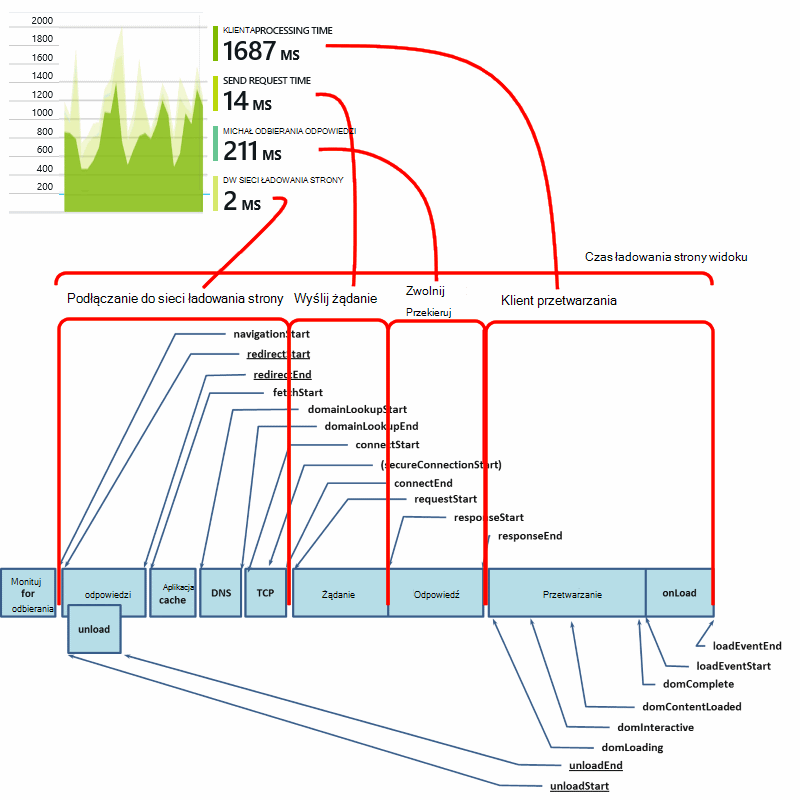

Należy zauważyć, że podczas *połączenia z siecią* często jest mniejsze niż można by się spodziewać, ponieważ jest to wartość średnia na wszystkie żądania z poziomu przeglądarki na serwerze. Wiele pojedynczych żądań mieć czas połączenia 0, ponieważ istnieje już aktywnego połączenia z serwerem.

### Spowalniać ładowania?

Ładowaniu stron wolne są głównym źródłem niezadowolenie dla użytkowników. Jeśli wykres wskazuje ładowaniu stron działa wolno, jest łatwe przeanalizować diagnostyczne.

Wykres pokazuje średnią wszystkich ładowaniu stron w aplikacji. Jeśli problem jest ograniczona do określonych stron obejrzeć dalsze dół karta, gdy istnieje siatki rozdzielonych adres URL strony:

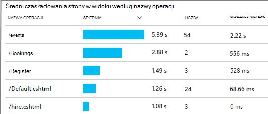

Zwróć uwagę, liczbę wyświetlanie stron i odchylenia standardowego. Jeśli liczba stron jest bardzo niskie, następnie problem nie ma wpływu na użytkowników znacznie. Odchylenie standardowe Wysoka (porównywalna do samej średnia) wskazuje wiele odmian między pojedynczych pomiarów.

**Powiększyć na jeden adres URL i widok o jedną stronę.** Kliknij dowolną nazwę strony, aby wyświetlić karta wykresy przeglądarki filtrowane tylko do tego adresu URL; a następnie w wystąpieniu widoku strony.

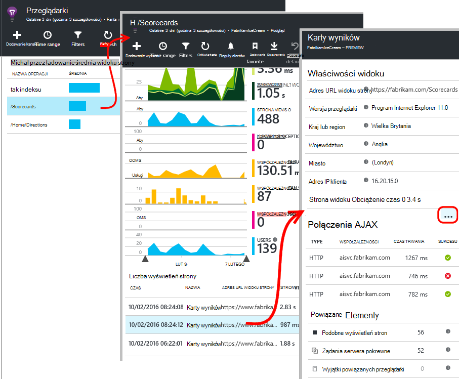

Kliknij pozycję `...` Aby uzyskać pełną listę właściwości to zdarzenie lub Sprawdzanie połączenia Ajax i powiązane z nimi zdarzenia. Powolne połączenia Ajax wpływa na całkowity czas ładowania strony, jeśli są one synchroniczne. Powiązane z nimi zdarzenia obejmują żądania serwera dla tego samego adresu URL (jeśli została skonfigurowana wniosków aplikacji na serwerze sieci web).

**Strona wyników w czasie.** Ponownie w karta przeglądarki Zmień czas ładowania strony widoku siatki na wykresie liniowym, aby sprawdzić, czy dokonano wartości w określonym czasie:

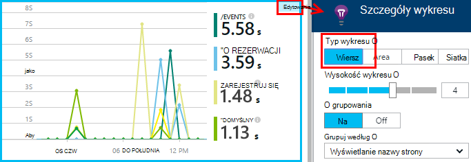

**Segmentu przez innych wymiarów.** Być może stron są tempo załadować konkretnej przeglądarki, klienta z systemem operacyjnym lub lokalizacji użytkownika? Dodawanie nowego wykresu i poeksperymentować z wymiarów **Grupuj według** .

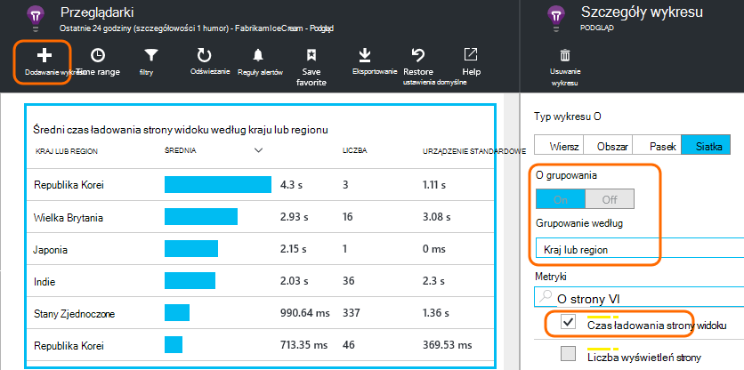

## Wydajność AJAX

Upewnij się, również działają wezwań AJAX na stronach sieci web. Są często stosowane do wypełnienia asynchroniczne elementów na stronie. Mimo że całej strony może załadować niezwłocznie, użytkowników może być udaremnione przez monomerów na pusty składników web Part, trwa oczekiwanie na wyświetlenie w nich danych.

AJAX wywołań ze strony sieci web są wyświetlane w przeglądarkach karta jako zależności.

Istnieją wykresy podsumowań w górnej części karta:

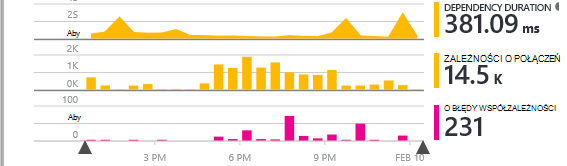

i szczegółowe siatki dolnym w dół:

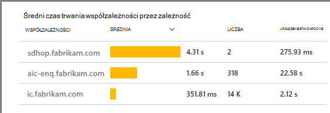

Kliknij każdy wiersz, aby uzyskać szczegółowe informacje.

> [AZURE.NOTE] Po usunięciu filtru przeglądarki na karta zarówno serwera, jak i zależności AJAX zawartymi w wykresach. Kliknij przycisk Przywróć domyślne, aby skonfigurować filtr.

**Aby przechodzić do zakończonego niepowodzeniem połączenia Ajax** przewiń w dół do siatki błędy współzależności, a następnie kliknij wiersz, aby wyświetlić określone wystąpienia.

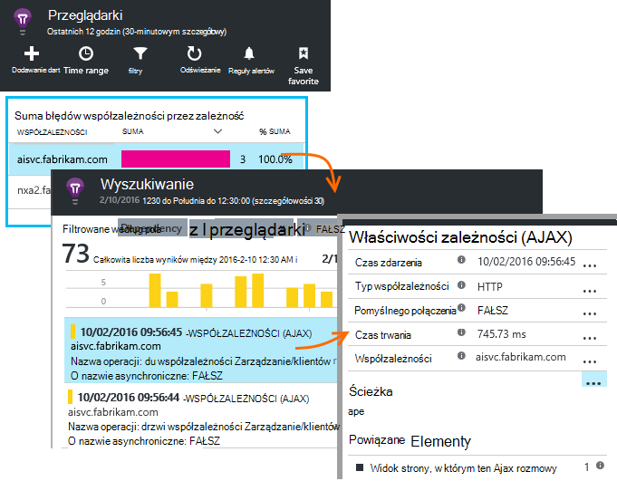

Kliknij pozycję `...` dla pełnego telemetrycznego połączenia Ajax.

### Nie połączeń Ajax zgłoszone?

Połączenia AJAX zawierać dowolne HTTP wywołań skryptu strony sieci web. Jeśli nie widzisz ich zgłoszone, sprawdź, czy nie ustawiona wstawkę kodu `disableAjaxTracking` lub `maxAjaxCallsPerView` [Parametry](https://github.com/Microsoft/ApplicationInsights-JS/blob/master/API-reference.md#config).

## Wyjątki w przeglądarce

Na karta przeglądarki jest wykres podsumowania wyjątki i siatki typów wyjątku dodatkowo karta w dół.

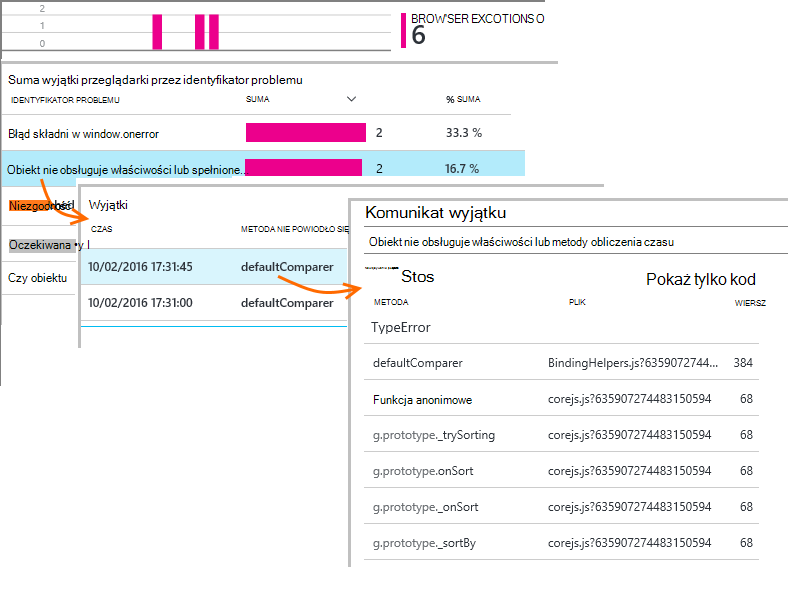

Jeśli nie widzisz przeglądarki wyjątki zgłoszone, sprawdź, czy nie ustawiona wstawkę kodu `disableExceptionTracking` [parametru](https://github.com/Microsoft/ApplicationInsights-JS/blob/master/API-reference.md#config).

## Przeprowadzanie inspekcji zdarzeń widoku pojedynczej strony

Zazwyczaj telemetrycznego widoku strony jest analizowane przez wniosków aplikacji i wyświetlić tylko skumulowana raporty, średnia wszystkich użytkowników. Jednak na potrzeby debugowania, zapoznanie się z pojedynczej strony przeglądanie zdarzeń.

W polu Wyszukaj w diagnostyczne karta, ustaw filtry do widoku Strona.

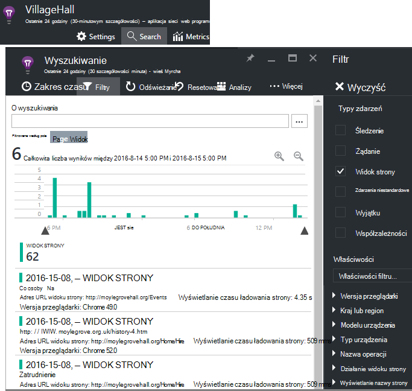

Wybierz dowolne zdarzenie, aby wyświetlić więcej szczegółów. Na stronie Szczegóły kliknij przycisk "..." Aby wyświetlić więcej szczegółów.

> [AZURE.NOTE] W przypadku korzystania z [funkcji wyszukiwania](app-insights-diagnostic-search.md), zwróć uwagę, trzeba dopasować cały wyrazy: "Abou" i "temat" nie odpowiadają "O".

Umożliwia także zaawansowanych [analiz kwerendy języka](app-insights-analytics-tour.md) do wyszukiwania wyświetleń stron.

### Właściwości widoku strony

* **Czas trwania widok strony** 

 * Domyślnie razem, gdy trwa ładowanie strony z klienta żądanie pełnego obciążenia (w tym pliki pomocnicze, ale z wyłączeniem asynchroniczne zadań, takich jak Ajax połączenia). 
 * Jeśli ustawisz `overridePageViewDuration` w [konfiguracji strony](#detailed-configuration)interwał między klientem żądanie na wykonanie pierwszego `trackPageView`. Jeśli został on przeniesiony trackPageView z pozycji normalny po zainicjowaniu skrypt, odpowiada inną wartość.
 * Jeśli `overridePageViewDuration` jest zestaw i czas trwania argument jest dostępna w `trackPageView()` połączenie, a następnie zamiast niej zostanie użyta wartość argumentu. 

## Zlicza niestandardowej strony

Domyślnie liczbę stron występuje zawsze, gdy nowa strona ładuje do przeglądarki klienta.  Ale warto liczba wyświetleń strony dodatkowe. Na przykład strony mogą być wyświetlane jego zawartości na kartach i mają zostać zliczone strony, gdy użytkownik przełączy się karty. Lub kodu JavaScript na stronie może być Pobierz nową zawartość bez zmieniania adresu URL w przeglądarce.

Wstawianie połączenia JavaScript tak we właściwym momencie w kodzie klienta:

    appInsights.trackPageView(myPageName);

Nazwę strony może zawierać znaków jako adres URL, ale cokolwiek po znaku "#" lub "?" jest ignorowana.

## Użycie śledzenia

Chcesz dowiedzieć się, co zrobić z aplikacji użytkowników?

* [Więcej informacji na temat zastosowania śledzenia](app-insights-web-track-usage.md)
* [Więcej informacji na temat zdarzenia niestandardowe i metryki interfejsu API](app-insights-api-custom-events-metrics.md).

#### Klip wideo: Śledzenie użycia

> [AZURE.VIDEO tracking-usage-with-application-insights]

## Następne kroki

* [Śledzenie użycia](app-insights-web-track-usage.md)
* [Zdarzenia niestandardowe i wskaźniki](app-insights-api-custom-events-metrics.md)
* [Dowiedz się środek kompilacji](app-insights-overview-usage.md)

