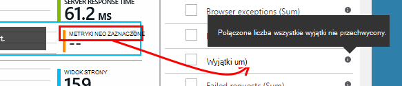

<properties 
    pageTitle="Poznawanie metryki w aplikacji wniosków | Microsoft Azure" 
    description="Jak interpretować wykresy w Eksploratorze metryczne i jak dostosować karty metryczne Eksploratora." 
    services="application-insights" 
    documentationCenter=""
    authors="alancameronwills" 
    manager="douge"/>

<tags 
    ms.service="application-insights" 
    ms.workload="tbd" 
    ms.tgt_pltfrm="ibiza" 
    ms.devlang="na" 
    ms.topic="article" 
    ms.date="10/15/2016" 
    ms.author="awills"/>
 
# Poznawanie metryki w aplikacji wniosków

Metryki w [Aplikacji wniosków] [ start] mierzonych i liczby zdarzeń, które są wysyłane w telemetrycznego z poziomu aplikacji. Ułatwiają one wykrywanie występują problemy z wydajnością i obejrzyj trendów w sposobu używania aplikacji. Jest szeroką gamę standardowy metryki i możesz również utworzyć własne niestandardowe metryki i zdarzeń.

Liczników wskaźników i wydarzenia są wyświetlane na wykresach zagregowane wartości, takie jak sum, średnie lub liczebności.

Oto przykładowy wykres:

Niektórych typów wykresów są podzielone: całkowita wysokość wykresu w dowolnym momencie jest sumą metryki wyświetlane. Legenda domyślnie wyświetlane są największych ilości.

Linie kropkowane wyświetlana wartość metryki tydzień wcześniej.

## Zakres czasu

Możesz zmienić zakres czasu objęte siatek na dowolnym karta lub wykresów.

Jeśli masz oczekiwano pewne dane, które jeszcze nie pojawiły się, kliknij przycisk Odśwież. Wykresy odświeżanie się w odstępach, ale interwały są dłużej większych zakresów czasu. W trybie wersji może minąć trochę czasu, zanim danych zostanie dodane później potoku analizy na wykres.

Aby powiększyć fragment wykresu, przeciągnij nad nim:

Kliknij przycisk Cofnij powiększenie, aby go przywrócić.

## Wartości dokładności i punkt

Umieść kursor myszy na wykresie, aby wyświetlić wartości miar w tym momencie.

Wartość metryki w określonym miejscu jest agregowane przedziale próbki. 

Interwał pobierania lub "dokładności" jest wyświetlany w górnej części karta. 

Można dostosować szczegółowości w karta zakres czasu:

Stopnie szczegółowości dostępne zależy od wybranego przedziału czasu. Jawne stopnie szczegółowości są rozwiązania alternatywne wobec "Automatyczny" szczegółowości dla przedziału czasu. 

## Eksplorator metryki

Kliknij dowolny wykres na karta Przegląd, aby wyświetlić szczegółowe zestawu pokrewne wykresy i siatki. Możesz edytować te wykresy i siatki odbiorcom skoncentrowanie się na stronie Szczegóły, który Cię interesuje.

Lub wystarczy kliknąć przycisk Eksploratora metryki w nagłówku karta Przegląd.

Na przykład kliknij za pośrednictwem aplikacji sieci web wykres żądania nie powiodło się:

## Co oznaczają dane?

Legenda z boku domyślnie zazwyczaj zawiera wartość zagregowaną okresie wykresu. Po umieszczeniu wskaźnika myszy na wykresie, dzięki niemu wartość w tym momencie.

Każdy punkt danych na wykresie jest sumą wartości danych otrzymanych w poprzednim interwał pobierania lub "dokładności". Stopień szczegółowości jest wyświetlana u góry karta i zależy od ogólnej skali czasu wykresu.

Może być zagregowana metryki na różne sposoby: 

 * **Suma** sumuje wartości punktów danych odebranych przez interwał pobierania lub okres wykresu.
 * **Średnia** dzieli sumę przez liczbę punktów danych odebranych przez interwał.
 * Zlicza **unikatowe** są używane dla liczby użytkowników i konta. W okresie próbek lub w okresie wykres na rysunku pokazano liczba różnych użytkowników, w tym czasie.

Możesz zmienić metodę agregacji:

Metoda domyślna dla każdego metryki jest wyświetlana podczas tworzenia nowego wykresu lub gdy zaznaczona wszystkie metryki:

## Edytowanie siatki i wykresy

Aby dodać nowego wykresu do karta:

Kliknij przycisk **Edytuj** na wykresie istniejącym lub nowym do edytowania, co zawiera:

Można wyświetlić więcej niż jeden Metryka na wykresie, jeśli istnieją ograniczenia dotyczące kombinacje, które mogą być wyświetlane razem. Jak wybrać jeden metryka, niektóre innych są wyłączone. 

Jeśli kodowane [niestandardowe metryki] [ track] do aplikacji (połączeń TrackMetric i TrackEvent) zostaną one wymienione w tym miejscu.

## Segmenty danych

Możesz podzielić metryki przez właściwość — na przykład, aby porównać wyświetleń stron na klientach z innych systemów operacyjnych. 

Zaznacz na wykresie lub siatce, Przełącz na grupowania i wybierz właściwość do Grupuj według:

> [AZURE.NOTE] Użycie opcji grupowania, typy obszar i wykres słupkowy zapewniają skumulowany wyświetlania. To jest odpowiednie miejsce, w którym metoda agregacji to suma. Typ agregacji w przypadku średnia, wybierz typy wyświetlania linii lub siatkę, ale. 

Jeśli kodowane [niestandardowe metryki] [ track] do aplikacji i zawierają wartości nieruchomości, będziesz mieć możliwość wybierz właściwość z listy.

Wykres jest za mały dla podzielonych danych? Dopasowywanie wysokości:

## Filtrowanie danych

Aby wyświetlić tylko metryki dla wybranego zestawu wartości właściwości:

Jeśli nie zaznaczysz żadnych wartości dla określonej właściwości jest taka sama jak zaznaczając je wszystkie: istnieje bez filtru na tej właściwości.

Zwróć uwagę, liczby wydarzeń obok każdej wartości właściwości. Po wybraniu wartości jednej właściwości są tak dostosowywane zlicza obok wartości innych właściwości.

Filtry są stosowane do wszystkich schematów na kartę. Jeśli chcesz różne filtry zastosowane do różne wykresy, tworzenie i zapisywanie różnych metryki karty. Jeśli chcesz, możesz przypiąć wykresów z innej karty do pulpitu nawigacyjnego, tak, aby były widoczne obok siebie.

### Usuwanie ruchu test robot i sieci web

Za pomocą filtru **ruchu rzeczywistą lub syntetycznego** i sprawdź **rzeczywistą**.

Można również filtrować przez **źródło syntetycznych ruchu**.

### Aby dodać do listy filtrów właściwości

Czy chcesz odfiltrować telemetrycznego w kategorii wybranej przez użytkownika? Na przykład może dzielenie konta użytkowników w różne kategorie, a potem segmentu danych według kategorii.

[Tworzenie własnych właściwości](app-insights-api-custom-events-metrics.md#properties). Ustaw go w [Inicjator telemetrycznego](app-insights-api-custom-events-metrics.md#telemetry-initializers) aby były wyświetlane wszystkie telemetrycznego — w tym telemetrycznego standardowy, wysyłane przez różne moduły SDK.

## Edytowanie typu wykresu

Należy zauważyć, że możesz przełączać się między siatki i wykresy:

## Zapisywanie swojego karta metryki

Po utworzeniu niektórych typów wykresów, zapisz je jako ulubione. Możesz określić, czy udostępnić go innym członkom zespołu, jeśli korzystasz z konta organizacji.

Aby wyświetlić karta ponownie, **Przejdź do pozycji Karta Przegląd** i otwieranie ulubionych:

Jeśli wybierzesz zakres czasu względne po zapisaniu, karta zostaną zaktualizowane przy użyciu najnowszych metryki. Jeśli wybierzesz zakres czasu bezwzględnego będzie widoczny te same dane co godzinę.

## Resetowanie karta

Jeśli edytujesz karta, ale następnie chcesz wrócić do oryginalnej wersji zapisany zestaw, po prostu kliknij przycisk Resetuj.

## Strumień na żywo metryki: błyskawiczne metryki Zamknij monitorowania

Strumień na żywo metryki zawiera usługi metryki aplikacji bezpośrednio w tym samym momencie, z najbliższego opóźnienie czasu rzeczywistego 1 sekundę. Jest to bardzo przydatne, gdy masz udostępnia nową kompilację i chcesz upewnić się, że wszystko jest działają zgodnie z oczekiwaniami lub badania zdarzenia w czasie rzeczywistym.

W przeciwieństwie do Eksploratora metryki strumień metryki na żywo Wyświetla ustalony zbiór metryki. Dane trwa tylko pod warunkiem jest na wykresie, a następnie jest pomijany. 

Strumień na żywo metryki jest dostępna z SDK wniosków aplikacji dla programu ASP.NET, wersji 2.1.0 lub nowszej.

## Ustawianie alertów

Aby otrzymywać powiadomienia pocztą e-mail wartości dowolnym metryki, Dodaj alertu. Możesz albo wysłać wiadomość e-mail, administratorom konta lub do adresów e-mail określone.

[Dowiedz się więcej o alerty][alerts].

## Eksportowanie do programu Excel

Możesz wyeksportować dane wyświetlane w Eksploratorze metryki do pliku programu Excel. Wyeksportowane dane zawiera dane z wszystkich wykresów i tabel w portalu. 

Na oddzielnym arkuszu w pliku programu Excel są eksportowane dane dla każdego wykres lub tabelę.

To co widzisz zakres eksportowanych. Jeśli chcesz zmienić zakres danych, wyeksportowane zmienić zakres czasu lub filtry. W przypadku tabel Jeśli polecenie **więcej ładowanie** jest wyświetlany, można kliknąć go przed kliknięciem przycisku Eksportuj ma więcej danych wyeksportowane.

*Eksportowanie działa tylko w przypadku programu Internet Explorer i Chrome obecnie. Pracujemy nad Dodawanie obsługi innych przeglądarek.*

## Eksportowanie ciągły

Jeśli chcesz, aby dane przez cały czas wyeksportowane, dzięki czemu można przetwarzać go zewnętrznie, warto rozważyć użycie, [Eksportowanie ciągły](app-insights-export-telemetry.md).

### Power BI

Jeśli chcesz, aby jeszcze bardziej rozbudowane widoki danych, można [eksportować do usługi Power BI](http://blogs.msdn.com/b/powerbi/archive/2015/11/04/explore-your-application-insights-data-with-power-bi.aspx).

## Analizy

[Analizy](app-insights-analytics.md) jest bardziej uniwersalny umożliwia analizowanie usługi telemetrycznego przy użyciu języka zaawansowanych kwerend. Używaj, jeśli chcesz połączyć lub obliczyć wyników z metryki lub wykonywanie badań w deph wydajności ostatnio używane do aplikacji. Z drugiej strony za pomocą Eksploratora metryki Chcąc automatycznego odświeżania wykresów na pulpicie nawigacyjnym i alerty.

## Rozwiązywanie problemów

*Wszelkie dane nie jest wyświetlane na wykresie.*

* Filtry są stosowane do wszystkich schematów na karta. Upewnij się, że podczas jest skoncentrowanie się na jednym wykresie, nie ustawiono filtr, z wyłączeniem wszystkich danych na innym. 

    Jeśli chcesz ustawić różne filtry różne wykresy, utwórz je w innej karty, zapisz je jako osobne ulubionych. Jeśli chcesz, możesz je przypiąć do pulpitu nawigacyjnego, tak, aby były widoczne obok siebie.

* Jeśli wykres pogrupować właściwość, która nie jest zdefiniowana na metrykę, będą nic się nie na wykresie. Spróbuj wyczyścić "Grupuj według" lub wybierz właściwość grupowania.
* Dane dotyczące wydajności (CPU, Wy i tak dalej) jest dostępna dla języka Java usług sieci web, Windows aplikacji komputerowych [web usług IIS, aplikacji i usług w przypadku zainstalowania monitor stanu](app-insights-monitor-performance-live-website-now.md)i [Usług w chmurze Azure](app-insights-azure.md). Nie jest dostępna dla Azure witryn sieci Web.

## Następne kroki

* [Monitorowanie użycia w aplikacji wniosków](app-insights-overview-usage.md)
* [Używanie funkcji wyszukiwania diagnostyczne](app-insights-diagnostic-search.md)

<!--Link references-->

[alerts]: app-insights-alerts.md
[start]: app-insights-overview.md
[track]: app-insights-api-custom-events-metrics.md

 