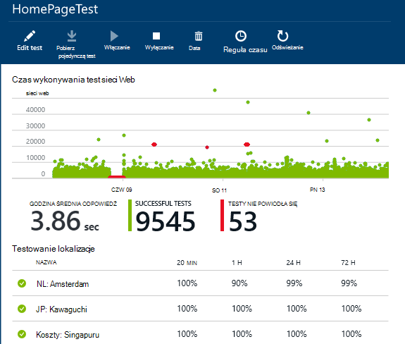
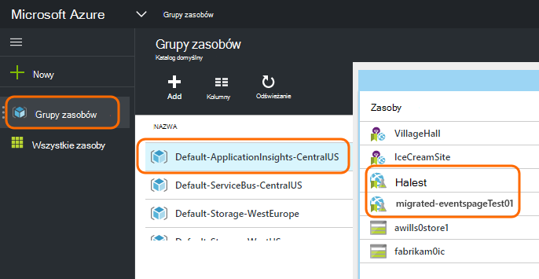
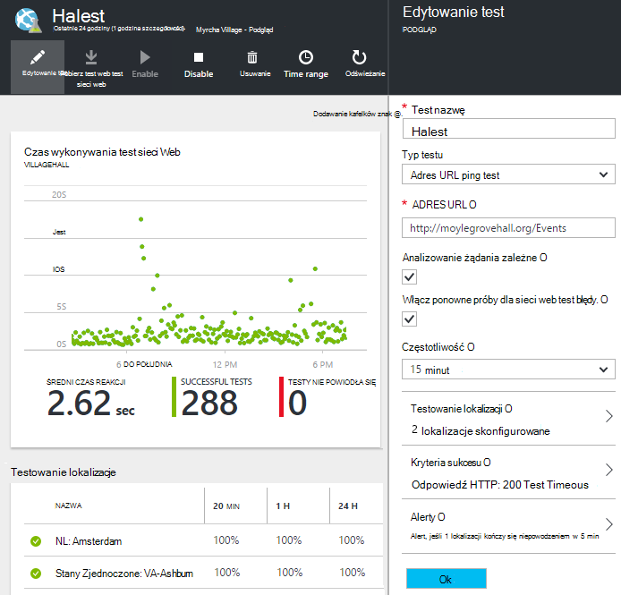

<properties 
    pageTitle="Migrowanie Azure punkt końcowy do sprawdza dostępności wniosków aplikacji" 
    description="Migrowanie klasyczny testów monitorowania punktu końcowego Azure do aplikacji wniosków dostępność testów przez 31 października 2016."
    services="application-insights" 
    documentationCenter=""
    authors="soubhagyadash" 
    manager="douge"/>

<tags 
    ms.service="application-insights" 
    ms.workload="tbd" 
    ms.tgt_pltfrm="ibiza" 
    ms.devlang="na" 
    ms.topic="article" 
    ms.date="07/25/2016" 
    ms.author="awills"/>
 
# Przechodzenie z Azure punktu końcowego monitorowania, aby sprawdza dostępności wniosków aplikacji

Używasz [monitorowania punkt końcowy](https://blogs.msdn.microsoft.com/mast/2013/03/03/windows-azure-portal-update-configure-web-endpoint-status-monitoring-preview/) dla aplikacji Azure? Przez *31 października 2016*firma Microsoft będzie Zamień je [sprawdza dostępności](app-insights-monitor-web-app-availability.md)nowych i bardziej zaawansowanych. Już utworzono niektórych nowych testów, mimo że są one wyłączone do 31 października 2016. 

Umożliwia edytowanie nowych badań i czy przełącznik samodzielnie ma. Znajdziesz je [Azure portal](https://portal.azure.com) w grupie zasobów domyślnego-ApplicationInsights-CentralUS.

## Co to są sprawdza dostępności?

Sprawdzanie dostępności jest funkcją Azure, której ciągłe sprawdza, czy dowolnej witryny sieci web lub usługi jest w górę i pracy przez wysłanie żądania HTTP do niego (pojedynczy ping testów lub badań sieci web programu Visual Studio) z lokalizacji do 16 na całym świecie. 

W [klasycznym portal Azure](https://manage.windowsazure.com)testy były nazywane monitorowania punktu końcowego. Zostały one bardziej ograniczony zakres. Nowe sprawdza dostępności są znaczącej poprawy:

* Do 10 testy sieci web programu Visual Studio lub testy ping na zasób wniosków aplikacji. 
* Lokalizacje do 16 na całym świecie wysyłanie wezwań test do aplikacji sieci web. Większą kontrolę nad kryteriami sukcesu test. 
* Testowanie witryny sieci web ani usługi — nie tylko Azure web apps.
* Testowanie ponowne próby: zmniejszanie alerty dodatnią wartość FAŁSZ z powodu problemów z sieci. 
* Webhooks można otrzymywać powiadomienia HTTP POST alertów.

Dowiedz się więcej o [sprawdza dostępności tutaj](app-insights-monitor-web-app-availability.md).

Sprawdza dostępności są częścią [Wniosków aplikacji usługi programu Visual Studio](app-insights-overview.md), czyli extensible analizy obsługę dowolnej aplikacji sieci web.

## Co się dzieje z Mój punkt końcowy sprawdza, dlatego?

* Firma Microsoft zostały skopiowane punkt końcowy monitorowania badań nowych badań dostępność wniosków aplikacji.
* Nowe sprawdza dostępności są obecnie wyłączone, a wciąż działają stare testów punktu końcowego.
* Alerty reguł *nie* migracji. Wstępnie zdefiniowane nowych badań za pomocą reguły domyślne:
 * Wyzwalacze, gdy więcej niż 1 lokalizacji raportów błędy w ciągu 5 minut.
 * Wysyła wiadomość e-mail dla administratorów subskrypcji.

W [Azure portal](https://portal.azure.com)zmigrowanych testów można znaleźć w grupie zasobów "Domyślny-ApplicationInsights-CentralUS". Nazwy test są prefiks "Migrated-". 

## Co należy zrobić?

* Jeśli jakiś sposób nieodebrane się migrowanie testy, nowych badań dostępność można [łatwo skonfigurować](app-insights-monitor-web-app-availability.md).

### Opcja A: wykonaj nic. Pozostaw ją z nami.

**Na 31 października 2016,** zostaną wykonane:

* Wyłącz starą testów punktu końcowego.
* Włącz migracją sprawdza dostępności.

### Opcja B: możesz zarządzać i/lub włączanie nowych badań.

* Przeglądanie i edytowanie dostępność nowych testów w nowej [Azure portal](https://portal.azure.com). 
 * Przeglądanie kryteriów wyzwalacza
 * Przejrzyj adresatów wiadomości e-mail
* Włączanie nowych badań
* Firma Microsoft wyłączy punkt końcowy starsze monitorowania badania 31 października 2016 

### Opcja C: opcjonalnych się

Jeśli nie chcesz używać sprawdza dostępności, możesz usunąć je w [Azure portal](https://portal.azure.com). Ponadto znajduje się link Anuluj subskrypcję u dołu wiadomości e-mail z powiadomieniem.

Firma Microsoft usunie nadal starą badania punktu końcowego 31 października 2016. 

## Jak edytować nowych testów?

Zaloguj się do [portalu Azure](https://portal.azure.com) i znajdowanie testów web "Migrated-": 

Edytowanie i/lub włączyć test:

## Dlaczego tak się dzieje?

Lepsze usługi. Usługa punktu końcowego stare była znacznie węższy. Może dostarczyć tylko dwa adresy URL badań prosty ping z 3 lokalizacji geo na maszyn wirtualnych Azure lub web app. Nowych badań można uruchomić testy kroku wielu sieci web z maksymalnie 16 lokalizacjach, a można określić maksymalnie 10 badań dla jednej aplikacji. Istnieje możliwość przetestowania dowolny adres URL — nie ma być Azure witryny.

Nowych badań skonfigurowano oddzielnie z aplikacji sieci web lub maszyn wirtualnych, które testowania. 

Firma Microsoft jest przeprowadzana migracja testy, aby upewnić się, że nadal mają kontrolę nad nimi podczas korzystania z nowego portalu. 

## Co to jest aplikacja wniosków?

Nowe sprawdza dostępności są częścią [Visual Studio aplikacji wnioski](app-insights-overview.md). Oto [2-minutowym klipie wideo](http://go.microsoft.com/fwlink/?LinkID=733921).

## Jestem płacisz dla nowych testów?

Testy migracją zostały skonfigurowane w zasób wniosków aplikacji w planie bezpłatne domyślne. Dzięki temu zbiór maksymalnie 5 milionów punktów danych. Które łatwo obejmuje wielkość danych, które obecnie użyje testy. 

Oczywiście jeśli wniosków aplikacji, takich jak i utworzyć więcej sprawdza dostępności lub przyjąć więcej monitorowanie wydajności i funkcji diagnostycznych następnie wygenerowany więcej punktów danych.  Jednak wynik tylko będzie, że może być trafisz przydziału dla bezpłatne planu. Nie otrzymasz BOM, chyba że i w przypadku planów Standard lub Premium. 

[Dowiedz się więcej o aplikacji wniosków ceny i monitorowania przydziału](app-insights-pricing.md). 

## Co to jest i nie jest migrowane?

Zachowane ze starej testy punkt końcowy:

* Adres URL punktu końcowego zostanie sprawdzone.
* Lokalizacje Geo, z których zostaną wysłane wezwania.
* Częstotliwość pozostaje 5 minut.
* Limit czasu test pozostaje 30 sekund. 

Nie są migrowane:

* Reguła wyzwalacza alert. Reguła możemy zainstalować wyzwalaczy po 1 lokalizacji raportów błędy w 5 minut.
* Adresaci alertów. Wiadomości e-mail z powiadomieniem będą wysyłane do subskrypcji właścicieli i Współtworzenie. 

## Jak znaleźć nowych testów?

Możesz edytować dowolne nowych badań teraz przydatna. Zaloguj się do [portalu Azure](https://portal.azure.com), otwórz **Grup zasobów** i wybierz **Domyślny-ApplicationInsights-CentralUS**. W tej grupie można znaleźć nowych badań sieci web. [Więcej informacji na temat nowych badań dostępności](app-insights-monitor-web-app-availability.md).

Należy zauważyć, że nowy alert wiadomości e-mail będą wysyłane z tego adresu: alerty wniosków aplikacji(ai-noreply@microsoft.com)

## Co się stanie, jeśli nic się nie mam?

Opcja odpowiedzi zostaną zastosowane. Firma Microsoft zostanie włączony migracją testów i skonfigurować domyślne reguły alertów, jak powyżej. Musisz dodać dowolne niestandardowe reguły alertów adresatów wymienionych powyżej. Firma Microsoft wyłączy punkt końcowy starsze monitorowania testów. 

## Miejsce, w którym można przekazywać opinie na temat? 

Dziękujemy za swoją opinię. Zapoznaj się z [e-mail](mailto:vsai@microsoft.com). 

