<properties
    pageTitle="Diagnozowanie problemów z wydajnością na witrynę sieci Web usług IIS uruchomionego | Microsoft Azure"
    description="Monitorowanie wydajności witryny sieci Web bez ponownego wdrażania go. Za pomocą autonomicznego lub przy użyciu aplikacji wniosków SDK uzyskanie telemetrycznego zależności."
    services="application-insights"
    documentationCenter=".net"
    authors="alancameronwills"
    manager="douge"/>

<tags
    ms.service="application-insights"
    ms.workload="tbd"
    ms.tgt_pltfrm="ibiza"
    ms.devlang="na"
    ms.topic="get-started-article"
    ms.date="10/24/2016"
    ms.author="awills"/>

# Aplikacje sieci web dokument w czasie rzeczywistym w aplikacji wniosków

*Wnioski aplikacji jest w podglądzie.*

Przygotować instrumentację live przeglądania przy użyciu programu Visual Studio wniosków aplikacji, bez konieczności modyfikowania i ponownie wdróż kodzie. W aplikacji są obsługiwane przez serwer usług IIS lokalnego instalowania Monitor stanu; lub jeśli aplikacje Azure web lub uruchomić w maszyn wirtualnych Azure, możesz zainstalować rozszerzenia aplikacji wnioski. (Są również osobnych artykułów Instrumentacja [live J2EE aplikacji sieci web](app-insights-java-live.md) i [Usług w chmurze Azure](app-insights-cloudservices.md)).

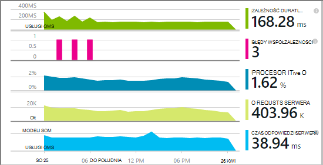

Dostępne są następujące opcje trzy marszrut stosowanie wniosków aplikacji do aplikacji sieci web .NET:

* **Tworzenie czasu:** [Dodawanie aplikacji wniosków SDK] [greenbrown] w kodzie aplikacji sieci web. 
* **Czas wykonywania:** Instrumentu aplikacji sieci web na serwerze, w sposób opisany poniżej, bez odbudowanie i ponowne rozmieszczanie kodu.
* **Oba:** Tworzenie zestawu SDK do kodu aplikacji sieci web, a także Zastosuj rozszerzenia wykonywalna. Najlepszy obu opcji. 

Poniżej przedstawiono podsumowanie uzyskiwanie każdego drogą:

||Tworzenie czasu|Czas wykonywania|
|---|---|---|
|Żądania i wyjątki|Tak|Tak|
|[Bardziej szczegółowe wyjątki](app-insights-asp-net-exceptions.md)||Tak|
|[Narzędzia diagnostyczne współzależności](app-insights-asp-net-dependencies.md)|Na .NET 4.6 +|Tak|
|[Liczniki wydajności systemu](app-insights-performance-counters.md)||Usług IIS lub Azure usługi w chmurze, nie Azure w przeglądarce|
|[Interfejs API umożliwiający telemetrycznego niestandardowe][api]|Tak||
|[Integracja dziennika śledzenia](app-insights-asp-net-trace-logs.md)|Tak||
|[Strony użytkownika & widoku danych](app-insights-javascript.md)|Tak||
|Bez konieczności odbudowanie kodu|Brak||

## Instrumentu aplikacji sieci web w czasie wykonywania

Potrzebujesz subskrypcji [Microsoft Azure](http://azure.com) .

### Jeśli aplikacja jest aplikacji Azure web lub usługi w chmurze

* Wybierz pozycję wniosków aplikacji w Panelu sterowania aplikacji platformy Azure. 

    Aby [uzyskać więcej informacji](app-insights-azure.md).

### Jeśli aplikacji znajduje się na serwerze usług IIS

1. Na serwerze sieci web usług IIS Zaloguj się przy użyciu poświadczeń administratora.
2. Pobierz i uruchom [Instalatora Monitor stanu](http://go.microsoft.com/fwlink/?LinkId=506648).
4. W Kreatorze instalacji logowanie się do programu Microsoft Azure.

    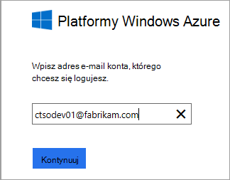

    *Błędy połączeń? Zobacz [Rozwiązywanie problemów](#troubleshooting).*

5. Wybieranie aplikacji zainstalowanych w sieci web lub witrynie sieci Web, którą chcesz monitorować, a następnie konfigurowanie zasobów, w której chcesz wyświetlić wyniki w portalu wniosków aplikacji.

    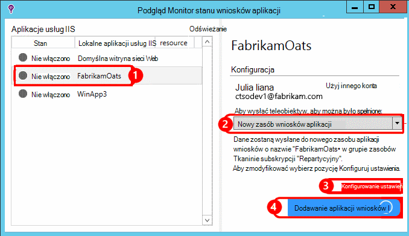

    Zazwyczaj chcesz skonfigurować nowego zasobu i [Grupa zasobów][roles].

    W przeciwnym razie użyj istniejącego zasobu, jeśli jeszcze skonfigurowana [sprawdza web] [ availability] witryny lub [Klient sieci web monitorowania][client].

6. Ponowne uruchomienie usług IIS.

    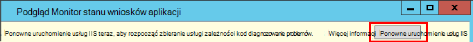

    Usługa sieci web zostanie przerwane przez krótki czas.

6. Zwróć uwagę, że ApplicationInsights.config został wstawiony do aplikacji sieci web, które chcesz monitorować.

    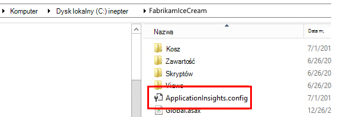

   Dostępne są także niektóre zmiany web.config.

#### Chcesz (ponownego) skonfigurować później?

Po zakończeniu pracy z kreatorem można ponownie skonfigurować agenta w dowolnym momencie. Można to jeśli zainstalowany agent, ale było niektóre problemy z początkowej konfiguracji.

## Widok telemetrycznego wydajności

Zaloguj się do [portalu Azure](https://portal.azure.com), przejdź wniosków aplikacji i otwórz utworzony zasób.

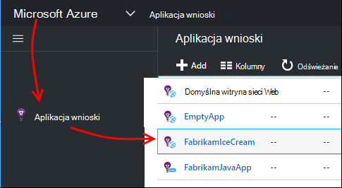

Otwórz Karta wydajności, aby wyświetlić żądania, czas reakcji, zależności i innych danych.

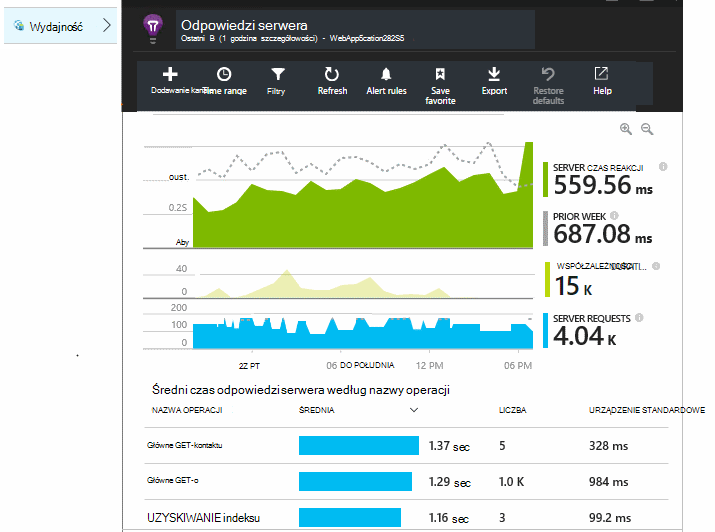

Kliknij dowolny wykres, aby otworzyć bardziej szczegółowy widok.

Możesz [Edytowanie, zmienianie rozmieszczenia, Zapisz](app-insights-metrics-explorer.md), i kliknij pozycję Przypnij wykresów lub całego karta do [pulpitu nawigacyjnego](app-insights-dashboards.md).

## Zależności

Wykres zależności czas trwania zawiera czas trwania połączenia z Twojej aplikacji do składników zewnętrznych, takich jak bazy danych, API pozostałych lub magazyn obiektów blob platformy Azure.

Na segmenty wykresu przez połączenia do różnych zależności: edytowanie wykresu, włączyć grupowania, a następnie Grupuj według współzależności, typ współzależności lub zależności wydajności.

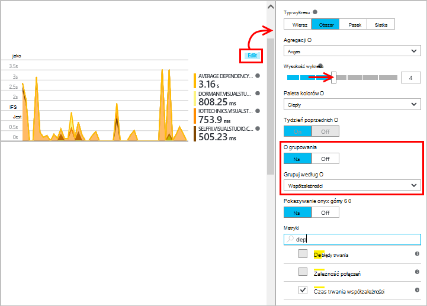

## Liczniki wydajności 

(Nie do Azure aplikacji web apps.) Kliknij pozycję serwery na karta Przegląd, aby wyświetlić wykresy liczników wydajności serwera, takie jak użycie Procesora pamięci i użytkowanie.

Jeśli masz kilka wystąpień serwera, można edytować wykresy Grupuj według roli wystąpienie.

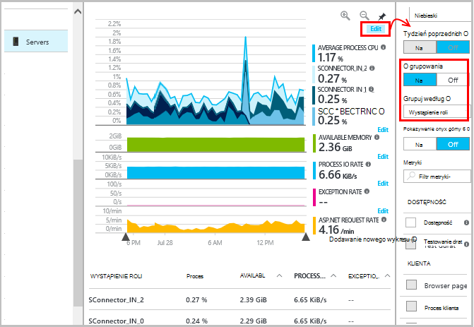

Możesz również [zmienić zestaw liczników wydajności, które są zgłaszane przez zestaw SDK](app-insights-configuration-with-applicationinsights-config.md#nuget-package-3). 

## Wyjątki

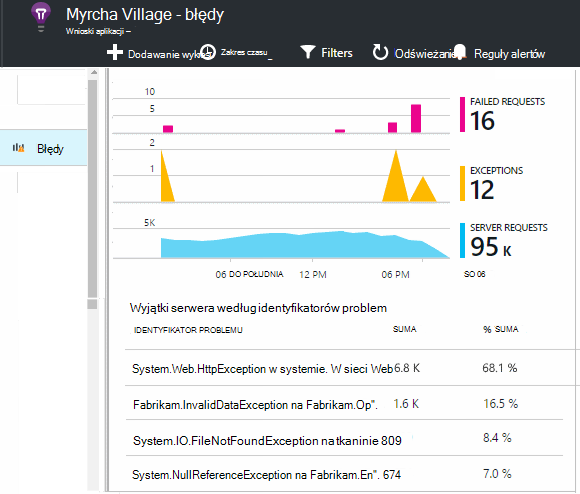

Możesz Drąż w dół do określonej wyjątki (w ciągu ostatnich siedmiu dni) i śledzenia stosem i danych kontekstu.

## Próbki

Jeśli aplikacja wysyła wiele danych i korzystania z SDK wniosków aplikacji dla programu ASP.NET wersji 2.0.0-beta3 lub nowszym, funkcja adaptacyjne przy próbkowaniu może działać i Wyślij tylko procent swojego telemetrycznego. [Dowiedz się więcej na temat pobierania.](app-insights-sampling.md)

## Rozwiązywanie problemów

### Błędy połączeń

Należy otworzyć [niektórych porty wychodzące](app-insights-ip-addresses.md#outgoing-ports) w zaporze swojego serwera umożliwia Monitor stanu do pracy.

### Nie telemetrycznego?

  * Za pomocą witryny, aby wygenerować niektóre dane.
  * Poczekaj kilka minut, aby umożliwić dane otrzymują, a następnie kliknij przycisk **Odśwież**.
  * Otwórz wyszukiwanie diagnostyczne (kafelków wyszukiwania), aby przeglądać poszczególne zdarzenia. Zdarzenia często są widoczne w diagnostyczne wyszukiwania, zanim agregowanie danych zostanie wyświetlony na wykresach.
  * Otwórz Monitor stanu i wybierz aplikacji w lewym okienku. Sprawdzanie, czy są komunikaty diagnostyki dla tej aplikacji, w sekcji "Konfiguracja powiadomienia":

  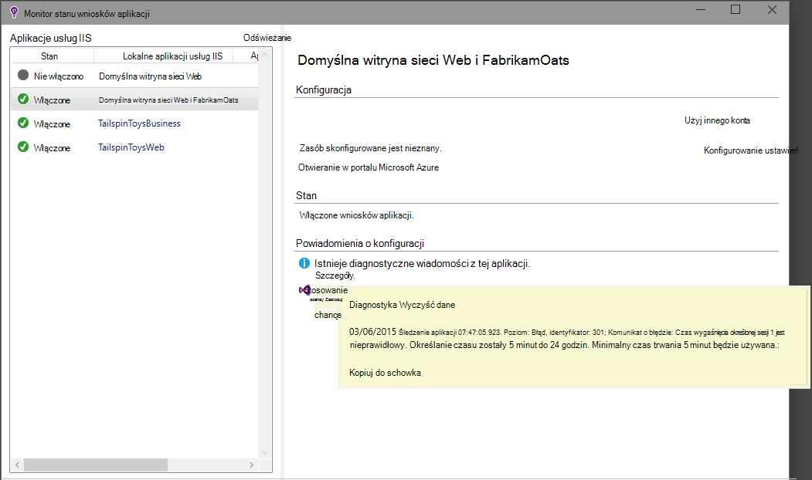

  * Upewnij się, że ustawienia zapory server umożliwiają ruchu wychodzącego portów wymienionych powyżej.
  * Na serwerze Jeśli zostanie wyświetlony komunikat o "wystarczających uprawnień", spróbuj wykonać następujące czynności:
    * W Menedżerze IIS wybierz do puli aplikacji, otwórz **Ustawienia zaawansowane**, a następnie w obszarze **Process Model** Uwaga tożsamości.
    * W Panelu sterowania zarządzania komputera Dodaj tożsamości do grupy Użytkownicy monitora wydajności.
  * Jeśli masz zainstalowane na serwerze MMA-SCOM niektórych wersjach mogą powodować konflikt. Odinstalowywanie zarówno SCOM, jak i Monitor stanu, a następnie ponownie zainstalować najnowsze wersje.
  * Zobacz [Rozwiązywanie problemów z][qna].

## Wymagania systemowe

Obsługiwane systemy operacyjne dla aplikacji Monitor stanu wniosków na serwerze:

- System Windows Server 2008
- Windows Server 2008 R2
- System Windows Server 2012
- System Windows server 2012 R2

przy użyciu najnowszych SP i programu .NET Framework 4.0 i 4,5

Po stronie klienta systemu Windows 7, 8 i Windows 8.1, ponownie przy użyciu programu .NET Framework 4.0 i 4,5

Obsługa usług IIS jest: usług IIS 7, 8 7.5, 8,5 (usług IIS jest wymagany)

## Automatyzacja przy użyciu programu PowerShell

Można uruchamiać i zatrzymywać, monitorowanie przy użyciu programu PowerShell na serwerze usług IIS.

Najpierw zaimportować moduł wniosków aplikacji:

`Import-Module 'C:\Program Files\Microsoft Application Insights\Status Monitor\PowerShell\Microsoft.Diagnostics.Agent.StatusMonitor.PowerShell.dll'`

Dowiedz się, jakie aplikacje są monitorowane:

`Get-ApplicationInsightsMonitoringStatus [-Name appName]`

* `-Name`(Opcjonalnie) Nazwa aplikacji sieci web.
* Wyświetla wniosków aplikacji monitorowanie stanu dla każdej aplikacji sieci web (lub nazwanego aplikacji) w ten serwer usług IIS.

* Zwraca `ApplicationInsightsApplication` dla każdej aplikacji:
 * `SdkState==EnabledAfterDeployment`: Aplikacja jest monitorowane i został działają w czasie wykonywania przez narzędzie Monitor stanu lub przez `Start-ApplicationInsightsMonitoring`.
 * `SdkState==Disabled`: Aplikacja nie jest narzędzia dla wniosków aplikacji. Nie została nigdy nie działają albo monitorowanie wykonywalna zostało wyłączone za pomocą narzędzia Monitor stanu lub z `Stop-ApplicationInsightsMonitoring`.
 * `SdkState==EnabledByCodeInstrumentation`: Aplikacja została narzędzia, dodając do kodu źródłowego zestawu SDK. Jego SDK nie można zaktualizować lub zatrzymana.
 * `SdkVersion`Pokazuje wersję używany do monitorowania tej aplikacji.
 * `LatestAvailableSdkVersion`wyświetlana jest wersja jest obecnie dostępna w galerii NuGet. Aby uaktualnić aplikację do tej wersji, należy użyć `Update-ApplicationInsightsMonitoring`.

`Start-ApplicationInsightsMonitoring -Name appName -InstrumentationKey 00000000-000-000-000-0000000`

* `-Name`Nazwa aplikacji w programie IIS
* `-InstrumentationKey`Ikey zasobów wniosków aplikacji, którym chcesz wyników, które mają być wyświetlane.

* To polecenie cmdlet dotyczy tylko aplikacje, które nie są już narzędzia - oznacza to, że SdkState == NotInstrumented.

    Polecenie cmdlet nie wpływa na aplikację, która jest już działają, w czasie kompilacji, dodając do kodu zestawu SDK lub w czasie wykonywania przez poprzedniego użycia tego polecenia cmdlet.

    SDK umożliwia instrumentu aplikacji jest to wersja ostatnio pobraną do tego serwera.

    Aby pobrać najnowszą wersję, za pomocą ApplicationInsightsVersion aktualizacji.

* Zwraca `ApplicationInsightsApplication` w przypadku powodzenia. Jeśli nie powiedzie się, dzienniki śledzenia stderr.

    
          Name                      : Default Web Site/WebApp1
          InstrumentationKey        : 00000000-0000-0000-0000-000000000000
          ProfilerState             : ApplicationInsights
          SdkState                  : EnabledAfterDeployment
          SdkVersion                : 1.2.1
          LatestAvailableSdkVersion : 1.2.3

`Stop-ApplicationInsightsMonitoring [-Name appName | -All]`

* `-Name`Nazwa aplikacji w programie IIS
* `-All`Zatrzyma monitorowanie wszystkich aplikacji w ten serwer usług IIS, dla którego`SdkState==EnabledAfterDeployment`

* Zatrzyma monitorowanie określonej aplikacji i usuwa oprzyrządowania. Tylko działa aplikacje, które zostały działają w czasie wykonywania za pomocą narzędzia monitorowanie stanu lub Start ApplicationInsightsApplication. (`SdkState==EnabledAfterDeployment`)

* Zwraca wartość ApplicationInsightsApplication.

`Update-ApplicationInsightsMonitoring -Name appName [-InstrumentationKey "0000000-0000-000-000-0000"`]

* `-Name`: Nazwa aplikacji sieci web w programie IIS.
* `-InstrumentationKey`(Opcjonalnie). Umożliwia zmianę tego zasobu, do którego jest wysyłana telemetrycznego tej aplikacji.
* To polecenie cmdlet:
 * Uaktualnienie nazwanych aplikację do wersji zestawu SDK ostatnio pobierane na tym komputerze. (Tylko wtedy, gdy `SdkState==EnabledAfterDeployment`)
 * Jeśli podasz klawisza oprzyrządowania nazwanych aplikacji jest konfigurowane wysyłać telemetrycznego do zasobu za pomocą tego klawisza. (Wtedy, gdy `SdkState != Disabled`)

`Update-ApplicationInsightsVersion`

* Pobieranie najnowszych SDK wniosków aplikacji na serwerze.

## Następne kroki

* [Tworzenie testów web] [ availability] aby się upewnić, że witryny granicach live.
* [Wyszukiwanie zdarzeń i dzienników] [ diagnostic] diagnozowanie problemów.
* [Dodawanie telemetrycznego klienta web] [ usage] chcesz wyświetlić wyjątki od kodu strony sieci web i umożliwiają wstawianie śledzenia połączeń.
* [Dodawanie aplikacji wniosków SDK w kodzie usługi sieci web] [ greenbrown] , aby wstawić śledzenia i dziennika połączeń w kod serwera.

<!--Link references-->

[api]: app-insights-api-custom-events-metrics.md
[availability]: app-insights-monitor-web-app-availability.md
[client]: app-insights-javascript.md
[diagnostic]: app-insights-diagnostic-search.md
[greenbrown]: app-insights-asp-net.md
[qna]: app-insights-troubleshoot-faq.md
[roles]: app-insights-resources-roles-access-control.md
[usage]: app-insights-web-track-usage.md
