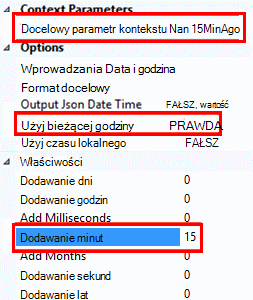

<properties
    pageTitle="Monitorowanie dostępności i czas reakcji dowolnej witryny sieci web | Microsoft Azure"
    description="Konfigurowanie badania wniosków aplikacji sieci web. Jeśli witryna sieci Web jest niedostępny lub odpowiada powoli, otrzymywać alerty."
    services="application-insights"
    documentationCenter=""
    authors="alancameronwills"
    manager="douge"/>

<tags
    ms.service="application-insights"
    ms.workload="tbd"
    ms.tgt_pltfrm="ibiza"
    ms.devlang="na"
    ms.topic="get-started-article"
    ms.date="09/07/2016"
    ms.author="awills"/>

# Monitorowanie dostępności i czas reakcji dowolnej witryny sieci web

Po Twojej aplikacji sieci web lub witrynie sieci web po wdrożeniu do dowolnego serwera, możesz skonfigurować testy sieci web, monitorowanie jego dostępności i czas reakcji. [Visual Studio aplikacji wniosków](app-insights-overview.md) wysyła żądania sieci web do aplikacji w regularnych odstępach z punktów na świecie. Ostrzega użytkownika w przypadku aplikacji nie odpowiedzieć lub odpowiada powoli.

Możesz skonfigurować testy sieci web dla protokołu HTTP lub HTTPS końcowego, który jest dostępne za pośrednictwem publicznego Internetu.

Istnieją dwa rodzaje testów sieci web:

* [Testowanie adresu URL ping](#create): prosty test, którą można utworzyć w portalu Azure.
* [Testowanie sieci web wielu kroku](#multi-step-web-tests): tworzenie programu Visual Studio Ultimate lub Enterprise programu Visual Studio i przekazać do portalu.

Możesz utworzyć maksymalnie 10 testy sieci web na zasób aplikacji.

## 1. Utwórz zasób dla raportów programu test

Pomiń ten krok, jeśli skonfigurowano już [zasób aplikacji wniosków] [ start] dla tej aplikacji i chcesz wyświetlić raporty dostępność w tym samym miejscu.

Utwórz konto [Microsoft](http://azure.com)Azure, przejdź do [portalu Azure](https://portal.azure.com)i utworzyć zasób wniosków aplikacji.

Kliknij pozycję **wszystkie zasoby** , aby otworzyć karta Przegląd nowego zasobu.

## 2. Utwórz test ping adresu URL

Zasób aplikacji wniosków poszukaj kafelka dostępności. Kliknij, aby otworzyć karta testy sieci Web dla aplikacji, a następnie dodaj test sieci web.

- **Adres URL** musi być widoczna z publicznego Internetu. Tak, na przykład można uruchamiać bazy danych nieco może zawierać ciągu kwerendy & #151; Jeśli adres URL jest rozpoznawana jako przekierowanie, możemy po nim maksymalnie 10 przekierowania.
- **Analizowanie żądania zależne**: obrazy, skrypty, pliki stylów i inne zasoby strony wymagane są częścią badania i czas reakcji zarejestrowanych zawiera tych godzinach. Test zakończy się niepowodzeniem, jeśli te zasoby nie może pomyślnie pobrane w ciągu limitu czasu dla całego badania.
- **Włączanie ponowne próby**: gdy test nie powiedzie się, próba jest ponawiana po krótki odstęp. Błąd jest zgłaszany tylko wtedy, gdy trzech kolejnych próbach kończą się niepowodzeniem. Kolejne testy następnie są wykonywane w częstotliwość badania normalny. Ponów próbę jest tymczasowo zawieszone do następnego sukcesu. Ta reguła jest stosowana niezależnie w każdej lokalizacji test. (Zaleca się to ustawienie. Przeciętnie około 80% błędy znikną Ponów.)
- **Testowanie częstotliwość**: Określa, jak często test jest uruchamiany w każdej lokalizacji test. Z częstotliwością pięć minut i lokalizacji pięć test witryny jest sprawdzany średnio co minutę.
- **Test lokalizacje** to argument miejsca, z którym naszych serwerów wysyłają żądania sieci web do adresu URL. Wybierz pozycję więcej niż jedno, tak, aby w witrynie sieci Web można odróżnić problemów sieciowych. Możesz wybrać maksymalnie 16 lokalizacji.

- **Kryteria sukcesu**:

    **Limit czasu test**: zmniejszyć tę wartość, aby otrzymywać alerty o wolne odpowiedzi. Test jest liczony jako błąd, jeśli odpowiedzi z witryny nie zostały odebrane w ciągu tego okresu. W przypadku wybrania **przeanalizować żądania zależne**, następnie wszystkie obrazy, pliki stylu, skrypty i inne zasoby zależne musi otrzymano w ciągu tego okresu.

    **Odpowiedź HTTP**: kodu stanu zwrócona, który jest liczony jako sukcesu. 200 jest kod, który wskazuje, zwrócenia normalna strona sieci web.

    **Uwzględnij zawartość**: ciągu, takie jak "Zapraszamy!" Testowanie firma Microsoft, że pojawi się w każdej odpowiedzi. Musi to być ciągu zwykły, bez symboli wieloznacznych. Pamiętaj, że jeśli zmiany zawartości strony trzeba je zaktualizować.

- **Alerty** są domyślnie wysłała występują błędy w trzech miejscach niż pięć minut. Błąd w jednym miejscu jest prawdopodobnie problem z siecią, a nie problem z witryny. Możesz zmienić progu się więcej lub mniej ważne a można też zmienić osób, które powinny być wysłane wiadomości e-mail.

    Możesz skonfigurować [webhook](../monitoring-and-diagnostics/insights-webhooks-alerts.md) wywoływana, gdy powstaje alertu. (Ale nie przechodzą należy zauważyć, że obecnie parametry zapytania jako właściwości).

### Testowanie więcej adresów URL

Dodawanie kolejnych testów. Na przykład, a także testowanie strony głównej można upewnij się, że baza danych działa, testując adresu URL wyszukiwania.

## 3. Zobacz sieci web wyniki testu

Po 1-2 minuty wyniki są wyświetlane w karta Test sieci Web.

Kliknij dowolny słupek na wykresie podsumowania, aby uzyskać bardziej szczegółowe informacje dotyczące tego okresu.

Te wykresy łączenie wyników dla wszystkie testy sieci web tej aplikacji.

## Jeśli widzisz błędy

Kliknij pozycję czerwona kropka.

Lub, przewiń w dół, a następnie kliknij przycisk test napisem mniej niż 100% sukcesu.

Wyniki otwarte test.

Test jest uruchamiany z kilku lokalizacjach & #151, wybierz jedną z nich, której wyniki są mniej niż 100%.

Przewiń w dół do **nie powiodło się badania** i wybierz wyniku.

Kliknij wynik, aby ocenianie go w portalu i sprawdź, dlaczego nie powiodło się.

Można też kliknąć można pobrać plik wyników i sprawdzić w programie Visual Studio.

*Wydaje się przycisk OK, ale zgłoszone jako błąd?* Zaznacz wszystkie obrazy, skryptów, arkusze stylów i innych plików załadowane przez stronę. Dowolnej z nich nie powiedzie się, test jest zgłoszone jako nie powiodła się, nawet w przypadku ładowania strony głównej html OK.

## Testy kroku wielu sieci web

Można monitorować scenariusza, który wymaga sekwencji adresów URL. Na przykład jeśli są monitorowania sprzedaży witryny sieci Web, możesz przetestować dodawania elementów do zakupów poprawnie koszyka działa.

Aby utworzyć test wielu krok, zarejestrować tego scenariusza przy użyciu programu Visual Studio, a następnie przekaż nagrania do wniosków aplikacji. Wnioski aplikacji odtwarzaniem tego scenariusza w określonych odstępach i potwierdza odpowiedzi.

Należy zauważyć, że nie można używać kodowane funkcje w testy: czynności scenariusz musi znajdować się jako skrypt w pliku .webtest.

#### 1. rekord scenariusz

Rejestrowanie sesji sieci web za pomocą programu Visual Studio Enterprise lub Ultimate.

1. Tworzenie projektu badania wydajności sieci web.

    

2. Otwórz plik .webtest i rozpocząć rejestrowanie.

    

3. Wykonaj akcje użytkownika ma być zasymulowania w swojej test: otwieranie witryny sieci Web, dodać produkt do koszyka i tak dalej. Następnie Zatrzymaj usługi test.

    

    Nie wprowadzaj scenariuszu długa. Istnieje ograniczenie kroków 100 i 2 minuty.

4. Edytowanie test, aby:
 - Dodawanie reguły sprawdzania poprawności, aby sprawdzić otrzymanej kody tekstu i odpowiedzi.
 - Usuń wszelkie nadmiar interakcji. Można też usunąć zależne żądania dla obrazów i do ad lub śledzenie witryn.

    Pamiętaj, że można edytować tylko testowy skrypt — nie można dodać kodu niestandardowego lub zadzwoń inne testy sieci web. Nie można wstawić pętli w teście. Możesz użyć wtyczki test standardowych sieci web.

5. Uruchamianie testu w programie Visual Studio, aby upewnić się, że działa on.

    Runner test sieci web zostanie otwarty w przeglądarce sieci web i powtarza akcje, które zostało zarejestrowane. Upewnij się, że działa on zgodnie z oczekiwaniami.

    

#### 2. przekazywanie test sieci web do wniosków aplikacji

1. Utwórz nowe badania sieci web w portalu wniosków aplikacji.

    

2. Wybierz przycisk Testuj wielu kroku i przekaż plik .webtest.

    

    Ustawianie lokalizacji test, częstotliwość i parametry alertu w taki sam sposób, jak w przypadku próby ping.

Wyświetlanie wyników test i wszystkie błędy w taki sam sposób, jak w przypadku testów adres url pojedynczego.

Typowe przyczyny błąd jest badanie trwa zbyt długo. Musi uruchomić więcej niż dwie minuty.

Pamiętaj, że wszystkie zasoby strony należy załadować poprawnie w teście pomyślnie tym skryptów, arkusze stylów, obrazów i tak dalej.

Uwaga test sieci web muszą być całkowicie zawarte w pliku .webtest: nie można używać funkcji zakodowany w teście.

### Podłączyć do swojego test wielu kroku godziny i liczb losowych

Załóżmy, że testowania narzędzi, który pobiera dane zależne od czasu, takich jak zasobów z zewnętrznego źródła. Po zarejestrowaniu test usługi sieci web, należy użyć określonym czasie, ale Ustaw jako parametrów badania, czas rozpoczęcia i zakończenia.

Po uruchomieniu test, potem zakończenia zawsze do chwili obecnej i czas rozpoczęcia powinny być 15 minut wcześniej.

Dodatki Test sieci Web umożliwia definiowanie parametrów razy.

1. Dodawanie wtyczki test sieci web dla każdej wartości parametru zmiennych, które mają. Na pasku narzędzi test sieci web wybierz pozycję **Dodaj dodatek Testowanie sieci Web**.

    

    W tym przykładzie używamy dwa wystąpienia wtyczka czasu daty. Jedno wystąpienie dotyczy "15 minut wcześniej", a drugi "teraz".

2. Otwórz okno właściwości każdego dodatku. Nadaj plikowi nazwę i ustaw ją na wartość Użyj bieżącej godziny. Dla jednej z nich, ustaw Dodawanie minut = -15.

    

3. W sieci web, przetestuj parametry, odwołanie do wtyczki nazwy za pomocą {{nazwa wtyczki}}.

    

Teraz przekazać do badania do portalu. Używa wartości dynamiczne przy każdym uruchomieniu test.

## Sposób postępowania z logowaniem

Jeśli użytkownicy zalogować się do aplikacji, masz różne opcje symulacji logowania, aby mógł testować strony logowania. Podejście, którego używasz, zależy od typu zabezpieczeń za pomocą aplikacji.

We wszystkich przypadkach należy utworzyć konto w aplikacji tylko do celów testowania. Jeśli to możliwe należy ograniczyć uprawnienia to konto testowe, aby istnieje możliwość testów web wpływających na rzeczywisty użytkownik.

### Prosta nazwy użytkownika i hasła

Rekord test sieci web w zwykły sposób. Najpierw usuń pliki cookie.

### Uwierzytelnianie SAML

Za pomocą wtyczki SAML, dostępnej badań sieci web.

### Tajny klienta

Jeśli w aplikacji jest trasa logowania, która wymaga tajny klienta, użyj tej trasy. Azure Active Directory (AAD) jest przykładem usługa, która zapewnia klientem tajne logowania. W AAD tajny klienta jest kluczem aplikacji.

Oto przykładowy test sieci web aplikacji Azure web za pomocą klawisza aplikacji:

1. Pobierz token z AAD przy użyciu hasła klienta (AppKey).
2. Wyodrębnianie token okaziciela z odpowiedzią.
3. Nawiązywanie połączenia przy użyciu token okaziciela w nagłówku autoryzacji interfejsu API.

Upewnij się, że testowanie sieci web jest klientem rzeczywisty - oznacza to, że ma własny aplikacji w AAD - i użyj jego clientId + appkey. Usługi badany również ma własny aplikacji w AAD: identyfikator URI ta aplikacja jest widoczny w teście sieci web w polu "zasobu".

### Otwieranie uwierzytelniania

Przykład otwórz uwierzytelniania jest zalogować się za pomocą konta Microsoft lub Google. Wiele aplikacje, które używają OAuth zapewniają klienta zamiast tajne, do pierwszej osoby powinny wskazywać na badanie tej możliwości.

Jeśli do badania, musisz zalogować się przy użyciu OAuth, ogólne rozwiązaniem jest:

 * Użyj narzędzia, takie jak Fiddler Sprawdź komunikacji między przeglądarki sieci web, witryna uwierzytelniania i aplikacji.
 * Wykonaj co najmniej dwa rejestrowaniu przy użyciu różnych komputerach lub przeglądarek, lub w długich odstępach (umożliwiające tokenów wygasało).
 * Przez porównanie różnych sesji, określ token przekazywane ponownie z witryny uwierzytelniania, co wartość przekazywana następnie do swojego serwera aplikacji po logowania.
 * Rekord test sieci web przy użyciu programu Visual Studio.
 * Definiowanie parametrów tokenów, ustawienie parametru po podłączeniu tokenu z uwierzytelnianiem i korzystania z niego w kwerendzie do witryny.
 (Visual Studio próbuje Definiowanie parametrów test, ale nie poprawnie Definiowanie parametrów tokeny).

## Edytowanie lub wyłącz test

Otwórz poszczególnych test, aby edytować lub je wyłączyć.

Może chcesz wyłączyć testy sieci web podczas wykonywania konserwacji na tej usługi.

## Testy wydajności

Test ładowania może zostać uruchomiony w witrynie sieci Web. Jak badania dostępności możesz wysłać prostych żądań lub wielu kroku żądania z naszych punktów na świecie. W przeciwieństwie do testu dostępność zostaną wysłane wezwania wiele, symulowanie wielu użytkowników jednocześnie.

Korzystając z karta Przegląd Otwórz **Ustawienia** **Testów wydajności**. Po utworzeniu test możesz przystąpić do łączenia lub Utwórz konto programu Visual Studio Team Services.

Po zakończeniu testów są wyświetlane czas reakcji i stawki sukcesu.

## Automatyzacji

* [Skryptów programu PowerShell Użyj skonfigurować test sieci web](https://azure.microsoft.com/blog/creating-a-web-test-alert-programmatically-with-application-insights/) automatycznie.
* Konfigurowanie [webhook](../monitoring-and-diagnostics/insights-webhooks-alerts.md) wywoływana, gdy powstaje alertu.

## Masz pytania? Problemy?

* *Można zadzwonić kodu testu mojej sieci web?*

    Wartość nie. Procedura badania musi być w pliku .webtest. I nie połączenia inne testy sieci web lub użyć pętli. Ale istnieje kilka wtyczek, które mogą okazać się pomocne.

* *Protokół HTTPS jest obsługiwana?*

    Obsługujemy TLS 1.1 i TLS 1.2.

* *Czy istnieje różnica między "testy sieci web" i "dostępność testy"?*

    Firma Microsoft korzysta z są używane zamiennie dwóch warunków.

* *Chcę używać sprawdza dostępności na naszym serwerze wewnętrznym, uruchamianego za zaporą.*

    Konfigurowanie zapory umożliwiające żądania od [czynników testowanie adresów IP w sieci Web](app-insights-ip-addresses.md#availability).

* *Test kroku wielu sieci web nie można przekazać*

    Istnieje limit rozmiaru 300 k.

    Pętle nie są obsługiwane.

    Odwołania do innych testów sieci web nie są obsługiwane.

    Źródła danych nie są obsługiwane.

* *Moje test wielu krok nie wykonania*

    Istnieje ograniczenie liczby 100 żądania na test.

    Test jest zablokowany, jeśli jest uruchomione dłużej niż dwie minuty.

* *Jak uruchomić test certyfikaty klienta*

    Firma Microsoft nie obsługuje, bardzo nam przykro.

## Klip wideo

> [AZURE.VIDEO monitoring-availability-with-application-insights]

## Następne kroki

[Dzienniki diagnostyczne wyszukiwania][diagnostic]

[Rozwiązywanie problemów][qna]

[Adresy IP agenci test sieci web](app-insights-ip-addresses.md)

<!--Link references-->

[azure-availability]: ../insights-create-web-tests.md
[diagnostic]: app-insights-diagnostic-search.md
[qna]: app-insights-troubleshoot-faq.md
[start]: app-insights-overview.md
