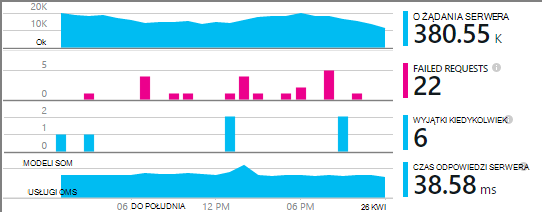
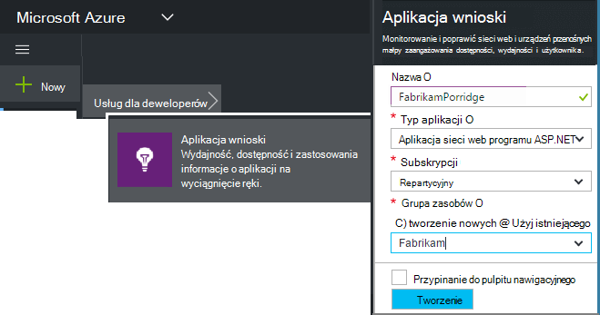
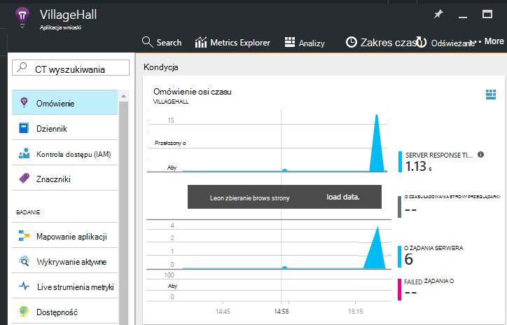

<properties
    pageTitle="Dodawanie aplikacji wniosków SDK monitorowanie aplikacji Node.js | Microsoft Azure"
    description="Analizowanie użycia, dostępności i wydajności lokalnego lub aplikacji sieci web Microsoft Azure o wniosków aplikacji."
    services="application-insights"
    documentationCenter=""
    authors="alancameronwills"
    manager="douge"/>

<tags
    ms.service="application-insights"
    ms.workload="tbd"
    ms.tgt_pltfrm="ibiza"
    ms.devlang="na"
    ms.topic="get-started-article"
    ms.date="08/30/2016"
    ms.author="awills"/>


# <a name="add-application-insights-sdk-to-monitor-your-nodejs-app"></a>Dodawanie aplikacji wniosków SDK monitorowanie aplikacji Node.js

*Wnioski aplikacji jest w podglądzie.*

[Visual Studio aplikacji wniosków](app-insights-overview.md) monitoruje live aplikacji ułatwiające [Wykrywanie i diagnozowanie problemów z wydajnością i wyjątki](app-insights-detect-triage-diagnose.md)oraz [używania aplikacji](app-insights-overview-usage.md). Działa aplikacje, które są obsługiwane na serwerach programu IIS własne lokalnego lub na maszyny wirtualne Azure, a także aplikacje Azure web.


Zestaw SDK zawiera automatyczne zbiór przychodzących żądań HTTP i odpowiedzi, liczniki wydajności (Procesora, pamięci, RPS) i nieobsługiwanego wyjątki. Ponadto możesz dodać niestandardowe połączenia do śledzenia zależności, metryki lub innych zdarzeń.




#### <a name="before-you-start"></a>Przed rozpoczęciem

Potrzebujesz:

* Program Visual Studio 2013 lub nowszym. Później jest lepsza.
* Subskrypcję usługi [Microsoft Azure](http://azure.com). Jeśli Twój zespół lub organizacja ma subskrypcję usługi Azure, właściciela można dodać możesz do niej, za pomocą [konta Microsoft](http://live.com).

## <a name="add"></a>Tworzenie zasób wniosków aplikacji

Zaloguj się do [portalu Azure][portal]i utworzyć nowy zasób wniosków aplikacji. [Zasób] [ roles] platformy Azure jest wystąpieniem usługi. Zasób jest miejsce, w którym analizowane i odpowiedzi na pytanie telemetrycznego z Twojej aplikacji.



Wybierz inne jako typ aplikacji. Wybór typu aplikacja ustawia domyślnej zawartości karty zasobów i właściwości widoczne w [Eksploratorze metryki][metrics].

#### <a name="copy-the-instrumentation-key"></a>Kopiowanie klucza oprzyrządowania

Klucz identyfikuje zasób, a następnie można będzie ją zainstalować wkrótce w zestawie SDK do kierowania danych do tego zasobu.


## <a name="sdk"></a>Zainstaluj zestaw SDK w aplikacji

```
npm install applicationinsights --save
```

## <a name="usage"></a>Użycie

Spowoduje to włączenie monitorowanie żądanie, nieobsługiwanego wyjątku śledzenia i wydajność systemu monitorowania (RPS-Procesora i pamięci).

```javascript

var appInsights = require("applicationinsights");
appInsights.setup("<instrumentation_key>").start();
```

Klucz oprzyrządowania można także ustawić w zmiennej środowiska APPINSIGHTS_INSTRUMENTATIONKEY. Jeśli jest to możliwe, nie podano argumentu jest wymagane podczas nawiązywania połączeń z `appInsights.setup()` lub `appInsights.getClient()`.

Możesz spróbować zestawu SDK bez wysyłania telemetrycznego: Ustawianie klucza oprzyrządowania ciąg niepuste.


## <a name="run"></a>Uruchom projekt

Uruchamianie aplikacji i przetestuj: otwieranie różnych stronach w celu wygenerowania niektórych telemetrycznego.


## <a name="monitor"></a>Wyświetlanie swojej telemetrycznego

Powróć do [Azure portal](https://portal.azure.com) i przejdź do zasobu wniosków aplikacji.


Poszukaj danych na stronie Omówienie. Na początku zostanie wyświetlony tylko jednej lub dwóch punktów. Na przykład:



Kliknij wykres, aby wyświetlić szczegółowe metryki. [Dowiedz się więcej na temat metryki.][perf]

#### <a name="no-data"></a>Brak danych?

* Za pomocą aplikacji otwieranie różnych stron tak, aby generuje niektórych telemetrycznego.
* Otwórz kafelków [wyszukiwania](app-insights-diagnostic-search.md) , aby wyświetlić pojedynczych zdarzeń. Czasami wystarczy zdarzeń nieco podczas dłużej uzyskanie potoku metryki.
* Poczekaj kilka sekund, a następnie kliknij polecenie **Odśwież**. Wykresy odświeżanie się okresowo, ale można odświeżać ręcznie Jeśli czekasz, niektóre dane się pojawić.
* Zobacz [Rozwiązywanie problemów z][qna].

## <a name="publish-your-app"></a>Publikowanie aplikacji

Teraz wdrażania aplikacji usług IIS lub Azure i obejrzyj danych kumulują się.


#### <a name="no-data-after-you-publish-to-your-server"></a>Brak danych po opublikowaniu na serwerze?

Otwórz następujące porty dla ruchu wychodzącego w zaporze swojego serwera:

+ `dc.services.visualstudio.com:443`
+ `f5.services.visualstudio.com:443`


#### <a name="trouble-on-your-build-server"></a>Problemy z na serwerze kompilacji?

Zobacz [Ten element Rozwiązywanie problemów](app-insights-asp-net-troubleshoot-no-data.md#NuGetBuild).


## <a name="customized-usage"></a>Użycie niestandardowych 

### <a name="disabling-auto-collection"></a>Wyłączanie automatycznego pobierania

```javascript
import appInsights = require("applicationinsights");
appInsights.setup("<instrumentation_key>")
    .setAutoCollectRequests(false)
    .setAutoCollectPerformance(false)
    .setAutoCollectExceptions(false)
    // no telemetry will be sent until .start() is called
    .start();
```

### <a name="custom-monitoring"></a>Niestandardowe monitorowania

```javascript
import appInsights = require("applicationinsights");
var client = appInsights.getClient();

client.trackEvent("custom event", {customProperty: "custom property value"});
client.trackException(new Error("handled exceptions can be logged with this method"));
client.trackMetric("custom metric", 3);
client.trackTrace("trace message");
```

[Dowiedz się więcej o telemetrycznego interfejsu API](app-insights-api-custom-events-metrics.md).

### <a name="using-multiple-instrumentation-keys"></a>Korzystanie z wielu kluczy oprzyrządowania

```javascript
import appInsights = require("applicationinsights");

// configure auto-collection with one instrumentation key
appInsights.setup("<instrumentation_key>").start();

// get a client for another instrumentation key
var otherClient = appInsights.getClient("<other_instrumentation_key>");
otherClient.trackEvent("custom event");
```

## <a name="examples"></a>Przykłady

### <a name="tracking-dependency"></a>Śledzenie współzależności

```javascript
import appInsights = require("applicationinsights");
var client = appInsights.getClient();

var startTime = Date.now();
// execute dependency call
var endTime = Date.now();

var elapsedTime = endTime - startTime;
var success = true;
client.trackDependency("dependency name", "command name", elapsedTime, success);
```


### <a name="manual-request-tracking-of-all-get-requests"></a>Ręczne żądanie śledzenie wszystkich żądań "Pobierz"

```javascript
var http = require("http");
var appInsights = require("applicationinsights");
appInsights.setup("<instrumentation_key>")
    .setAutoCollectRequests(false) // disable auto-collection of requests for this example
    .start();

// assign common properties to all telemetry sent from the default client
appInsights.client.commonProperties = {
    environment: process.env.SOME_ENV_VARIABLE
};

// track a system startup event
appInsights.client.trackEvent("server start");

// create server
var port = process.env.port || 1337
var server = http.createServer(function (req, res) {
    // track all "GET" requests
    if(req.method === "GET") {
        appInsights.client.trackRequest(req, res);
    }

    res.writeHead(200, { "Content-Type": "text/plain" });
    res.end("Hello World\n");
}).listen(port);

// track startup time of the server as a custom metric
var start = +new Date;
server.on("listening", () => {
    var end = +new Date;
    var duration = end - start;
    appInsights.client.trackMetric("StartupTime", duration);
});
```

## <a name="next-steps"></a>Następne kroki

* [Monitorowanie usługi telemetrycznego w portalu](app-insights-dashboards.md)
* [Pisać zapytania analizy przez usługi telemetrycznego](app-insights-analytics-tour.md)


<!--Link references-->

[knowUsers]: app-insights-overview-usage.md
[metrics]: app-insights-metrics-explorer.md
[perf]: app-insights-web-monitor-performance.md
[portal]: http://portal.azure.com/
[qna]: app-insights-troubleshoot-faq.md
[roles]: app-insights-resources-roles-access-control.md
