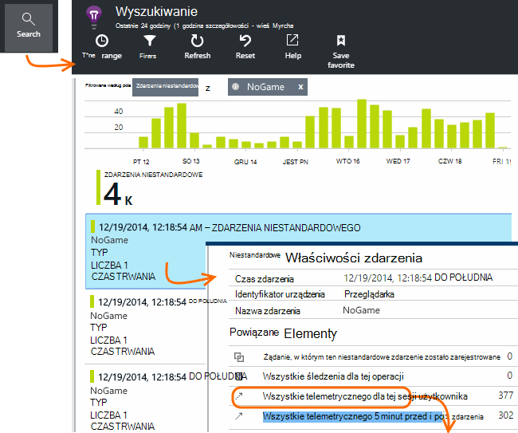

<properties
    pageTitle="Analiza użycia z wniosków aplikacji"
    description="Omówienie analizy użycia z wniosków aplikacji"
    services="application-insights"
    documentationCenter=""
    authors="alancameronwills"
    manager="douge"/>

<tags
    ms.service="application-insights"
    ms.workload="tbd"
    ms.tgt_pltfrm="ibiza"
    ms.devlang="multiple"
    ms.topic="article" 
    ms.date="04/08/2016"
    ms.author="awills"/>

# Analiza użycia z wniosków aplikacji

Informacje o sposobem korzystania z aplikacji pozwala wyodrębnienia pracy opracowywania scenariuszy, które są najbardziej istotne do nich i uzyskanie wniosków do celów, które są łatwiejsze lub trudne do osiągnięcia.

Wnioski aplikacji można udostępnia widzieć zastosowania aplikacji pomaga w celu zwiększenia możliwości użytkowników i spełniają celów biznesowych.

Wnioski aplikacji działa w przypadku obu autonomicznej aplikacji (w systemie iOS, Android i systemu Windows) i w przypadku aplikacji sieci web (hostowana w .NET lub J2EE). 

## Dodawanie aplikacji wniosków do projektu

Aby rozpocząć pracę, Uzyskaj bezpłatne konto z [Platformy Microsoft Azure](https://azure.com). (Po zakończeniu okresu próbnego, możesz kontynuować warstwie bezpłatną usługę.)

W [portalu Azure](https://portal.azure.com)utworzyć zasób wniosków aplikacji. Jest to miejsce, w którym pojawi się użycie i wydajność danych o aplikacji.

**Jeśli aplikacja jest aplikacji dla urządzeń** dodać SDK wniosków aplikacji do projektu. Procedura dokładnie różni się od [IDE i platformy](app-insights-platforms.md). W przypadku aplikacji systemu Windows po prostu kliknij prawym przyciskiem myszy projektu w programie Visual Studio i wybierz pozycję "Dodaj wniosków aplikacji".

**Jeśli jest aplikacji sieci web,** Otwórz karta Szybki Start i uzyskać wstawkę kodu, aby dodać do stron sieci web. Opublikuj je ponownie z tym wstawki kodu.

Można również dodać wniosków aplikacji w kodzie serwera [ASP.NET](app-insights-asp-net.md) lub [J2EE](app-insights-java-get-started.md) tak, aby połączyć telemetrycznego z klienta i serwera.

### Uruchom projekt, a wyniki pierwszego

Uruchom projekt w trybie debugowania przez kilka minut, a następnie przejdź do [portalu Azure](https://portal.azure.com) i przejdź do zasobu projektu w aplikacji wnioski.

Publikowanie aplikacji Uzyskaj więcej telemetrycznego i Dowiedz się, co robią użytkowników z aplikacji.

## Analizy okno

Kliknij Kafelek wyświetleń stron, aby wyświetlić informacje dotyczące sposobu użycia.

Umieść wskaźnik myszy na puste miejsce powyżej wykresu, aby wyświetlić liczby w określonym miejscu. W przeciwnym razie liczby wyświetlana wartość zagregowana w tym okresie, takich jak średnia, Suma lub liczba unikatowych użytkowników w okresie.

W aplikacjach sieci web użytkownicy są liczone za pomocą plików cookie. Osoba, która korzysta z kilku przeglądarek, czyści pliki cookie lub używa funkcji prywatności będą zliczane kilka razy.

Do sesji sieci web jest liczony po 30 minutach braku aktywności. Sesji na telefonu lub innego urządzenia jest liczony, gdy aplikacja zostało zawieszone więcej niż kilka sekund.

Kliknij dowolny wykres, aby wyświetlić więcej szczegółów. Na przykład:

(W tym przykładzie jest z witryny sieci Web, ale wykresy wyglądać podobnie do aplikacji, które są uruchamiane na urządzeniach).

Porównanie z poprzednim tygodniu, aby zobaczyć, jeśli zmieniasz rzeczy:

Porównywanie dwóch miar, na przykład użytkowników i nowych użytkowników:

Grupowanie (segmentu) danych według właściwości, takie jak przeglądarki, System operacyjny lub miasta:

## Użycie strony

Kliknij pozycję wyświetleń stron kafelka uzyskanie podział najpopularniejszych stron:

W powyższym przykładzie pochodzi z witryny sieci Web gry. Z niego od razu widać:

* Użycie nie zwiększona w ostatnim tygodniu. Być może możemy należy wziąć pod uwagę Optymalizacja aparatu wyszukiwania?
* Wiele osób mniej niż strony głównej można znaleźć na stronach gry. Dlaczego strony głównej nie przyciągania osób do gier
* "Krzyżówkami" jest najpopularniejszym nożna. Firma Microsoft powinni nadawać priorytet nowe pomysły i ulepszenia.

## Śledzenie niestandardowych

Załóżmy, że zamiast wykonania każdej gry na osobnej stronie sieci web, możesz zdecydować o refactor je wszystkie w samej aplikacji jedną stronę, do większości funkcji kodowane jako kod Javascript na stronie sieci web. Dzięki temu użytkownikowi szybko przełączyć się między jednej gry lub nawet mieć kilka gier na jednej stronie.

Ale nadal chcesz wniosków aplikacji do logowania się liczba każdej gry powoduje otwarcie, w taki sam sposób, jak podczas znajdowały się one w osobnych stron sieci web. Jest łatwe: tylko wstawianie połączenia z modułem telemetrycznego do swojego JavaScript miejsce, w którym chcesz rekord, który został otwarty nowy "Strona":

    telemetryClient.trackPageView(game.Name);

## Zdarzenia niestandardowe

Za pomocą telemetrycznego na różne sposoby, aby dowiedzieć się, jak aplikacja jest używany. Ale nie zawsze chcesz mieszać wiadomości w górę z widokami strony. Użyj zamiast tego zdarzenia niestandardowe. Możesz wysłać je z urządzenia aplikacje, strony sieci web lub na serwerze sieci web:

(JavaScript)

    telemetryClient.trackEvent("GameEnd");

(C#)

    var tc = new Microsoft.ApplicationInsights.TelemetryClient();
    tc.TrackEvent("GameEnd");

(VB)

    Dim tc = New Microsoft.ApplicationInsights.TelemetryClient()
    tc.TrackEvent("GameEnd")

Zdarzenia niestandardowe najczęściej znajdują się na karta Przegląd.

Kliknij przycisk nagłówka tabeli, aby wyświetlić łączną liczbę zdarzeń. Wykres można segmentu przez różne atrybuty, takie jak nazwa zdarzenia:

Przydatna funkcja osi czasu jest, że można dostosować zmian z innymi metryki i zdarzeń. Na przykład w czasie, gdy więcej gry są odtwarzane, czy powinny być widoczne wzrost także porzucone gry. Wzrost porzucone gry jest nieproporcjonalny, należy sprawdzić, czy wysokie obciążenie powoduje problemy, które użytkownicy znaleźć do przyjęcia, ale.

## Przechodzenie do określonego zdarzenia

Uzyskanie lepszego zrozumienia jak przechodzi typowe sesji można skupić się na sesji określonego użytkownika, zawierającą określony typ zdarzenia.

W tym przykładzie możemy kodowane zdarzenia niestandardowego "NoGame" nazywanym jeśli loguje bez rzeczywistego Rozpoczynanie gry. Dlaczego użytkownik może to zrobić? Być może Jeśli firma Microsoft przechodzić do niektórych poszczególne wystąpienia, możemy wyświetlony clue.

Zdarzenia niestandardowe odebrana z aplikacji są wyświetlane według nazwy karta Przegląd:

Kliknij zdarzenie przedmiotem zainteresowania, a następnie wybierz ostatnie określonego wystąpienia:

Przyjrzyjmy się wszystkie telemetrycznego dla sesji, w którym wystąpił danego zdarzenia NoGame.

Wystąpiły bez wyjątków, aby użytkownik nie uniemożliwia odtwarzanie przy niektórych błąd.

Firma Microsoft odfiltrować wszystkie typy telemetrycznego z wyjątkiem wyświetleń stron dla tej sesji:

A teraz widać, ten użytkownik zalogowany wystarczy, aby sprawdzić wyniki najnowszych. Powinny być może warto opracować historii użytkownika, co ułatwi to zrobić. (I firma Microsoft wykonała zdarzenia niestandardowego do raportu, gdy wystąpi ten określony artykuł)

## Filtrowanie, wyszukiwanie i segmentu danych za pomocą właściwości
Wartości liczbowe i znacznikami dowolnego można dołączać do zdarzenia.

JavaScript klienta

    appInsights.trackEvent("WinGame",
        // String properties:
        {Game: currentGame.name, Difficulty: currentGame.difficulty},
        // Numeric measurements:
        {Score: currentGame.score, Opponents: currentGame.opponentCount}
    );

C# na serwerze

    // Set up some properties:
    var properties = new Dictionary <string, string>
        {{"game", currentGame.Name}, {"difficulty", currentGame.Difficulty}};
    var measurements = new Dictionary <string, double>
        {{"Score", currentGame.Score}, {"Opponents", currentGame.OpponentCount}};

    // Send the event:
    telemetry.TrackEvent("WinGame", properties, measurements);

VB na serwerze

    ' Set up some properties:
    Dim properties = New Dictionary (Of String, String)
    properties.Add("game", currentGame.Name)
    properties.Add("difficulty", currentGame.Difficulty)

    Dim measurements = New Dictionary (Of String, Double)
    measurements.Add("Score", currentGame.Score)
    measurements.Add("Opponents", currentGame.OpponentCount)

    ' Send the event:
    telemetry.TrackEvent("WinGame", properties, measurements)

Dołączanie właściwości do wyświetleń stron w taki sam sposób:

JavaScript klienta

    appInsights.trackPageView("Win",
        {Game: currentGame.Name},
        {Score: currentGame.Score});

W polu Wyszukaj diagnostyczne Wyświetl właściwości, klikając pozycję przez poszczególne wystąpienia zdarzenia.

Użyj pola wyszukiwania, aby wyświetlić wystąpienia zdarzenia o wartości określonej właściwości.

## A | Testowanie B

Jeśli nie wiesz, który wariant funkcji więcej powiedzie się, zwolnij oba wprowadzania każdego dostępne dla różnych użytkowników. Miarą sukcesu w każdej, a następnie przenieś do wersji ujednolicony.

Dla tej metody możesz dołączyć odrębnych znaczniki do wszystkich telemetrycznego wysłanej przez w każdej wersji aplikacji. Można to zrobić, definiując właściwości w aktywnej TelemetryContext. Te domyślne właściwości są dodawane do każdej telemetrycznego wiadomości wysyłające aplikacji — nie tylko niestandardowe wiadomości, ale także standardowe telemetrycznego.

W portalu wniosków aplikacji zostanie następnie można filtr i grupa (segmentu) danych na znaczniki, aby porównać wersje.

C# na serwerze

    using Microsoft.ApplicationInsights.DataContracts;

    var context = new TelemetryContext();
    context.Properties["Game"] = currentGame.Name;
    var telemetry = new TelemetryClient(context);
    // Now all telemetry will automatically be sent with the context property:
    telemetry.TrackEvent("WinGame");

VB na serwerze

    Dim context = New TelemetryContext
    context.Properties("Game") = currentGame.Name
    Dim telemetry = New TelemetryClient(context)
    ' Now all telemetry will automatically be sent with the context property:
    telemetry.TrackEvent("WinGame")

Poszczególne telemetrycznego można zastąpić wartości domyślne.

Uniwersalny inicjator można ustawić tak, aby wszystkie nowe TelemetryClients automatycznie Użyj kontekstu.

    // Telemetry initializer class
    public class MyTelemetryInitializer : ITelemetryInitializer
    {
        public void Initialize (ITelemetry telemetry)
        {
            telemetry.Properties["AppVersion"] = "v2.1";
        }
    }

W inicjator aplikacji, takich jak Global.asax.cs:

    protected void Application_Start()
    {
        // ...
        TelemetryConfiguration.Active.TelemetryInitializers
        .Add(new MyTelemetryInitializer());
    }

## Tworzenie - miary — informacje

Gdy używasz analizy staje się zintegrowanym elementem procesu opracowywania — nie tylko coś Pomyśl o mnie, aby ułatwić rozwiązywanie problemów. Oto kilka porad:

* Ustalanie kluczowych metryk aplikacji. Czy chcesz wielu użytkownikom możliwie lub będzie lepszy małego zestawu bardzo Radosna użytkowników? Czy chcesz zmaksymalizować wizyty lub sprzedaży?
* Planowanie celu pomiaru każdej sekcji. Gdy szkicowanie nowego wątku użytkownika lub funkcji lub planu w celu zaktualizowania istniejącej, zawsze wziąć pod uwagę co będzie miarą sukcesu zmiany. Przed kodowanie uruchomienia, poproś "efekt to będzie w naszym miar, jeśli to działa? Czy firma Microsoft śledzić wszelkie nowe zdarzenia?"
I oczywiście, gdy ta funkcja jest live, upewnij się, spójrz na analizy i działania na stronie wyników.
* Tworzenie relacji między innymi wskaźnikami klucza jednostki metryczne. Na przykład po dodaniu funkcji "Ulubione" chcesz wiedzieć, jak często użytkownicy Dodaj ulubione. Ale jest prawdopodobnie więcej interesujące wiedzieć, jak często są wrócić do ulubionych. I najważniejsze, czy klienci korzystający z ulubionych ostatecznie kupić więcej produktu?
* Testowanie Kanaryjskich. Ustaw przełącznik funkcji, który umożliwia nawiązywanie nową funkcję widoczny tylko dla niektórych użytkowników. Aby sprawdzić, czy nowa funkcja jest używane w taki sposób, który możesz przewidziane za pomocą aplikacji wnioski. Wprowadź zmiany, a następnie zwolnij go do większej liczby osób.
* Zwróć się do użytkowników! Analiza za mało samodzielnie, ale uzupełniające do utrzymania relacji z klientem dobre.

## Dowiedz się więcej

* [Wykrywanie, sprawdzać i diagnozowanie awarię i występują problemy z wydajnością w aplikacji](app-insights-detect-triage-diagnose.md)
* [Wprowadzenie do aplikacji wniosków na wielu platformach](app-insights-detect-triage-diagnose.md)

## Klip wideo

> [AZURE.VIDEO usage-monitoring-application-insights]

 
