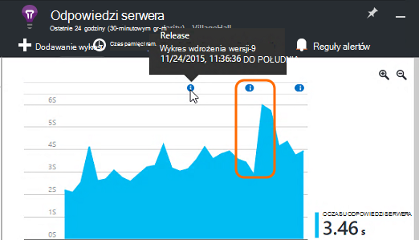

<properties 
    pageTitle="Samouczek wniosków aplikacji | Microsoft Azure" 
    description="Śledzenie użycia i wydajności aplikacji sieci live web.  Wykrywanie i sprawdzać diagnozowanie problemów. Stale monitorować i poprawić sukcesu użytkownikom." 
    services="application-insights" 
    documentationCenter=""
    authors="alancameronwills" 
    manager="douge"/>

<tags 
    ms.service="application-insights" 
    ms.workload="tbd" 
    ms.tgt_pltfrm="ibiza" 
    ms.devlang="na" 
    ms.topic="article" 
    ms.date="10/15/2016" 
    ms.author="awills"/>
 
# Wnioski aplikacji — wprowadzenie

Visual Studio aplikacji wniosków to usługa extensible analizy, która monitoruje aplikacji sieci live web. Z nim wykrywanie i diagnozowanie problemów z wydajnością, a zrozumieć, co użytkownicy faktycznie zrobić za pomocą aplikacji. Jest przeznaczony dla deweloperów ułatwiające ciągłego doskonalenia wydajności i użyteczności. Działa w przypadku aplikacji na wielu różnych platform, takich jak .NET, Node.js i J2EE hostowanej lokalnego lub w chmurze. 

[Zapoznaj się animacji wprowadzający](https://www.youtube.com/watch?v=fX2NtGrh-Y0).

## Jak to działa?

Zainstalować pakiet small oprzyrządowania w aplikacji i konfigurowanie aplikacji wniosków zasobu w portalu Microsoft Azure. Oprzyrządowania monitoruje aplikacji i wysyła dane telemetryczne do portalu. Portalu pokazano wykresy statystyczne i udostępnia narzędzia zaawansowane wyszukiwanie ułatwiające diagnozowanie problemów.

Wnioski aplikacji zawiera kilka [modułów oprzyrządowania standardowy](app-insights-configuration-with-applicationinsights-config.md) zbieranie informacji o różnych typach telemetrycznego, takich jak czas reakcji żądanie, wyjątki i połączeń w zależności. Możesz też [napisać kod, aby wysłać telemetrycznego niestandardowych](app-insights-api-custom-events-metrics.md) do portalu.

### Co to jest obciążenia?

Wpływ na wydajność usługi aplikacji jest bardzo mały. Śledzenie połączeń są bez blokowania, są przetwarzany wsadowo i wysłane w oddzielnym wątku. 

## Czego?

Wnioski aplikacji celem jest członkami zespołu deweloperów, aby lepiej zrozumieć, jak działa aplikacji i jak jest używany. Umożliwia:

Typy danych telemetrycznych:

* Stawki żądania HTTP, czasy odpowiedzi, stawki sukcesu.
* Współzależności (HTTP i SQL) połączeń stawki, czasy odpowiedzi, stawki sukcesu.
* Wyjątek śledzenia z zarówno serwera, jak i klienta.
* Dzienniku diagnostycznym śledzenia.
* Widok strony Zlicza liczby użytkowników i sesji, czasy ładowania przeglądarki, wyjątki.
* Kursy połączenia AJAX, czasy odpowiedzi oraz stawki sukcesu.
* Liczniki wydajności serwera.
* Niestandardowe telemetrycznego klienta i serwera.
* Segmentacji lokalizacji klienta, wersja przeglądarki, wersja systemu operacyjnego, wystąpienie serwera, niestandardowe wymiary i więcej.
* Sprawdza dostępności

Narzędzia diagnostyczne i analityczne:

* Alerty inteligentne i ręczne awariami i innymi wskaźnikami i dostępności.
* Wykresy w czasie metryki zagregowane.
* Diagnostyczne wyszukiwanie wystąpień żądania, wyjątki, niestandardowych zdarzeń dziennika śledzenia, liczbę wyświetleń stron, zależności i AJAX połączeń. 
* Analizy — języka kwerend zaawansowanych w swojej telemetrycznego
* Pulpity nawigacyjne - redagowanie wykresów należy monitorować wszystkie składniki aplikacji.

## Jak z niej korzystać?

### Monitorowanie

Instalowanie aplikacji wniosków w aplikacji sieci web, ustawianie testów web dostępność, a:

* Konfigurowanie pulpitu nawigacyjnego dla pokoju zespołu w celu kontroli na obciążenia, elastyczność i wydajności współzależności, ładowaniu stron i AJAX połączeń. 
* Dowiedz się, które są najmniejszą i najpopularniejszych awarii.
* Obejrzyj strumień na żywo przy umieszczaniu nowej wersji, aby od razu wiedzieć o dowolnej obniżenie wydajności.

### Diagnozowanie

Jeżeli otrzymają alert lub wykrywania problemów:

* Dostosować błędy z wyjątków, połączeń zależności i śledzenia.
* Odkryj zrzuty stosu i dzienników.

### Oceń

Przeszukiwarki każdej nowej funkcji, która zostanie wdrożony.

* Planowanie celu pomiaru używania nowego interfejsu użytkownika lub funkcje biznesowych.
* Napisz telemetrycznego niestandardowych do kodu do rejestrowania użycia.
* Każdy cykl opracowywania za podstawę słabo dowodów z telemetrycznego.

## Rozpoczynanie pracy

Wnioski aplikacji jest jednym z wielu usług hostowany w programie Microsoft Azure, a telemetrycznego jest wysłane tam analizowanych i prezentacji. Dlatego przed wykonaniem jakichkolwiek innych czynności, musisz subskrypcję usługi [Microsoft Azure](http://azure.com). Bezpłatnie do utworzenia konta i wybierz pozycję bezpłatne [ceny warstwa](https://azure.microsoft.com/pricing/details/application-insights/) wniosków aplikacji. Jeśli Twoja organizacja ma już subskrypcji, ich można dodać do konta Microsoft do niego. 

Istnieje kilka sposobów, aby rozpocząć pracę. Zaczyna się od zależności sprawdza się najlepiej dla Ciebie. Można dodać inne później.

* **W czasie wykonywania: instrumentu aplikacji sieci web na serwerze.** Pozwala uniknąć dowolną aktualizację kodu. Musisz dostęp administratora serwera.
 * [**Usług IIS lokalnego lub maszyn wirtualnych**](app-insights-monitor-performance-live-website-now.md)
 * [**Azure web app lub maszyn wirtualnych**](app-insights-monitor-performance-live-website-now.md#if-your-app-runs-as-an-azure-web-app)
 * [**J2EE**](app-insights-java-live.md)
* **W czasie projektowania: Dodawanie aplikacji wniosków w kodzie.** Umożliwia pisanie niestandardowych telemetrycznego wewnętrznej dokumentu i aplikacji komputerowych.
 * Aktualizacja 2013 [Visual Studio](app-insights-asp-net.md) 2 lub nowszy.
 * Java [Zaćmienie](app-insights-java-eclipse.md) lub [innych narzędzi](app-insights-java-get-started.md)
 * [Node.js](app-insights-nodejs.md)
 * [Innych platformach](app-insights-platforms.md)
* Widok strony, AJAX i inne telemetrycznego po stronie klienta, **[instrumentu stron sieci web](app-insights-javascript.md)** .
* **[Sprawdza dostępności](app-insights-monitor-web-app-availability.md)** - ping witryny sieci Web regularnie z naszych serwerów.

> [AZURE.NOTE]  W tym momencie być może po prostu chcesz uzyskać na i eksperymentować. Ale jeśli chcesz zobaczyć, jakie możliwości aplikacji wniosków, Czytaj dalej...

## Eksplorowanie metryki

Uruchamianie aplikacji - albo w trybie debugowania na tym komputerze rozwoju lub wdrażając go na serwerze — i używać go na chwilę. Zaloguj się do [portalu Azure](https://portal.azure.com).

Przejdź do karta Przegląd wniosków aplikacji usługi aplikacji:

Przegląd umożliwia widoczne od razu, jak działa aplikacji. Możesz porównać obciążenia (pod względem liczba żądań) z godziną aplikacji zbyt reagować na żądania. W przypadku nieproporcjonalny wzrost czasu odpowiedzi podczas ładowania rośnie, warto przydzielenie większej ilości zasobów do aplikacji. Jeśli jest wyświetlany więcej prawo odpowiedzi nie powiodło się po wdrożeniu nową kompilację może być do przywrócenia.

#### Poznaj więcej szczegółów

Kliknij dowolny wykres, aby uzyskać bardziej szczegółowe zestaw wykresów. Na przykład na wykresie czas odpowiedzi serwera prowadzi do wykresy przedstawiające żądań, czas reakcji i czasy odpowiedzi współzależności (oznacza to, że usług, które połączeń aplikacji).  

Wykres zależności jest przydatne, ponieważ ułatwia baz danych oraz interfejsy API pozostałych, która korzysta z aplikacji odpowiadasz także, czy powoduje opóźnienia.

#### Dostosowywanie wykresu

Spróbuj wykonać jedną z następujących wykresów do edycji. Na przykład aplikacji sieci web jest uruchamiany w zbiorze wystąpienia serwera, możesz porównać czasy odpowiedzi na innym serwerze wystąpienia:

1. Umieść wskaźnik myszy na wykresie, a następnie kliknij przycisk Edytuj.
2. Wybierz pozycję metryczne. Wiele metryki mogą być wyświetlane na jednym wykresie, ale tylko w niektórych kombinacji: może być konieczne zaznaczenia jednego metryki przed wybraniem odpowiedni.
3. Umożliwia grupowanie według segmentu metryki według właściwości. W tym przykładzie możemy wyświetlane osobnych wierszach czasy różnych odpowiedzi. 

    Zauważ, że należy wybrać prawidłowej właściwości metryki, lub wykres nie zostaną odzwierciedlone wszystkie dane.
4. Wybierz typ wykresu. Obszar i wykresy słupkowe pokazywanie skumulowany wyświetlania odpowiedni typ agregacji po "Suma".

[Więcej informacji na temat masowej metryki](app-insights-metrics-explorer.md).

## Wyszukiwanie danych wystąpienia

Aby zbadać problem, warto sprawdzić wystąpienia określonego zdarzenia.

Kliknij wykres metryczne przeszukiwania wystąpienia danych z odpowiednie filtry i przedział czasu. Na przykład kliknij za pośrednictwem żądania serwera zlicza, aby wyświetlić raporty indywidualne żądanie. 

Lub możesz przejść bezpośrednio do danych wystąpienia z wyszukiwania na stronie Przegląd:

Użyj filtrów, aby skoncentrować się na określonych typów zdarzeń, a na wybranym wartości:

Kliknij przycisk "...", aby wyświetlić pełną listę właściwości, lub Otwórz inne zdarzenia skojarzone z tym samym wezwanie. W tym przykładzie nie powiodło się żądanie zawiera raport skojarzony wyjątek:

Otwieranie zdarzenia — w tym przykładzie powiązanych wyjątku - i możesz utworzyć element pracy (Jeśli śledzenie zadań za pomocą programu Visual Studio Team Services). 
 

## Analizy

[Analiza](app-insights-analytics.md) jest bardziej zaawansowanych funkcji wyszukiwania i analizy, w którym można napisać przypominających SQL kwerendy danych telemetrycznych, albo aby wyszukać problemy specyficzne dla lub zbiera informacje statystyczne.

Otwórz okno samouczka, aby wyświetlić i uruchomić przykłady kwerend danych lub więcej dłużej [instruktażu samouczka](app-insights-analytics-tour.md). IntelliSense zostanie wyświetlony monit z kwerendami, które są dostępne, a istnieje [Odwołanie pełny języka](app-insights-analytics-reference.md). 

Kwerendy zwykle zaczynają się od nazwy strumienia telemetrycznego, takich jak żądania, wyjątki lub zależności. POP Otwórz pasek schematu po lewej stronie, aby wyświetlić listę strumieni telemetrycznego dostępna. Kwerenda jest potok [operacji kwerendy](app-insights-analytics-reference.md#queries-and-operators) `where` - Filtr logiczny - lub `project` -która oblicza nowe właściwości. `summarize`[wystąpienia agregacji](app-insights-analytics-tour.md#aggregate-groups-of-rows), pogrupować je w funkcjach zdefiniowanych, a następnie zastosowania funkcji agregacji w zgrupowanych danych.

Wyniki mogą być [renderowane w tabel i różnych typów wykresów](app-insights-analytics-tour.md#charting-the-results).

## Niestandardowe telemetrycznego

Wbudowane telemetrycznego, który zostanie wyświetlony po prostu instalując wniosków aplikacji umożliwia analizowanie liczników, stawki sukcesu i odpowiedź czas zarówno żądania sieci web do połączeń w aplikacji i zależności - oznacza to, że z Twojej aplikacji SQL, API pozostałych. Uzyskasz śledzenia wyjątku i (z Monitor stanu na serwerze) liczniki wydajności systemu. Po dodaniu wstawkę kodu klienta do stron sieci web zostanie wyświetlony liczby wyświetlanie stron, a czasem ładowania, wyjątki klienta i AJAX połączeń sukcesu i odpowiedzi. 

Analizowanie wszystkich ten telemetrycznego umożliwiają poznanie znacznie dotyczące wydajności i użycia Twojej aplikacji. Jednak czasami, która nie jest wystarczająco. Warto monitora długość kolejki tak, aby można Dostosowywanie wydajności; Zliczanie sprzedaży i segmentu je w lokalizacji. lub po stronie klienta, Dowiedz się, jak często że kliknięciu określonego przycisku Tak, aby można dostosować środowisko użytkownika.

[Aplikacji wniosków API](app-insights-api-custom-events-metrics.md) zawiera połączeń `TrackEvent(name)` i `TrackMetric(name, value)` tak, aby można wysłać własnych niestandardowych zdarzeń i miar. Istnieją równoważne połączeń po stronie klienta.

Na przykład jeśli strony sieci web jest to aplikacja gier jedną stronę, możesz wstawić wiersza w odpowiednich miejscach do logowania, gdy użytkownik wins lub traci gry:

    
    appInsights.trackEvent("WinGame");
    ...
    appInsights.trackEvent("LoseGame");

Następnie firma Microsoft może wykresu zlicza zdarzenia niestandardowego segmentacji ich według nazwy zdarzenia:

### Dziennik śledzenia

W celach diagnostycznych jest niestandardowego zdarzenia `TrackTrace(message)` używanego do śledzenia wykonania. Funkcje wyszukiwania i analizy można znaleźć w treści wiadomości, które mogą być dłuższa niż nazwą zdarzenia. 

Jeśli używasz już ramy rejestrowanie, takich jak Log4Net, NLog, Log4J lub System.Diagnostic.Trace, następnie wywołań śledzenia mogą być przechwytywane przez wniosków aplikacji i będą wyświetlane obok innych telemetrycznego. Narzędzia programu Visual Studio automatyczne dodawanie odpowiedniego modułu SDK.

## Pulpity nawigacyjne

Wiele aplikacji składa się z kilku części, takie jak usługi sieci web i co najmniej jeden ponownie zakończenia procesorów. Każdy składnik będzie monitorowane przez zasób osobnych wniosków aplikacji. Jeśli działanie systemu Azure, może być przy użyciu parametru - i monitorowania — usług, takich jak koncentratory zdarzeń i maszynowego uczenia także. 

Monitorowanie całego systemu, można wybrać najbardziej interesujące wykresy z poszczególnych aplikacji i przypiąć je do Azure [pulpitu nawigacyjnego](app-insights-dashboards.md), co umożliwia śledzą całego systemu przez cały czas. 

W rzeczywistości możesz utworzyć wiele pulpitów nawigacyjnych — na przykład zespołu pokoju pulpitu nawigacyjnego za monitorowanie kondycji systemu ogólne; pulpit nawigacyjny projektu, który omówiono zastosowania różne funkcje; oddzielne pulpitu nawigacyjnego składników badany; i tak dalej.  

Pulpity nawigacyjne, takie jak zasoby, mogą być udostępniane między członków zespołu.

## Rozwoju w programie Visual Studio

Jeśli korzystasz z programu Visual Studio do opracowywania aplikacji, można znaleźć kilka narzędzi wniosków aplikacji wbudowana. 

### Wyszukiwanie diagnostyczne

Okno wyszukiwania zawiera zdarzenia, które zostały zarejestrowane. (Jeśli zalogowano Azure podczas konfigurowania aplikacji wniosków, możesz szukać tego samego zdarzenia w portalu.)

Wyszukiwanie niezależnej działa na wszystkie pola w zdarzenia. Na przykład wyszukiwanie część adresu URL strony; lub wartość właściwości, takich jak kod pocztowy klienta; lub z określonymi wyrazami w dzienniku śledzenia.

Kliknij dowolne zdarzenie, aby wyświetlić właściwości szczegółowe.

Można również Otwórz kartę powiązanych elementów diagnozowanie żądań zakończonych niepowodzeniem lub wyjątków.

### Centrum diagnostyki

Centrum diagnostyki (w Visual Studio 2015 lub nowszej) przedstawiono telemetrycznego serwera wniosków aplikacji jest generowany. Dzieje się tak, nawet jeśli tylko wybrał Zainstaluj zestaw SDK, bez łączenia go do zasobu w portalu Azure.

### Wyjątki

Jeśli masz [wyjątku monitorowania](app-insights-asp-net-exceptions.md), raporty wyjątku pojawi się w oknie Wyszukiwanie. 

Kliknij pozycję wyjątków, aby uzyskać śledzenia stosu. Jeśli kod aplikacji jest otwarty w programie Visual Studio, możesz kliknąć za pośrednictwem za pomocą śledzenia stosu do odpowiedniego wiersza kodu.

Ponadto w wierszu obiektyw kod powyżej każdej z tych metod pojawi się liczba wyjątków, rejestrowane przez aplikację wniosków w ciągu ostatnich 24 godzin.

### Lokalne monitorowania

(Z programu Visual Studio aktualizacja 2015 2) Jeśli jeszcze nie skonfigurowano SDK wysyłanie telemetrycznego do portalu wniosków aplikacji (dzięki temu ApplicationInsights.config jest żaden klucz oprzyrządowania) oknie diagnostyki zostaną wyświetlone telemetrycznego z najnowszych debugowania sesji. 

Jest to pożądane, jeśli masz już opublikowane poprzednią wersję aplikacji. Nie chcesz telemetrycznego z Twojej sesji debugowania, aby zostać zamienione z telemetrycznego portalu wniosków aplikacji z opublikowanych aplikacji.

Jest również przydatne, jeśli masz kilka [niestandardowych telemetrycznego](app-insights-api-custom-events-metrics.md) chcesz debugowanie przed wysłaniem telemetrycznego do portalu.

* *Na początku I w pełni skonfigurowane wniosków aplikacji, aby wysłać telemetrycznego do portalu. Ale teraz chcesz wyświetlić telemetrycznego tylko w programie Visual Studio.*

 * W obszarze Ustawienia okna Wyszukiwanie istnieje możliwość wyszukiwania lokalnego diagnostyki, nawet w przypadku aplikacji wysyła telemetrycznego do portalu.
 * Aby zatrzymać telemetrycznego wysyłana do portalu, komentarz wiersza `<instrumentationkey>...` z ApplicationInsights.config. Gdy wszystko będzie już gotowe do ponownego wysłania telemetrycznego do portalu, Usuń komentarze.

## Trendów

Trendów to narzędzie w programie Visual Studio do wizualizacji zachowanie aplikacji w czasie. 

Wybierz pozycję **Eksplorowanie trendów telemetrycznego** z przycisku na pasku narzędzi aplikacji wniosków lub okna aplikacji wniosków wyszukiwania. Wybierz jedną z pięciu typowych kwerend, aby rozpocząć pracę. Można analizować różnych zestawów danych na podstawie typów telemetrycznego, zakresami czasu i inne właściwości. 

Aby znaleźć różnic w odniesieniu w danych, wybierz jedną z opcji anomalii w obszarze lista rozwijana "Typ widoku". Opcje filtrowania w dolnej części okna ułatwiają skupić w na określony podzbiór usługi telemetrycznego.

## Udostępnia nową kompilację

### Live strumienia metryki

Strumień na żywo metryki zawiera usługi metryki aplikacji bezpośrednio w tym samym momencie, z najbliższego opóźnienie czasu rzeczywistego 1 sekundę. Jest to bardzo przydatne, gdy masz udostępnia nową kompilację i chcesz upewnić się, że wszystko jest działają zgodnie z oczekiwaniami lub badania zdarzenia w czasie rzeczywistym.

W przeciwieństwie do Eksploratora metryki strumień metryki na żywo Wyświetla ustalony zbiór metryki. Dane trwa tylko pod warunkiem jest na wykresie, a następnie jest pomijany. 

### Adnotacje

[Adnotacje wersji](app-insights-annotations.md) na wykresach metryki Pokaż, których wdrażane nową kompilację. Ułatwiają ich zobaczyć, czy zmiany zostały wpływu na wydajność usługi aplikacji. Mogą być automatycznie tworzone przez [program Visual Studio Team Services tworzenie systemu](https://www.visualstudio.com/en-us/get-started/build/build-your-app-vs)i możesz też [utworzyć je z programu PowerShell](#create-annotations-from-powershell).

Adnotacje wersji są funkcją kompilacji opartej na chmurze i zwolnij usługi programu Visual Studio Team Services. 

## Alerty

Jeśli wystąpią problemy z aplikacji, warto wiedzieć o ją natychmiast. 

Wnioski aplikacji oferuje trzy typy alertów, które są dostarczane za pomocą poczty e-mail.

### Aktywne diagnostyki 

[Diagnostyka aktywne](app-insights-proactive-failure-diagnostics.md) są automatycznie konfigurowane — nie trzeba go skonfigurować. Pod warunkiem witryny ma za mało ruch, otrzymasz wiadomość e-mail przypadku wzrost żądań zakończonych niepowodzeniem jest rzadko używana raz stopa dnia lub wezwania na. Alert zawiera informacje diagnostyczne. 

Poniżej przedstawiono przykładowy alert. 

Drugi typ aktywnego wykrywania wykrywa korelacji między awarii i czynników, takich jak lokalizacja, klienta OS lub typ przeglądarki.

### Metryka alertów

Możesz skonfigurować [alerty metryczne](app-insights-alerts.md) informujący o po dowolnej metryki przecina wartość progowa dla niektórych okres — takie jak liczniki błąd, pamięci i liczba wyświetleń strony.

### Dostępność

[Dostępność web testów](app-insights-monitor-web-app-availability.md) wysyłać żądania do witryny z naszych serwerów w różnych miejscach na świecie. Ich informujący, gdy witryna jest niedostępny w Internecie lub odpowiada powoli. 

## Eksportowanie

Istnieje kilka sposobów zostanie wyświetlony danych telemetrycznych się z portalu wniosków aplikacji:

* [Eksportowanie ciągły](app-insights-export-telemetry.md) to idealne rozwiązanie, jeśli chcesz zachować dużych części usługi telemetrycznego przez okres dłuższy niż okres przechowywania standardowy.
* [Metryki](app-insights-metrics-explorer.md#export-to-excel) tabel, wyniki wyszukiwania i wyniki [analizy](app-insights-analytics.md) wszystkich można eksportować do arkusza kalkulacyjnego programu Excel. 
* Interfejsu API usługi REST dostępu do danych może służyć do wyszukiwania i wyodrębnianie danych, w tym wykonywania kwerend analizy. Interfejs API jest obecnie Podgląd prywatne. [Więcej informacji na temat dołączania do podglądu](https://visualstudio.uservoice.com/forums/357324-application-insights/suggestions/4999529-make-data-accessible-via-apis-for-custom-processin).
* Można wyeksportować pulpity nawigacyjne [analizy kwerendy do usługi Power BI](app-insights-export-power-bi.md) i wyświetlić wyniki w usłudze Power BI wizualizacji, które można odświeżać automatycznie.

 
## Zarządzanie danymi

Istnieją limity na użycie wniosków aplikacji, które zależą do pewnego stopnia na schemacie cennik, wybranego przez użytkownika. Limity główne znajdują się na:

* Stopa telemetrycznego minutę
* Liczba punktów danych na miesiąc
* Okres przechowywania danych

[Próbki](app-insights-sampling.md) jest mechanizm zmniejszenie kosztów i unikanie ograniczania. Część danych telemetrycznych, pamiętając przedstawiciela próbki zostaje odrzucone. Elementów skojarzonych (na przykład wyjątki i żądania, które je spowodowały) są zachowywane lub odrzucane razem. Dla aplikacji ASP.NET przy próbkowaniu automatyczny i zostaną zastosowane w aplikacji; w przeciwnym razie można ustawić go do zastosowania przy spożyciu do portalu.

## Następne kroki

Rozpoczynanie pracy w czasie rzeczywistym w:

* [Serwer usług IIS](app-insights-monitor-performance-live-website-now.md)
* [Serwer J2EE](app-insights-java-live.md)

Rozpoczynanie pracy w czasie rozwoju:

* [PROGRAMU ASP.NET](app-insights-asp-net.md)
* [Java](app-insights-java-get-started.md)
* [Node.js](app-insights-nodejs.md)

## Obsługa i opinii

* Problemy i pytania:
 * [Rozwiązywanie problemów][qna]
 * [Forum w witrynie MSDN](https://social.msdn.microsoft.com/Forums/vstudio/home?forum=ApplicationInsights)
 * [Zdarzeń StackOverflow](http://stackoverflow.com/questions/tagged/ms-application-insights)
 * [Uzyskiwanie pomocy technicznej — Deweloper](app-insights-get-dev-support.md)
* Sugestii:
 * [Możliwości](https://visualstudio.uservoice.com/forums/357324)
* Blog:
 * [Blog wniosków aplikacji](https://azure.microsoft.com/blog/tag/application-insights)

## Klipy wideo

> [AZURE.VIDEO 218]

> [AZURE.VIDEO usage-monitoring-application-insights]

> [AZURE.VIDEO performance-monitoring-application-insights]

> [Wstępne animacji](https://www.youtube.com/watch?v=fX2NtGrh-Y0)

<!--Link references-->

[android]: https://github.com/Microsoft/ApplicationInsights-Android
[azure]: ../insights-perf-analytics.md
[client]: app-insights-javascript.md
[desktop]: app-insights-windows-desktop.md
[detect]: app-insights-detect-triage-diagnose.md
[greenbrown]: app-insights-asp-net.md
[ios]: https://github.com/Microsoft/ApplicationInsights-iOS
[java]: app-insights-java-get-started.md
[knowUsers]: app-insights-overview-usage.md
[platforms]: app-insights-platforms.md
[portal]: http://portal.azure.com/
[qna]: app-insights-troubleshoot-faq.md
[redfield]: app-insights-monitor-performance-live-website-now.md

 