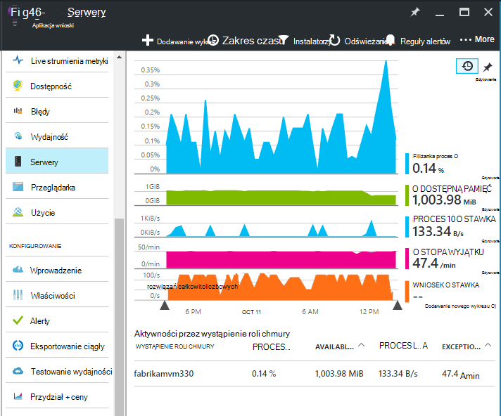
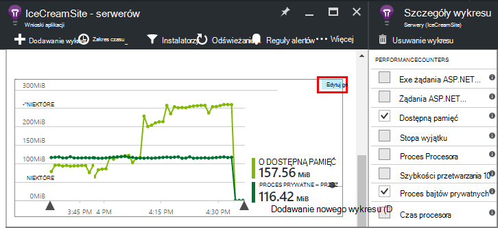
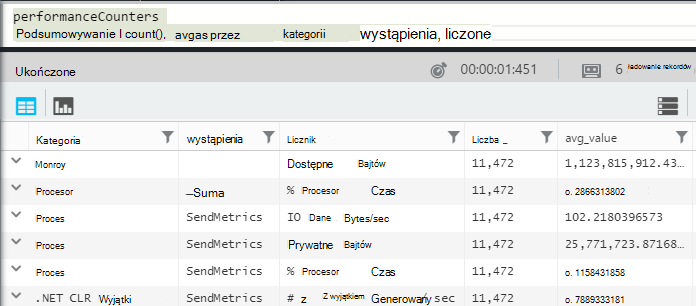
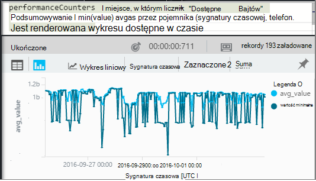
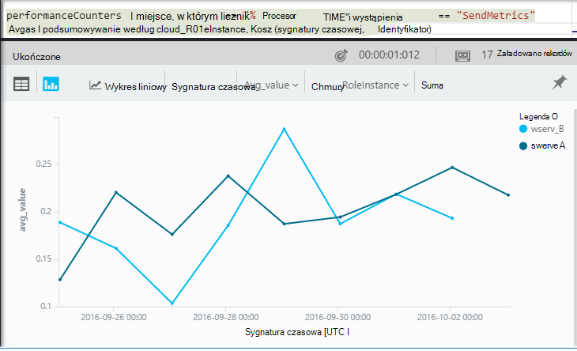

<properties 
    pageTitle="Liczniki wydajności w aplikacji wniosków | Microsoft Azure" 
    description="Monitorowanie systemu i niestandardowe liczniki wydajności .NET w aplikacji wnioski." 
    services="application-insights" 
    documentationCenter=""
    authors="alancameronwills" 
    manager="douge"/>

<tags 
    ms.service="application-insights" 
    ms.workload="tbd" 
    ms.tgt_pltfrm="ibiza" 
    ms.devlang="na" 
    ms.topic="article" 
    ms.date="10/11/2016" 
    ms.author="awills"/>
 
# <a name="system-performance-counters-in-application-insights"></a>Liczniki wydajności systemu w aplikacji wniosków


System Windows oferuje szeroką gamę [liczniki wydajności](http://www.codeproject.com/Articles/8590/An-Introduction-To-Performance-Counters) , takie jak użytkowanie Procesora, pamięci, dysku i obciążenie sieci. Można również określić własne. Jeśli aplikacja jest uruchomiona w obszarze usług IIS na hoście lokalnego lub maszyn wirtualnych, do którego ma dostęp administracyjny na [Wniosków aplikacji](app-insights-overview.md) mogą być wyświetlane te liczniki wydajności. Wykresy wskazują zasobów dostępnych dla aplikacji live i ułatwiają określanie niedopasowane obciążenia między wystąpieniami serwera.

Liczniki wydajności są wyświetlane w karta serwery, zawierający tabelę tego segmentów przez wystąpienie serwera.



(Liczniki wydajności nie są dostępne w aplikacjach sieci Web Azure. Ale można [wysyłać diagnostyki Azure analizy aplikacji](app-insights-azure-diagnostics.md)).

## <a name="configure"></a>Konfigurowanie

Jeśli Monitor stanu wniosków aplikacji nie jest jeszcze zainstalowany na komputerach serwerów, należy zainstalować go, aby zobaczyć liczników wydajności.

Pobierz i uruchom [Instalatora Monitor stanu](http://go.microsoft.com/fwlink/?LinkId=506648) w każdym wystąpieniu serwera. Jeśli aplikacja jest już zainstalowana, nie musisz zainstalować go ponownie.

* *Mam [zainstalowane SDK wniosków aplikacji w aplikacji](app-insights-asp-net.md) podczas opracowywania. Czy nadal potrzebuję Monitor stanu?*

    Tak, Monitor stanu jest wymagane na potrzeby zbierania liczników wydajności dla aplikacji sieci web programu ASP.NET. Być może już wiesz, Monitor stanu można także na [Monitorowanie aplikacji sieci web, które są już live](app-insights-monitor-performance-live-website-now.md), bez instalowania zestawu SDK w czasie projektowania.


## <a name="view-counters"></a>Wyświetlanie liczników

Karta serwery zawiera domyślny zestaw liczników wydajności. 

Aby wyświetlić inne liczniki, edytować na wykresach w karta serwery lub Otwórz nowy karta [Eksploratora metryki](app-insights-metrics-explorer.md) i Dodaj nowe wykresy. 

Dostępne liczniki są wyświetlane jako metryki podczas edytowania wykresu.



Aby wyświetlić wszystkie wykresy najbardziej przydatna w jednym miejscu, tworzenie [pulpitu nawigacyjnego](app-insights-dashboards.md) i Przypnij je do niego.

## <a name="add-counters"></a>Dodawanie liczników

Jeśli licznik wydajności, które mają nie jest wyświetlane na liście metryki, jest tak, ponieważ SDK wniosków aplikacji nie jest zbierania znajdujących się na serwerze sieci web. Możesz skonfigurować ją do tego.

1. Dowiedz się, jakie liczniki są dostępne na serwerze za pomocą tego polecenia programu PowerShell na serwerze:

    `Get-Counter -ListSet *`

    (See [`Get-Counter`](https://technet.microsoft.com/library/hh849685.aspx).)

1. Otwórz ApplicationInsights.config.

 * Po dodaniu aplikacji wniosków do aplikacji podczas opracowywania Edytuj ApplicationInsights.config w projekcie, a następnie ponownie wdrożyć go na serwerach.
 * Jeśli Monitor stanu umożliwia instrumentu aplikacji sieci web w czasie rzeczywistym, ApplicationInsights.config można znaleźć w katalogu głównym aplikacji w programie IIS. Aktualizowane dostępne w każdym wystąpieniu serwera.

2. Edytowanie dyrektywy zbierających wydajności:

 ```XML

    <Add Type="Microsoft.ApplicationInsights.Extensibility.PerfCounterCollector.PerformanceCollectorModule, Microsoft.AI.PerfCounterCollector">
      <Counters>
        <Add PerformanceCounter="\Objects\Processes"/>
        <Add PerformanceCounter="\Sales(photo)\# Items Sold" ReportAs="Photo sales"/>
      </Counters>
    </Add>

```

Możesz przechwycić zarówno standardowej liczniki i te wprowadziły samodzielnie. `\Objects\Processes`przykład licznika standardowy, dostępna we wszystkich systemach Windows. `\Sales(photo)\# Items Sold`przedstawia przykład niestandardowego licznika wprowadzonym w usłudze sieci web. 

Format jest `\Category(instance)\Counter"`, czy dla kategorii, które nie mają wystąpienia, tylko `\Category\Counter`.

`ReportAs`wymagany dla nazwy liczników, które nie pasują `[a-zA-Z()/-_ \.]+` -oznacza to, że zawierają znaki, które nie znajdują się w następujących zestawów: liter, zaokrąglanie nawiasy, ukośnik, łącznik, podkreślenie, spacji, kropki.

Jeśli użytkownik określi wystąpienie, zostanie pobrana jako wymiaru "CounterInstanceName" zgłoszoną metryki.

### <a name="collecting-performance-counters-in-code"></a>Zbieranie liczników wydajności w kodzie

Do gromadzenia liczniki wydajności systemu i wysłać je do wniosków aplikacji, możesz dopasować wstawkę kodu poniżej:

    var perfCollectorModule = new PerformanceCollectorModule();
    perfCollectorModule.Counters.Add(new PerformanceCounterCollectionRequest(
      @"\.NET CLR Memory([replace-with-application-process-name])\# GC Handles", "GC Handles")));
    perfCollectorModule.Initialize(TelemetryConfiguration.Active);

Lub możesz wykonać te same kroki z niestandardowej metryki, utworzony:

    var perfCollectorModule = new PerformanceCollectorModule();
    perfCollectorModule.Counters.Add(new PerformanceCounterCollectionRequest(
      @"\Sales(photo)\# Items Sold", "Photo sales"));
    perfCollectorModule.Initialize(TelemetryConfiguration.Active);

## <a name="performance-counters-in-analytics"></a>Liczniki wydajności do analizy

Można wyszukać i wyświetlić raporty licznika wydajności do [analizy](app-insights-analytics.md).


Udostępnia schematu **performanceCounters** `category`, `counter` nazwy, a `instance` nazwa wszystkich liczników wydajności.  Na telemetrycznego dla każdej aplikacji zostaną wyświetlone tylko liczniki dla tej aplikacji. Na przykład aby sprawdzić, jakie liczniki są dostępne: 



(W tym miejscu "Wystąpienia" odwołuje się do wystąpienia licznika wydajności nie wystąpieniem komputera roli lub serwera. Nazwę wystąpienia licznika wydajności zwykle segmenty liczników, takich jak czas procesora przez nazwa proces lub aplikację.)

Aby wyświetlić wykres dostępną pamięć w okresie ostatnich: 




Przykład innych telemetrycznego **performanceCounters** również zawiera kolumnę `cloud_RoleInstance` wskazująca tożsamości wystąpienia serwera hosta, na którym działa aplikacji. Na przykład, aby porównać działanie aplikacji na różnych komputerach: 




## <a name="aspnet-and-application-insights-counts"></a>ASP.NET i liczb wniosków aplikacji

*Jaka jest różnica między stopa wyjątku i metryk wyjątki?*

* *Stopa wyjątku* jest licznik wydajności systemu. Środowisko CLR zlicza wszystkie wyjątki obsłużone i nieobsługiwanego, które są generowane i dzieli sumę w zakresie przy próbkowaniu przez długość okresu. SDK wniosków aplikacji zbiera wynik i wysyła go do portalu.
* *Wyjątki* to liczba raportów TrackException odebrana przez portal w zakresie przy próbkowaniu wykresu. Zawiera tylko wyjątki obsłużone miejsce, w którym napisano TrackException połączeń w kodzie, a nie zawiera wszystkie [nieobsługiwanego wyjątki](app-insights-asp-net-exceptions.md). 

## <a name="alerts"></a>Alerty

Podobnie jak inne wskaźniki możesz [ustawić alert](app-insights-alerts.md) ostrzega, jeśli licznik wydajności wykracza poza limit zadanej. Otwórz karta alerty i kliknij pozycję Dodaj Alert.


## <a name="next"></a>Następne kroki

* [Zależność śledzenia](app-insights-asp-net-dependencies.md)
* [Śledzenie wyjątku](app-insights-asp-net-exceptions.md)