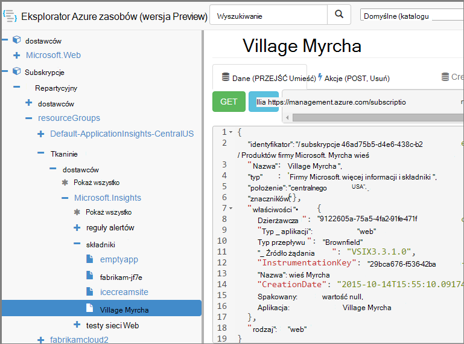

<properties 
    pageTitle="Tworzenie aplikacji wniosków zasobów za pomocą programu PowerShell" 
    description="Programowo utworzyć zasoby aplikacji wniosków w ramach systemu." 
    services="application-insights" 
    documentationCenter=""
    authors="alancameronwills" 
    manager="douge"/>

<tags 
    ms.service="application-insights" 
    ms.workload="tbd" 
    ms.tgt_pltfrm="ibiza" 
    ms.devlang="na" 
    ms.topic="article" 
    ms.date="03/02/2016" 
    ms.author="awills"/>
 
# <a name="create-application-insights-resources-using-powershell"></a>Tworzenie aplikacji wniosków zasobów za pomocą programu PowerShell

W tym artykule pokazano, jak utworzyć zasób [Wniosków aplikacji](app-insights-overview.md) platformy Azure automatycznie. Użytkownik może na przykład zrobić w ramach procesu tworzenia. Wraz z podstawowe zasobu wniosków aplikacji można utworzyć [testów web dostępność](app-insights-monitor-web-app-availability.md), [Skonfiguruj alerty](app-insights-alerts.md)i utworzyć inne zasoby Azure.

Klucz do tworzenia tych zasobów jest JSON szablonów dla [Menedżera zasobów Azure](../powershell-azure-resource-manager.md). W skrócie procedura jest: pobieranie definicji JSON istniejących zasobów. Definiowanie parametrów określonych wartości, takie jak nazwy. a następnie uruchomić szablon, gdy chcesz utworzyć nowy zasób. Kilka zasobów można spakować razem, je tworzyć w jednym przejdź — na przykład na monitorze aplikacji z sprawdza dostępności, alerty i miejsca do magazynowania dla ciągły eksportowanie. Istnieje kilka precyzyjnie do niektórych parameterizations, które firma Microsoft będzie wyjaśniono, w tym miejscu.

## <a name="one-time-setup"></a>Jednorazowej konfiguracji

Jeśli nie była wcześniej używana programu PowerShell z subskrypcją usługi Azure przed:

Zainstaluj moduł programu Powershell Azure na komputerze, na którym chcesz uruchomić skrypty:

1. Instalowanie [Instalatora platformy sieci Web firmy Microsoft (v5 lub nowszy)](http://www.microsoft.com/web/downloads/platform.aspx).
2. Należy go zainstalować Microsoft Azure programu Powershell.

## <a name="copy-the-json-for-existing-resources"></a>Kopiowanie JSON dla istniejących zasobów

1. Konfigurowanie [Aplikacji wniosków](app-insights-overview.md) dla projektu podobne do tych, których chcesz wygenerować automatycznie. Jeśli chcesz, Dodaj testy sieci web i alerty.
2. Tworzenie nowego pliku .json — Przejdźmy nadaj jej `template1.json` w tym przykładzie. Skopiuj tę zawartość do niego:


    ```JSON

        {
          "$schema": "https://schema.management.azure.com/schemas/2015-01-01/deploymentTemplate.json#",
          "contentVersion": "1.0.0.0",
          "parameters": {
            "appName": { "type": "string" },
            "webTestName": { "type": "string" },
            "url": { "type": "string" },
            "text": { "type" : "string" }
          },
          "variables": {
            "testName": "[concat(parameters('webTestName'), 
               '-', toLower(parameters('appName')))]"
            "alertRuleName": "[concat(parameters('webTestName'), 
               '-', toLower(parameters('appName')), 
               '-', subscription().subscriptionId)]"
          },
          "resources": [
            {
              // component JSON file contents
            },
            {
              //web test JSON file contents
            },
            {
              //alert rule JSON file contents
            }
 
            // Any other resources go here
          ]
        }
    
    ```

    Ten szablon skonfiguruje test jeden dostępność oprócz głównym zasobów.


2. Otwórz [Menedżera zasobów Azure](https://resources.azure.com/). Przechodzenie w dół między `subscriptions/resourceGroups/<your resource group>/providers/Microsoft.Insights/components`, zasobu aplikacji. 

    

    *Składniki* są podstawowe zasoby wniosków aplikacji do wyświetlania aplikacji. Istnieją zasoby osobnych skojarzone reguły alertów i analiz web dostępności.

3. Kopiowanie JSON składnika w odpowiednim miejscu w `template1.json`.
6. Usuń następujące właściwości:
  * `id`
  * `InstrumentationKey`
  * `CreationDate`
4. Otwieranie sekcji webtests i alertrules i skopiuj JSON poszczególnych elementów do szablonu. (Nie kopiować z węzłów webtests lub alertrules: Przejdź do elementów w obszarze ich.)

    Każdy test sieci web ma skojarzone reguły alertu, więc skopiuj oba.

    Testowanie sieci web powinien znajdować się przed reguły alertu.

5. Spełnienia wymagań schematu, wstawić poniższy wiersz każdego zasobu:

    `"apiVersion": "2014-04-01",`

    (Schematu również narzeka o wielkości liter nazwy typów zasobów `Microsoft.Insights/*` —, ale *nie* zmieniają one.)


## <a name="parameterize-the-template"></a>Definiowanie parametrów szablonu

Teraz masz zamienić określone nazwy parametrów. [Definiowanie parametrów szablonu](../resource-group-authoring-templates.md)możesz zapisać wyrażenia za pomocą [zestaw funkcji pomocy](../resource-group-template-functions.md). 

Nie można Definiowanie parametrów tylko część ciągu, więc należy używać `concat()` tworzenia ciągów.

Poniżej przedstawiono przykłady zastępczych, które należy wprowadzić. Istnieje kilka wystąpień każdego podstawiania. Może być konieczne innych osób w szablonie. W tych przykładach użyto parametry i zmienne, możemy zdefiniowanych w górnej części szablonu.

Znajdowanie | Zamień na
---|---
`"hidden-link:/subscriptions/.../components/MyAppName"`| `"[concat('hidden-link:',`<br/>` resourceId('microsoft.insights/components',` <br/> ` parameters('appName')))]"`
`"/subscriptions/.../alertrules/myAlertName-myAppName-subsId",` | `"[resourceId('Microsoft.Insights/alertrules', variables('alertRuleName'))]",`
`"/subscriptions/.../webtests/myTestName-myAppName",` | `"[resourceId('Microsoft.Insights/webtests', parameters('webTestName'))]",`
`"myWebTest-myAppName"` | `"[variables(testName)]"'`
`"myTestName-myAppName-subsId"` | `"[variables('alertRuleName')]"`
`"myAppName"` | `"[parameters('appName')]"`
`"myappname"`(małe litery) | `"[toLower(parameters('appName'))]"`
`"<WebTest Name=\"myWebTest\" ...`<br/>` Url=\"http://fabrikam.com/home\" ...>"`|`[concat('<WebTest Name=\"',` <br/> `parameters('webTestName'),` <br/> `'\" ... Url=\"', parameters('Url'),` <br/> `'\"...>')]" `


## <a name="set-dependencies-between-the-resources"></a>Ustawienie zależności między zasobów

Azure należy skonfigurować zasoby w kolejności ściśle. Aby upewnić się, że jeden zakończeniu przed rozpoczęciem następnego, Dodaj linii zależności:

* W sieci web Sprawdź zasobu:

    `"dependsOn": ["[resourceId('Microsoft.Insights/components', parameters('appName'))]"],`

* W alercie zasobu:

    `"dependsOn": ["[resourceId('Microsoft.Insights/webtests', variables('testName'))]"],`

## <a name="create-application-insights-resources"></a>Tworzenie aplikacji wniosków zasobów

1. W programie PowerShell Zaloguj się do Azure

    `Login-AzureRmAccount`

2. Uruchom polecenie w następujący sposób:

    ```PS

        New-AzureRmResourceGroupDeployment -ResourceGroupName Fabrikam `
               -templateFile .\template1.json `
               -appName myNewApp `
               -webTestName aWebTest `
               -Url http://myapp.com `
               -text "Welcome!"
               -siteName "MyAzureSite"

    ``` 

    * -ResourceGroupName jest grupa miejsce, w którym chcesz utworzyć nowe zasoby.
    * -templateFile musi przypadać przed parametry niestandardowe.
    * -Argumentu nazwę zasobu, aby utworzyć.
    * -webTestName nazwę test sieci web, aby utworzyć.
    * -Adres Url adres url aplikacji sieci web.
    * -ciąg tekstu, który pojawia się na stronie sieci web.
    * Nazwa-witryny — używany, jeśli jest Azure witryny sieci Web


## <a name="define-metric-alerts"></a>Definiowanie metryczne alertów

Istnieje [Metoda programu PowerShell Ustawianie alertów](app-insights-alerts.md#set-alerts-by-using-powershell).


## <a name="an-example"></a>Przykład

Poniżej przedstawiono pełną składnik, testowanie sieci web i szablonu sieci web test alert utworzonym przeze mnie:

``` JSON

{
  "$schema": "https://schema.management.azure.com/schemas/2015-01-01/deploymentTemplate.json#",
  "contentVersion": "1.0.0.0",
  "parameters": {
    "webTestName": { "type": "string" },
    "appName": { "type": "string" },
    "URL": { "type": "string" },
    "text": { "type" : "string" }
  },
  "variables": {
    "alertRuleName": "[concat(parameters('webTestName'), '-', toLower(parameters('appName')), '-', subscription().subscriptionId)]",
    "testName": "[concat(parameters('webTestName'), '-', toLower(parameters('appName')))]"
  },
  "resources": [
    {
      //"id": "[resourceId('Microsoft.Insights/components', parameters('appName'))]",
      "apiVersion": "2014-04-01",
      "kind": "web",
      "location": "Central US",
      "name": "[parameters('appName')]",
      "properties": {
        "TenantId": "9122605a-471fc50f8438",
        "Application_Type": "web",
        "Flow_Type": "Brownfield",
        "Request_Source": "VSIX3.3.1.0",
        "Name": "[parameters('appName')]",
        //"CreationDate": "2015-10-14T15:55:10.0917441+00:00",
        "PackageId": null,
        "ApplicationId": "[parameters('appName')]"
      },
      "tags": { },
      "type": "microsoft.insights/components"
    },
    {
      //"id": "[resourceId('Microsoft.Insights/webtests', variables('testName'))]",
      "name": "[variables('testName')]",
      "apiVersion": "2014-04-01",
      "type": "microsoft.insights/webtests",
      "location": "Central US",
      "tags": {
        "[concat('hidden-link:', resourceId('microsoft.insights/components', parameters('appName')))]": "Resource"
      },
      "properties": {
        "provisioningState": "Succeeded",
        "Name": "[parameters('webTestName')]",
        "Description": "",
        "Enabled": true,
        "Frequency": 900,
        "Timeout": 120,
        "Kind": "ping",
        "RetryEnabled": true,
        "Locations": [
          {
            "Id": "us-va-ash-azr"
          },
          {
            "Id": "emea-nl-ams-azr"
          },
          {
            "Id": "emea-gb-db3-azr"
          }
        ],
        "Configuration": {
          "WebTest": "[concat(
             '<WebTest   Name=\"', 
                parameters('webTestName'), 
              '\"  Id=\"32cfc791-aaad-4b50-9c8d-993c21beb218\"   Enabled=\"True\"         CssProjectStructure=\"\"    CssIteration=\"\"  Timeout=\"120\"  WorkItemIds=\"\"         xmlns=\"http://microsoft.com/schemas/VisualStudio/TeamTest/2010\"         Description=\"\"  CredentialUserName=\"\"  CredentialPassword=\"\"         PreAuthenticate=\"True\"  Proxy=\"default\"  StopOnError=\"False\"         RecordedResultFile=\"\"  ResultsLocale=\"\">  <Items>  <Request Method=\"GET\"         Guid=\"a6f2c90b-61bf-b28hh06gg969\"  Version=\"1.1\"  Url=\"', 
              parameters('Url'), 
              '\" ThinkTime=\"0\"  Timeout=\"300\" ParseDependentRequests=\"True\"         FollowRedirects=\"True\" RecordResult=\"True\" Cache=\"False\"         ResponseTimeGoal=\"0\"  Encoding=\"utf-8\"  ExpectedHttpStatusCode=\"200\"         ExpectedResponseUrl=\"\" ReportingName=\"\" IgnoreHttpStatusCode=\"False\" />        </Items>  <ValidationRules> <ValidationRule  Classname=\"Microsoft.VisualStudio.TestTools.WebTesting.Rules.ValidationRuleFindText, Microsoft.VisualStudio.QualityTools.WebTestFramework, Version=10.0.0.0, Culture=neutral, PublicKeyToken=b03f5f7f11d50a3a\" DisplayName=\"Find Text\"         Description=\"Verifies the existence of the specified text in the response.\"         Level=\"High\"  ExectuionOrder=\"BeforeDependents\">  <RuleParameters>        <RuleParameter Name=\"FindText\" Value=\"', 
              parameters('text'), 
              '\" />  <RuleParameter Name=\"IgnoreCase\" Value=\"False\" />  <RuleParameter Name=\"UseRegularExpression\" Value=\"False\" />  <RuleParameter Name=\"PassIfTextFound\" Value=\"True\" />  </RuleParameters> </ValidationRule>  </ValidationRules>  </WebTest>')]"
        },
        "SyntheticMonitorId": "[variables('testName')]"
      }
    },
    {
      //"id": "[resourceId('Microsoft.Insights/alertrules', variables('alertRuleName'))]",
      "name": "[variables('alertRuleName')]",
      "apiVersion": "2014-04-01",
      "type": "microsoft.insights/alertrules",
      "location": "East US",
      "dependsOn": [
        "[resourceId('Microsoft.Insights/components', parameters('appName'))]",
        "[resourceId('Microsoft.Insights/webtests', variables('testName'))]"
      ],
      "tags": {
        "[concat('hidden-link:', resourceId('Microsoft.Insights/components', parameters('appName')))]": "Resource",
        "[concat('hidden-link:', resourceId('Microsoft.Insights/webtests', variables('testName')))]": "Resource"
      },
      "properties": {
        "name": "[variables('alertRuleName')]",
        "description": "",
        "isEnabled": true,
        "condition": {
          "$type": "Microsoft.WindowsAzure.Management.Monitoring.Alerts.Models.LocationThresholdRuleCondition, Microsoft.WindowsAzure.Management.Mon.Client",
          "odata.type": "Microsoft.Azure.Management.Insights.Models.LocationThresholdRuleCondition",
          "dataSource": {
            "$type": "Microsoft.WindowsAzure.Management.Monitoring.Alerts.Models.RuleMetricDataSource, Microsoft.WindowsAzure.Management.Mon.Client",
            "odata.type": "Microsoft.Azure.Management.Insights.Models.RuleMetricDataSource",
            "resourceUri": "[resourceId('microsoft.insights/webtests', variables('testName'))]",
            "metricName": "GSMT_AvRaW"
          },
          "windowSize": "PT15M",
          "failedLocationCount": 2
        },
        "action": {
          "$type": "Microsoft.WindowsAzure.Management.Monitoring.Alerts.Models.RuleEmailAction, Microsoft.WindowsAzure.Management.Mon.Client",
          "odata.type": "Microsoft.Azure.Management.Insights.Models.RuleEmailAction",
          "sendToServiceOwners": true,
          "customEmails": [ ]
        },
        "provisioningState": "Succeeded",
        "actions": [ ]
      }

    }
  ]
}

```

## <a name="see-also"></a>Zobacz też

Inne artykuły automatyzacji:

* [Utwórz zasób wniosków aplikacji](app-insights-powershell-script-create-resource.md) — szybkie metody bez przy użyciu szablonu.
* [Ustawianie alertów](app-insights-powershell-alerts.md)
* [Tworzenie testy sieci web](https://azure.microsoft.com/blog/creating-a-web-test-alert-programmatically-with-application-insights/)
* [Wysyłanie diagnostyki Azure analizy aplikacji](app-insights-powershell-azure-diagnostics.md)
* [Tworzenie wersji adnotacji](https://github.com/Microsoft/ApplicationInsights-Home/blob/master/API/CreateReleaseAnnotation.ps1)
