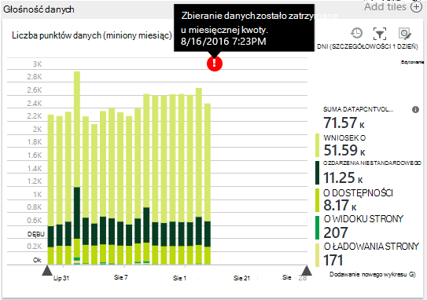

<properties 
    pageTitle="Zarządzanie ceny i przydziału dla aplikacji wniosków | Microsoft Azure" 
    description="Wybierz plan cena, do którego potrzebujesz, zarządzanie wielkości telemetrycznego" 
    services="application-insights" 
    documentationCenter=""
    authors="alancameronwills" 
    manager="douge"/>

<tags 
    ms.service="application-insights" 
    ms.workload="tbd" 
    ms.tgt_pltfrm="ibiza" 
    ms.devlang="na" 
    ms.topic="article" 
    ms.date="10/13/2016" 
    ms.author="awills"/>

# Zarządzanie ceny i przydziału dla wniosków aplikacji

*Wnioski aplikacji jest w podglądzie.*

[Ceny] [ pricing] dla [Programu Visual Studio aplikacji wniosków] [ start] jest oparty na objętość danych na aplikacji. Istnieje znacznych warstwa bezpłatne, w której zostanie wyświetlony większość funkcji z pewne ograniczenia.

Każdemu zasobowi wniosków aplikacji jest naliczany jako oddzielna usługa i składa się na rachunku za subskrypcję Azure.

[Zobacz Schemat cennik][pricing].

## Przegląd zasobów i cena planu dla zasobu wniosków aplikacji

Możesz otworzyć przydziału + ceny karta z poziomu strony ustawień zasobu do aplikacji.

Wybór schematu ceny dotyczy:

* [Miesięcznej kwoty](#monthly-quota) - ilość telemetrycznego można analizować każdego miesiąca.
* [Szybkość danych](#data-rate) — maksymalna szybkość, w którym można przetwarzane dane z Twojej aplikacji.
* [Eksportowanie ciągły](#continuous-export) — czy eksportowanie danych do innych narzędzi i usług.

Limity te są ustawiane osobno dla każdego zasobu wniosków aplikacji.

### Bezpłatna wersja próbna Premium

Po utworzeniu nowego zasobu wniosków aplikacji zaczyna się w warstwie bezpłatne.

W dowolnej chwili możesz przełączać się do wersji próbnej 30 dni wolne Premium. Dzięki temu korzyści wynikających z poziomu Premium. Po 30 dniach zostaną automatycznie przywrócone, niezależnie od poziomu możesz były przed - chyba że zdecydujesz się jawnie innej warstwie. Zaznacz warstwy, które mają być w dowolnym momencie podczas okresu próbnego, ale nadal otrzymasz bezpłatnej wersji próbnej do końca 30 dni.

## Miesięczny przydziału

* W każdym miesiącu kalendarza aplikacji można wysłać w górę o określoną ilość telemetrycznego analizy aplikacji. Przydziału dla bezpłatnej cennik warstwa jest obecnie 5 milionów punktów danych, co miesiąc i znacznie więcej dla innych programów; Możesz kupić więcej przekroczenie przydziału.  Zobacz [ceny schematu] [ pricing] dla wartości rzeczywistych. 
* Przydział zależy od poziomu cennik, który wybrano.
* Przydział jest liczony od północy UTC pierwszego dnia każdego miesiąca.
* Wykres punktów danych pokazuje, ile przydziału wykorzystał w tym miesiącu.
* Przydział jest mierzony w *punktów danych.* Jeden punkt danych jest połączenie z jedną z metod śledzenia, czy o nazwie jawnie w kodzie, lub przez jednego z modułów telemetrycznego standardowy. Może mieć wiele dołączone właściwości i wskaźniki.
* Punkty danych są generowane przez:
 * [Moduły SDK](app-insights-configuration-with-applicationinsights-config.md) automatycznie zbieranie danych, na przykład do raportu wezwanie na spotkanie lub awarię lub do pomiaru wydajności.
 * [Interfejs API](app-insights-api-custom-events-metrics.md) `Track...` połączeń, które zostały zapisane, takich jak `TrackEvent` lub `trackPageView`.
 * [Dostępność testy sieci web](app-insights-monitor-web-app-availability.md) , który skonfigurowano.
* Gdy debugowanie, widać wysyłana z aplikacji w oknie dane wyjściowe programu Visual Studio punktów danych. Zdarzenia klienta można wyświetlić, otwierając że kartę Sieć w przeglądarce jest debugowanie okienko (zazwyczaj F12).
* *Dane sesji* nie jest liczony w przydziału. W tym liczby użytkowników, sesje, środowiska i dane urządzenia.
* Jeśli chcesz zliczyć punktów danych podczas kontroli, można znaleźć w różnych miejscach:
 * Poszczególne elementy, które są widoczne w [diagnostyczne wyszukiwania](app-insights-diagnostic-search.md), która zawiera HTTP żądania, wyjątki, śledzenia dziennika, liczbę wyświetleń stron, zdarzeń zależności i zdarzenia niestandardowe.
 * Pomiarami nieprzetworzonych [metryki](app-insights-metrics-explorer.md) takich jak licznik wydajności. (Punktów, które są wyświetlane na wykresy są zwykle agregacje wiele punktów nieprzetworzonych danych).
 * Każdy punkt wykresu dostępność sieci web jest także agregacji kilka punktów danych.
* Można również sprawdzić poszczególnych punktów danych w źródle podczas debugowania:
 * Po uruchomieniu aplikacji w trybie debugowania w programie Visual Studio, punkty danych są rejestrowane w oknie dane wyjściowe. 
 * Aby wyświetlić punkty danych klienta, otwórz okienko debugowania przeglądarki (zazwyczaj F12) i otwórz kartę Sieć.
* Szybkość danych może być (domyślnie) ograniczona przez [adaptacyjne próbki](app-insights-sampling.md). Oznacza to, że jako użycie usługi podwyżki aplikacji i stawka telemetrycznego nie zwiększyć jak można by się spodziewać.

### Nadmiar

Aplikacja wysyła więcej niż miesięcznej kwoty, możesz wykonać następujące czynności:

* Zapłacić dodatkowych danych. [Cennik schematu] [ pricing] Aby uzyskać szczegółowe informacje. Możesz wybrać tę opcję, z wyprzedzeniem. Ta opcja jest niedostępna w wolnym ceny warstwy.
* Uaktualnianie do poziomu cennik.
* Brak. Dane sesji będzie w dalszym ciągu można zarejestrować, ale inne dane nie będą wyświetlane w diagnostyczne wyszukiwania lub w Eksploratorze metryki.

## Ile danych jest wysyłanie?

Wykres w dolnej części ceny karta zawiera objętość punktu danych aplikacji, pogrupowane według typu punkt danych. (Można również utworzyć wykres w Eksploratorze metryka.)

Kliknij wykres, aby uzyskać więcej szczegółów, lub przeciągnij wskaźnik przez go, a następnie kliknij przycisk (+) dla szczegóły zakres czasu.

Wykres przedstawia ilość danych, odebrana przez usługę wniosków aplikacji, po [pobraniu](app-insights-sampling.md).

Jeśli wielkość danych osiągnie miesięczne przydziału, adnotacji zostanie wyświetlone na wykresie.

## Szybkość danych

Oprócz miesięcznej kwoty istnieją ograniczania limity na szybkość danych. Bezpłatne [ceny warstwa] [ pricing] limit wynosi 200 danych punktów na sekundę średnia ponad 5 minut, a dla płatnej tiers jest 500/s średnią niż 1 minuty. 

Istnieją trzy pakiety, które są zliczane oddzielnie:

* [Połączenia TrackTrace](app-insights-api-custom-events-metrics.md#track-trace) i [rejestrowany dzienników](app-insights-asp-net-trace-logs.md)
* [Wyjątki](app-insights-api-custom-events-metrics.md#track-exception), ograniczone do 50 punktów/s.
* Wszystkie inne telemetrycznego (liczba wyświetleń strony, sesje, żądania, zależności, metryki, zdarzenia niestandardowe, wyniki testów sieci web).

*Co się stanie, jeśli Moja aplikacja jest większa niż wartość stopy na sekundę?*

* Ilości danych, który wysyła aplikacji jest ustalana co minutę. Jeśli przekracza stawkę sekundę średnia minuty, serwer odrzuca niektóre żądania. Zestawu SDK buforów danych, a następnie próbuje ponownie wysłać, rozkładanie wzrost przez kilka minut. Jeśli aplikacji wysyła spójne danych powyżej ograniczania stawki, niektóre dane zostaną usunięte. (ASP.NET, Java i JavaScript SDK ponownie wysłać w ten sposób; innych SDK może po prostu upuszczania ograniczenie danych).

Jeśli ograniczania występuje, pojawi się powiadomienie ostrzeżenie, że to wystąpiło zdarzenie.

*Jak ustalić liczbę punktów danych, wysyła aplikacji?*

* Otwórz ustawienia-przydziału i ceny, aby wyświetlić wykres głośność danych.
* Lub w Eksploratorze metryki Dodawanie nowego wykresu i wybierz polecenie **Głośność punkt danych** jako jej metryki. Przełączanie na grupowania i grupowanie według **typu danych**.

## Aby zmniejszyć szybkość danych

Jeśli występują ograniczenia ograniczania, Oto kilka rzeczy, które możesz wykonać:

* Za pomocą [próbki](app-insights-sampling.md). Ta technologia zmniejsza szybkość danych bez pochylanie usługi metryki i bez przerywania umożliwia przechodzenie między elementami pokrewnymi w wyszukiwaniu.
* [Ogranicz liczbę połączeń Ajax, które mogą być zgłaszane](app-insights-javascript.md#detailed-configuration) w każdej widoku strony lub przełącznik wyłączanie raportowania Ajax.
* Wyłącz moduły kolekcji, które nie są potrzebne, [edytując ApplicationInsights.config](app-insights-configuration-with-applicationinsights-config.md). Na przykład można zdecydować, że liczniki wydajności lub współzależności dane są inessential.
* Wstępnie agregacji metryki. Jeśli połączenia do TrackMetric zostało umieszczone w aplikacji, można zmniejszyć ruch przy użyciu przeciążeń, akceptującym obliczenia średniej i odchylenia standardowego partii miar. Lub można użyć [wstępnie agregację pakiet](https://www.myget.org/gallery/applicationinsights-sdk-labs). 

## Próbki

[Próbki](app-insights-sampling.md) jest metodę redukcji stawek, jaką telemetrycznego są wysyłane do aplikacji, przy zachowaniu znajdowania powiązane z nimi zdarzenia podczas wyszukiwania diagnostyczne i zachowaniu poprawne, że statystyką zdarzenia. 

Przy próbkowaniu to skuteczny sposób, aby zmniejszyć koszty i utrzymać koszty w ramach miesięczny przydziału. Algorytm przy próbkowaniu zachowuje powiązanych elementów telemetrycznego, tak, aby na przykład podczas korzystania z funkcji wyszukiwania, możesz znaleźć żądania związane z określonym wyjątek. Algorytmu zachowuje poprawne liczników, tak aby zobaczyć poprawne wartości w Eksploratorze metryki dla żądań, wyjątku stawki i inne liczby.

Istnieje kilka formularzy przy próbkowaniu.

* [Adaptacyjne pobierania](app-insights-sampling.md) jest domyślny zestaw SDK programu ASP.NET, który jest automatycznie dostosowywany tak wielkości telemetrycznego wysyłające aplikacji. Działa automatycznie w SDK w aplikacji sieci web, dzięki czemu zmniejszany jest ruch telemetrycznego w sieci. 
* *Pobieranie próbek spożyciu* jest alternatywy działająca w punkcie, w którym telemetrycznego z Twojej aplikacji wprowadza usługę wniosków aplikacji. Nie wywiera wpływu na wielkość telemetrycznego wysyłanych z aplikacji, ale jej zmniejsza wielkość zachowane przez usługę. Jego umożliwia zmniejszenie przydziału wykorzystane przez telemetrycznego z przeglądarki i inne SDK.

Przy próbkowaniu spożyciu ustawia kontrolki przydziałów + ceny karta:

> [AZURE.WARNING] Wartość widoczna na kafelku zachowane próbki wskazuje tylko wartości ustawione dla próbki spożyciu. Częstotliwość pobierania działa SDK w aplikacji nie była widoczna. 
> 
> Jeśli przychodzące telemetrycznego już zostały próbki w zestawie SDK przy próbkowaniu spożyciu nie jest stosowany.
 
Aby odkrywać stopa rzeczywista przy próbkowaniu niezależnie od tego, gdzie zostały zastosowane, należy użyć [kwerendy analizy](app-insights-analytics.md) , takich jak:

    requests | where timestamp > ago(1d)
  	| summarize 100/avg(itemCount) by bin(timestamp, 1h) 
  	| render areachart 

W każdym zachowane rekordu `itemCount` wskazuje liczbę oryginalny rekordy, które go reprezentuje równa 1 + numer poprzedniego rekordy usuwane. 

## Przejrzyj faktury dla subskrypcji Azure

Opłaty wniosków aplikacji są dodawane do rachunku Azure. Można wyświetlić szczegóły usługi Azure BOM w sekcji rozliczeń Azure portal lub [Portal Azure rozliczenia](https://account.windowsazure.com/Subscriptions). 

## Nazwa ograniczenia

1.  Maksymalnie 200 unikatowych nazw metryczne i 200 nazwy unikatowe właściwości aplikacji. Metryki zawierać dane wysłane za pośrednictwem TrackMetric, a także wymiarów na innych typów danych, takich jak zdarzenia.  [Nazwy metryki i właściwości] [ api] globalnych na klucz oprzyrządowania.
2.  [Właściwości] [ apiproperties] mogą być używane do filtrowania i grupowania według tylko wtedy, gdy mają mniej niż 100 wartości unikatowe dla każdej właściwości. Po liczba unikatowych wartości przekracza 100, możesz nadal wyszukiwać właściwości, ale już go używać w przypadku filtrów lub Grupuj według.
3.  Właściwości standardowe, takie jak zażądać nazwa i adres URL strony są ograniczone do 1000 unikatowych wartości w tygodniu. Po 1000 unikatowych wartości dodatkowe wartości są oznaczane jako "Innych wartości". Nadal można wartości pierwotne wyszukiwanie pełnotekstowe i filtrowania.

Jeśli okaże się, że aplikacja jest przekraczają limity te, należy rozważyć, czy dzielenia danych między klawiszy różnych oprzyrządowania - oznacza to, że [tworzenia nowych zasobów wniosków aplikacji](app-insights-create-new-resource.md) i Wyślij części danych do nowych kluczy oprzyrządowania. Może się okazać, że wynik jest lepiej zorganizowane. Aby wyświetlić różne metryki na tym samym ekranie, aby ta metoda nie ogranicza możliwość porównanie różnych metryki służy [pulpitów nawigacyjnych](app-insights-dashboards.md#dashboards) . 

## Podsumowanie ograniczenia

[AZURE.INCLUDE [application-insights-limits](../../includes/application-insights-limits.md)]

<!--Link references-->

[api]: app-insights-api-custom-events-metrics.md
[apiproperties]: app-insights-api-custom-events-metrics.md#properties
[start]: app-insights-overview.md
[pricing]: http://azure.microsoft.com/pricing/details/application-insights/

 