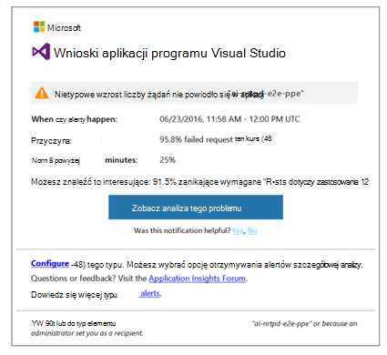
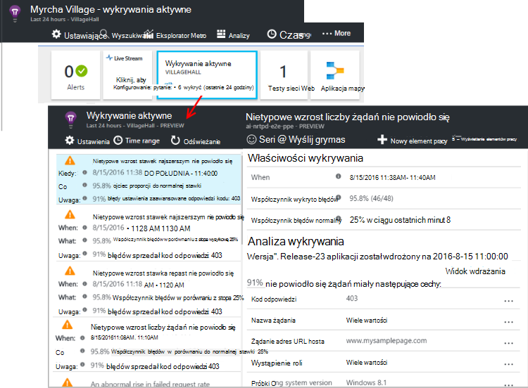

<properties 
    pageTitle="Aktywne diagnostyki w aplikacji wniosków | Microsoft Azure" 
    description="Wnioski aplikacji wykonuje automatyczne szczegółowej analizy telemetrycznego Twojej aplikacji i ostrzeżenie o potencjalnych problemach." 
    services="application-insights" 
    documentationCenter="windows"
    authors="rakefetj" 
    manager="douge"/>

<tags 
    ms.service="application-insights" 
    ms.workload="tbd" 
    ms.tgt_pltfrm="ibiza" 
    ms.devlang="na" 
    ms.topic="article" 
    ms.date="08/15/2016" 
    ms.author="awills"/>

#  Aktywne diagnostyki w aplikacji wniosków

 Aktywne diagnostyki ostrzega automatycznie potencjalnych problemów z wydajnością w aplikacji sieci web. Wykonuje inteligentne analizy danych telemetrycznych wysyłające aplikacji usługi [Programu Visual Studio aplikacji wnioski](app-insights-overview.md). Jeśli istnieje przerwa wzrost awariami lub nietypowe wzorców wydajności klienta lub serwera, zostanie wyświetlony alert. Ta funkcja wymaga konfiguracji. Działa, gdy aplikacja wysyła za mało telemetrycznego.

Uzyskiwania dostępu do wykrywania aktywne alertów zarówno z wiadomości e-mail, które otrzymujesz oraz karta aktywnego wykrywania.

## Przejrzyj usługi wykryć aktywne

Można wyszukiwać wykryć na dwa sposoby:

* **Odbieranie wiadomości e-mail** z aplikacji wnioski. Oto typowy przykład:

    

    Kliknij duży przycisk, aby otworzyć dokładniej omówione w portalu.

* **Kafelka wykrywania aktywne** w swojej aplikacji karta Przegląd Wyświetla liczbę ostatnich alertów. Kliknij Kafelek, aby wyświetlić listę ostatnich alertów.

Zaznacz alert, aby wyświetlić jego szczegóły.

## Jakie problemy zostaną wykryte żadne?

Istnieją trzy rodzaje wykrywania:

* [Diagnostyka stopa aktywnej błąd](app-insights-proactive-failure-diagnostics.md). Używamy maszynowego uczenia ustawić oczekiwana liczba zakończonych niepowodzeniem żądań dla aplikacji sieci korelacji z obciążeniem i inne czynniki. Jeśli stopa błąd odbywa się poza oczekiwanych koperty, wyślemy alert.
* [Diagnostyka wydajności aktywne](app-insights-proactive-performance-diagnostics.md). Firma Microsoft wyszukiwania anomalous wzorców w czas reakcji i awariami każdego dnia. Firma Microsoft dostosować te problemy z właściwości, takie jak lokalizacja, przeglądarki, klienta systemu operacyjnego, wystąpienie serwera i godzina.
* [Azure usług w chmurze](https://azure.microsoft.com/blog/proactive-notifications-on-cloud-service-issues-with-azure-diagnostics-and-application-insights/). Możesz otrzymywać alerty, gdy aplikacji jest obsługiwana w usługach chmura Azure, a w przypadku wystąpienia roli zawiera uruchamianiem, odtwarzanie częstych lub awarię środowisko uruchomieniowe.

(Łącza pomocy Każde powiadomienie prowadzą do odpowiednich artykułów.)

## Następne kroki

Te narzędzia diagnostyczne ułatwiają inspekcja telemetrycznego z Twojej aplikacji:

* [Metryka Eksploratora](app-insights-metrics-explorer.md)
* [Eksplorator usługi wyszukiwania](app-insights-diagnostic-search.md)
* [Analizy — języka kwerend zaawansowanych](app-insights-analytics-tour.md)

Diagnostyka aktywne są całkowicie automatyczne. Ale być może chcesz skonfigurować niektóre alerty więcej?

* [Ręcznie skonfigurować alerty metryczne](app-insights-alerts.md)
* [Dostępność testy sieci web](app-insights-monitor-web-app-availability.md) 

