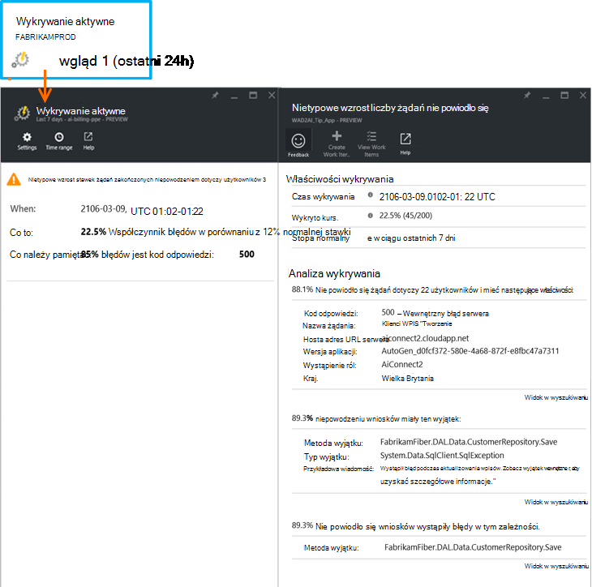

<properties 
    pageTitle="Diagnostyka stopa aktywne błąd w aplikacji wniosków | Microsoft Azure" 
    description="Powiadamia nietypowe zmiany stawki żądania nie powiodło się do aplikacji sieci web i oferuje analizy diagnostyczne. Konfiguracja nie jest potrzebna." 
    services="application-insights" 
    documentationCenter=""
    authors="yorac" 
    manager="douge"/>

<tags 
    ms.service="application-insights" 
    ms.workload="tbd" 
    ms.tgt_pltfrm="ibiza" 
    ms.devlang="na" 
    ms.topic="article" 
    ms.date="10/12/2016" 
    ms.author="awills"/>
 
# Narzędzia diagnostyczne stopa aktywne błąd

[Visual Studio aplikacji wniosków](app-insights-overview.md) automatycznie o tym, w czasie rzeczywistym najbliższego Jeśli nieprawidłowej wzrost współczynnik błędów napotkania aplikacji sieci web. Wykrywa nietypowe wzrost stopy żądania HTTP zgłoszone jako nie powiodło się. Są to zazwyczaj zawierających kody odpowiedzi w 400 - i 500-zakresy. Aby pomóc sprawdzać i diagnozowanie problemu, analizę cech żądań zakończonych niepowodzeniem i powiązanych telemetrycznego znajduje się w powiadomieniu. Dostępne są także łącza do portalu wniosków aplikacji dodatkowo diagnostyki. Funkcja musi nie konfiguracji lub konfiguracji, jak przewidywanie współczynnik normalny błędów za pomocą komputera nauki algorytmy.

Ta funkcja działa Java i ASP.NET aplikacjach sieci web hostowanej w chmurze lub na własnych serwerach. Działa dla dowolnej aplikacji, generowany przez telemetrycznego żądanie — na przykład jeśli masz roli Pracownik wywołującym [TrackRequest()](app-insights-api-custom-events-metrics.md#track-request). 

Po konfigurowania [Aplikacji wniosków projektu](app-insights-overview.md)i pod warunkiem aplikacji generuje minimalne pewnego telemetrycznego, błąd aktywne diagnostyki ma 24 godziny Aby dowiedzieć się normalny zachowanie aplikacji, przed jego włączeniu i wysyłać alertów.

Poniżej przedstawiono przykładowy alert. 

> [AZURE.NOTE] Domyślnie zostanie wyświetlony krótszej poczty format niż w tym przykładzie. Ale możesz [przełączać się do tego formatu szczegółowe](#configure-alerts).

Należy zauważyć, że informuje:

* Błąd proporcji aplikacji normalnego działania.
* Ilu użytkowników występuje — informującego o ile martwić się.
* Wzorzec charakterystycznego skojarzone z błędy. W tym przykładzie jest kod określonego odpowiedzi, Nazwa żądania (operacji) oraz wersję aplikacji. Który natychmiast zawiera informację, gdzie rozpocząć wyszukiwanie w kodzie. Inne możliwości może być określonego systemu operacyjnego przeglądarki lub klienta.
* Wyjątek, dziennika śledzenia i błąd zależności (bazy danych lub innych składników zewnętrznych), które mogą być skojarzone z scharakteryzowany nie powiodło się żądania.
* Łączy bezpośrednio do odpowiednich wyszukiwanie na telemetrycznego w aplikacji wnioski.

## Zalety aktywne alertów

Zwykłe [metryczne alerty](app-insights-alerts.md) informujący o tym, że być może wystąpił problem. Ale Diagnostyka aktywne błąd uruchamiania diagnostyczne pracy związanej z, wykonywanie wielu analityczne w przeciwnym razie należy wykonać samodzielnie. Uzyskanie wyników starannie spakowany, ułatwiając szybkie dotarcie do głównego problem.

## Jak to działa

W pobliżu monitorów diagnostyki aktywnej w czasie rzeczywistym telemetrycznego odebrana z aplikacji, a w szczególności liczby żądań nie powiodło się. Ta metryka zlicza żądania której `Successful request` właściwość ma wartość false. Domyślnie `Successful request== (resultCode < 400)` (o ile nie zostały zapisane kodu niestandardowego [filtru](app-insights-api-filtering-sampling.md#filtering) lub wygenerować połączeń [TrackRequest](app-insights-api-custom-events-metrics.md#track-request) ). 

Wydajność aplikacji sieci zawiera typowe deseń zachowania. Niektóre żądania będzie bardziej podatne na błąd niż inne; i ogólnego wskaźnika błędu może być Przejdź w górę wraz ze wzrostem obciążenia. Błąd aktywne diagnostyki używa maszynowego uczenia w celu znalezienia tych różnic w odniesieniu. 

Jak telemetrycznego wejścia wniosków aplikacji z aplikacji sieci web, Diagnostyka aktywne błąd porównuje bieżące zachowanie deseniami widoczne na kilka dni. W przypadku nieprawidłowej wzrost współczynnik błędów obserwuje się przez porównanie poprzedniego wydajności, analizę zostanie wywołany.

Kiedy analizę zostanie wywołana, usługa wykonuje analizę klaster na żądanie nie powiodło się, w celu zidentyfikowania deseń wartości, które charakteryzującą błędy. W powyższym przykładzie analizy wykrytych to większości błędów o kod określonego wyniku, Nazwa żądania, adres URL serwera hosta i wystąpienie roli. Natomiast analizy wykrył, że właściwość systemu operacyjnego klienta są rozłożone na wiele wartości, a więc nie ma na liście.

Podczas tej usługi jest narzędzia z tych telemetrycznego, analizatora znajduje wyjątków i błąd zależności, skojarzonych z żądania w klastrze, które zidentyfikował, razem z przykładem dowolnego dzienników skojarzone z żądaniami.

Analiza wyniku został wysłany do użytkownika jako alert, chyba że skonfigurowano go nie.

Przykład [alertów, które można ustawić ręcznie](app-insights-alerts.md)można sprawdzić stan alertu i skonfiguruj go w karta alertów zasobu wniosków aplikacji. Jednak w przeciwieństwie do innych alertów, nie musisz Konfigurowanie diagnostyki aktywne błąd. Jeśli chcesz, możesz je wyłączyć lub zmienić ich adresy e-mail docelowej.

## Konfigurowanie alertów 

Można wyłączyć diagnostyki aktywne, zmienianie adresatów wiadomości e-mail, tworzenie webhook lub korzystania z bardziej szczegółowe komunikaty o alertach.

Otwórz stronę alertów. Aktywne diagnostyki znajduje się wraz z alerty ustawione ręcznie, a zobaczysz, czy jest obecnie w stanie alertów.

Kliknij alert, aby go skonfigurować.

Powiadomienie, że można wyłączyć diagnostyki aktywne, ale nie można go usunąć (lub utworzyć nowe).

#### Szczegółowe alertów

Jeśli wybierzesz "Odbieranie szczegółowej analizy" wiadomość e-mail będzie zawierać informacje diagnostyczne. Czasami można rozpoznać problem tylko z danych w wiadomości e-mail. 

Istnieje małe ryzyko, że bardziej szczegółowego alertu może zawierać poufnych informacji, ponieważ zawiera on wyjątku i śledzenie wiadomości. Jednak chcesz tylko dzieje, gdy kodzie umożliwiają poufnych informacji do wiadomości. 

## Triaging i diagnozowania alertu

Alert wskazuje, że wykryto nieprawidłowej wzrost liczby żądań nie powiodło się. Istnieje prawdopodobieństwo, że jest problem związany z aplikacji lub z jego środowiska.

Od wartości procentowej żądania i liczba użytkowników, których dotyczy problem możesz określić, jak pilna jest ten problem. W powyższym przykładzie błąd stopień 22,5% różni się od zwykłych stawek 1%, wskazuje, że nieprawidłowe coś. Z drugiej strony dotyczyła tylko 11 użytkowników. Gdyby aplikacji, czy można ocenić, jak poważne jest to.

W większości przypadków można rozpoznać problem szybko z Nazwa żądania i wyjątku, zależność błąd i śledzenia danych dostarczonych. 

Istnieje kilka innych wskazówek. Na przykład zależności współczynnik błędów w tym przykładzie jest taka sama, jak stawka wyjątku (89.3%). Sugeruje to, że wyjątek wynika bezpośrednio z błąd zależności — umożliwiając wyczyść ogólny obraz tego, gdzie rozpocząć wyszukiwanie w kodzie.

Aby zbadać, łącza w każdej sekcji spowoduje przejście bezpośrednio do [strony wyszukiwania](app-insights-diagnostic-search.md) filtrowane, aby odpowiednie żądań, wyjątku, zależności lub śledzenia. Lub Otwórz [Azure portal](https://portal.azure.com), przejdź do zasobu wniosków aplikacji dla aplikacji i otwórz karta błędy.

W tym przykładzie klikając łącze "Wyświetl szczegóły błędy zależności" zostanie wyświetlona karta wyszukiwanie wniosków aplikacji na instrukcji SQL z głównej przyczyny: wartości null, jeżeli w obowiązkowe i niepomyślnego sprawdzania poprawności podczas zapisywania operacji.

## Przeglądanie ostatnich alertów

Aby zapoznać się z alertów w portalu, otwórz **Ustawienia dzienników inspekcji**.

Kliknij dowolny alert, aby wyświetlić jego pełne szczegóły.

Lub kliknij pozycję **aktywne wykrywania** bezpośrednie przechodzenie do ostatnio alert:

## Na czym polega różnica...

Błąd aktywne stopa diagnostyki uzupełnia innych podobnych ale różne funkcje aplikacji wniosków. 

* [Metryka alerty](app-insights-alerts.md) są ustawiane przez Ciebie i można monitorować szeroką gamę metryki, takich jak Procesora użytkowanie żądań, czasem ładowania strony i tak dalej. Można używać ich do ostrzega, na przykład, jeśli musisz dodać więcej zasobów. Natomiast diagnostyki aktywne błąd obejmuje niewielki zakres krytyczna metryki (obecnie tylko żądań zakończonych niepowodzeniem stopa), zaprojektowane w celu powiadomienia o tym, że możesz w czasie rzeczywistym sposób po aplikacji sieci web nie powiodło się żądanie że stawki zwiększa znacznie w porównaniu z normalne zachowanie aplikacji sieci web.

    Diagnostyka stawek aktywne błąd jest automatycznie dostosowywany tak progu w odpowiedzi na obowiązujące warunki.

    Błąd aktywne stopa diagnostyki Uruchom diagnostyczne pracy dla użytkownika. 
* [Diagnostyka wydajności aktywne](app-insights-proactive-performance-diagnostics.md) używa też analizy maszynowego do identyfikować wzorce nietypowe w swojej metryki i jest wymagana żadna konfiguracja przez Ciebie. Ale w przeciwieństwie do diagnostyki stopa błąd aktywne, celem Diagnostyka wydajności aktywne jest znajdowanie segmentów kolektora do zastosowania, które mogą być nieprawidłowo obsługiwane — na przykład według określonych stron na konkretny typ przeglądarki. Analiza jest wykonywana codziennie, a w przypadku znalezienia dowolny wynik jest może być znacznie zadecydować niż alert. Natomiast analizy dotyczące diagnostyki aktywne błąd jest wykonywane przez cały czas na telemetrycznego przychodzących, a użytkownik jest informowany ciągu kilku minut awariami serwera jest większa niż oczekiwano.

## Jeśli zostanie wyświetlony alert aktywne błąd stopa diagnostyki

*Dlaczego otrzymali ten alert?*

*   Wykryliśmy nieprawidłowej wzrost częstotliwość żądań zakończonego niepowodzeniem w porównaniu do normalnego linii bazowej poprzedniego okresu. Po analizy awarii i skojarzone telemetrycznego możemy Pomyśl problem, który należy zwrócić uwagę na występuje. 

*Powiadomienie oznacza, że problem występuje ostatecznie?*

*   Firma Microsoft próby alert na zakłócenia aplikacji lub obniżenie wydajności, mimo że tylko można w pełni zrozumieć znaczenie i ich wpływu na aplikacji lub użytkowników.

*Tak możesz guys przeglądać dane?*

*   Wartość nie. Usługa jest całkowicie automatyczne. Tylko otrzymasz powiadomienia o jego. Dane są [prywatne](app-insights-data-retention-privacy.md).

*Czy muszę subskrybowanie ten alert?* 

*   Wartość nie. Wysyłanie telemetrycznego żądania każdej aplikacji ma tę regułę alertu.

*Czy anulować subskrypcję lub otrzymywanie powiadomień, zamiast tego wysyłane do moich współpracowników?*

*   Tak, w reguły, kliknij regułę aktywne diagnostyki ją skonfigurować. Wyłączenie alertu lub zmienianie adresatów alertu. 

*Utrata wiadomości e-mail. Gdzie znaleźć powiadomienia o jego w portalu*

*   W dzienników inspekcji. Kliknij pozycję Ustawienia, dzienników inspekcji, a następnie dowolną alert, aby wyświetlić jej występowania, ale ograniczone szczegółowy widok.

*Niektóre alerty są znanych problemów i nie chcę otrzymywać je.*

*   W naszym zaległości mamy zwalczaniu alertów.

## Następne kroki

Te narzędzia diagnostyczne ułatwiają inspekcja telemetrycznego z Twojej aplikacji:

* [Metryka Eksploratora](app-insights-metrics-explorer.md)
* [Eksplorator usługi wyszukiwania](app-insights-diagnostic-search.md)
* [Analizy — języka kwerend zaawansowanych](app-insights-analytics-tour.md)

Aktywne wykryć są całkowicie automatyczne. Ale być może chcesz skonfigurować niektóre alerty więcej?

* [Ręcznie skonfigurować alerty metryczne](app-insights-alerts.md)
* [Dostępność testy sieci web](app-insights-monitor-web-app-availability.md) 

