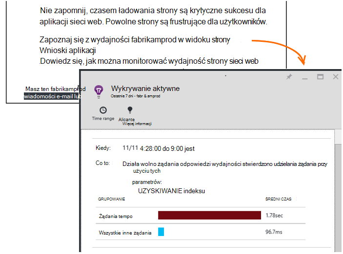

<properties 
    pageTitle="Wniosków aplikacji: Diagnostyka wydajności aktywne | Microsoft Azure" 
    description="Wnioski aplikacji wykonuje szczegółowej analizy telemetrycznego Twojej aplikacji i ostrzeżenie o potencjalnych problemach." 
    services="application-insights" 
    documentationCenter="windows"
    authors="antonfrMSFT" 
    manager="douge"/>

<tags 
    ms.service="application-insights" 
    ms.workload="tbd" 
    ms.tgt_pltfrm="ibiza" 
    ms.devlang="na" 
    ms.topic="article" 
    ms.date="08/31/2016" 
    ms.author="awills"/>

#  Diagnostyka wydajności aktywne

*Wnioski aplikacji jest w podglądzie.*

[Visual Studio aplikacji wniosków](app-insights-overview.md) wykonuje szczegółowej analizy telemetrycznego Twojej aplikacji i może zostać wyświetlone ostrzeżenie o potencjalnych problemów z wydajnością. Prawdopodobnie czytasz te ponieważ odebrano jedną z naszych aktywne alerty pocztą e-mail. 

Ta funkcja wymaga ustawień i jest automatycznie aktywny, gdy aplikacji generuje za mało telemetrycznego.

## Co to są Diagnostyka wydajności aktywne?

Diagnostyka wydajności aktywne wykrywa nietypowe wzorców wydajności w aplikacji, analizując telemetrycznego, wysyłające aplikacji usługi wniosków aplikacji. 

W szczególności umożliwia znalezienie występują problemy z wydajnością, które dotyczą tylko niektórych użytkowników lub tylko mają wpływ na użytkowników w niektórych przypadkach.

Na przykład go Cię powiadamiać stronach aplikacji znacznie spowolnić obciążenie jednego typu przeglądarki niż inne lub jeśli żądania są udostępniane wolniej z określonego serwera. Można również wykrywania problemów związanych z kombinacji właściwości, takie jak ładowania strony wolne w danym obszarze geograficznych przez określony czas dnia.

Różnic w odniesieniu podobne do poniższych trudno wykrywanie sprawdzając tylko dane, ale są najczęściej niż się wydaje. Często są tylko powierzchniowy, gdy skarga klientów. Do tego czasu jest zbyt opóźnione: odpowiednich użytkowników są już przechodzenia do konkurentów!

Obecnie nasze algorytmów Przyjrzyj się czasem ładowania strony, czasy odpowiedzi wezwania na serwerze i czasy odpowiedzi zależności.  

Nie masz ustawić dowolny progi lub skonfigurować reguły. Wykrywanie nieprawidłowego desenie służą maszynowego uczenia się i algorytmów wyszukiwania danych. 

Jest bardzo chcesz mieć swoją opinię. Napisz nam, jak pomoże Ci, jak można poprawić wykrywania aktywne i jakie dodatkowe funkcje chcesz, abyśmy dodać. Można przesłać opinię za pośrednictwem Wyślij uśmiech/grymas niezadowolenia w portalu lub e-mail do AppInsightsML@microsoft.com. 

## Informacje o alercie aktywne

* *Dlaczego otrzymali tej wiadomości e-mail*
 * Aktywne wykrywania analizowane telemetrycznego aplikacji wysyłane do wniosków aplikacji i wykryty problem z wydajnością aplikacji. 
* *Powiadomienie oznacza, że problem występuje ostatecznie?*
 * Wartość nie. Jest po prostu sugestię jakiejś kwestii którą można przeglądać więcej ściśle. 
* *Co należy zrobić?*
 * [Przyjrzyj się dane prezentowane](#responding-to-an-alert). Za pomocą Eksploratora metryki Przegląd wydajności w czasie, a także przechodzić do dodatkowych metryki. Przy użyciu funkcji wyszukiwania do filtrowania określonych zdarzeń, które ułatwiają Określ przyczynę. 
* *Tak możesz guys przeglądać dane?*
 * Wartość nie. Usługa jest całkowicie automatyczne. Tylko otrzymasz powiadomienia o jego. Dane są [prywatne](app-insights-data-retention-privacy.md).

## Proces wykrywania

* *Jakiego rodzaju różnic w odniesieniu wydajności zostaną wykryte żadne?*
 * Desenie, które może okazać się go czasochłonne sprawdzić dla siebie. Na przykład niskiej wydajności w określonych kombinacji lokalizacji, godziny lub platformy.
* *Czy podczas analizowania wszystkich danych zebranych przez wniosków aplikacji*
 * Nie obecnie. Obecnie firma Microsoft analizowanie żądania czas reakcji i czas reakcji współzależności czas pobierania. Analiza dodatkowe metryki jest już wkrótce. 
* *Czy można utworzyć własne anomalii reguły wykrywania?*
 * Jeszcze nie. Ale można wykonywać następujące czynności:
 * [Skonfiguruj alerty](app-insights-alerts.md) informujący o tym, kiedy metryki przecina progu.)
 * [Eksportowanie danych telemetrycznych](app-insights-export-telemetry.md) do [bazy danych](app-insights-code-sample-export-sql-stream-analytics.md) lub [PowerBI](app-insights-export-power-bi.md) lub [innych](app-insights-code-sample-export-telemetry-sql-database.md) narzędzi, gdzie można analizować je samodzielnie.
* *Jak często jest wykonywane analizy*
 * Firma Microsoft przeprowadzić analizę codziennie na telemetrycznego z poprzedniego dnia.
* * Więc ta zastępuje [metryczne alerty](app-insights-alerts.md)?
 * Wartość nie.  Nie możemy przekazać wykrywanie każdej zachowanie, które warto rozważyć nieprawidłowego.

## Jak badanie problemów podniesiona

Otwórz raport diagnostyczne, wiadomości e-mail lub na liście różnic w odniesieniu.

* **Gdy** zawiera czas wykryto problem.
* **Jakie** informacje
 * Ten problem, które zostało wykryte;
 * Cech zestaw zdarzeń, które znaleziono wyświetlane zachowanie problem.
* W tabeli porównano Ustawianie niskiej z zachowaniem średnia wszystkich innych zdarzeń.

Kliknij łącza, aby otworzyć Eksploratora jednostki metryczne i wyszukiwanie w odpowiednich raportach, przefiltrowany według czasu i właściwości zestawu wykonywanie działa wolno.

Modyfikowanie zakresu czasu oraz filtry Eksplorowanie danych telemetrycznych.

## Jak zwiększyć wydajność?

Odpowiedzi wolniej i nie powiodło się to jeden z największych frustrations dla użytkowników witryny sieci web, wiesz własnych możliwości. Tak jest ważne w celu rozwiązania problemów.

### Klasyfikowanie

Najpierw czy ma znaczenie? Jeśli strona zawsze jest powolne, ładowanie, ale tylko o 1% użytkowników witryny kiedykolwiek jest w celu jej przejrzenia, być może masz ważniejszych co należy wziąć pod uwagę. Z drugiej strony jeśli tylko 1% użytkowników go otworzyć, ale zgłasza zawsze wyjątków, co może być warte badanie.

Instrukcja wpływ w wiadomości e-mail jako ogólne wskazówki, ale pamiętaj, że nie jest on wszystko na temat. Gromadzenie inne dokumenty, aby potwierdzić.

Należy rozważyć, czy parametry problem. Jeśli jest to zależne od geograficznych, konfigurowanie [sprawdza dostępności](app-insights-monitor-web-app-availability.md) , łącznie z tego regionu: być może wystąpił po prostu problemów z siecią w tym obszarze. 

### Diagnozowanie obciążenia powolne strony 

Gdzie znajduje się ten problem? Działa wolno reagować na serwerze, jest bardzo długa strona lub czy przeglądarce musi wykonać wiele zadań, aby ją wyświetlić?

Otwórz karta metryczne przeglądarki. Przedstawia [segmentowany wyświetlania czasu ładowania strony przeglądarki](app-insights-javascript.md#explore-your-data) , gdzie będzie czas. 

* Jeśli **Wysyłanie czas żądania** jest wysoka, serwer odpowiada powoli lub żądanie jest wpisu z dużą ilością danych. Przyjrzyj się [wskaźniki](app-insights-web-monitor-performance.md#metrics) , którzy chcą czasy odpowiedzi. 
* Konfigurowanie [śledzenia zależności](app-insights-dependencies.md) czy powolność jest z powodu usług zewnętrznych lub bazy danych.
* Jeśli **Otrzymujesz odpowiedzi** jest głównym, strony i jego zależne części — JavaScript, CSS, obrazy i tak dalej (ale nie asynchroniczne załadowano dane) są długie. Konfigurowanie, [Testowanie dostępności](app-insights-monitor-web-app-availability.md)i należy ustawić opcję, aby załadować części zależne. Gdy pojawi się niektóre wyniki, Otwórz szczegóły wyników i rozwinąć, aby zobaczyć czasy ładowania różnych plików.
* Wysoka **czas przetwarzania klienta** sugerowanie, że skrypty działają powoli. Jeśli przyczyny nie występują oczywiste, Rozważ dodanie kodu chronometraż i Wyślij godziny w przypadku połączeń trackMetric.

### Poprawa powolne strony

Ma sieci web pełny porad dotyczących zwiększania odpowiedzi serwera, a czasem ładowania strony, więc nie próbie wszystkich tutaj powtarzać. Oto kilka porad, które prawdopodobnie wiesz już, co ułatwia zastanawiająca:

* Powolne, ładowanie ze względu na duże pliki: asynchroniczne ładowanie skrypty i inne części. Za pomocą skryptu grupowania. Podział strony głównej na widżety załadować dane o jego oddzielnie. Nie wysyłaj zwykły stare HTML dla długich tabel: żądanie danych jako JSON lub w innym formacie kompaktowym za pomocą skryptu, a następnie wypełnij tabelę w miejscu. Istnieją doskonałe RAM ułatwiające to wszystko. (One również powoduje duży skryptów, oczywiście.)
* Spowalniać zależności serwera: należy rozważyć, czy lokalizacje geograficzne składników. Na przykład jeśli korzystasz z platformy Azure, upewnij się, że serwer sieci web i bazy danych znajdują się w tym samym regionie. Zapytania pobierać informacje nie są potrzebne? Czy buforowanie lub tworzeniu partii pomocy?
* Problemy dotyczące wydajności: przeglądać metryki serwera czasów odpowiedzi i zlicza, wezwanie. Jeśli czas reakcji nieproporcjonalnie szczytowy z wartości w liczbie żądania, jest prawdopodobieństwo, że serwery są rozciągnięciu. 

## Wiadomości e-mail z powiadomieniem

* *Czy muszę subskrybowanie tej usługi, aby otrzymywać powiadomienia?*
 * Wartość nie. Nasze robotów okresowo ankiety danych przez wszystkich użytkowników wniosków aplikacji, a wysyła powiadomienia w przypadku wykrycia problemów.
* *Czy anulować subskrypcję lub otrzymywanie powiadomień, zamiast tego wysyłane do moich współpracowników?*
 * Kliknij łącze Anuluj subskrypcję alertu lub wiadomości e-mail. 
 
    Obecnie są one wysyłane do osób, które mają [dostęp do zasobu wniosków aplikacji zapisu](app-insights-resources-roles-access-control.md).

    Można również edytować ustawienia listy adresatów w Karta aktywnego wykrywania.
* *Nie chcę wypełnienia tych wiadomości.*
 * Są ograniczone do jeden raz dziennie najtrafniejszych kwestii, które jeszcze nie możemy jeszcze zgłoszone o. Nie można uzyskać powtarzania wszystkich wiadomości.
* *Jeśli nic nie mam, będzie uzyskać przypomnienia?*
 * Nie, jest wyświetlany komunikat o każdej problem tylko raz. 
* *Utrata wiadomości e-mail. Gdzie znaleźć powiadomienia o jego w portalu*
 * W aplikacji wniosków Omówienie aplikacji kliknij Kafelek **Wykrywanie aktywne** . Można znaleźć wszystkie powiadomienia w górę spód 7 dni.

## Następne kroki

Te narzędzia diagnostyczne ułatwiają inspekcja telemetrycznego z Twojej aplikacji:

* [Metryka Eksploratora](app-insights-metrics-explorer.md)
* [Eksplorator usługi wyszukiwania](app-insights-diagnostic-search.md)
* [Analizy — języka kwerend zaawansowanych](app-insights-analytics-tour.md)

Aktywne wykryć są całkowicie automatyczne. Ale być może chcesz skonfigurować niektóre alerty więcej?

* [Ręcznie skonfigurować alerty metryczne](app-insights-alerts.md)
* [Dostępność testy sieci web](app-insights-monitor-web-app-availability.md) 

