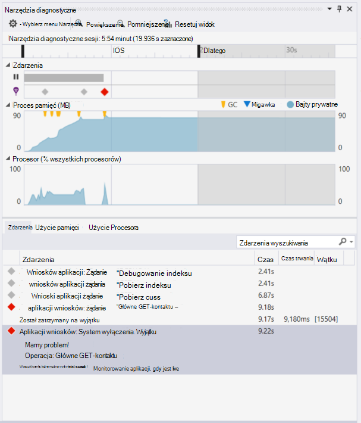
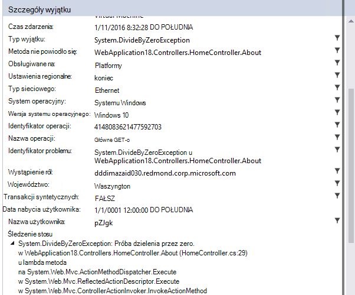

<properties
    pageTitle="Informacje o wersji programu Visual Studio rozszerzenia analiz Deweloper"
    description="Najnowsze aktualizacje dla programu Visual Studio narzędzi do analizy Deweloper."
    services="application-insights"
    documentationCenter=""
    authors="acearun"
    manager="douge"/>
<tags
    ms.service="application-insights"
    ms.workload="tbd"
    ms.tgt_pltfrm="ibiza"
    ms.devlang="na"
    ms.topic="article"
    ms.date="06/09/2016"
    ms.author="acearun"/>

# Informacje o wersji dla narzędzi dla deweloperów analizy
Co nowego: wniosków aplikacji i HockeyApp analizy w programie Visual Studio.
## W wersji 7.0
### Trendów wniosków aplikacji programu Visual Studio
Visual Studio aplikacji wniosków jest nowe narzędzie w programie Visual Studio, którego mogą pomóc w analizie sposób działania aplikacji w czasie. Aby rozpocząć, na pasku narzędzi **Aplikacji wniosków** lub w oknie Wyszukiwanie wniosków aplikacji wybierz **Eksplorowanie trendów telemetrycznego**. Lub, w menu **Widok** kliknij pozycję **Inne okna**, a następnie kliknij **Trendów wniosków aplikacji**. Wybierz jedną z pięciu typowych kwerend, aby rozpocząć pracę. Można analizować różnych zestawów danych na podstawie typów telemetrycznego, zakresami czasu i inne właściwości. Aby znaleźć różnic w odniesieniu w danych, wybierz jedną z opcji anomalii na liście rozwijanej **Typ widoku** . Opcje filtrowania w dolnej części okna ułatwiają skupić w na określony podzbiór usługi telemetrycznego.

### Wyjątki w CodeLens
Telemetrycznego wyjątku zostanie wyświetlona w CodeLens. Jeśli utworzono połączenie projektu z usługą wniosków aplikacji, pojawi się liczba wyjątków, które wystąpiły w każdej metody produkcji w ciągu ostatnich 24 godzin. Z CodeLens można przejść do wyszukiwania lub trendów, aby zbadać z wyjątkiem bardziej szczegółowo.

### Obsługa Core programu ASP.NET
Wnioski aplikacji obsługuje teraz ASP.NET Core RC2 projekty w programie Visual Studio. Możesz dodać wniosków aplikacji do nowych projektów ASP.NET Core RC2 w oknie dialogowym **Nowy projekt** , tak jak w następujących zrzut ekranu. Lub można ją dodać do istniejącego projektu, kliknij prawym przyciskiem myszy projektu w Eksploratorze rozwiązań, a następnie kliknij **Dodaj telemetrycznego wniosków aplikacji**.

ASP.NET 5 RC1 i projektów ASP.NET Core RC2 mieć także nowym możliwościom w oknie narzędzia diagnostyczne. Zobaczysz zdarzeń wniosków aplikacji, takich jak żądania i wyjątki z Twojej aplikacji programu ASP.NET podczas debugowania lokalnie na komputerze. Z każdego zdarzenia kliknij przycisk **wyszukiwania** , aby przechodzenie do szczegółów, aby uzyskać więcej informacji.

### HockeyApp w przypadku aplikacji uniwersalny systemu Windows
Oprócz beta rozkładu i użytkownika opinię HockeyApp zawiera symbolicated awarii raportowania dla aplikacji uniwersalny systemu Windows. Wprowadziliśmy go jeszcze łatwiejsze dodać HockeyApp SDK: kliknij prawym przyciskiem myszy nad projektem uniwersalny systemu Windows, a następnie kliknij **Na lodzie aplikacji — Włączanie analizy ulec awarii**. Instaluje zestawu SDK, konfiguruje zbioru awarii i przepisy zasobu HockeyApp w chmurze, wszystko to bez przekazywanie aplikacji z usługą HockeyApp.

Inne nowe funkcje:

* Wprowadziliśmy funkcję wyszukiwania wniosków aplikacji szybsze i bardziej intuicyjny. Teraz zakresami czasu oraz filtry szczegółów automatycznie zostaną zastosowane podczas zaznaczania.
* Również w wyszukiwaniu wniosków aplikacji, teraz istnieje opcję, aby przejść do kodu bezpośrednio z poziomu telemetrycznego wezwanie.
* Wprowadziliśmy ulepszenia HockeyApp logowanie.
* W polu narzędzia diagnostyczne są wyświetlane informacje telemetrycznego produkcji wyjątki.

## Wersja 5,2
Pracujemy powinno poinformować wprowadzenie HockeyApp scenariuszy w programie Visual Studio. Integracja pierwszego znajduje się w rozkład beta aplikacji uniwersalny systemu Windows i Windows Forms aplikacji z poziomu programu Visual Studio.

Z rozkładem beta możesz przekazać wcześniejsze wersje aplikacji do HockeyApp do dystrybucji podzbiór wybranych klientów lub testerzy. Rozkład beta, w połączeniu z HockeyApp awarii zbieranie i użytkownika opinii funkcje, może dostarczyć ważnych informacji o aplikacji przed udostępnieniem większego. Tak, aby można uniknąć lub zminimalizować problemy w przyszłości, takie jak oceny niskim aplikacji, negatywnych opinii i tak dalej, można użyć tych informacji w celu rozwiązania problemów z aplikacją pakietu.

Dowiedz się, jak łatwo jest przekazywanie tworzy dla rozkładu beta z poziomu programu Visual Studio.
### Aplikacje uniwersalny systemu Windows
Menu kontekstowe węzeł projektu aplikacji uniwersalny systemu Windows zawiera teraz opcję przekazywanie do kompilacji do HockeyApp.

Wybierz element i HockeyApp zostanie otwarte okno dialogowe przekazywania. Konieczne będzie konto HockeyApp, aby przekazać do kompilacji. Jeśli nowy użytkownik, nie martw się. Tworzenie konta jest skomplikowanym procesem.

Po nawiązaniu połączenia, zostanie wyświetlony formularz przekazywania w oknie dialogowym.

Wybierz zawartość, aby przekazać (plik .appxbundle lub .appx), a następnie wybierz opcje udostępniania w kreatorze. Opcjonalnie możesz dodać informacje o wersji na następnej stronie. Wybierz pozycję **Zakończ** , aby rozpocząć przekazywanie.

Po zakończeniu przekazywania zostanie wyświetlone powiadomienie HockeyApp z potwierdzeniem i łącza do aplikacji w portalu HockeyApp.

To wszystko! Przekazane przez Ciebie tylko kompilacji dla rozkładu beta za pomocą kilku kliknięć.

Możesz zarządzać aplikacji na wiele sposobów w portalu HockeyApp. Ta opcja uwzględnia zaproszenie użytkowników raportów awarii i opinię, zmieniając szczegóły i tak dalej.

Zobacz [HockeyApp bazy wiedzy Knowledge Base](http://support.hockeyapp.net/kb/app-management-2) , aby uzyskać więcej informacji o zarządzaniu aplikacji.

### Aplikacje formularzy z systemu Windows
Menu kontekstowe węzeł projektu formularza systemu Windows zawiera teraz opcję przekazywanie do kompilacji do HockeyApp.

Spowoduje to otwarcie okna dialogowego przekazywania HockeyApp, który jest podobny do znajdującego się w aplikacji uniwersalny Windows.

Uwaga nowe pole w kreatorze, służącą do wersji aplikacji. W przypadku aplikacji Universal Windows informacje znajduje się z manifestu. Aplikacje Windows Forms Niestety, nie masz równoważne z tą funkcją. Będzie konieczne ręczne określanie.

Pozostałe przepływu jest podobna do aplikacji uniwersalnej systemu Windows: wybierz pozycję Tworzenie i zwolnij opcji, Dodaj wersji notatek, przekazywanie i zarządzanie nimi w portalu HockeyApp.

Jest tak proste jak. Spróbuj i trafić co sądzisz.
## Wersja 4.3
### Telemetrycznego wyszukiwania z sesji debugowania lokalne
W tej wersji możesz teraz wyszukać telemetrycznego wniosków aplikacji wygenerowane podczas sesji debugowania programu Visual Studio. Przed można użyć wyszukiwania tylko wtedy, gdy zarejestrowanych aplikacji w aplikacji wnioski. Teraz aplikacji tylko musi mieć SDK wniosków aplikacji zainstalowany szukać lokalnej telemetrycznego.

Jeśli masz aplikację ASP.NET z SDK wniosków aplikacji, wykonaj następujące czynności, aby za pomocą funkcji wyszukiwania.

1. Debugowanie aplikacji.
2. Otwórz aplikację wniosków wyszukiwania w jeden z następujących sposobów:
    - W menu **Widok** kliknij pozycję **Inne okna**, a następnie kliknij **Aplikację wniosków wyszukiwania**.
    - Kliknij przycisk na pasku narzędzi **Aplikacji wnioski** .
    - W oknie Eksplorator rozwiązań rozwijanie **ApplicationInsights.config**, a następnie kliknij **telemetrycznego sesji debugowania wyszukiwania**.
3. Jeśli nie masz jeszcze z wniosków aplikacji, w trybie telemetrycznego sesji debugowania zostanie otwarte okno wyszukiwania.
4. Kliknij ikonę **wyszukiwania** , aby wyświetlić swojej lokalnej telemetrycznego.

## Wersji 4.2
W tej wersji dodano funkcje ułatwiające wyszukiwania danych w kontekście zdarzenia, umożliwia przechodzenie do kodu z więcej danych dotyczących zdarzeń i środowisko łatwe wysyłanie danych logowania do aplikacji wnioski. To rozszerzenie jest aktualizowana co miesiąc. Jeśli masz opinii lub funkcji żądania, wyślij go do aidevtools@microsoft.com.
### Rejestrowanie kliknij pozycję Brak obsługi
Już korzystasz z NLog, log4net lub System.Diagnostics.Tracing, nie musisz martwić przenoszenie wszystkich wyników śledzenia wniosków aplikacji. W tej wersji możemy zostały zintegrowane karty rejestrowania aplikacji wniosków z środowisko normalnej konfiguracji.
Jeśli masz już jeden z tych ram rejestrowanie skonfigurowane, poniższej sekcji opisano, jak ją uzyskać.
**Jeśli dodano już wniosków aplikacji:**
1. Kliknij prawym przyciskiem myszy węzeł projektu, a następnie kliknij pozycję **Wniosków aplikacji**, a następnie kliknij **Wniosków Konfigurowanie aplikacji**. Upewnij się, czy jest widoczny opcję, aby dodać właściwej karty w oknie Konfiguracja.
2. Także podczas tworzenia rozwiązanie Uwaga okno podręczne, które pojawi się na górze prawej strony ekranu i kliknij przycisk **Konfiguruj**.

Jeśli jest zainstalowana karta Rejestrowanie, uruchomienie aplikacji i upewnij się, że jest widoczna danych na karcie Narzędzia diagnostyczne w następujący sposób:

### Przechodzenie do lub Znajdowanie kodu, w którym emisji telemetrycznego właściwość zdarzenia
Z nowej wersji użytkownika można kliknij dowolną wartość w przypadku szczegółów i wyszuka to odpowiedni ciąg w bieżącym otwartego rozwiązania. Wyniki będą widoczne w programie Visual Studio listy "Znajdowanie wyników", tak jak pokazano poniżej:

### Jeśli nie zalogowano się nowe okno wyszukiwania
Firma Microsoft została ulepszona wyglądu okna aplikacji wniosków wyszukiwanie ułatwiające wyszukiwania danych, gdy aplikacja jest w produkcji.

### Zobacz wszystkie zdarzenia telemetrycznego skojarzonego ze zdarzeniem
Dodaliśmy nową kartę, przy użyciu wstępnie zdefiniowanych kwerend dla wszystkich danych związanych z wydarzeniem telemetrycznego, że użytkownik jest wyświetlane obok kartę Szczegóły zdarzenia. Na przykład żądanie zawiera pole o nazwie **Identyfikator operacji**. Co zdarzenia związanego z tego żądania ma taką samą wartość identyfikatora **Operacji**. Jeśli wystąpi wyjątek podczas przetwarzania żądania operacji, wyjątku znajduje się ten sam identyfikator operacji jako żądanie tak, aby ułatwić znajdowanie. Jeśli szukasz na żądanie, kliknij pozycję **Wszystkie telemetrycznego dla tej operacji** , aby otworzyć nową kartę, której są wyświetlane nowe wyniki wyszukiwania.

### Prześlij dalej i Wstecz Historia w wyszukiwaniu
Teraz możesz przejść i z powrotem między wyników wyszukiwania.

## Wersja 4.1
Ta wersja zawiera wiele nowych funkcji i aktualizacji. Musisz mieć aktualizacji 1 można zainstalować tej wersji.

### Przechodzenie z powodu wyjątku do metody kodu źródłowego
Teraz jeśli wyjątki z Twojej aplikacji produkcji w oknie Wyszukiwanie wniosków aplikacji, można przejść do metody w kodzie miejsce, w którym występuje wyjątek. Konieczne jest poprawny załadowanego w programie Project i aplikacji wniosków trwa istotnych pozostałej! (Aby dowiedzieć się więcej na temat okna Wyszukiwanie wniosków aplikacji, zobacz informacje o wersji dla wersji 4.0 w poniższych sekcjach).

Jak to działa? Za pomocą aplikacji wniosków wyszukiwania nawet wtedy, gdy rozwiązanie nie jest otwarty. W obszarze śledzenie stosu jest wyświetlany komunikat informacyjny, a liczby elementów w wynikach śledzenia stosu są niedostępne.

Jeśli plik informacje są dostępne, niektóre elementy mogą być łącza, ale elementu informacji o rozwiązanie nadal będą widoczne.

Po kliknięciu hiperłącza będzie przejść do lokalizacji, w wybranej metody w kodzie. Mogą występować różnice w numer wersji, ale funkcję, aby przejść do właściwej wersji kodu, rozpocznie się w późniejszych wersjach.

### Obsługę nowych punktów wejścia do wyszukiwania w Eksploratorze rozwiązań
Teraz można dostęp do wyszukiwania w Eksploratorze rozwiązań.

### Wyświetla powiadomienie publikowanie po ukończeniu
Podręczne okno dialogowe wyświetlonym po opublikowaniu projektu w trybie online, można wyświetlać dane aplikacji wniosków produkcji.

## W wersji 4.0

### Dane aplikacji wniosków wyszukiwania w programie Visual Studio
Funkcja wyszukiwania w portalu wniosków aplikacji teraz w programie Visual Studio można filtrować i wyszukiwanie na typach zdarzeń, wartości i tekst, takich jak, a następnie przeprowadź inspekcję pojedynczych zdarzeń.

### Zobacz dane pochodzące z komputera lokalnego w polu narzędzia diagnostyczne

Usługi telemetrycznego oprócz innych debugowania danych można wyświetlić na stronie programu Visual Studio narzędzia diagnostyczne. Tylko ASP.NET 4,5 jest obsługiwana.

### Dodawanie zestawu SDK do projektu bez konieczności logowania się do Azure

Nie masz już do zalogowania się do Azure, aby dodać pakiety wniosków aplikacji do projektu, za pośrednictwem okna dialogowego **Nowego projektu** lub z menu kontekstowego projektu. Jeśli możesz się zalogować, SDK zostaną zainstalowane i skonfigurowane do wysyłania telemetrycznego do portalu jako przed. Jeśli nie możesz zalogować się, zestawu SDK zostaną dodane do projektu i generuje telemetrycznego koncentratora diagnostyczne. Możesz skonfigurować ją później przydatna.

### Obsługa urządzeń

U *Connect();* 2015 r. możemy [ogłoszenia,](https://azure.microsoft.com/blog/deep-diagnostics-for-web-apps-with-application-insights/) czy HockeyApp naszych obsługi urządzeń przenośnych Deweloper dla urządzeń. HockeyApp ułatwia rozpowszechnianie kompilacjach beta do swojego testerzy, zbieranie i analizowanie wszystkich awarii z Twojej aplikacji i zbieranie opinii bezpośrednio z klientów.
HockeyApp obsługuje aplikacji na platformie, niezależnie od wybrania do utworzenia, czy to być iOS, Android, lub systemu Windows lub rozwiązanie i platform, takich jak Xamarin, Cordova lub jedności.

W przyszłych wersjach rozszerzenia aplikacji wniosków, firma Microsoft będzie wprowadzenie bardziej zintegrowane środowisko między HockeyApp i Visual Studio. Teraz można rozpocząć od HockeyApp przez dodanie odwołanie NuGet. Można znaleźć w [dokumentacji](http://support.hockeyapp.net/kb/client-integration-windows-and-windows-phone) , aby uzyskać więcej informacji.
