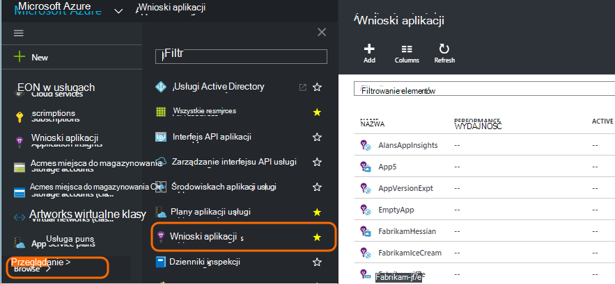
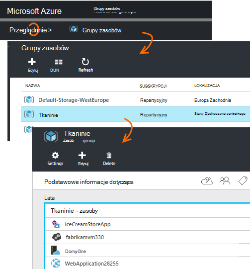
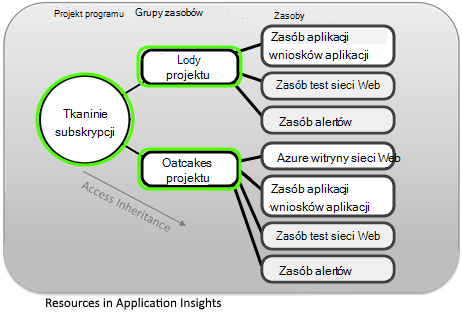
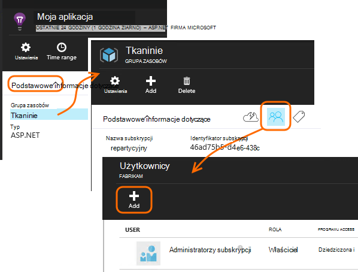
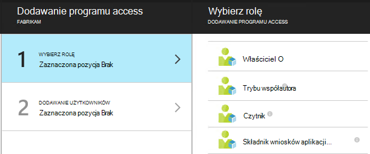
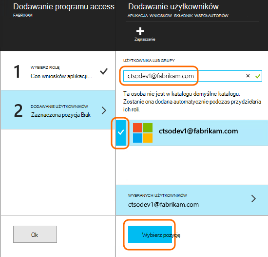

<properties
    pageTitle="Zasoby, role i kontroli dostępu w aplikacji wniosków"
    description="Właściciele, uczestników i czytniki wniosków Twojej organizacji."
    services="application-insights"
    documentationCenter=""
    authors="alancameronwills"
    manager="douge"/>

<tags
    ms.service="application-insights"
    ms.workload="tbd"
    ms.tgt_pltfrm="ibiza"
    ms.devlang="na"
    ms.topic="article"
    ms.date="05/07/2016"
    ms.author="awills"/>

# Zasoby, role i kontroli dostępu w aplikacji wniosków

Można kontrolować, kto ma do odczytu i aktualizowanie dostęp do danych w Visual Studio [Wniosków aplikacji][start], przy użyciu [Kontrola dostępu oparta na rolach w Microsoft Azure](../active-directory/role-based-access-control-configure.md).

> [AZURE.IMPORTANT] Przypisywanie dostępu do użytkowników w **grupie zasobów lub subskrypcji** do której należy zasób aplikacji — nie w samej zasobu. Przypisywanie roli **współautora składnik wniosków aplikacji** . Dzięki temu jednolitego kontrolę nad dostępem do testów sieci web i alerty wraz z zasobu aplikacji. Aby [uzyskać więcej informacji](#access).

## Zasoby, grupy i subskrypcji

Pierwszy, niektóre definicje:

* **Zasób** - wystąpienie usługi Microsoft Azure. Zasób aplikacji wniosków zbiera, analizuje i wyświetla dane telemetrycznego wysyłane z aplikacji.  Inne typy Azure zasobów zawiera aplikacje sieci web, bazy danych i maszyny wirtualne.

    Aby wyświetlić wszystkie zasoby, przejdź do [Azure Portal][portal], zaloguj się i kliknij przycisk Przeglądaj.

    

* [**Grupa zasobów** ] [ group] — każdy zasób należy do jednej grupy. Grupa jest to wygodny sposób zarządzania zasobami pokrewnych, szczególnie w przypadku kontroli dostępu. Na przykład do grupy zasobów można umieścić aplikacji sieci Web, zasób wniosków aplikacji monitorowanie aplikacji i zasób miejsca do magazynowania, aby zachować wyeksportowane dane.

    

* [**Subskrypcja**](https://manage.windowsazure.com) — wnioski aplikacji lub inne zasoby Azure, możesz zalogować się do subskrypcji usługi Azure. Grupa zasobów, co należy jedną subskrypcję Azure, które wybierz pakietu cena i, jeśli jest subskrypcji organizacji wybrać członkowie i ich uprawnień dostępu.
* [**Konto Microsoft** ] [ account] -nazwę użytkownika i hasło, którego używasz, aby zalogować się do programu Microsoft Azure subskrypcje, XBox Live, Outlook.com i innych usług firmy Microsoft.

## Kontrolowanie dostępu do tej grupy zasobów

Należy zrozumieć, oprócz zasobu utworzonego dla aplikacji, czy też oddzielnych zasoby ukryte alertów i analiz sieci web. Są dołączone do tej samej [grupy zasobów](#resource-group) jako aplikacja. Może też zostało umieszczone innych usług Azure w tam, takich jak witryny sieci Web lub miejsce do magazynowania.

Kontrolowanie dostępu do tych zasobów w związku z tym zaleca się:

* Kontrola dostępu na poziomie **grupy zasobów lub subskrypcji** .
* Przypisywanie roli **współautora składnik wniosków aplikacji** do użytkowników. Umożliwia edytowanie testy sieci web, alerty i zasoby wniosków aplikacji bez dostępu do innych usług, w grupie.

## Aby umożliwić dostęp do innego użytkownika

Musisz mieć uprawnienia właściciela do subskrypcji lub grupy zasobów.

Użytkownik musi mieć [Konto Microsoft][account], lub dostęp do swojego [Konta Microsoft organizacji](..\active-directory\sign-up-organization.md). Można zapewnić dostęp osobom, a także zdefiniowane w usługi Azure Active Directory grupy użytkowników.

#### Przejdź do grupy zasobów

Dodaj użytkownika.

Lub można przejść w górę inny poziom i dodać użytkownika z subskrypcją.

#### Wybierz rolę

Rola | W grupie zasobów
---|---
Właściciel | Można zmienić wszystko, w tym dostępu użytkowników
Trybu współautora | Można edytować wszystko, w tym wszystkie zasoby
Aplikacja składnika wniosków współautora | Można edytować wniosków aplikacji zasobów, testy sieci web i alertów
Czytnik | Można wyświetlić, ale nie zmian

"Edytowanie" zawiera tworzenie, usuwanie i aktualizowanie:

* Zasoby
* Testy sieci Web
* Alerty
* Eksportowanie ciągły

#### Wybierz użytkownika

Jeśli użytkownik, który ma nie jest w katalogu, możesz zaprosić każda osoba z kontem Microsoft.
(Gdy korzystają z usługi, takie jak Outlook.com, OneDrive, Windows Phone lub XBox Live, mają konta Microsoft.)

## Użytkowników i ról

* [Kontrola dostępu w Azure oparta na rolach](../active-directory/role-based-access-control-configure.md)

<!--Link references-->

[account]: https://account.microsoft.com
[group]: ../resource-group-overview.md
[portal]: https://portal.azure.com/
[start]: app-insights-overview.md
