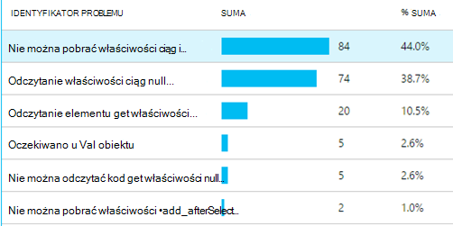
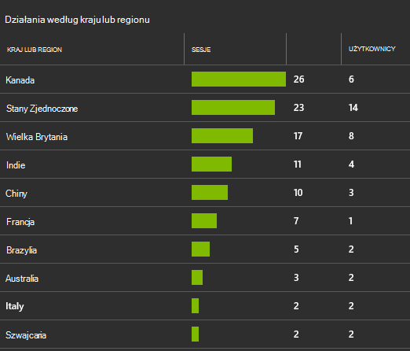
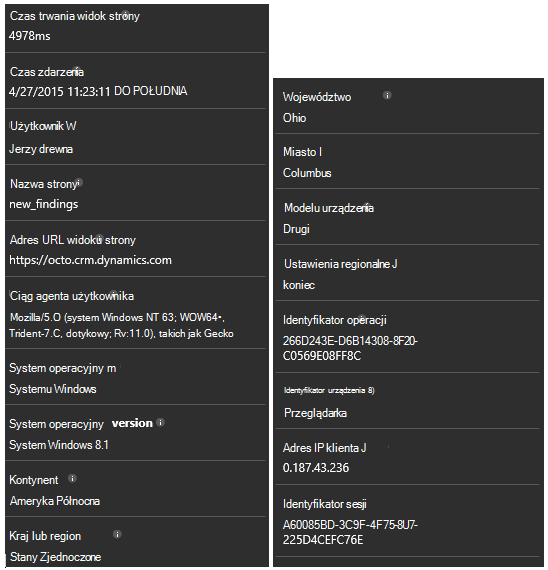

<properties 
    pageTitle="Przewodnik: Monitorowanie systemu Microsoft Dynamics CRM z wniosków aplikacji" 
    description="Pobieranie telemetrycznego z Microsoft Dynamics CRM Online przy użyciu aplikacji wnioski. Przewodnik po instalacji, wprowadzenie danych, wizualizacji i Eksportuj." 
    services="application-insights" 
    documentationCenter=""
    authors="mazharmicrosoft" 
    manager="douge"/>

<tags 
    ms.service="application-insights" 
    ms.workload="tbd" 
    ms.tgt_pltfrm="ibiza" 
    ms.devlang="na" 
    ms.topic="article" 
    ms.date="11/17/2015" 
    ms.author="awills"/>
 
# Przewodnik: Włączanie telemetrycznego dla programu Microsoft Dynamics CRM Online przy użyciu aplikacji wniosków

W tym artykule pokazano, jak uzyskać telemetrycznego danych z [Programu Microsoft Dynamics CRM Online](https://www.dynamics.com/) przy użyciu [Programu Visual Studio aplikacji wnioski](https://azure.microsoft.com/services/application-insights/). Przedstawimy każde Zakończ proces dodawania aplikacji wniosków skrypt do aplikacji, przechwytywanie danych i wizualizacji danych.

>[AZURE.NOTE] [Przeglądanie rozwiązanie próbki](https://dynamicsandappinsights.codeplex.com/).

## Dodawanie aplikacji wniosków do nowego lub istniejącego wystąpienia CRM Online 

Monitorowanie aplikacji, możesz dodać SDK wniosków aplikacji do aplikacji. Zestaw SDK wysyła telemetrycznego do [portalu wniosków aplikacji](https://portal.azure.com), miejsce, w którym można użyć naszych Zaawansowana analiza i narzędzia diagnostyczne lub eksportowanie danych do magazynowania.

### Tworzenie zasób wniosków aplikacji platformy Azure

1. Uzyskiwanie [konta w programie Microsoft Azure](http://azure.com/pricing). 
2. Zaloguj się do [portalu Azure](https://portal.azure.com) i dodawanie nowego zasobu wniosków aplikacji. Jest to miejsce, w którym opracowywania i wyświetlania danych.

    

    Wybierz ASP.NET jako typ aplikacji.

3. Otwórz kartę Szybkie uruchamianie i otworzyć skrypt kodu.

    

**Nie zamykaj strony kodu** podczas następnego kroku w innym oknie przeglądarki. Wkrótce musisz kodu. 

### Utwórz zasób sieci web kodu JavaScript w programie Microsoft Dynamics CRM

1. Otwórz wystąpienie CRM Online i zaloguj się z uprawnieniami administratora.
2. Otwórz program Microsoft Dynamics CRM ustawienia, dostosowania, dostosowywanie systemu

    
    
    

    

3. Utwórz zasób JavaScript.

    

    Nadaj plikowi nazwę, wybierz **skrypt (JScript)** i Otwórz Edytor tekstu.

    
    
4. Skopiuj kod z wniosków aplikacji. Podczas kopiowania upewnij się zignorować znaczników skryptów. Zapoznaj się poniżej zrzut ekranu:

    

    Kod zawiera klucz oprzyrządowania, identyfikujący zasób wniosków aplikacji.

5. Zapisz i opublikuj.

    

### Formularze dokumentu

1. W programie Microsoft CRM Online otwieranie formularza klienta

    

2. Otwórz formularz właściwości

    

3. Dodaj zasób sieci web JavaScript utworzone przez Ciebie

    

    

4. Zapisywanie i publikowanie wprowadzone dostosowania formularza.

## Metryki przechwycone

Teraz masz skonfigurowane przechwytywania telemetrycznego dla formularza. Zawsze, gdy są one używane, dane zostaną wysłane do zasobu wniosków aplikacji.

Poniżej przedstawiono przykłady danych, która zostanie wyświetlona.

#### Kondycja aplikacji

Wyjątki w przeglądarce:

Kliknij wykres, aby uzyskać więcej szczegółów:

#### Użycie

#### Przeglądarki

#### Geolokalizacja

#### Wezwanie na środku strony widoku

## Przykładowy kod

[Przeglądanie przykładowy kod](https://dynamicsandappinsights.codeplex.com/).

## Power BI

Możesz wykonywać nawet dokładniejszej analizy, jeśli [Eksportowanie danych do programu Microsoft Power BI](app-insights-export-power-bi.md).

## Przykładowe systemu Microsoft Dynamics CRM rozwiązanie

[Poniżej przedstawiono rozwiązanie przykładowych zaimplementowana w programie Microsoft Dynamics CRM] (https://dynamicsandappinsights.codeplex.com/).

## Dowiedz się więcej

* [Co to jest aplikacja wniosków?](app-insights-overview.md)
* [Wnioski aplikacji dla stron sieci web](app-insights-javascript.md)
* [Więcej przykładów i instruktaży](app-insights-code-samples.md)

 
