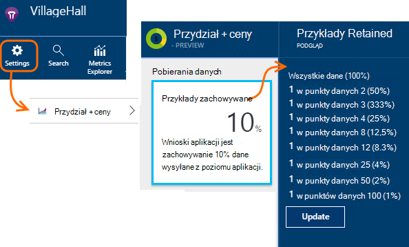

<properties 
    pageTitle="Przy próbkowaniu telemetrycznego w aplikacji wniosków | Microsoft Azure" 
    description="Jak zachować wielkość telemetrycznego kontrolą." 
    services="application-insights" 
    documentationCenter="windows"
    authors="vgorbenko" 
    manager="douge"/>

<tags 
    ms.service="application-insights" 
    ms.workload="tbd" 
    ms.tgt_pltfrm="ibiza" 
    ms.devlang="na" 
    ms.topic="article" 
    ms.date="08/30/2016" 
    ms.author="awills"/>

#  <a name="sampling-in-application-insights"></a>Pobieranie próbek w aplikacji wniosków

*Wnioski aplikacji jest w podglądzie.*


Próbki jest funkcją programu [Visual Studio aplikacji wniosków](app-insights-overview.md) jest zalecany sposób, aby zmniejszyć ruch telemetrycznego i miejsca do magazynowania przy zachowaniu statystyczne poprawne analizy danych aplikacji. Filtr zaznacza elementy, które są powiązane tak, że możesz przechodzić między elementami podczas wykonywania dochodzenia diagnostyczne.
Po metryczne liczniki są prezentowane użytkownikowi w portalu, są one renormalized w celu uwzględnienia próbek, w celu zminimalizowania wpływu na statystyki.

Przy próbkowaniu zmniejsza ruch, pomagają w miesięczny przydziałów danych i pomaga w uniknięciu ograniczania.

## <a name="in-brief"></a>Krótko mówiąc:

* Przy próbkowaniu zachowuje 1 w rekordach *n* i usuwa pozostałe. Na przykład mogą go zachować zdarzenia 1 do 5, stawki przy próbkowaniu 20%. 
* Przy próbkowaniu odbywa się automatycznie, gdy aplikacja wysyła wiele telemetrycznego, w aplikacjach serwer sieci web programu ASP.NET.
* Można także ustawić ręcznie, próbki w portalu na stronie cennik; lub w zestawie SDK programu ASP.NET w pliku .config również zmniejszyć ruch sieciowy.
* Jeśli dziennika zdarzeń niestandardowych i chcesz mieć pewność, że zestaw zdarzeń jest zachowywane lub odrzucane razem, upewnij się, że mają taką samą wartość OperationId.
* Dzielnik przy próbkowaniu *n* jest zgłoszone we wszystkich rekordach we właściwości `itemCount`, który w wyszukiwaniu pojawia się w obszarze przyjazną nazwę "licznik żądania" lub "liczba zdarzeń". Podczas pobierania nie znajduje się w operacji `itemCount==1`.
* Jeśli piszesz analizy kwerendy, należy [wziąć pod uwagę przy próbkowaniu](app-insights-analytics-tour.md#counting-sampled-data). W szczególności, zamiast po prostu zliczanie rekordów, należy użyć `summarize sum(itemCount)`.


## <a name="types-of-sampling"></a>Typy pobierania


Istnieją trzy metody pobierania alternatywny:

* **Adaptacyjne pobierania** jest automatycznie dostosowywany tak wielkość telemetrycznego wysłanych z zestawu SDK w aplikacji programu ASP.NET. Domyślnie SDK v 2.0.0-beta3. Obecnie dostępne dla programu ASP.NET tylko telemetrycznego po stronie serwera. 
* **Przy stałym oprocentowaniu próbkowaniu** zmniejsza głośność telemetrycznego wysyłane z serwera programu ASP.NET oraz z przeglądarki użytkownika. Ustaw wskaźnik. Klienta i serwera zsynchronizuje ich pobierania tak, w wyszukiwania, możesz przechodzić między wyświetleń stron pokrewnych i wezwań.
* **Przy próbkowaniu spożyciu** zmniejsza głośność telemetrycznego zachowane przez usługę wniosków aplikacji stawki ustawiany. Nie zmniejszyć ruch telemetrycznego, ale pomagają w miesięczny przydziału. 

W przypadku adaptacyjną lub stałej stopy przy próbkowaniu operacja, przy próbkowaniu spożyciu jest wyłączona.

## <a name="ingestion-sampling"></a>Przy próbkowaniu spożyciu

Ten formularz przy próbkowaniu działa w punkcie, w którym telemetrycznego z serwera sieci web, przeglądarki i urządzeń osiągnie punktu końcowego usługi wniosków aplikacji. Mimo że nie go zmniejszyć ruch telemetrycznego wysyłanych z aplikacji, zmniejszenie ilości przetwarzania i zachowane (i obciążona opłatą za) przez wniosków aplikacji.

Użyj tego typu pobierania, jeśli aplikacji często omówiono miesięczny przydziału i nie mam opcji przy użyciu jednej z zestawu SDK rodzaju próbki. 

Ustaw kurs przy próbkowaniu przydziałów i ceny karta:



Podobnie jak inne rodzaje przy próbkowaniu algorytmu zachowuje telemetrycznego powiązanych elementów. Na przykład gdy jest sprawdzanie telemetrycznego w wyszukiwaniu, będziesz mieć możliwość znaleźć żądania związane z określonego wyjątku. Metryka zlicza, takich jak liczby żądań i stawka wyjątku poprawnie są zachowywane.

Punktów danych, które są odrzucane przez pobieranie próbek nie są dostępne w dowolnej funkcji wniosków aplikacji, takich jak [Eksportowanie ciągły](app-insights-export-telemetry.md).

Przy próbkowaniu spożyciu nie działają podczas SDK próbek adaptacyjne lub stałym oprocentowaniu. Jeśli przy próbkowaniu szybkość zestawu SDK jest mniejsza niż 100%, stopa przy próbkowaniu spożyciu ustawiany jest ignorowana.

> [AZURE.WARNING] Wartość wyświetlana w polu wskazuje wartość ustawionego dla próbki spożyciu. Stopa rzeczywista przy próbkowaniu go nie reprezentować, jeśli przy próbkowaniu SDK znajduje się w operacji.


## <a name="adaptive-sampling-at-your-web-server"></a>Adaptacyjne przy próbkowaniu na serwerze sieci web

Adaptacyjne pobierania jest dostępny dla zestawu SDK wniosków aplikacji dla programu ASP.NET v 2.0.0-beta3 lub w nowszej wersji i jest domyślnie włączona. 


Adaptacyjne przy próbkowaniu ma wpływ na wielkość telemetrycznego wysłanych z aplikacji serwera sieci web z usługą wniosków aplikacji. Głośność zostanie automatycznie dopasowana do zachowania w określonej wartości maksymalnej ruchu.

Go nie działają niewielki telemetrycznego, dlatego w debugowania aplikacji lub witryny sieci Web z niskie zapotrzebowanie nie ulegnie zmianie.

Aby osiągnąć wielkość docelowej, niektóre telemetrycznego wygenerowane odrzucone. Ale jak inne rodzaje przy próbkowaniu algorytmu zachowuje telemetrycznego powiązanych elementów. Na przykład gdy jest sprawdzanie telemetrycznego w wyszukiwaniu, będziesz mieć możliwość znaleźć żądania związane z określonego wyjątku. 

Metryka zlicza, takich jak liczby żądań i stawka wyjątku są dostosowywane tak, aby wyrównania stopa przy próbkowaniu, że około prawidłowe wartości wyświetlane w Eksploratorze metryki.

**Aktualizowanie projektu NuGet** pakietów do najnowszej wersji *wstępnej* aplikacji wniosków: kliknij prawym przyciskiem myszy projektu w Eksploratorze rozwiązań, wybierz pozycję Zarządzaj pakietów NuGet, sprawdź **zawiera wstępną** i wyszukiwanie Microsoft.ApplicationInsights.Web. 

W [ApplicationInsights.config](app-insights-configuration-with-applicationinsights-config.md), można dostosować kilku parametrów w `AdaptiveSamplingTelemetryProcessor` węzeł. Dane wyświetlane są wartości domyślne:

* `<MaxTelemetryItemsPerSecond>5</MaxTelemetryItemsPerSecond>`

    Kurs docelowej algorytmu adaptacyjne ma dla **każdego hosta serwera**. Jeśli aplikacji sieci web działa na wielu hostów, zmniejszyć tę wartość tak, aby pozostawać szybkość docelowej ruchu w portalu wniosków aplikacji.

* `<EvaluationInterval>00:00:15</EvaluationInterval>` 

    Interwał, w którym jest ponownie obliczony bieżący stopień telemetrycznego. Oceny jest wykonywane średnią ruchomą. Można skrócić ten interwał, w przypadku usługi telemetrycznego mogących szybkiego seria.

* `<SamplingPercentageDecreaseTimeout>00:02:00</SamplingPercentageDecreaseTimeout>`

    Podczas pobierania próbek zmiany wartości procentowe, jak szybko po możemy mogą Zmniejsz wartość procentową przy próbkowaniu ponownie, aby przechwycić mniej danych.

* `<SamplingPercentageIncreaseTimeout>00:15:00</SamplingPercentageIncreaseTimeout>`

    Podczas pobierania próbek zmiany wartości procentowe, jak szybko po możemy mogą zwiększyć wartość procentową przy próbkowaniu ponownie, aby przechwycić większej ilości danych.

* `<MinSamplingPercentage>0.1</MinSamplingPercentage>`

    Jak zmienia się próbki wartość procentową, co to jest wartość minimalną, które będziemy mogli ustawić.

* `<MaxSamplingPercentage>100.0</MaxSamplingPercentage>`

    Jak zmienia się próbki wartość procentową, co to jest maksymalna wartość, która będziemy mogli ustawić.

* `<MovingAverageRatio>0.25</MovingAverageRatio>` 

    Przy obliczaniu średniej ruchomej grubości przypisany do ostatnio wartość. Użyj wartości równa lub mniejsza niż 1. Mniejsze wartości wprowadź algorytmu mniej reaktywnych do szybkiego zmiany.

* `<InitialSamplingPercentage>100</InitialSamplingPercentage>`

    Wartość przydzielonych, gdy aplikacja właśnie zostało uruchomione. Nie zmniejszyć to podczas debugowanie. 

### <a name="alternative-configure-adaptive-sampling-in-code"></a>Alternatywny: Konfigurowanie adaptacyjne przy próbkowaniu w kodzie

Zamiast dostosowania przy próbkowaniu w pliku .config, możesz użyć kodu. Umożliwia określenie funkcji zwrotnego, która jest wywoływana przy każdym częstotliwość pobierania jest ponownie obliczony. Można, na przykład, aby dowiedzieć się, jakie szybkość pobierania jest używany.

Usuwanie `AdaptiveSamplingTelemetryProcessor` węzła z pliku .config.


*C#*

```C#

    using Microsoft.ApplicationInsights;
    using Microsoft.ApplicationInsights.Extensibility;
    using Microsoft.ApplicationInsights.WindowsServer.Channel.Implementation;
    using Microsoft.ApplicationInsights.WindowsServer.TelemetryChannel;
    ...

    var adaptiveSamplingSettings = new SamplingPercentageEstimatorSettings();

    // Optional: here you can adjust the settings from their defaults.

    var builder = TelemetryConfiguration.Active.TelemetryProcessorChainBuilder;
    
    builder.UseAdaptiveSampling(
         adaptiveSamplingSettings,

        // Callback on rate re-evaluation:
        (double afterSamplingTelemetryItemRatePerSecond,
         double currentSamplingPercentage,
         double newSamplingPercentage,
         bool isSamplingPercentageChanged,
         SamplingPercentageEstimatorSettings s
        ) =>
        {
          if (isSamplingPercentageChanged)
          {
             // Report the sampling rate.
             telemetryClient.TrackMetric("samplingPercentage", newSamplingPercentage);
          }
      });

    // If you have other telemetry processors:
    builder.Use((next) => new AnotherProcessor(next));

    builder.Build();

```

([Więcej informacji na temat telemetrycznego procesorów](app-insights-api-filtering-sampling.md#filtering)).


<a name="other-web-pages"></a>
## <a name="sampling-for-web-pages-with-javascript"></a>Próbki dla stron sieci web przy użyciu języka JavaScript

Możesz skonfigurować stron sieci web dla próbki stałym oprocentowaniu przez serwer. 

Podczas [konfigurowania stron sieci web dla aplikacji wniosków](app-insights-javascript.md)modyfikowanie wstawkę kodu pobranego z portalu wniosków aplikacji. (W aplikacjach ASP.NET wstawkę kodu zazwyczaj zawiera _Layout.cshtml.)  Wstawianie linii, takich jak `samplingPercentage: 10,` przed klucz oprzyrządowania:

    <script>
    var appInsights= ... 
    }({ 


    // Value must be 100/N where N is an integer.
    // Valid examples: 50, 25, 20, 10, 5, 1, 0.1, ...
    samplingPercentage: 10, 

    instrumentationKey:...
    }); 
    
    window.appInsights=appInsights; 
    appInsights.trackPageView(); 
    </script> 

Procent pobierania wybierz wartość procentową, która jest zbliżony 100-N, gdzie N jest liczbą całkowitą.  Obecnie próbek nie obsługuje innych wartości.

Jeśli włączysz również przy stałym oprocentowaniu próbkowaniu na serwerze, klientów i serwera zsynchronizuje tak, w wyszukiwania, możesz przechodzić między widokami strony powiązanej i wezwań na.


## <a name="fixed-rate-sampling-for-aspnet-web-sites"></a>Przy stałym oprocentowaniu próbkowaniu witryn sieci web programu ASP.NET

Przy próbkowaniu stałej stopy zmniejsza ruch wysłanych z serwera sieci web i przeglądarki sieci web. W przeciwieństwie do pobierania adaptacyjne powoduje zmniejszenie telemetrycznego przy stałej stawce przez danego użytkownika. Go też synchronizuje klienta i serwera próbek tak, aby powiązanych elementów są zachowywane — na przykład tak, aby podczas przeglądania w widoku strony do wyszukiwania można znaleźć jej powiązane żądanie.

Algorytm przy próbkowaniu zachowuje powiązanych elementów. Dla każdego żądania HTTP zdarzenie, go i jego powiązane z nimi zdarzenia są odrzucane lub przesyłane. 

W Eksploratorze metryki stawki, na przykład liczniki zaproszenie i wyjątku są pomnożona przez współczynnik do wyrównania stopa pobierania, aby były w przybliżeniu poprawne.

1. **Aktualizowanie projektu NuGet pakietów** do najnowszej wersji *wstępnej* aplikacji wnioski. Kliknij prawym przyciskiem myszy projektu w Eksploratorze rozwiązań, wybierz pozycję Zarządzaj pakietów NuGet, sprawdź **zawiera wstępną** i wyszukiwanie Microsoft.ApplicationInsights.Web. 

2. **Wyłączanie pobierania adaptacyjne**: [ApplicationInsights.config](app-insights-configuration-with-applicationinsights-config.md), usuń lub skomentować `AdaptiveSamplingTelemetryProcessor` węzeł.

    ```xml

    <TelemetryProcessors>
    <!-- Disabled adaptive sampling:
      <Add Type="Microsoft.ApplicationInsights.WindowsServer.TelemetryChannel.AdaptiveSamplingTelemetryProcessor, Microsoft.AI.ServerTelemetryChannel">
        <MaxTelemetryItemsPerSecond>5</MaxTelemetryItemsPerSecond>
      </Add>
    -->
    

    ```

2. **Włącz moduł przy próbkowaniu stałym oprocentowaniu.** Dodaj następujący fragment do [ApplicationInsights.config](app-insights-configuration-with-applicationinsights-config.md):

    ```XML

    <TelemetryProcessors>
     <Add  Type="Microsoft.ApplicationInsights.WindowsServer.TelemetryChannel.SamplingTelemetryProcessor, Microsoft.AI.ServerTelemetryChannel">

      <!-- Set a percentage close to 100/N where N is an integer. -->
     <!-- E.g. 50 (=100/2), 33.33 (=100/3), 25 (=100/4), 20, 1 (=100/100), 0.1 (=100/1000) -->
      <SamplingPercentage>10</SamplingPercentage>
      </Add>
    </TelemetryProcessors>

    ```

> [AZURE.NOTE] Procent pobierania wybierz wartość procentową, która jest zbliżony 100-N, gdzie N jest liczbą całkowitą.  Obecnie próbek nie obsługuje innych wartości.


### <a name="alternative-enable-fixed-rate-sampling-in-your-server-code"></a>Alternatywny: Włączanie przy stałym oprocentowaniu próbkowaniu w kodzie serwera


Zamiast ustawienie parametru przy próbkowaniu w pliku .config, możesz użyć kodu. 

*C#*

```C#

    using Microsoft.ApplicationInsights.Extensibility;
    using Microsoft.ApplicationInsights.WindowsServer.TelemetryChannel;
    ...

    var builder = TelemetryConfiguration.Active.GetTelemetryProcessorChainBuilder();
    builder.UseSampling(10.0); // percentage

    // If you have other telemetry processors:
    builder.Use((next) => new AnotherProcessor(next));

    builder.Build();

```

([Więcej informacji na temat telemetrycznego procesorów](app-insights-api-filtering-sampling.md#filtering)).


## <a name="when-to-use-sampling"></a>Kiedy należy używać przy próbkowaniu?

Adaptacyjne pobierania jest włączany automatycznie, jeśli korzystasz z 2.0.0-beta3 wersję programu ASP.NET SDK lub nowszym. Niezależnie od tego, która wersja SDK korzystasz możesz użyć spożyciu pobierania (w naszym server).

Nie trzeba dla większości aplikacji małych i średnich rozmiar próbki. Najbardziej przydatnych informacji diagnostycznych oraz dokładność statystyk uzyskane zbierania danych dotyczących wszystkich Twoich działań użytkownika. 

 
Główną zaletą pobierania są:

* Aplikacja wniosków usługi krople ("ogranicza") danych punktów aplikacji wysyła bardzo wysoki stopień telemetrycznego w skrócie czasu interwału. 
* Aby zachować w ramach [przydziału](app-insights-pricing.md) punktów danych dla swojego poziomu cennik. 
* Aby ograniczyć ruch sieciowy z kolekcji telemetrycznego. 

### <a name="which-type-of-sampling-should-i-use"></a>Jakiego typu próbek należy używać?


**Za pomocą spożyciu próbki, jeśli:**

* Często przejdź do swojej miesięcznej kwoty telemetrycznego.
* Używasz wersji SDK, która nie obsługuje pobierania — na przykład, Java SDK lub wersji programu ASP.NET wcześniejszą niż 2.
* Wiele telemetrycznego jest wyświetlany w przeglądarce sieci web użytkownika.

**Za pomocą stałym oprocentowaniu próbki, jeśli:**

* Używasz SDK wniosków aplikacji dla usługi sieci web programu ASP.NET w wersji 2.0.0 lub nowszym, a
* Chcesz próbek synchronizowane między klientem a serwerem, tak, aby podczas jest badanie zdarzeń w [wyszukiwaniu](app-insights-diagnostic-search.md), można przejść między powiązane z nimi zdarzenia klienta i serwera, takie jak liczba wyświetleń strony i żądania http.
* Ma pewności procentu odpowiedniej próbki dla aplikacji. Powinna być wystarczająco wysoka, aby uzyskać dokładne metryki, ale poniżej stawki powodujący przekroczenie przydziału cennik i ograniczania ograniczenia. 


**Za pomocą adaptacyjne pobierania:**

W przeciwnym razie zaleca się przy próbkowaniu adaptacyjne. Ta opcja jest włączona domyślnie na serwerze programu ASP.NET SDK, wersji 2.0.0-beta3 lub nowszej. Nie go zmniejszyć ruch do niektórych minimalny wskaźnik, aby nie wywiera wpływu na niski użycia witryny.


## <a name="how-do-i-know-whether-sampling-is-in-operation"></a>Jak ustalić, czy w operacji pobierania?

Aby odkrywać stopa rzeczywista przy próbkowaniu niezależnie od tego, gdzie zostały zastosowane, należy użyć [kwerendy analizy](app-insights-analytics.md) , takich jak:

    requests | where timestamp > ago(1d)
  	| summarize 100/avg(itemCount) by bin(timestamp, 1h) 
  	| render areachart 

W każdym zachowane rekordu `itemCount` wskazuje liczbę oryginalny rekordy, które go reprezentuje równa 1 + numer poprzedniego rekordy usuwane. 


## <a name="how-does-sampling-work"></a>Jak działa przy próbkowaniu?

Stałym oprocentowaniu adaptacyjne przy próbkowaniu się funkcja SDK w wersji programu ASP.NET z 2.0.0 lub nowszym. Przy próbkowaniu spożyciu to funkcja usługi wniosków aplikacji, a można w operacji zestawu SDK nie działa przy próbkowaniu. 

Algorytm przy próbkowaniu zdecyduje, które elementy telemetrycznego, aby usunąć i które z nich należy (czy jest w zestawie SDK lub w usłudze wniosków aplikacji). Decyzja pobierania jest oparty na kilka reguł, które mają na celu zachowanie wszystkich punktów danych powiązanych niezmieniona zachowaniu diagnostyczne środowiska w wniosków aplikacji, czyli sankcji i niezawodne nawet w przypadku ograniczonego zestawu danych. Na przykład jeśli na żądanie nie powiodło się aplikacji wysyła telemetrycznego dodatkowe elementy (takie jak wyjątku i śledzenia rejestrowane w ramach tego procesu żądania), przy próbkowaniu nie będzie podzielić żądania i innych telemetrycznego. Go zachowuje lub umieści je wszystkie razem. W wyniku Po wyświetleniu szczegółów żądania w aplikacji wniosków zawsze Zobacz żądanie wraz z jego elementami telemetrycznego skojarzone. 

Dla aplikacji, które definiują "użytkownika" (oznacza to, że najbardziej typowe aplikacji sieci web), podjęcie decyzji przy próbkowaniu zależy od skrótu identyfikatora użytkownika, co oznacza, że wszystkie telemetrycznego dla każdego określonego użytkownika jest zachowywany lub usunięte. Dla typów aplikacji, które nie definiują użytkowników (na przykład usługi sieci web) decyzja pobierania jest oparty na identyfikator operacji żądania. Na koniec dla elementów telemetrycznego, które nie mają identyfikator użytkownika ani operacji ustawić (na przykład elementy telemetrycznego zgłoszone z asynchroniczne wątków z bez kontekstu http) przy próbkowaniu po prostu przechwytuje procent elementów telemetrycznego każdego typu. 

Podczas prezentacji telemetrycznego powrót do usługi aplikacji wniosków dostosowywaniu metryk taką samą wartość procentową przy próbkowaniu użytym w czasie pobierania, w celu wyrównania brakujących punktów danych. W związku z tym podczas przeglądania telemetrycznego w aplikacji wniosków, użytkownicy widzą statystyczne poprawne przybliżenia, które są bardzo zbliżony liczb rzeczywistych.

Dokładność zbliżania w znacznym stopniu zależy od wartość procentową skonfigurowaną przy próbkowaniu. Ponadto dokładność zwiększa dla aplikacji, które obsługują dużej liczby zazwyczaj podobne żądania z dużą liczbą użytkowników. Z drugiej strony dla aplikacji, które nie działają w programie znacznej obciążenia, przy próbkowaniu nie jest potrzebna jako te aplikacje zwykle można wysłać wszystkie ich telemetrycznego podczas utrzymywanie w ramach przydziału, nie powodując utraty danych z ograniczania. 

Należy zauważyć, że wnioski aplikacji nie przykładowych typów telemetrycznego metryki i sesji od dla tych typów, zmniejszenie dokładności może być bardzo niepożądanych. 

### <a name="adaptive-sampling"></a>Adaptacyjne pobierania

Adaptacyjne przy próbkowaniu dodaje składnik, który monitoruje bieżąca szybkość przekazywania z zestawu SDK i dopasowuje wartość procentową przy próbkowaniu, aby utrzymać koszty w ramach maksymalna szybkość docelowej. Dostosowania jest obliczany ponownie w regularnych odstępach czasu i jest oparty na średnią ruchomą wychodzących szybkość transmisji.

## <a name="sampling-and-the-javascript-sdk"></a>Pobieranie próbek i SDK języka JavaScript

Po stronie klienta (JavaScript) SDK uczestniczy w próbkowaniu stałym oprocentowaniu w połączeniu z SDK po stronie serwera. Otrzymane stron wysyła telemetrycznego po stronie klienta z tym samym użytkowników, dla których po stronie serwera wprowadzone swoją decyzję "przykładowy w". Tę logikę służy do zachowywanie integralności sesja użytkownika na stronach klienta i serwera. W związku z telemetrycznego określonego elementu w aplikacji wniosków znajdują się inne elementy telemetrycznego dla tego użytkownika lub sesji. 

*Moje klienta i po stronie serwera telemetrycznego nie pokazuj skoordynowanego próbki, jak opisano powyżej.*

* Sprawdź czy włączony przy stałym oprocentowaniu próbkowaniu zarówno na klienta i serwera.
* Upewnij się, że wersja SDK jest 2.0 lub nowszego.
* Sprawdź, ustawić tę samą wartość procentową przy próbkowaniu w klienta i serwera.


## <a name="frequently-asked-questions"></a>Często zadawane pytania 

*Dlaczego nie jest próbek prosty "zbieranie X procent każdego typu telemetrycznego"?*

 *  Podczas tej metody przy próbkowaniu może zapewnić bardzo wysoki dokładności w przybliżenia metryczne, chcesz wstawić podział możliwość powiązania danych diagnostycznych dla użytkowników, sesji i żądanie krytyczne diagnostyki pakietu. W związku z tym, za pomocą "zbieranie telemetrycznego elementów wszystkich X procent użytkowników aplikacji" lub "zbieranie wszystkich telemetrycznego dla X Procent żądań aplikacji" próbek lepiej działa logicznych. Dla elementów telemetrycznych nie jest skojarzony z żądania (na przykład asynchroniczne przetwarzania w tle), jest bazowy "zbieranie X procent wszystkich elementów dla każdego typu telemetrycznego." 

*Wartość procentową przy próbkowaniu można zmienić w czasie?*

 * Tak, adaptacyjne przy próbkowaniu stopniowo zmienia wartość procentową przy próbkowaniu, oparte na wielkość obecnie obserwowanych telemetrycznego.

 

*Użycie przy stałym oprocentowaniu próbkowaniu, jak ustalić, które próbki procent będzie najlepiej nadają się do aplikacji?*

* Jednym ze sposobów jest adaptacyjne zaczynać się przy próbkowaniu, Dowiedz się, co oceń rozliczy na (patrz pytanie powyżej), a następnie przejdź do stałym oprocentowaniu próbki przy użyciu tego kursu. 

    W przeciwnym razie masz odgadnięcie. Analizowanie bieżące użycie telemetrycznego w AI, obserwować dowolnego ograniczania, która ma miejsce i oszacowanie wielkość zebrane telemetrycznego. Tych trzech wartości wejściowych razem z do wybranego poziomu cennik Zaproponuj, ile można zmniejszyć objętość telemetrycznego zbierane. Jednak zwiększenie liczby użytkowników lub kilka innych shift wielkości telemetrycznego może powodować do szacowania.

*Co się stanie, jeśli skonfigurować procent pobierania jest zbyt niska?*

* Pobierania zbyt niska wartość procentową (over-aggressive przy próbkowaniu) zmniejsza dokładność przybliżenia, gdy wniosków aplikacji próbuje zadośćuczynienia wizualizacji danych w celu zmniejszenia głośność danych. Również diagnostyczne obsługi może być utworzenie negatywny wpływ, jako część żądania rzadko awarie lub wolniej może być pobierane się.

*Co się stanie, jeśli skonfigurować wartość procentową przy próbkowaniu zbyt duży?*

* Konfigurowanie procent pobierania zbyt duży (nie rygorystyczne wystarczająco) powoduje za mało zmniejszenia wielkości telemetrycznego zbierane. Nadal mogą wystąpić utratą danych telemetrycznych związane z ograniczania i koszt użycia wniosków aplikacji może być większa niż możesz planowana z powodu nadmiarowych opłaty.

*Na platformach jakich można korzystać przy próbkowaniu?*

* Przy próbkowaniu spożyciu może być spowodowany automatycznie dla dowolnego telemetrycznego powyżej woluminu określonego zestawu SDK nie działa przy próbkowaniu. To będzie działać, na przykład jeśli aplikacji korzysta z serwera Java lub jeśli używasz starszej wersji programu ASP.NET SDK.

* Jeśli korzystasz z wersji programu ASP.NET SDK 2.0.0 oraz powyżej (obsługiwanych Azure lub na własny serwer), zostanie wyświetlony adaptacyjne próbek domyślnie, ale można przełączyć się stałym oprocentowaniu zgodnie z powyższym opisem. Z próbki stałym oprocentowaniu przeglądarki SDK automatycznie synchronizuje do przykładowe powiązane z nimi zdarzenia. 

*Istnieją pewne rzadkich zdarzenia, które zawsze chcę, aby wyświetlić. Jak można je uzyskać poza moduł przy próbkowaniu?*

 * Inicjowanie osobne wystąpienie TelemetryClient z nowego TelemetryConfiguration (nie domyślnie aktywnej). Używać, aby wysłać rzadkich zdarzenia.


## <a name="next-steps"></a>Następne kroki

* [Filtrowanie](app-insights-api-filtering-sampling.md) można udostępnić więcej ściśle kontroli usługi SDK wysyła.
