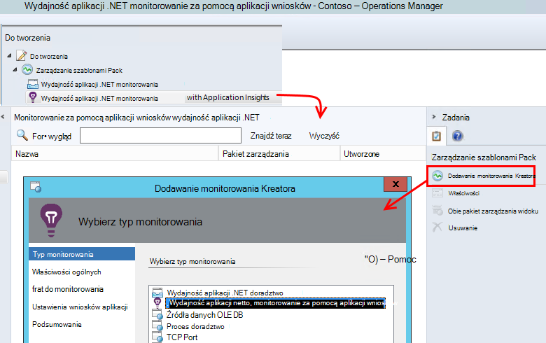

<properties 
    pageTitle="Integracja SCOM z wniosków aplikacji | Microsoft Azure" 
    description="Jeśli jesteś użytkownikiem SCOM, monitorować wydajność i diagnozowanie problemów z wniosków aplikacji. Pełna pulpitów nawigacyjnych, inteligentne alertów, zaawansowane narzędzia diagnostyczne i analizy kwerendy." 
    services="application-insights" 
    documentationCenter=""
    authors="alancameronwills" 
    manager="douge"/>

<tags 
    ms.service="application-insights" 
    ms.workload="tbd" 
    ms.tgt_pltfrm="ibiza" 
    ms.devlang="na" 
    ms.topic="article" 
    ms.date="08/12/2016" 
    ms.author="awills"/>
 
# Monitorowanie wydajności aplikacji przy użyciu aplikacji wniosków dla SCOM

Jeśli używasz systemu Centrum Operations Manager (SCOM) do zarządzania serwerami z można monitorować wydajność i diagnozowanie problemów z wydajnością przy użyciu [Programu Visual Studio aplikacji wnioski](app-insights-asp-net.md). Wnioski aplikacji monitoruje przychodzących żądań aplikacji sieci web, wychodzącej pozostałych i połączeń SQL, wyjątki i śledzenia dziennika. Zapewnia on pulpitów nawigacyjnych z wykresami metryczne i inteligentne alertów, a także zaawansowane wyszukiwanie diagnostyczne i kwerendach analitycznych przez ten telemetrycznego. 

Możesz przełączać się na monitorowanie wniosków aplikacji przy użyciu pakietu zarządzania SCOM.

## Przed rozpoczęciem

Przyjęto założenie:

* Użytkownicy zaznajomieni z SCOM i używanie SCOM 2012 R2 lub 2016 do zarządzania programu IIS serwery w sieci web.
* Masz już zainstalowany na serwerach aplikacji sieci web, które chcesz monitorować przy użyciu aplikacji wnioski.
* Wersja framework aplikacji jest .NET 4,5 lub nowszym.
* Masz dostęp do subskrypcji w [Programie Microsoft Azure](https://azure.com) i zalogować się do [portalu Azure](https://portal.azure.com). Twoja organizacja może być subskrypcji, a do niego dodać konta Microsoft.

(Do zespołu opracowującego mogą tworzyć [SDK wniosków aplikacji](app-insights-asp-net.md) do aplikacji sieci web. Ten czas kompilacji oprzyrządowania daje im większa elastyczność podczas pisania telemetrycznego niestandardowe. Jednak nie ma znaczenia: możesz wykonać kroki opisane w tym miejscu lub bez SDK wbudowana.)

## (Raz) Zainstaluj pakiet zarządzania wniosków aplikacji

Na komputerze, na którym uruchomieniu programu Operations Manager:

2. Odinstaluj dowolnej starszej wersji pakietu zarządzania:
 1. Otwórz Administracja, pakiety zarządzania programu Operations Manager. 
 2. Usuń starą wersję.
1. Pobierz i zainstaluj pakiet zarządzania z wykazu.
2. Uruchom ponownie menedżera operacji.

## Utwórz pakiet zarządzania

1. W programie Operations Manager Otwórz **Narzędzia do tworzenia**, **.NET... z aplikacji wniosków**, **Kreatora dodawania monitorowania**i ponownie wybierz pozycję **.NET... z wniosków aplikacji**.

    

2. Nazwa konfiguracji po aplikacji. (Musisz instrumentu jedną aplikację naraz.)
    
    

3. Na tej samej stronie kreatora Utwórz nowy pakiet zarządzania lub wybierz pakiet utworzonej dla wniosków aplikacji.

     (Wniosków aplikacji [pakiet zarządzania](https://technet.microsoft.com/library/cc974491.aspx) jest szablonem, z której można utworzyć wystąpienie. Można ponownie użyć tego samego wystąpienia później.)

    

4. Wybierz jedną aplikację, którą chcesz monitorować. Funkcja wyszukiwania wyszukiwanie wśród aplikacji zainstalowanych na serwerach.

    

    Pole opcjonalne zakres monitorowania można określić podzbiór serwerów, jeśli nie chcesz, aby monitorować aplikację na wszystkich serwerach.

5. Na następnej stronie kreatora najpierw musisz podać poświadczenia, aby zalogować się do programu Microsoft Azure.

    Na tej stronie wybierz pozycję zasób aplikacji wniosków miejsce, w którym chcesz umieścić dane telemetrycznego analizowane i wyświetlanie. 

 * Jeśli aplikacja została skonfigurowana dla aplikacji wniosków podczas opracowywania, zaznacz jego istniejący zasób.
 * W przeciwnym razie utwórz nowy zasób o nazwie aplikacji. Jeśli istnieją inne aplikacje, które są składnikami tego samego systemu, umieść je w tej samej grupy zasobów, aby ułatwić dostęp do telemetrycznego zarządzanie.

    Te ustawienia można zmienić później.

    

6. Kończenie pracy kreatora.

    
    
Powtórz tę procedurę dla każdej aplikacji, którą chcesz monitorować.

Jeśli chcesz zmienić ustawienia później, ponownie otwórz okno właściwości monitora z okna narzędzia do tworzenia.

## Sprawdź monitorowania

Monitor, że zainstalowano wyszukuje aplikacji na wszystkich serwerach. Gdy znajdzie aplikacji, konfiguruje Monitor stanu wniosków aplikacji monitorowanie aplikacji. Jeśli to konieczne, najpierw instaluje Monitor stanu na serwerze.

Możesz sprawdzić, jakie wystąpień aplikacji znaleziono:

## Widok telemetrycznego w aplikacji wniosków

W [portalu Azure](https://portal.azure.com)przejdź do zasobów dla aplikacji. [Zobacz wykresy przedstawiające telemetrycznego](app-insights-dashboards.md) z Twojej aplikacji. (Jeśli go nie nie pojawiają na stronie głównej jeszcze, kliknij strumień na żywo metryki).

## Następne kroki

* [Konfigurowanie pulpitu nawigacyjnego](app-insights-dashboards.md) ze sobą najważniejszych wykresy monitorowania tego i innych aplikacji.
* [Więcej informacji na temat wskaźników](app-insights-metrics-explorer.md)
* [Ustawianie alertów](app-insights-alerts.md)
* [Diagnozowanie problemów z wydajnością](app-insights-detect-triage-diagnose.md)
* [Zaawansowane analizy kwerendy](app-insights-analytics.md)
* [Dostępność testy sieci web](app-insights-monitor-web-app-availability.md)
