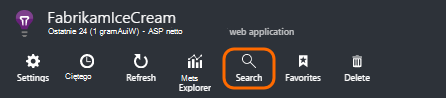
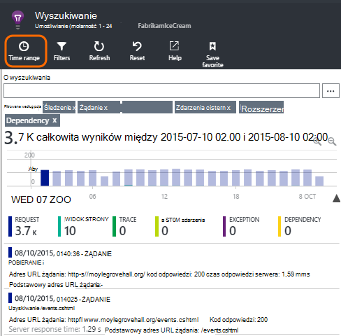
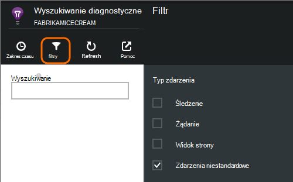
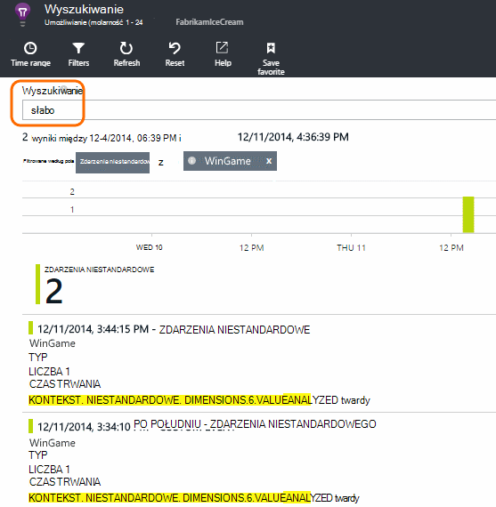
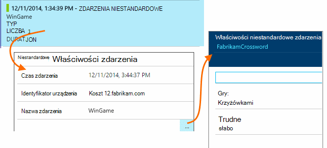
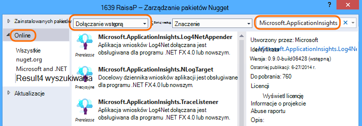
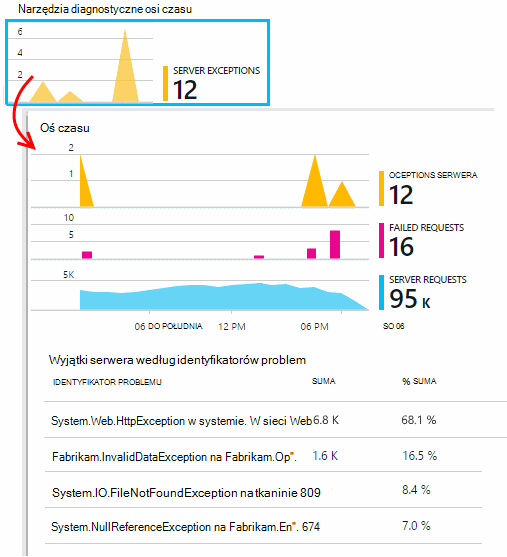
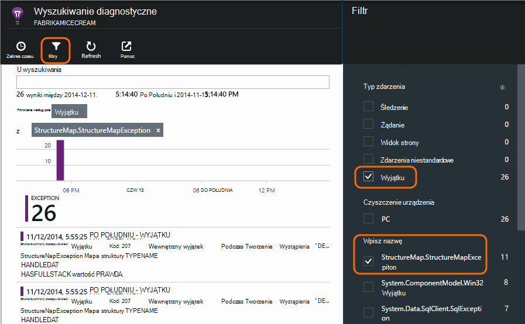

<properties 
    pageTitle="Dzienniki, wyjątki i niestandardowe informacje diagnostyczne dla programu ASP.NET w aplikacji wniosków" 
    description="Diagnozowanie problemów w aplikacjach sieci web programu ASP.NET przez wyszukiwanie wnioski, wyjątki i dzienniki generowane za pomocą śledzenia, NLog lub Log4Net." 
    services="application-insights" 
    documentationCenter=""
    authors="alancameronwills" 
    manager="douge"/>

<tags 
    ms.service="application-insights" 
    ms.workload="tbd" 
    ms.tgt_pltfrm="ibiza" 
    ms.devlang="na" 
    ms.topic="article" 
    ms.date="04/08/2016" 
    ms.author="awills"/>
 
# Dzienniki, wyjątki i niestandardowe informacje diagnostyczne dla programu ASP.NET w aplikacji wniosków

[Aplikacja wniosków] [ start] zawiera zaawansowane [Wyszukiwanie diagnostyczne] [ diagnostic] narzędzia, które umożliwia badanie i przejdź do telemetrycznego wysyłane przez SDK wniosków aplikacji z aplikacji do szczegółów. Wiele zdarzenia, na przykład liczba wyświetleń strony użytkownika są automatycznie wysyłane przez zestaw SDK.

Można także napisać kod, aby wysłać zdarzenia niestandardowe, raporty wyjątku i śledzenia. A jeśli już używasz framework rejestrowanie, takich jak log4J, log4net, NLog lub System.Diagnostics.Trace, można przechwycić te dzienniki i je uwzględnić w wyszukiwaniu. Ułatwia do śledzenia dziennika być zgodne z akcje użytkownika, wyjątki i inne zdarzenia.

## Przed zapisu telemetrycznego niestandardowe

Jeśli nie jest jeszcze [Konfigurowanie aplikacji wniosków projektu][start], to teraz zrobić.

Po uruchomieniu aplikacji wysyła niektóre telemetrycznego, które będą widoczne w diagnostyczne wyszukiwania, w tym żądań odebranych przez serwer, strony widoków, rejestrowane po stronie klienta i nie przechwycony wyjątki.

Otwórz diagnostyczne wyszukiwania, aby wyświetlić telemetrycznego, która automatycznie wyśle zestawu SDK.

Dane są różne dla poszczególnych typ jednej aplikacji. Kliknięcie za pomocą dowolnego poszczególne zdarzenia, aby uzyskać więcej szczegółów.

## Próbki 

Jeśli aplikacja wysyła wiele danych i korzystania z SDK wniosków aplikacji dla programu ASP.NET wersji 2.0.0-beta3 lub nowszym, funkcja adaptacyjne przy próbkowaniu może działać i Wyślij tylko procent swojego telemetrycznego. [Dowiedz się więcej na temat pobierania.](app-insights-sampling.md)

##Zdarzenia niestandardowe

Zdarzenia niestandardowe są wyświetlane w [Diagnostyczne wyszukiwania] [ diagnostic] i w [Eksploratorze metryki][metrics]. Możesz wysłać je z urządzenia, strony sieci web i aplikacji serwera. Można ich używać zarówno w celach diagnostycznych, jak i [Opis upodobania][track].

Niestandardowe zdarzenie ma nazwę i mogą zawierać właściwości, które można filtrować, razem z wartości liczbowe.

JavaScript klienta

    appInsights.trackEvent("WinGame",
         // String properties:
         {Game: currentGame.name, Difficulty: currentGame.difficulty},
         // Numeric measurements:
         {Score: currentGame.score, Opponents: currentGame.opponentCount}
         );

C# na serwerze

    // Set up some properties:
    var properties = new Dictionary <string, string> 
       {{"game", currentGame.Name}, {"difficulty", currentGame.Difficulty}};
    var measurements = new Dictionary <string, double>
       {{"Score", currentGame.Score}, {"Opponents", currentGame.OpponentCount}};

    // Send the event:
    telemetry.TrackEvent("WinGame", properties, measurements);

VB na serwerze

    ' Set up some properties:
    Dim properties = New Dictionary (Of String, String)
    properties.Add("game", currentGame.Name)
    properties.Add("difficulty", currentGame.Difficulty)

    Dim measurements = New Dictionary (Of String, Double)
    measurements.Add("Score", currentGame.Score)
    measurements.Add("Opponents", currentGame.OpponentCount)

    ' Send the event:
    telemetry.TrackEvent("WinGame", properties, measurements)

### Uruchamianie aplikacji, a następnie wyświetlać wyniki.

Otwórz diagnostyki wyszukiwania.

Zaznacz zdarzenie niestandardowe i wybierz nazwę danego zdarzenia.

Filtrowanie danych przez wprowadzanie wyszukiwanego terminu w wartości właściwości.  

Przechodzenie do poszczególne zdarzenia, aby wyświetlić właściwości szczegółowe.

##Liczba wyświetleń strony

Telemetrycznego widoku strony są wysyłane przez połączenie trackPageView() w [wstawkę kodu JavaScript wstawianych na stronach sieci web][usage]. Głównym celem jest do współtworzenia liczby wyświetleń stron, które są wyświetlane na stronie Przegląd.

Zazwyczaj jest to jeden raz na każdej stronie HTML, ale można wstawić kolejnych połączeń — na przykład, jeśli masz aplikację jednej strony i chcesz się zalogować nowej strony, gdy użytkownik uzyskuje większej ilości danych.

    appInsights.trackPageView(pageSegmentName, "http://fabrikam.com/page.htm"); 

Czasami jest przydatne dołączyć właściwości, których można używać jako filtry w wyszukiwaniu diagnostycznych:

    appInsights.trackPageView(pageSegmentName, "http://fabrikam.com/page.htm",
     {Game: currentGame.name, Difficulty: currentGame.difficulty});

##Śledzenie danych telemetrycznych

Śledzenie telemetrycznego jest kod, który ma być wstawiony specjalnie, aby utworzyć dzienniki diagnostyczne. 

Na przykład można wstawić połączeń w następujący sposób:

    var telemetry = new Microsoft.ApplicationInsights.TelemetryClient();
    telemetry.TrackTrace("Slow response - database01");

####  Instalowanie karty dla swojego framework rejestrowania

Można także wyszukiwać dzienniki generowane z ramy rejestrowania - log4Net NLog lub System.Diagnostics.Trace. 

1. Jeśli zamierzasz użyć log4Net lub NLog, należy go zainstalować w projekcie. 
2. W Eksploratorze rozwiązań projektu kliknij prawym przyciskiem myszy i wybierz pozycję **Zarządzaj NuGet pakietów**.
3. Wybierz pozycję Online > Zaznacz wszystko, **Obejmują wstępną** i wyszukaj "Microsoft.ApplicationInsights"

    

4. Wybierz odpowiedni pakiet — jeden z:
  + Microsoft.ApplicationInsights.TraceListener (do przechwytywania System.Diagnostics.Trace połączeń)
  + Microsoft.ApplicationInsights.NLogTarget
  + Microsoft.ApplicationInsights.Log4NetAppender

Pakiet NuGet instaluje niezbędne zespołów i zmodyfikowano web.config lub app.config.

#### Wstawianie połączeń w dzienniku diagnostycznym

Jeśli używasz System.Diagnostics.Trace typowego połączenia jest następujący:

    System.Diagnostics.Trace.TraceWarning("Slow response - database01");

Jeśli wolisz log4net lub NLog:

    logger.Warn("Slow response - database01");

Uruchamianie aplikacji w trybie debugowania lub wdrożyć go.

Zobaczysz wiadomości w diagnostyczne wyszukiwania po wybraniu filtru śledzenia.

### Wyjątki

Uzyskiwanie wyjątku raportów w aplikacji wniosków zapewnia wydajne, zwłaszcza, ponieważ nawigowanie między niepowodzeniu żądania i wyjątki i przeczytaj stos wyjątków.

W niektórych przypadkach należy [wstawić kilka wierszy kodu] [ exceptions] aby się upewnić, że są jest automatycznie otrzymanych listy wyjątków.

Można także napisać jawne kod, aby wysłać telemetrycznego wyjątku:

Języka JavaScript

    try 
    { ...
    }
    catch (ex)
    {
      appInsights.TrackException(ex, "handler loc",
        {Game: currentGame.Name, 
         State: currentGame.State.ToString()});
    }

C#

    var telemetry = new TelemetryClient();
    ...
    try 
    { ...
    }
    catch (Exception ex)
    {
       // Set up some properties:
       var properties = new Dictionary <string, string> 
         {{"Game", currentGame.Name}};

       var measurements = new Dictionary <string, double>
         {{"Users", currentGame.Users.Count}};

       // Send the exception telemetry:
       telemetry.TrackException(ex, properties, measurements);
    }

VB

    Dim telemetry = New TelemetryClient
    ...
    Try
      ...
    Catch ex as Exception
      ' Set up some properties:
      Dim properties = New Dictionary (Of String, String)
      properties.Add("Game", currentGame.Name)

      Dim measurements = New Dictionary (Of String, Double)
      measurements.Add("Users", currentGame.Users.Count)
  
      ' Send the exception telemetry:
      telemetry.TrackException(ex, properties, measurements)
    End Try

Parametry pomiary i właściwości są opcjonalne, ale są przydatne w przypadku filtrowania i dodać dodatkowe informacje. Na przykład jeśli masz aplikację, który może zostać uruchomiony kilka gier, możesz znaleźć wszystkie raporty wyjątku związane z określonym nożna. Możesz dodać dowolną liczbę elementów, jak do każdego słownika.

#### Wyświetlanie wyjątki

Pojawi się podsumowanie wyjątki zgłoszone na karta Przegląd, a za pośrednictwem można kliknąć, aby wyświetlić więcej szczegółów. Na przykład:

[]

Kliknij dowolny typ wyjątku, aby wyświetlić poszczególne wystąpienia:

[]

Można również otwierać diagnostyki wyszukiwania bezpośrednio, filtrować wyjątki i wybierz typ wyjątku, który chcesz wyświetlić.

### Raportowanie nieobsługiwanego wyjątki

Raporty wniosków aplikacji nieobsługiwany wyjątki miejsce, w którym można, z urządzenia i [przeglądarki sieci web][usage], lub serwery w sieci web, czy działają przez [Monitor stanu] [ redfield] lub [Aplikacji wniosków SDK][greenbrown]. 

Jednak zawsze nie można to zrobić w niektórych przypadkach, ponieważ .NET framework połowy wyjątki.  Aby upewnić się, że jest widoczna wszystkie wyjątki, dlatego musisz pisanie obsługi małych wyjątku. Najlepsze procedura różni się z technologią. Zobacz [telemetrycznego wyjątku dla programu ASP.NET] [ exceptions] Aby uzyskać szczegółowe informacje. 

### Korelacji z kompilacji

Po przeczytaniu dzienniki diagnostyczne jest prawdopodobieństwo, że kod źródłowy będzie zmieniły się po pobraniu wdrożonej kod aktywny.

Dlatego jest przydatne wprowadzenia kompilacji informacje, takie jak adres URL bieżącej wersji właściwość wraz z każdym wyjątku lub śledzenia. 

Zamiast dodawać właściwość oddzielnie do każdego połączenia wyjątku, można ustawić informacje w kontekście domyślnym. 

    // Telemetry initializer class
    public class MyTelemetryInitializer : ITelemetryInitializer
    {
        public void Initialize (ITelemetry telemetry)
        {
            telemetry.Properties["AppVersion"] = "v2.1";
        }
    }

W inicjator aplikacji, takich jak Global.asax.cs:

    protected void Application_Start()
    {
        // ...
        TelemetryConfiguration.Active.TelemetryInitializers
        .Add(new MyTelemetryInitializer());
    }

###Żądania serwer sieci Web

Żądanie telemetrycznego są wysyłane automatycznie po [instalacji Monitor stanu na serwerze sieci web][redfield], lub możesz [dodać wniosków aplikacji do projektu sieci web][greenbrown]. Również kanały do schematów czasu żądania i odpowiedzi w Eksploratorze jednostki metryczne i na stronie Przegląd.

Jeśli chcesz wysłać dodatkowe zdarzenia, można użyć interfejsu API TrackRequest().

## Pytania i odpowiedzi

### Pojawia się błąd "klucz oprzyrządowania nie może być puste"

Wygląda na komputerze zainstalowano rejestrowanie karty Nuget pakiet bez instalowania aplikacji wnioski.

W Eksploratorze rozwiązań, kliknij prawym przyciskiem myszy `ApplicationInsights.config` i wybierz polecenie **Aktualizuj aplikacji wniosków**. Zostanie wyświetlony okno dialogowe umożliwiające logowanie się do Azure i Utwórz zasób wniosków aplikacji lub ponowne użycie istniejącej. Który należy rozwiązywanie problemu.

### Ile kosztuje dane są zachowywane?

Do 500 zdarzenia z każdą z nich na sekundę. Zdarzenia są zachowywane przez siedem dni.

### Niektóre zdarzenia lub śledzenia nie są wyświetlane

Jeśli aplikacja wysyła wiele danych i korzystania z SDK wniosków aplikacji dla programu ASP.NET wersji 2.0.0-beta3 lub nowszym, funkcja adaptacyjne przy próbkowaniu może działać i Wyślij tylko procent swojego telemetrycznego. [Dowiedz się więcej na temat pobierania.](app-insights-sampling.md)

## Następne kroki

* [Konfigurowanie dostępności i badania czas reakcji][availability]
* [Rozwiązywanie problemów][qna]

<!--Link references-->

[availability]: app-insights-monitor-web-app-availability.md
[diagnostic]: app-insights-diagnostic-search.md
[exceptions]: app-insights-asp-net-exceptions.md
[greenbrown]: app-insights-asp-net.md
[metrics]: app-insights-metrics-explorer.md
[qna]: app-insights-troubleshoot-faq.md
[redfield]: app-insights-monitor-performance-live-website-now.md
[start]: app-insights-overview.md
[track]: app-insights-api-custom-events-metrics.md
[usage]: app-insights-web-track-usage.md

 
